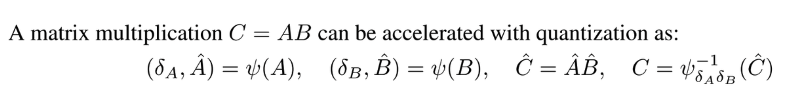

# 量化

## 简介

量化（Quantization）是模型部署与推理优化中的核心技术。它的基本思想是：**用更少的 bit 数去表示原本用高精度浮点数存储和计算的数据**。例如，把原本的 FP32 权重、激活值，映射为 INT8、FP8，甚至 INT4、FP4。这样做的目的通常有三个：**减少显存占用、降低带宽压力、提升计算吞吐**。量化的意义就在于：**用更低的存储成本和更快的低精度算子，换取更高的整体执行效率**。当然，量化并不是无损压缩，它本质上是一个有误差的近似过程，所以实际应用中还必须权衡精度损失与性能收益。

<!-- more -->

## 一、量化介绍

### 1.1 量化的定义
从数学上看，量化本质上就是把连续的高精度实数，映射到离散的低精度表示空间中。通常把这个过程分成两步理解：

1. **量化（Quantize）**：把浮点数映射为低精度整数或低精度浮点表示；
2. **反量化（Dequantize）**：在计算或输出时，再把低精度表示恢复为近似原始值。

对于 fp8/6/4 等格式，nvidia 的 TensorCore 是支持包含反量化的矩阵乘的，可以参考[nv ptx 指导手册](https://docs.nvidia.com/cuda/pdf/ptx_isa_8.7.pdf) 中的 9.7.14.3 Block Scaling。且如果是 fp8 量化，在Hopper 和 BlackWell 架构中可以用 TensorCore 直接完成包含反量化 scale 的乘加计算。可参考文章[Hopper架构介绍](https://summer536.github.io/Notes/zh/notes/cuda/Hopper.html)

例如，对于一个加速矩阵乘法 $C = A * B$：

图示公式描述了基于量化（Quantization）加速矩阵乘法的完整流水线：

1. **量化 (Quantize)**：通过量化函数 $\psi(\cdot)$，将高精度矩阵 $A,B$ 转换为低精度表示 $\hat{A},\hat{B}$（存储数值分布）及缩放因子 $\delta_A,\delta_B$（记录数值尺度/Scale）。
2. **计算 (Compute)**：Tensor Core 执行高效的低精度矩阵乘法 $\hat{C} = \hat{A}\hat{B}$。
3. **反量化 (Dequantize)**：通过 $\psi^{-1}_{\delta_A\delta_B}$ 将低精度结果 $\hat{C}$ 乘回 Scale，还原为近似的真实结果 $C$。

**核心逻辑**：低比特数值负责压缩计算空间，Scale 负责还原数值域。在使用 FP8、INT8 等低精度 Tensor Core 路径时，Scale 是防止大数溢出或小数舍入为零的必备组件。

与此同时：量化可以有不同的量化粒度（即有多少元素共享一个缩放因子），包括：

- Per-tensor：整个张量共享一个缩放因子。
- Per-token：张量的每个 token都有一个缩放因子。
- Per-channel：张量的每个 channel 都有一个缩放因子。
- Per-block：基于 FlashAttention 的tiling，每 block 个 token 共享一个缩放因子

---

### 1.2 为什么要做量化

模型量化的收益主要体现在以下几个方面。

- **减少存储开销**：

  这是最直观的收益。如果一个模型原本使用 FP32 存储，每个参数占 4 字节；如果改成 INT8，则每个参数只占 1 字节，理论上存储开销可缩小到原来的四分之一。如果进一步使用 INT4 或 FP4，压缩比例会更高。

  对于大语言模型来说，参数量动辄几十亿、上百亿，光是权重本身就非常占显存。量化之后，模型更容易装进单卡，也更容易降低部署成本。

- **降低内存带宽压力**：

  很多推理任务并不是单纯算力不足，而是数据搬不动。尤其是在矩阵乘法和 attention 中，GPU 往往要频繁从显存中读取权重和激活值。量化之后，由于数据体积变小，同样一次内存读取能拿到更多有效数据，从而缓解带宽瓶颈。

- **提升低精度计算吞吐**：

  现代硬件，尤其是 GPU、TPU、AI 加速器，对低精度算子通常有专门优化。例如 INT8 Tensor Core、FP8 Tensor Core 等。使用量化后的数据，往往能走更快的硬件路径，从而提升矩阵乘法、卷积、attention 等算子的执行速度。

---

### 1.3 量化误差

量化并不是精确保留原始数据，而是有损近似，因此误差不可避免。量化误差的来源主要有以下几种。

- **舍入误差**：因为浮点数在映射到整数时需要 round，所以原本连续的值会被压到离散点上，导致误差。

- **截断误差**：如果原始数值超出了量化区间，那么它会被强行截断到边界值，产生较大的误差。这通常发生在数据存在 outlier（离群值）时。

- **动态范围不匹配**：如果 scale 选得不好，会导致小值分辨率不够或大值频繁饱和，从而使整体误差增大。

- **误差累积**：在神经网络里，量化误差不会只出现一次。每一层都可能引入一点误差，而这些误差会在多层传播中不断累积。因此，某一层看似很小的误差，在最终输出上可能被放大。

---

## 二、大模型量化的几大方向

在大模型中，量化并不是只对整个模型笼统地做一次压缩，而往往是**按模块、按数据类型分别处理**。

从工程视角来理解，可以把大模型量化分成四个最常见方向：

- **权重量化**：最成熟，最常用，代表方法有 **GPTQ、AWQ、bitsandbytes、SmoothQuant**；
- **激活量化**：更难，但能进一步降低中间张量带宽，常与 **SmoothQuant** 等方法结合；
- **KV Cache 量化**：主要面向长上下文推理，代表方法有 **KIVI、KVQuant**；
- **Attention 量化**：直接优化 attention kernel 的低比特计算，代表性方法是 **SageAttention 系列**。

### 2.1 权重量化（Weight Quantization）

权重量化是大模型里最常见、最成熟的量化方式，因为模型参数本身占据了大量显存，而且权重在推理时是静态的，分布相对稳定，最适合离线做后训练量化。工程上，很多 4-bit / 8-bit LLM 部署方案，首先量化的就是 Linear 层权重，尤其是 Attention 中的 Q/K/V/O 投影层和 MLP 中的 up/down/gate projection。常见方法包括 **GPTQ**、**AWQ**、**bitsandbytes 的 LLM.int8 与 4-bit/NF4**。**权重量化主要解决模型放不下、带宽太大、推理吞吐受限** 的问题，因此它通常是大模型量化的第一步，也是最先落地的一步。

### 2.2 激活量化（Activation Quantization）

**激活量化针对的是推理过程中动态产生的中间张量**。和权重相比，激活值的分布会随着输入变化，因此更难量化，也更容易因为 outlier 或动态范围过宽而掉精度。但它的收益同样显著，因为激活值决定了中间层的访存开销和很多矩阵乘法的数据搬运成本。

工程上，激活量化最常见的代表方法之一是 **SmoothQuant**，它通过平滑激活中的离群值，把一部分量化难度转移到权重中，从而让 W8A8 这类权重/激活同时量化方案更容易稳定落地。

### 2.3 KV Cache 量化（Key-Value Cache Quantization）

在 LLM 推理中，随着上下文越来越长，KV Cache 会快速成为新的显存瓶颈，因此 KV Cache 量化已经成为长上下文推理优化中的重要分支。与普通激活量化不同，KV Cache 的特殊性在于：它既是 attention 计算的输入，又会随生成过程不断增长，因此对内存容量、带宽和吞吐影响非常直接。

代表性方法包括 **KIVI**、**KVQuant** 等。KIVI 提出了一种 tuning-free 的 2-bit KV cache 量化方案，并指出 **Key 更适合 per-channel 量化，而 Value 更适合 per-token 量化**；KVQuant 则继续朝着更长上下文、更低 bit 方向推进。

### 2.4 Attention 部分的量化（Attention Quantization）

Attention 量化和普通权重量化不太一样，它更关注 **attention 计算本身**，也就是 \(QK^T\)、softmax 前后的中间量以及 \(PV\) 这类核心路径，目标是让 attention 直接走低比特高吞吐 kernel。这个方向里，**SageAttention** 是非常有代表性的工作：初代 SageAttention 主打准确的 8-bit attention 推理加速，而 **SageAttention2** 进一步把 \(Q,K\) 压到 **INT4**、把 \(\tilde{P},V\) 压到 **FP8**，并配合 outlier smoothing 提升精度。

需要注意的是，Attention 量化和 KV Cache 量化 虽然都发生在 attention 模块附近，但目标并不相同：前者更偏向**加速 attention 计算**，后者更偏向**压缩缓存占用**。

### 2.5 Embedding、LM Head 与其他敏感模块

除了上面几个主流部分，很多大模型在部署时还会考虑是否量化 **Embedding 层** 和最终的 **LM Head**。但这些位置通常更敏感，因为它们直接影响输入表征与最终 logits，量化后有时会更明显地影响输出质量。因此在很多实用方案中，常常会采取“**大部分 Linear 层量化，但 Embedding 和 LM Head 保持更高精度**”的折中策略。此外，一些归一化层、RoPE 相关计算、softmax、残差相加等操作，通常也不会像权重矩阵那样被优先做极低比特量化，而更常保留在 FP16 / BF16 中，以换取稳定性。这也是为什么很多量化模型并不是全模型所有东西都同一个 bit 数，而是**按模块差异化量化**。这一点也是近期 LLM 量化研究普遍强调的实践经验。

---

## 三、大模型常见量化方法介绍

### 3.1 AWQ
详见文章: [AWQ 激活感知的权重量化](https://summer536.github.io/Notes/zh/notes/ai-infra/AWQ.html)

### 3.2 Sageattention
待更新

### 3.3 GPTQ
待更新

### 3.4 AutoRound
待更新

### 3.5 SmoothQuant
待更新

### 3.6 any4
待更新

---

## 参考资料

- [大模型推理量化(Quantization)基础速览](https://zhuanlan.zhihu.com/p/2005335401469083798)
- [SageAttenion-1(即插即用的 8bit 注意力) 原理及源码分析](https://zhuanlan.zhihu.com/p/1923159458663621364)