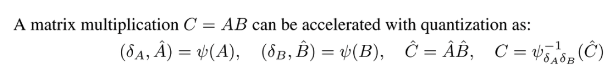
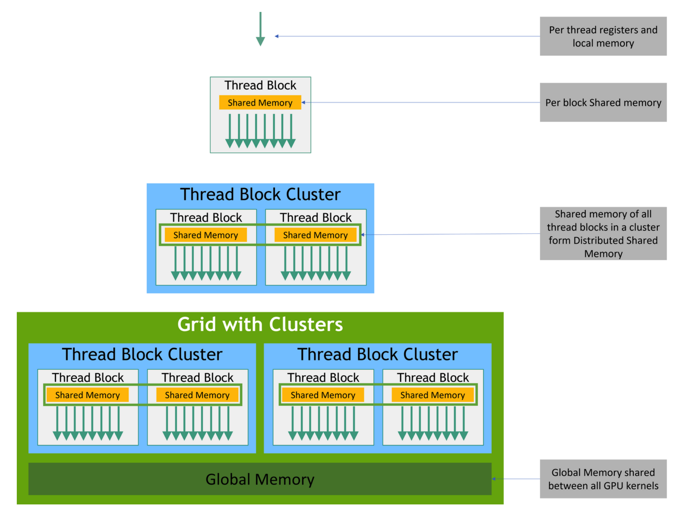
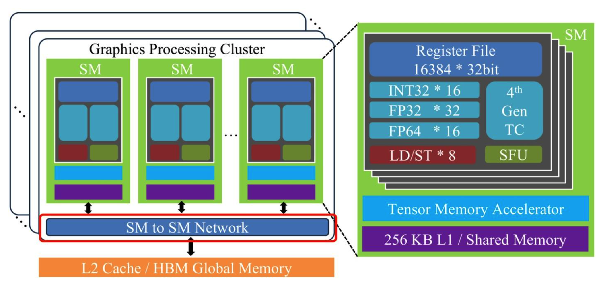
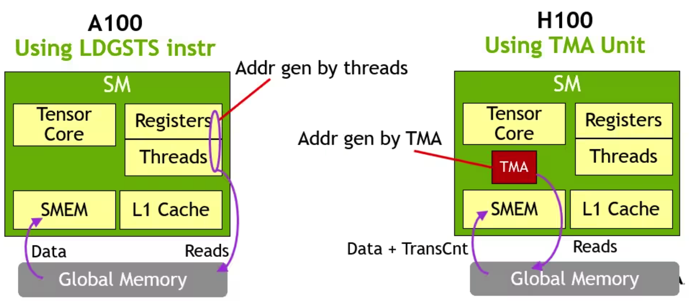

# Hopper架构特性

## 简介

Hopper 是 NVIDIA 在 Ampere 之后推出的一代面向 AI 与 HPC 的 GPU 架构，对应 CUDA 计算能力 9.0。Hopper 的关键词是 **FP8、Transformer Engine、Thread Block Cluster、Distributed Shared Memory(DSMEM)、Tensor Memory Accelerator(TMA)** 以及更强的多 GPU 互联能力。

以前很多 CUDA kernel 的优化重点是：如何让单个 thread block 在一个 SM 内部把 shared memory、register 和 Tensor Core 用到极致；到了 Hopper，优化问题进一步扩展为：**如何让多个 thread block 跨 SM 协同、如何让数据搬运与计算真正异步流水化、如何让低精度 Tensor Core 尤其 FP8 在尽量不损精度的前提下成为主力路径。** 这正是 Hopper 与前代最本质的区别。

---

## 一、Hopper 架构的定位

Hopper 的设计目标非常明确：同时面向两类最吃算力的工作负载。

1.  **大模型训练/推理：** 这类任务的特点是矩阵乘巨大、跨卡通信频繁、对数值格式非常敏感，而且 attention/MLP 等模块会持续吞吐海量数据。Hopper 为此提供了第四代 Tensor Core、FP8、Transformer Engine、HBM3 和第四代 NVLink。官方资料指出，H100 的第四代 Tensor Core 配合 Transformer Engine，使其在最吃计算的 AI/HPC 场景下峰值吞吐相比 A100 约提升 6 倍；其中仅 FP8 路径就为 Tensor Core 再带来约 2 倍提升。
2.  **传统 HPC 与动态规划类算法：** Hopper 不仅继续强化 FP64/TF32/FP16/BF16 路径，还新增了 DPX 指令，用来加速动态规划型问题，例如生物序列比对、路径规划、图优化等。官方博客给出的说法是，DPX 在某些动态规划算法上可带来相对 Ampere 最高约 7 倍的加速。

## 二、Hopper 的关键硬件参数

基于官方公开资料，H100/Hopper 有几组非常关键的指标：

* H100 SXM5 版本配备 80GB HBM3，内存带宽最高可达 3TB/s；PCIe 版也可提供 80GB 显存，但采用 HBM2e，带宽超过 2TB/s。
* H100 具有 132 个 SM，比 A100 的 108 个 SM 更多；同时每个 SM 的计算能力也更强。
* 每个 SM 含 4 个第四代 Tensor Core，全卡共 528 个 Tensor Core。
* L2 Cache 从 A100 的 40MB 增加到 50MB。
* Hopper 支持 第四代 NVLink，总双向带宽提升到 900GB/s，相比 A100 的 600GB/s 更高。


### 2.1 SM 基本资源

从 CUDA Tuning Guide 看，Hopper（compute capability 9.0）的 SM 在资源配置上延续了 NVIDIA 近几代的一些规律，但又显著放大了片上存储与并行协作能力：

* 每个 SM 最多仍支持 64 个并发 warp。
* 每个 SM 有 64K 个 32-bit 寄存器，单线程最多可使用 255 个寄存器。
* 每个 SM 最多可驻留 32 个 thread block。
* 共享内存容量提升到 228KB/SM，相比 A100 的 164KB 明显增加；单个 thread block 最高可访问 227KB shared memory。
* Hopper 把统一的 L1/Texture/Shared 组合容量提升到 256KB。

### 2.2 FP32 吞吐增强

Hopper Tuning Guide 明确写到，compute capability 9.0 设备的 FP32 每 SM 每周期吞吐是 Ampere 的 2 倍。这意味着即便你不使用 Tensor Core，普通 CUDA Core 路径也能获益。

### 2.3 Tensor Core

Hopper 的 Tensor Core 升级主要有三层：

1.  **单个 Tensor Core 更快。** 官方博客明确写到，每个 H100 SM 因为新一代 Tensor Core，单 SM 计算能力大约是前代的 2 倍。
2.  **新增 FP8 支持。** H100 引入了 FP8 数据类型，尤其面向 Transformer 训练/推理。
3.  **与 Transformer Engine 联动。** Tensor Core 不再只是“接受输入然后乘”，而是和动态精度选择、scale 管理一起工作。

Hopper 的 Tensor Core 是更适合低精度 AI 的、与软件栈深度协同的计算核心。

### 2.4 Transformer Engine：

H100 引入了 FP8，并支持两种主要格式：

* **E4M3：** 1 位符号、4 位指数、3 位尾数，精度更好、动态范围较小，常适合前向激活和权重。
* **E5M2：** 1 位符号、5 位指数、2 位尾数，动态范围更大、精度更低，更适合梯度等更关注范围的张量。

这和过去 Hopper 之前的主流思路不一样。Ampere 时代大家常用的是 FP16/BF16/TF32。它们已经是低精度了，但 FP8 又把位宽进一步压低了一半。压低位宽的直接收益就是：更高吞吐、更低带宽压力、更低存储成本。但同时它也把数值稳定性的难题推到了前台。Hopper给出的解决办法是将scale直接融入到Tensor Core的计算中来保证低精度计算的准确性与高效性。如下：

**Transformer Engine会在每一层分析输出张量的统计特征，并动态决定使用何种精度、如何缩放张量到 FP8 可表示范围内，再写回内存**。Hopper 把数值统计、动态范围管理和低精度 Tensor Core 结合起来。**scale + runtime 统计 + kernel 实现** 一整套机制。

#### Scale 是如何来的？为什么 Tensor Core 计算里会涉及到 scale？

在低精度矩阵乘中，原始高精度矩阵 \(A\) 和 \(B\) 往往不能直接无损地存成 FP8 / INT8 这类低比特格式，因为这类格式的**动态范围更小、有效精度也更低**。因此，实际做法通常是先对矩阵做量化：把原矩阵拆成**量化后的低精度值**和**缩放因子 scale**两部分。



而在计算量化后的矩阵乘法时就会涉及到scale的计算:
```cpp
D = (A * scale_A) * (B * scale_B) + C
```

只要使用 FP8、INT8、INT4 这类量化 Tensor Core 路径，scale 几乎就是必然存在的。

#### Hopper 架构对 scale 做了什么？它是如何优化的？

Hopper 的关键改进在于：它不再把 scale 仅仅当成“矩阵乘前后由软件额外处理的系数”，而是通过 **Transformer Engine** 把 scale 管理变成了硬件与软件协同的一部分。传统做法里，程序往往需要先统计张量范围、计算 scale、把数据手动缩放后再送进 Tensor Core，算完再额外做反缩放；这样会带来更多指令、更多访存，以及更长的数据通路。Hopper 则针对 FP8 专门引入了 Transformer Engine，它会根据每层张量的数值分布动态选择合适的 FP8 格式（如 E4M3 或 E5M2），并维护对应的 scaling 因子，使张量尽量落在 FP8 最合适的表示范围内，再配合第四代 Tensor Core 高效执行低精度 MMA。这样做的优化本质有两点：**第一，scale 的计算与使用更加自动化、细粒度，减少了程序员和框架手工插入额外缩放/反缩放逻辑的负担；第二，scale 被更紧密地融合进低精度计算流水线，减少额外指令和数据搬运开销，让 FP8 真正能在保证精度可控的前提下发挥吞吐优势。**

## 三、Thread Block Cluster 与 DSMEM

传统 CUDA 编程里，一个 thread block 的线程运行在同一个 SM 上，彼此可以通过 shared memory 协作；不同 thread block 之间通常只能通过 global memory 间接通信，或者靠 kernel 边界分阶段同步。Ampere 也基本是这个思路。

问题在于：随着 GPU 变得越来越大、SM 数越来越多、kernel 越来越复杂，单个 thread block 已经不够表达很多程序的局部性。Hopper 为此引入了新的层级：**Thread Block Cluster**。



### 3.1 Thread Block Cluster 介绍

Cluster 可以理解成一组被保证并发调度到一组相邻 SM 上的 thread block。它在 CUDA 的逻辑层级中，插入到了 thread block 与 grid 之间，形成：

**thread → block → cluster → grid**

集群中的 thread block 会被并发安排到同一个 GPC 内的多个 SM 上，并能通过硬件加速 barrier 和新的内存共享能力高效协作。Guide 还指出，Hopper 的可移植 cluster size 上限是 8，而 H100 允许在 opt-in 后使用 16 的非可移植 cluster size。

### 3.2 Distributed Shared Memory（DSMEM）

有了 cluster 之后，Hopper 引入了 Distributed Shared Memory。简单说，就是 cluster 里的一个 block 可以直接访问另一个 block 所在 SM 的 shared memory，并执行 load/store/atomic。官方博客描述为：**多个 block 的 shared memory 逻辑上被映射进统一的地址空间，从而形成“分布式共享内存”。**

* 跨 block 交换数据，不再总是要先写 global memory 再读回来；
* 跨 SM 协作的代价显著下降。

这里的Distributed Shared Memory是cluster中所有block的share MEM的集合。那么这样就会存在一个问题：*Block Cluster 中不同的 Block 可能放在不同的 SM 上，L1 Cache 是每个 SM 独有的，一个 SM 无法访问另一个 SM 的 L1 Cache，所以 Distributed Shared Memory 需要使用所有 SM 都能访问的高效存储器。L2 Cache 是所有 SM 均可访问，但 Distributed Shared Memory 仅需要保证一个 Cluster 内部的 SM 可以访问即可，不需要到L2 Cache这么高的级别。那么 Hopper 是否存在一层存储器支持 Cluster 内部的所有 SM 可以访问？*

有的兄弟，有的。**Hopper 架构在 Cluster 内部，位于 L1 和 L2 Cache 之间新增了一层SM-to-SM Network。Thread Block Cluster 内部的 SM 可以通过该层网络访问其他 SM 的 Shared Memory**。 与此同时，在软件层，CUDA 也为 Distributed Shared Memory 提供了访问的编程接口以及整个 Thread Block Cluster 的同步接口。



**关于DSMEM的用法，详细请参考知乎阿杰大佬的文章：[[Hopper 架构特性学习笔记 Part1] Distributed Shared Memory](https://zhuanlan.zhihu.com/p/708645371)**

## 四、Tensor Memory Accelerator（TMA）

### 4.1 TMA 

TMA 是 Hopper 非常核心、但又很容易被初学者忽略的能力。Hopper 博客把它描述为新的异步数据搬运单元，可以高效地在 global memory 与 shared memory 之间搬运大块数据，也支持 cluster 内 block 之间的异步拷贝。核心功能如下：

- **支持大块（bulk）异步显存拷贝**，使用 cuda::memcpy_async 接口。这个类似 CPU 上的 memcpy，支持一整块的显存拷贝，可以减少拷贝指令数量；
- **支持多维度显存块拷贝**，从 1D 到 5D tensor 的传输；实际使用时一维和多维的API使用方法不同，详细使用方法请参考知乎阿杰大佬的文章：[[Hopper 架构特性学习笔记 Part2] Tensor Memory Access（TMA）](https://zhuanlan.zhihu.com/p/709750258)

- **支持双向拷贝**，Hopper架构支持从 global memory 到 shared memory的双向拷贝，并且从 shared memory 写回 global memory 时，还能指定 elementwise reduction，比如 add/min/max 等。

### 4.2 TMA 和 Ampere 的 async copy （异步拷贝）有什么不同？


Ampere 已经有异步拷贝的雏形，但地址生成和很多搬运细节仍要靠线程来参与。在拷贝大块的显存时，会拆分成若干个很小的显存块，利用循环、多线程方式完成多个小显存块拷贝。每次拷贝均要计算显存的起始地址，这种寻址操作是不能被异步拷贝重叠的，并且运算指令随着小显存块的增多而线性增加。显式计算地址的原因主要是地址不连续，比如在矩阵乘中，对 Global Memory 进行分块，并将每个小块加载到 Shared Memory 中，显存块中不同行的地址是不连续的，需要手动计算。


而在 Hopper 上，**TMA 由硬件处理 stride、offset、boundary 等复制细节**，一个线程发起请求后，后续地址生成和数据搬运由硬件接管。

* 搬运数据不再那么占线程资源。
* 计算线程和搬运线程可以更彻底地解耦。

H100 是第一款真正异步的 GPU，因为它把数据进出片上存储、计算、同步组织成了更完整的异步流水线。

### 4.3 为什么 TMA 对 GEMM/Attention 特别重要？

高性能 GEMM 和 Attention 的关键之一，是把“从 global 拉 tile 到 shared”的过程，和“Tensor Core 计算当前 tile”的过程重叠起来。TMA 恰好就是在降低这部分重叠的编程难度和地址计算开销。

**TMA 的作用是更高效地喂饱 Tensor Core。**

## 五、WGMMA 与 Hopper 的新计算协同方式

在早期 Tensor Core 编程里，大家更熟悉的是 `mma.sync`：通常由一个 warp 协同完成一个小矩阵乘加。Hopper 进一步扩展了这种思路，在 PTX 中引入了 warpgroup 级的异步矩阵乘加机制，例如 `wgmma.mma_async`、`wgmma.commit_group` 和 `wgmma.wait_group`。PTX 文档表明，`wgmma.commit_group` 会把先前尚未提交的 `wgmma.mma_async` 归入一个 warpgroup 级 group，并可以通过 `wgmma.wait_group` 等待完成。

从工程角度理解为：
**Hopper 的核心变化之一，就是把 Tensor Core 的使用从warp 级碎片化调用，推向更大粒度的异步协同调用。**


## 六、总结

Hopper在硬件层面带来了：

* 更强的第四代 Tensor Core；
* FP8 与 Transformer Engine；
* HBM3、50MB L2、增强的统一 L1/Shared/Texture；
* 第四代 NVLink 与 NVLink Network。

它在编程模型层面带来了：

* Thread Block Cluster；
* Distributed Shared Memory；
* TMA 驱动的真正异步数据流水线；
* 更大粒度的矩阵乘法协作方式，如 warpgroup 级异步 MMA。

## 参考资料
- [NVIDIA Hopper Architecture In-Depth](https://developer.nvidia.com/blog/nvidia-hopper-architecture-in-depth/)
- [给 Ampere 开发者看的 Hopper 架构解读](https://zhuanlan.zhihu.com/p/1895527304509236945)
- [[Hopper 架构特性学习笔记 Part1] Distributed Shared Memory](https://mp.weixin.qq.com/s/-V7cCt51EE_e0O68AaWt0g)
- [[Hopper 架构特性学习笔记 Part2] Tensor Memory Access（TMA）](http://zhuanlan.zhihu.com/p/709750258)
- [SageAttenion-1(即插即用的 8bit 注意力) 原理及源码分析](https://zhuanlan.zhihu.com/p/1923159458663621364)