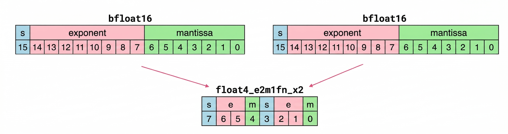
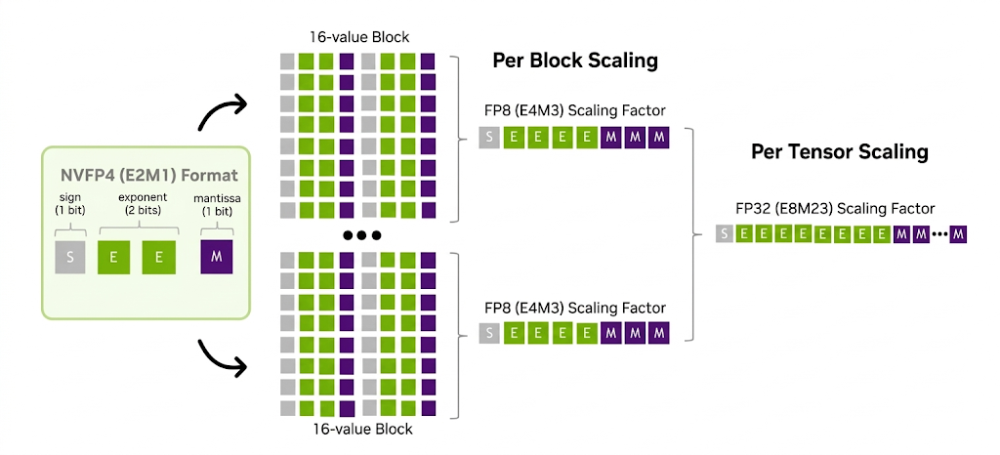
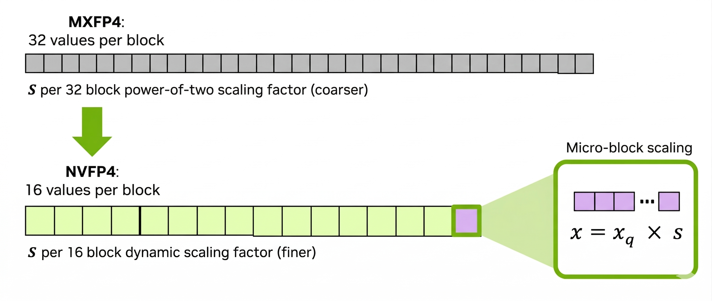

# nvFP4与mxFP4对比

## 简介

在低精度推理领域，随着Blackwell的GPU新架构发布，FP4精度正在被力推为新的低精度推理选择。目前FP4主流的版本为mxFP4和nvFP4两种，本文将详细介绍nvFP4的技术细节和优势，并对比nvFP4与mxFP4的差异。

---

## 一、FP4数据结构

单个Float4采用“1位符号位+2位指数位+1位尾数位”(E2M1)的结构，其数值计算公式为：
$$ value = (-1)^S \times (1+ M \times 2^{-1} ) \times 2^{E-1}$$
基于该结构，**一个Float4的数据共有16种可能的取值**，分别为[0, 0.5, 1, 1.5, 2, 3, 4, 6, -0, -0.5, -1, -1.5, -2, -3, -4, -6]。相比之下，INT4类型可表示[-8, -7, -6, -5, -4, -3, -2, -1, 0, 1, 2, 3, 4, 5, 6, 7]。**FP4 比 INT4多了一些1.5、-0.5等非整数值**，更适配神经网络参数的数值分布特征。

### nvFP4

nvFP4的核心数据结构在pytorch里面表示为**torch.float4_e2m1fn_x2**，通过**双元素打包存储**的设计，在保证精度的同时最大化存储效率——即**把两个4位浮点数（float4）打包到1个字节（8bit）中存储**。

将2个4位数据分别存入1个字节的高4位和低4位，使存储效率翻倍。
- 设计充分**适配内存的字节级（8位）寻址特性**：在未打包时，1个4位元素需占用1个字节，1024个float4元素共需1024字节；打包后，每2个4位元素占用1个字节，1024个元素仅需512字节，存储空间直接减半。
- **连续的存储方式更适配GPU的内存读取特性**，进一步提升memory throughput。

## 二、nvfp4的量化实现方法

nvFP4采用“高精度scale + 二级全局scale”的量化策略。具体量化相关知识可[参考文章](https://summer536.github.io/Notes/zh/notes/ai-infra/quantize.html)。

实现方法如下：

### 2.1 step1:小块级（blockwise）量化（精细缩放）

首先将完整的tensor分为多个小块，**每个小块包含16个数**；随后为**每个小块独立计算1个E4M3格式(FP8)的缩放因子**，精准捕捉小块内部的局部动态范围。由于16个元素的数据分布相对均匀，E4M3格式的scale可实现高精度的局部量化。

### 2.2 step2:tensorwise量化（全局缩放）
step1已经初步进行了量化，但不同小块之间还可能存在整体偏差。为此，引入**一个FP32精度的全局缩放因子**，对所有小块的量化结果进行统一校准，进一步减小tensor层面的整体量化误差，确保量化后的数据分布与原始浮点数据分布的误差尽可能的小。

基于上述的二级缩放策略，原始浮点数x的量化公式为：
$$x_{quant} = round (x/(global_{scale} \times block_{scale}))$$

示意图如下：

反量化时通过下式来恢复到原始精度：
$$x_{dequant} = x_{quant} \times (global_{scale} \times block_{scale})$$

## 三、nvFP4与mxFP4的对比分析

nvFP4与mxFP4二者均为float4类型，数据结构一致，关键区别在于缩放策略的不同。其一，nvFP4使用“细粒度(一块16个数据)+双层优化(blockwise + tensorwise)”，而mxFP4采用的是单blockwise+一块32个数据的scale策略；其二，nvFP4的blockwise的scale采用的是E4M3的数据结构，而mxFP4采用E8M0；在某些精度敏感场景下，nvFP4的优势更大。

### 3.1 nvFP4与mxFP4的共同点

**二者都是一个block为量化粒度**，为什么需要这么细的量化粒度？因为 FP4 表达范围有限，一共16个取值。如果一个tensor都统一用一个scale，这个必定损失很多信息，所以为了精准表达数据原始信息，必须用一个block作为一个量化scale单位。相反，对于int8这种有256个取值的类型，那么多数模型（尤其是CV类）以tensor为量化scale单位，是可行的。

复习一下，量化粒度有多种从粗到细常用的分别有：Per-tensor、Per-token、Per-channel、Per-block。

### 3.2 mxFP4的局限性

**mxFP4采用 1×32 block粒度的缩放策略**，即32个元素共享1个缩放因子（scale），且**scale类型为E8M0**（对应的torch API为torch.float8_e8m0fnu），所以它的缺陷是仅支持2的幂次scale，**粒度较粗且离散性强，易产生较大量化误差**。

例如，若经校准算法（calibration）分析得出激活的最优scale为0.9，但由于E8M0仅能表示2^n（n为整数）形式的数值，可选择的近似值仅有2^-1=0.5和2^0=1.0。最终选取最接近0.9的1.0作为scale，由此产生的缩放误差约为(1.0-0.9)/0.9≈11.1%。

### 3.3 nvFP4的特点

相比之下，nvFP4在三个维度上优化了mxFP4的缺陷：

1. **更细粒度分块**：前面第二节讲了。nvFP4采用 1×16 block粒度的缩放策略，提升了scale对局部数据分布的鲁棒性。

2. **高精度scale**：与此同时，nvFP4的scale采用的是**E4M3格式**，凭借3个尾数位的设计支持非2幂次缩放，数值表示能力显著提升。**同样以最优scale为0.9为例**，E4M3在[0.5,1.0]区间可表示0.5、0.5625、0.625、0.6875、0.75、0.8125、0.875、0.9375、1.0等多个数值，可选取最接近0.9的0.875作为scale，缩放误差仅为(0.875-0.9)/0.9≈-2.78%，远低于mxFP4。

3. **全局误差补偿**：nvFP4引入了mxFP4没有的二次全局scale，它对blockwise的E4M3进行微调，进一步降低了整体量化误差。

## 四、总结

作为mxFP4的工程增强版本，nvFP4以"1×16细粒度分块+E4M3高精度缩放+全局误差补偿"为核心技术亮点，有效解决了经典4位量化方案的数值精度瓶颈，实现了性能与精度的更优平衡。

在实际选型中，根据场景需求灵活决策：若部署场景对简洁性要求较高，且处理的激活值、权重等数据**对scale精度不敏感**，**mxFP4凭借更粗的分块粒度和无需全局校准的特性，可降低计算复杂度**；若场景对**量化精度要求较高**，需在提升效率的同时严格控制精度损失，则**nvFP4是更优选择**。

## 参考资料
- [关于mxFP4/nvFP4知道这些就OK了](https://mp.weixin.qq.com/s/kg6_u6jydNET6K-IKmqEdQ)