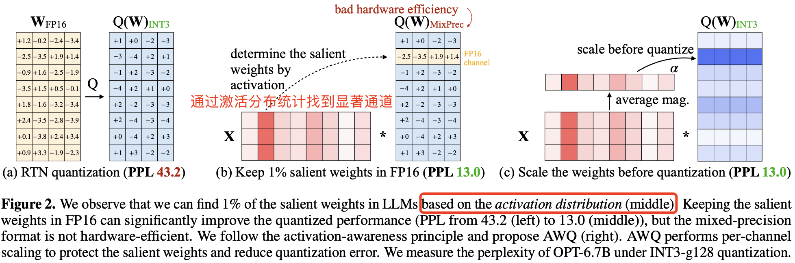
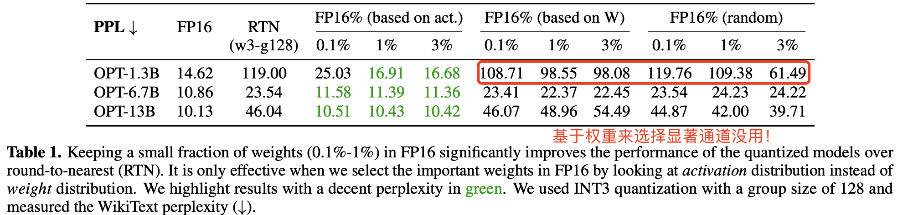
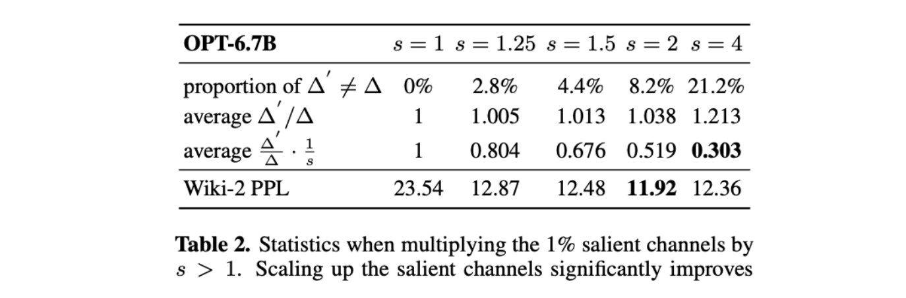
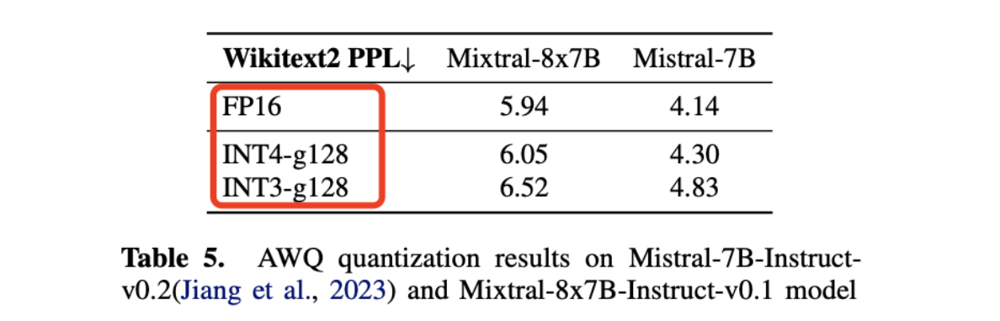

# AWQ：激活感知的权重量化

## 简介

本文将讲解AWQ的原理和实现。

<!-- more -->

## 一、摘要
激活感知权重量化 (AWQ)适合硬件的 LLM 低位权重（比如 w4）量化。AWQ指出，**并非所有的LLM权重都同等重要，仅保护 0.1% -- 1% 的显著权重便能大幅减少量化误差。** 

除此之外，AWQ还研究了如何保护好这些显著权重，它指出如果仅仅使用FP16精度保存它们（换而言之，这是最简单的方法，我知道你们重要，那我优化的时候留着你们不优化不就好了嘛，我去优化那些不重要的权重），的确可以提升量化性能，且不会显著增加模型的总位数，但也会带来一个显著的问题：**混合精度(FP16+INT4)的数据类型会推理系统实现复杂化**。为此，AWQ提出，仍然**采用INT4来量化这些显著权重，同时引入一个缩放因子$s$对显著权重进行放大以降低量化误差。**

AWQ 不依赖反向传播或重构，因此可以泛化到不同领域和模态而不会对校准集过拟合。AWQ在各种语言建模和领域特定的基准测试（编码和数学）中优于现有方法。凭借更好的泛化性，它在**指令微调语言模型以及多模态语言模型**上首次实现了卓越的量化性能。

## 二、AWQ
**AWQ：Activation-aware Weight Quantization**

量化技术通过**将浮点数映射为低位整数**，有效的减少 LLM 模型权重体积和推理成本。本节中，作者首先提出了一种仅针对权重的量化方法，通过保护更多“重要”权重，在无需额外训练（QAT）或回归的情况下提升模型精度。随后，作者引入了一种数据驱动的优化方法，来搜索减少量化误差的最佳缩放因子（如下图）。

- (a)中，如果直接采用FP16->INT4量化，量化后模型的困惑度PPL（这个是越低越好）较高，为43.2。
- (b)中，通过统计激活分布来确定哪些是显著权重通道，对这些显著通道保持FP16精度不量化，只量化不显著的非重要权重，模型的困惑度PPL降低到13.0。但是这样会带来混合精度(FP16+INT4)的数据类型，推理系统实现复杂化。
- (c)中，仍然通过统计激活分布来确定哪些是显著权重通道，对这些显著通道采用缩放因子$s$进行放大（所有权重都量化为INT4类型），量化后模型的困惑度PPL降低到13.0。

### 观点 1-权重并非同等重要，需要基于激活分布来挑选权重的显著通道

作者观察到，**LLM 中的权重并非同等重要：仅有 0.1%~1% 的小部分显著权重对模型输出精度影响较大**。如果能保留这部分关键权重，其他权重使用低比特量化推理，那么就能在保持模型精度的前提下，大幅降低模型内存占用和提高推理速度。

那么，如何评估哪些权重重要呢？

通常评估权重重要性是采用两种方法+一种作者新提出来的方法：
- 1.**权重的大小**: 非常简单，权重的绝对值越大越重要。
- 2.**L2范数（所有权重平方和的平方根）**：L2范数考虑了权重参数的多个维度上的影响，能够更全面地评估权重的重要性。相比于仅考虑权重的大小，L2范数能够更好地捕捉权重在模型中的综合影响力。

- 而作者提出了另一种方法：**基于激活值的大小来评估其重要性**。对于每个权重参数，计算其在模型推理过程中对应的激活值（即前向传播过程中该权重参与计算得到的输出值）。并按激活值的大小来评估其重要性。

原理：
**激活值反映了权重在模型实际运行中的贡献度**。通过计算权重在模型推理过程中的激活值，可以更直接地评估权重对模型输出的影响。相比于仅考虑权重的大小或L2范数，激活值能够更准确地反映权重在实际应用中的重要性。

激活值如何得到？

选择一批具有代表性的数据（这批数据要经典地反应你当前模型的主要用途！比如安全模型，那么就选择一些安全相关的数据），输入到模型中。在前向传播过程中，对于每个权重参数，记录其在计算过程中参与计算得到的输出值（即激活值）。

AWQ的作者做了实验来对比其效果，如下图所示：

- 实验一：无量化（FP16），PPL最低
- 实验二：全部参数统一量化，采用RTN(INT3+128分组)量化，PPL最高。
- 实验三：保留显著权重为FP16（保留方法：基于激活值识别），其他参数量化为INT3，PPL最低。
- 实验四：保留显著权重为FP16（保留方法：基于权重值大小识别），其他参数量化为INT3，PPL与实验二相当。
- 实验五：保留显著权重为FP16（保留方法：随机选择权重为显著权重），其他参数量化为INT3，PPL与实验二相当。

科普一下：RTN 量化的核心思想是简单地将每个数值舍入到目标精度下的最接近值，量化缩放系数计算公式为$\Delta = (max - min) / 2^{r-1}$，其中$r$是量化位数，$max$是权重的最大值，$min$是权重的最小值。

通过实验我们不难发现，基于激活值来保留重要权重(1%足够)，量化后模型的困惑度PPL最低。接近量化前的PPL。

现在下一个问题，我不想保留它们为FP16（原因上面讲了），有没有一种方法能量化它们为INT4，同时还能保护它们？

**有的兄弟，有的**

### 观点 2-对显著权重进行放大可以降低量化误差
承上，作者提出一种方案，对显著权重进行放大，同时对激活值进行缩放，来降低量化误差。（我也不知道他怎么想出来的），我们姑且先来看看它的误差分析吧。

#### 量化误差分析

从权重量化带来的误差分析入手。假设一个权重组或块$\mathbf{w}$，其线性操作可写为$y = \mathbf{w} x$，而量化后的对应形式为$y = Q(\mathbf{w}) x$，由此可定义量化函数$Q(\mathbf{w})$乘以激活值$x$为：

$$
Q(\mathbf{w}) \cdot x = \Delta \cdot \text{Round}\left(\frac{\mathbf{w}}{\Delta}\right) \cdot x, \quad \Delta = \frac{\max(|\mathbf{w}|)}{2^{N-1}}
$$

其中，$N$是量化位数，$\Delta$是由绝对值的最大值确定的量化缩放系数，$x$是激活值。

现在考虑对于一个权重元素$w \in \mathbf{w}$，如果我们引入缩放因子$s$，并在量化过程中将权重$w$与$s$相乘，同时将激活$x$以同样的缩放因子$s$逆向缩放！即$Q(w \cdot s)(x / s)$，引入缩放因子之后的新线性操作函数形式变为：

$$
Q(w \cdot s) \cdot \frac{x}{s} = \Delta' \cdot \text{Round}\left(\frac{ws}{\Delta'}\right) \cdot x \cdot \frac{1}{s},
$$

虽然公式1和公式2在数学上是“等效”的，但是带来的精度损失是不一样的。

$\Delta'$是在应用$s$之后的新量化缩放系数。作者通过实验发现：

1. 来自$\text{Round}(\cdot)$的期望误差（记为$\text{RoundErr}(\cdot)$）不变：由于舍入函数将浮点数映射到整数，误差大致在$[0, 0.5]$范围内均匀分布，导致平均误差约为$0.25$，即$\text{RoundErr}(\cdot) \sim 0.25$。

2. 对单个元素$w$进行缩放通常不会改变$\mathbf{w}$组的最大值。因此可以得出$\Delta' \approx \Delta$的结论；

3. 由于$\Delta$和$x$以FP16表示，因此它们没有量化误差。

因此，方程（1）和（2）中的量化误差可以表示为公式（3）：

$$
\text{Err}(Q(w)x) = \Delta \cdot \text{RoundErr}\left(\frac{w}{\Delta}\right) \cdot x
$$

$$
\text{Err}\left(Q(w \cdot s)\left(\frac{x}{s}\right)\right) = \Delta' \cdot \text{RoundErr}\left(\frac{ws}{\Delta'}\right) \cdot x \cdot \frac{1}{s}
$$

两个误差相除，可得**新误差与原始误差的比率为 $\frac{\Delta'}{\Delta} \cdot \frac{1}{s}$。因为 $\Delta' \approx \Delta$ 且 $s > 1$，则可推公式（2）的误差小于公式（1）**。因此，量化时对显著权重进行放大即引入缩放因子 $s$，是可以降低量化误差的。

到这里，论文通过上述复杂的公式推导证明了观点 2 的由来，下面才是实验证明。

但是前面的设想和公式推导还只是理论层面，因此为了验证该想法，作者在 OPT-6.7B 模型的 **1% 显著通道上乘以 $s > 1$**，并做了相关对比实验，实验结果如下。

先看直接结果（模型精度变化），结果显示，放大显著通道非常有效：模型困惑度 PPL 从 $s = 1$ 时的 23.54（仅为 RTN）降低到 $s = 2$ 时的 11.92。

再看间接结果：

- 随着 $s$ 增加，$\Delta \neq \Delta'$ 的比例逐渐增大，但在 $s < 2$ 时比例还是很低的（<5%）；
- 误差比值 $\frac{\Delta'}{\Delta} \cdot \frac{1}{s}$ 随 $s$ 增加持续减小，符合前面的推导。

有点意外的是，**最佳困惑度在 $s = 2$ 时出现而不是 4（$s = 4$ 时误差比值最小）。这是因为如果 $s$ 过大，会导致非显著通道的相对误差增加。当 $\Delta$ 增大时，非显著通道的误差会被 $\frac{\Delta'}{\Delta}$ 放大，并且在 $s = 4$ 时，21.2% 的通道 $\frac{\Delta'}{\Delta}$ 比例大于 1，从而损害模型的整体准确性。**

到此，表 2 的实验结果直接证明了量化时对显著权重进行放大，是可以降低量化误差的，同时，在保护显著通道时，我们还需考虑非显著通道的误差。二者中间有competition关系！

那么我们怎么找到最优的缩放因子$s$呢？

### 寻找最优的缩放因子$s$

一句话总结：**s计算过程中会按照超参数 group_size 对通道进行分组，每组共享一个$\alpha$。这个$\alpha$是用于平衡显著通道和非显著通道的，通过最优的$\alpha$可以计算得到最佳的缩放因子s。** 

那么$\alpha$怎么来呢？作者给出的方法是实际上就是在 [0,1] 区间平均取 20 个数，0, 0.05, 0.10, 0.15 …… 然后逐个计算不同 $\alpha$ 下的 MSE 损失，损失最小的就是最佳的 $\alpha$。

下面细嗦

按照前面的分析，我们希望找到权重矩阵通道的每一个缩放系数 $s$，使得量化误差最小，这里 $s$ 如何选择，本质上是优化如下目标函数：

$$
\mathbf{s}^* = \arg \min_{\mathbf{s}} \mathcal{L}(\mathbf{s})
$$

$$
\mathcal{L}(\mathbf{s}) = \| Q(\mathbf{W} \cdot \text{diag}(\mathbf{s})) (\text{diag}(\mathbf{s})^{-1} \cdot \mathbf{X}) - \mathbf{W} \mathbf{X} \|
$$

上式 $Q$ 表示权重量化函数（例如，组大小为 **128** 的 **INT3/INT4** 量化，以及前文提到的 **per-channel** INT8 量化），$\mathbf{W}$ 是原始 **FP16** 权重，$\mathbf{X}$ 是从小型校准集缓存的输入特征（从预训练数据集中提取了一个小的校准集，以避免过拟合到特定任务）。$\mathbf{s}$ 是逐（输入）通道的缩放因子；对于 $\mathbf{s}^{-1} \cdot \mathbf{X}$，通常可以将其与前一个操作符融合（参见 Wei 等，2022b；Xiao 等，2022，《SmoothQuant 源码分析》文章也详细解释了）。

按照作者的观点，激活值越大，对应通道越显著，就应该分配更大的缩放系数降低其量化误差。因此，**作者统计各通道的激活值平均值（计算输入矩阵各列绝对值的平均值）$s_{\mathbf{x}}$，将此作为各通道的缩放系数**。另外，引入一个变量 $\alpha$ 用于平衡显著通道和非显著通道，并通过计算不同 $\alpha$ 下的 MSE 损失（$\mathcal{L}$），损失最小的就是最佳的 $\alpha$。转换成公式可得求权重缩放系数 $s$ 的表达式如下所示：

$$
s = \text{mean}(\text{abs}(\mathbf{x}))^\alpha, \quad \alpha^* = \arg \min_{\alpha} \mathcal{L}(\text{mean}(\text{abs}(\mathbf{x}))^\alpha)
$$

其中 $\text{mean}(\text{abs}(\mathbf{x}))$ 是逐通道计算的激活值绝对值的平均值，MSE 损失是模型网络层的浮点结果和量化结果的均方误差，计算公式为：

$$
\text{MSE} = \frac{1}{n} \sum_{i=1}^n (out_{fp16} - out_{quant})^2
$$

另外，在求 $s$ 中需要注意两点：

1. $s$ 计算过程中会按照超参数 **group_size** 对通道进行分组，每组共享一个 $\alpha$。
2. 码实现和论文有个细节不同，为了防止 $s$ 过大或者过小，作者还进行了一步数据标准化：

   $$
   s = \frac{s}{\sqrt{\max(s) \cdot \min(s)}}.
   $$

到这里权重缩放系数 s 的计算公式（5）的意义和细节我们已经彻底搞懂了，但是还有最后一个问题是，α 如何取值呢？作者认为可以通过在区间 [0,1] 上进行快速网格搜索来找到最佳的 α （0 表示不进行缩放；1 表示在搜索空间中最激进的缩放）。但这种方法到底是怎么做的，论文中并没有提。通过阅读源码，发现该方法实际上就是在 [0,1] 区间平均取 20 个数，即 0,0.05,0.10,0.15,… ，然后逐个计算不同 α 下的 MSE 损失，损失最小的就是最佳的 α 。得到最佳 α 后，最佳缩放系数 s 也随之确定。

为了验证 AWQ 算法的有效性，作者做了 OPT 模型在 INT3-g128 量化下的消融实验，实验结果显示 AWQ 明显优于 RTN，并实现了和混合精度（1% FP16）相当的精度，同时对硬件更友好。

## 三、AWQ使用中的一些思考和讨论
### 1. 校准数据集
使用AWQ量化时，我们通常会采用一批能反应模型功能的训练数据集来作为AWQ量化的校准数据集。我们上面提到，AWQ量化中需要使用到数据来进行前向传播计算激活值，这批数据就是帮助AWQ来“看到”模型的典型分布状态的。

校准数据推荐（2000-5000）条。

当没有校准数据进行AWQ量化时，它无法计算激活值，会退化为类似均匀量化的方法，失去“激活感知”优势。

### 2. AWQ量化模型的哪些参数？
标准Transformer架构的模型通常有如下几种参数：
- 权重参数(Weights)：线性层中的权重矩阵，如$W_q, W_k, W_v, W_o$等。以及前反馈网络（MLP层）的权重矩阵
- 偏置参数(Biases)：各层中的偏置向量
- 层归一化参数(LayerNorm)：各层中的层归一化参数
- 嵌入参数(Embedding)：词嵌入矩阵
- 输出参数(Output)：线性层中的输出权重矩阵

**AWQ主要量化其中的权重参数、嵌入参数和输出参数作为权重的一部分进行量化。**

**偏置参数和层归一化参数通常不被量化**，因为：

1.偏置参数对模型性能影响较小

2.层归一化参数对模型稳定性很重要，量化可能会影响模型性能

### 3. 介绍一下AWQ的分组量化机制？
#### 按通道分组（Grouping by Channels）：

在Transformer模型中，权重矩阵通常是多维的（例如，线性层的权重矩阵形状为[输出维度，输入维度]）。
AWQ将权重矩阵按输出维度（即按通道）进行分组。例如，对于一个线性层，如果输出维度为768，可以将权重矩阵分成768组，每组对应一个输出通道。
这种分组策略能够保证每个输出通道的权重被独立量化，从而更好地保留每个通道的特征。

#### 组内共享量化参数：

每个组内的所有权重共享相同的量化参数（如量化步长和零点）。
这种方式既保证了量化的效率，又能够捕捉到组内权重参数的相似性。

## 总结
作者提出的激活感知权重量化 (AWQ)，是一种用于 LLM 低位权重压缩的简便有效方法。基于权重在 LLM 中重要性不均的观察，**AWQ 采用逐通道缩放来减少关键权重的量化损失。AWQ 不会对校准集过拟合，并能够保留 LLM 在不同领域和模态中的通用能力**。它在语言建模方面优于现有方法，并可应用于指令微调的语言模型和多模态语言模型。

## 待更新
 [AWQ的代码详解](https://www.armcvai.cn/2024-11-03/awq-code.html)

## 参考资料

1. [AWQ: Activation-aware Weight Quantization for LLM Compression and Acceleration](https://arxiv.org/pdf/2306.00978)

2. [AWQ 量化详解](https://www.armcvai.cn/2024-11-01/llm-quant-awq.html)
