# DeepSpeed 

## 简介

本文将从大模型训练过程中GPU的存储内容谈起，分析分布式数据并行DDP的显存占用问题，进而介绍解决方法-DeepSpeed框架及其三种ZeRO策略。 

<!-- more -->
## 引言
数据并行DP有两个显著问题：
  - 存储开销大。每块GPU上都存了一份完整的模型，造成冗余。
  - 通讯开销大。Server需要和每一个Worker进行梯度传输。当Server和Worker不在一台机器上时，Server的带宽将会成为整个系统的计算效率瓶颈。

DDP通过Ring AllReduce将通讯压力均衡到每个Worker上，解决了前者问题。但显存占用问题依然存在，由微软开发的ZeRO（零冗余优化），它是DeepSpeed这一分布式训练框架的核心，被用来解决大模型训练中的显存开销问题。**ZeRO的思想就是用通讯换显存**。

## 一、大模型训练过程中GPU的存储
### 1.1 存储分类
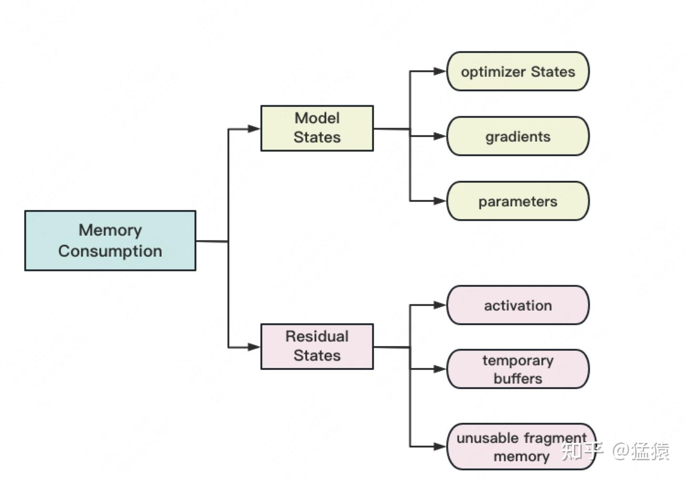

存储主要分为两大块：Model States和Residual States。

**Model States**指和模型本身息息相关的，**必须存储**的内容，具体包括：

- optimizer states：Adam优化算法中的momentum(一阶动量)和variance方差(二阶动量)
- gradients：模型梯度
- parameters：模型参数W

**Residual States指并非模型必须的**，但在训练过程中会额外产生的内容，具体包括：

- activation：激活值。在流水线并行中我们曾详细介绍过。在backward过程中使用链式法则计算梯度时会用到。有了它算梯度会更快，但它不是必须存储的，因为可以通过重新做Forward来算它。
- temporary buffers: 临时存储。例如把梯度发送到某块GPU上做加总聚合时产生的存储。
- unusable fragment memory：碎片化的存储空间。虽然总存储空间是够的，但是如果取不到连续的存储空间，相关的请求也会被fail掉。对这类空间浪费可以通过内存整理来解决。

### 1.2 混合精度训练
知道了存储分类，进一步，我们想知道，假设模型的参数W大小是$\Phi$，那么每一类存储具体占了多大的空间呢？

在分析这个问题前，我们需要来了解**混合精度训练**
对于模型，我们肯定希望其参数越精准越好，也即我们用fp32（单精度浮点数，存储占4byte）来表示参数W。但是在forward和backward的过程中，fp32的计算开销也是庞大的。那么能否在计算的过程中，引入fp16或bf16（半精度浮点数，存储占2byte），来减轻计算压力呢？于是，混合精度训练就产生了，它的步骤如下图：

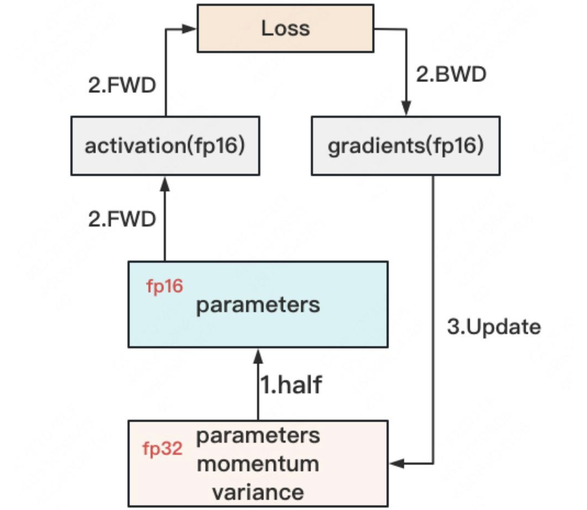

1. **存储一份fp32的parameter，momentum和variance（统称model states）**
2. 在forward开始之前，额外开辟一块存储空间，将fp32 parameter减半到fp16 parameter。
3. 正常做forward和backward，在此之间产生的activation和gradients，都用fp16进行存储。
4. **用fp16 gradients去更新fp32下的model states**，**用fp16 parameter去更新fp32下的model states**。
5. 当模型收敛后，fp32的parameter就是最终的参数输出。

通过这种方式，混合精度训练在计算开销和模型精度上做了权衡。

### 1.3 存储空间计算

我们可以来计算模型在训练时需要的存储大小了，假设模型的参数W大小是$\Phi$，以byte为单位，存储如下：

这里**暂不将activation纳入统计范围**，原因是：

- activation不仅与模型参数相关，还与batch size相关
- activation的存储不是必须的。存储activation只是为了在用链式法则做backward的过程中，计算梯度更快一些。但你永远可以通过只保留最初的输入X，重新做forward来得到每一层的activation（虽然实际中并不会这么极端）。
- 因为activation的这种灵活性，纳入它后不方便衡量系统性能随模型增大的真实变动情况。因此在这里不考虑它。

## 二、DeepSpeed-ZeRO（Zero Redundancy Optimizer）
零冗余优化器（Zero Redundancy Optimizer），是DeepSpeed-ZeRO的核心，它通过将优化器状态、梯度和模型参数进行分割，从而减少显存占用。

在整个训练中，有很多states并不会每时每刻都用到，举例来说；

- Adam优化下的optimizer states只在最终做update时才用到(可对优化器os进行优化)
- 数据并行中，gradients只在最后做AllReduce和updates时才用到(可对梯度g进行优化)
- 参数W只在做forward和backward的那一刻才用到(可对参数W进行优化)

诸如此类。

所以，ZeRO想了一个简单粗暴的办法：**如果数据算完即废，等需要的时候，我再想办法从个什么地方拿回来，那不就省了一笔存储空间吗？**

沿着这个思路，我们逐一来看ZeRO是如何递进做存储优化的。
- ZeRO Stage 1：仅对优化器状态进行分割，每个GPU中仍有完整的模型参数和梯度数据
- ZeRO Stage 2：对优化器状态和梯度进行分割
- ZeRO Stage 3：对优化器状态、梯度和模型参数全部进行分割

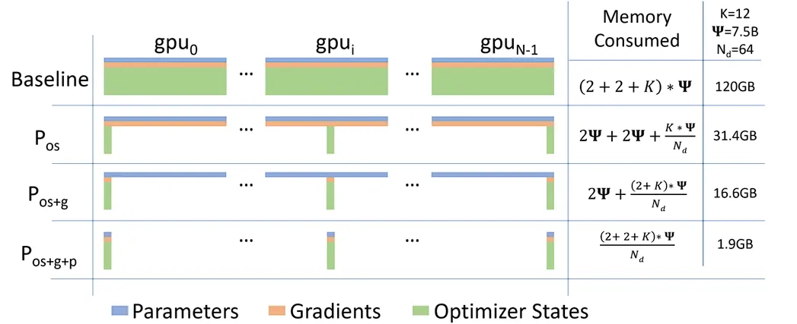

## 三、ZeRO-DP

*优化器状态（O, fp32），参数（W, fp16）和梯度（G, fp16）*

### 3.1 ZeRO-Stage1（$P_{os}$：优化状态分割）
ZeRO-Stage1的思路是：**将optimizer states进行分割**。每块GPU上各自维护一份。这样就减少了相当一部分的显存开销。如下图：

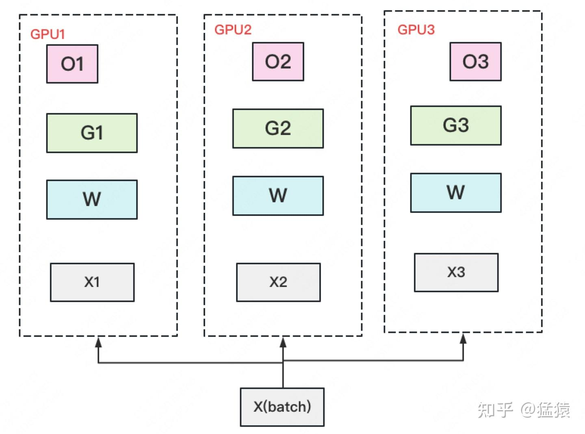

此时，整体数据并行的流程如下：

（1）每块GPU上存一份完整的参数W。将一个batch的数据分成3份，每块GPU各吃一份，做完一轮foward和backward后，各得一份梯度。

（2）对**梯度做一次AllReduce(N分片->1规约计算->N广播)，得到完整的梯度G，产生单卡通讯量$2\Phi$**。

（3）得到完整梯度G，就可以对W做更新。我们知道W的更新由optimizer states和梯度共同决定。由于每块GPU上只保管部分optimizer states，因此只能将相应的W（蓝色部分）进行更新。

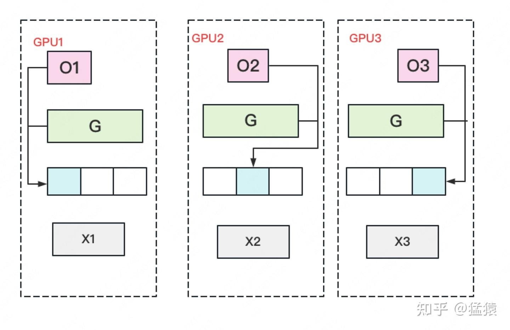

（4）此时，每块GPU上都有部分W没有完成更新（图中白色部分）。所以我们需要**对W做一次All-Gather(N分片->1合并->N广播)**，从别的GPU上把更新好的部分W取回来。产生**单卡通讯量$\Phi$**。

（5）最后，每块GPU上都有完整的W，可以进行下一轮的训练。

做完$P_{os}$后，设GPU个数为$N_d$，显存和通讯量的情况如下：

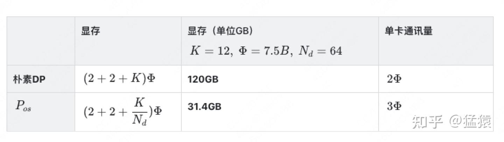

*增加1.5倍单卡通讯开销的基础上，将单卡存储降低了4倍*

### 3.2 ZeRO-Stage2（$P_{os}+P_{g}$：优化状态和梯度分割）
更近一步，我们把梯度也拆开，每个GPU格子维护一块梯度。
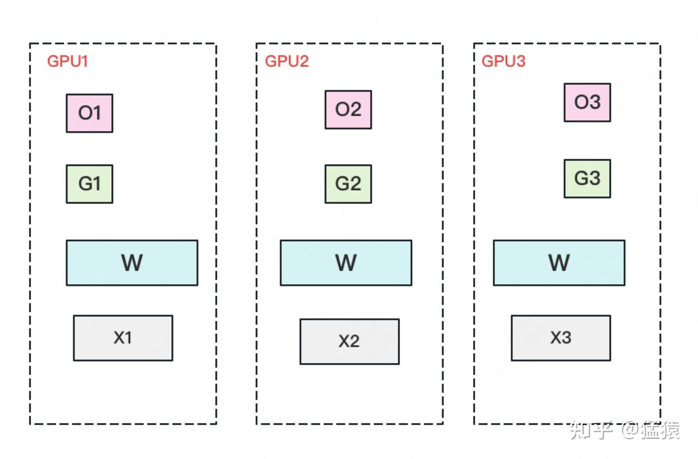
此时，数据并行的整体流程如下：

（1）每块GPU上存一份完整的参数W。将一个batch的数据分成3份，每块GPU各吃一份，做完一轮foward和backward后，算得一份完整的梯度（下图中绿色+白色）。

（2）对**梯度做一次Reduce-Scatter(N分片->1规约计算->N分发)**，保证每个GPU上所维持的那块梯度是聚合梯度。例如对GPU1，它负责维护G1，因此其他的GPU只需要把G1对应位置的梯度发给GPU1做加总就可。汇总完毕后，白色块对GPU无用，可以从显存中移除。**单卡通讯量$\Phi$(why?)**。

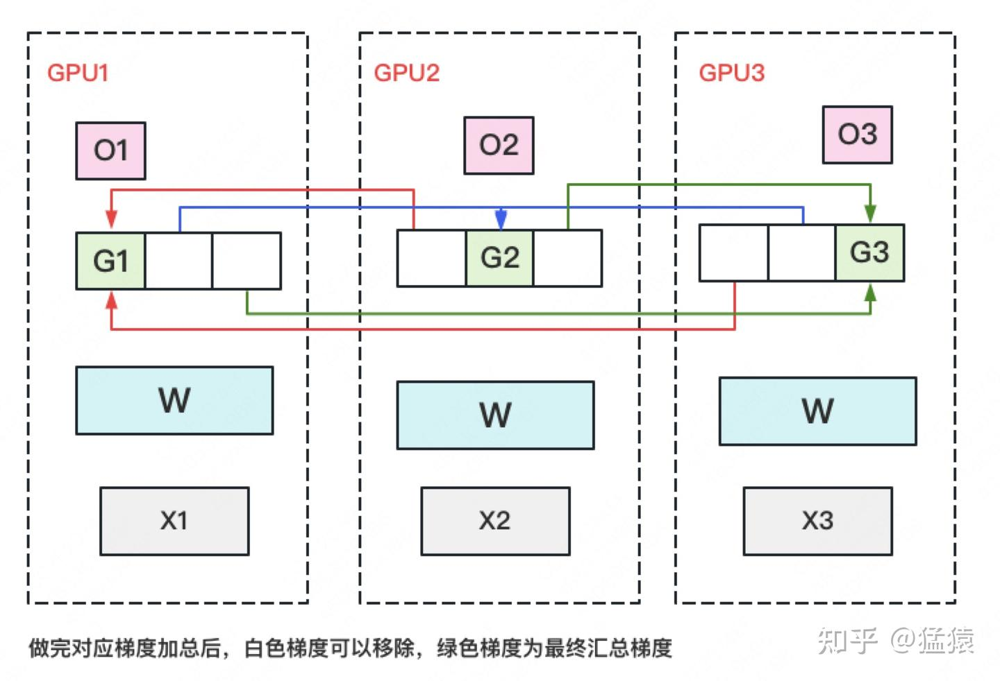

（3）每块GPU用自己对应的O和G去更新相应的W。更新完毕后，每块GPU维持了一块更新完毕的W。同理，**对W做一次All-Gather**，将别的GPU算好的W同步到自己这来。**单卡通讯量$\Phi$**。

再次比对下显存和通讯量：

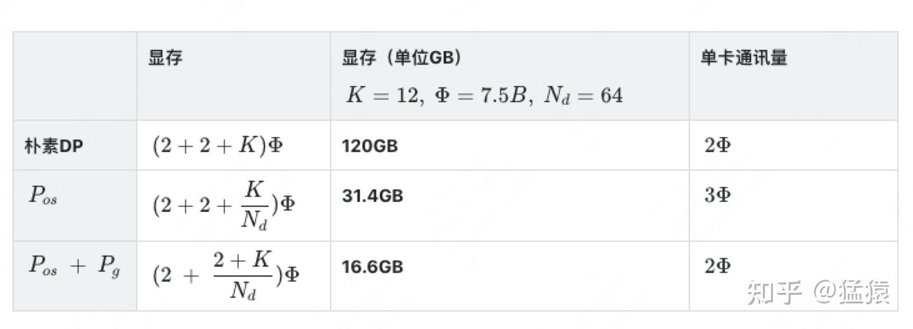

*和朴素DP相比，存储降了8倍，单卡通讯量持平*

### 3.3 ZeRO-Stage3（$P_{os}+P_{g}+P_{w}$：优化状态、梯度和参数分割）
ZeRO的思想就是：**万物皆可切，万物皆可抛**。所以现在，我们把参数也切开。每块GPU置维持对应的optimizer states，gradients和parameters（即W）。
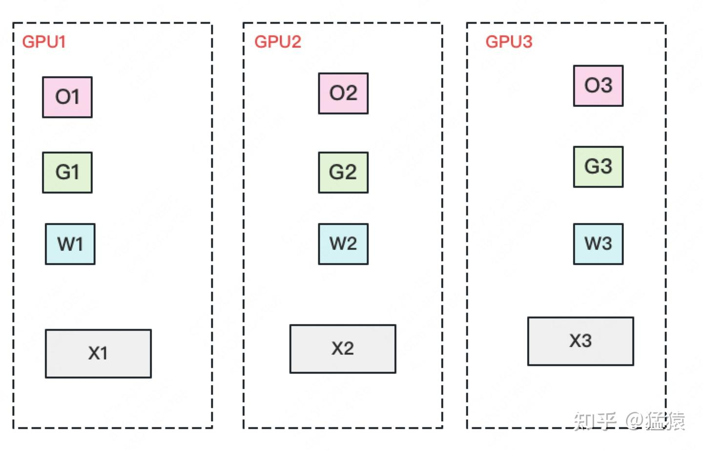

数据并行的流程如下：

（1）每块GPU上只保存部分参数W。将一个batch的数据分成3份，每块GPU各吃一份。

（2）做forward时，**对W做一次All-Gather**，取回分布在别的GPU上的W，得到一份完整的W，**单卡通讯量$\Phi$**。forward做完，立刻把不是自己维护的W抛弃。

（3）做backward时，**对W做一次All-Gather**，取回完整的W，**单卡通讯量$\Phi$**。backward做完，立刻把不是自己维护的W抛弃。

（4）做完backward，算得一份完整的梯度G，**对G做一次Reduce-Scatter**，从别的GPU上聚合自己维护的那部分梯度，**单卡通讯量$\Phi$**。聚合操作结束后，立刻把不是自己维护的G抛弃。

（5）用自己维护的O和G，更新W。由于只维护部分W，因此无需再对W做任何AllReduce操作。

显存和通讯量如下：

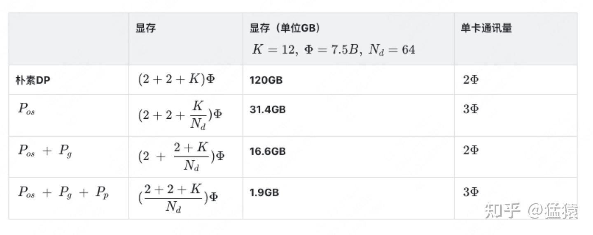

*我们用1.5倍的通讯开销，换回近120倍的显存！*

特别值得注意的是，最新的Zero3采用的层内（intra）分割，也就是把完整的权重矩阵分成几块，而早期的Zero3采用的是层间（inter）分割

以上两种分割方式对应了不同的通信方式：
- 层间（inter）分割：在前向传播和反向传播时做broadcast，计算到块时，GPU0将广播到其他设备。
- 层内（intra）分割：在前向传播和反向传播时做all-gather，取回每一块的完整的权重，以便做梯度计算。

### 3.4 ZeRO VS 模型并行

既然ZeRO都把参数W给切了，那它应该是个模型并行呀？为什么要归到数据并行里呢？

其实**ZeRO是模型并行的形式，数据并行的实质**。**模型并行**，是指在forward和backward的过程中，我只需要用**自己维护的那块W来计算**就行。即同样的输入X，每块GPU上各算模型的一部分，最后通过某些方式聚合结果。但**对ZeRO来说**，它做forward和backward的时候，是需要把各GPU上维护的W聚合起来的，即**本质上还是用完整的W进行计算**。它是不同的输入X，完整的参数W，最终再做聚合。

## 四、ZeRO-R
上述是对model states的显存优化，现在来看对residual states的优化。

### 4.1 $P_{ac}$：Partitioned Activation Checkpointing
前面说过，对activation的存储是灵活的。不像optimizer states，gradients和parameters对模型更新是必须的，activation只是起到加速梯度计算的作用。因此，在哪几层保存activation，保存哪些activation都是可以灵活设置的。同样，我们也可以仿照以上切割方式，每块GPU上只维护部分的activation，需要时再从别的地方聚合过来就行。需要注意的是，activation对显存的占用一般会远高于模型本身，通讯量也是巨大的，所以这块要灵活、有效地实验设计。

**一句话总结，这个需要根据模型结构和计算图来做实验设计。**

### 4.2 $C_{B}$：Constant Size Buffer
固定大小的内存buffer，它的目的在于：

- **提升带宽利用率**。当GPU数量上升，GPU间的通讯次数也上升，每次的通讯量可能下降（但总通讯量不会变）。数据切片小了，就不能很好利用带宽了。所以这个buffer起到了积攒数据的作用：等数据积攒到一定大小，再进行通讯。
- **使得存储大小可控**。在每次通讯前，积攒的存储大小是常量，是已知可控的。更方便使用者对训练中的存储消耗和通讯时间进行预估。

### 4.3 $M_{D}$：Memory Defragmentation

在前文提过，设置机制，对碎片化的存储空间进行重新整合，整出连续的存储空间。防止出现总存储足够，但连续存储不够而引起的存储请求fail。

## 五、ZeRO-Offload与ZeRO-Infinity

### 5.1 ZeRO-Offload
最后，简单介绍一下ZeRO-Offload。它的核心思想是：**显存不够，内存来凑**。如果我把要存储的大头卸载(offload)到CPU上，而把计算部分放到GPU上，这样比起跨机，是不是能既降显存，也能减少一些通讯压力呢？
ZeRO-Offload的做法是：

- **forward和backward计算量高**，因此和它们相关的部分，例如参数W（fp16），activation，就全**放入GPU**。
- **update的部分计算量低**，因此和它相关的部分，全部**放入CPU中**。例如优化器中的W(fp32)，优化器中的一阶二阶动量（fp32）和gradients(fp16)等。

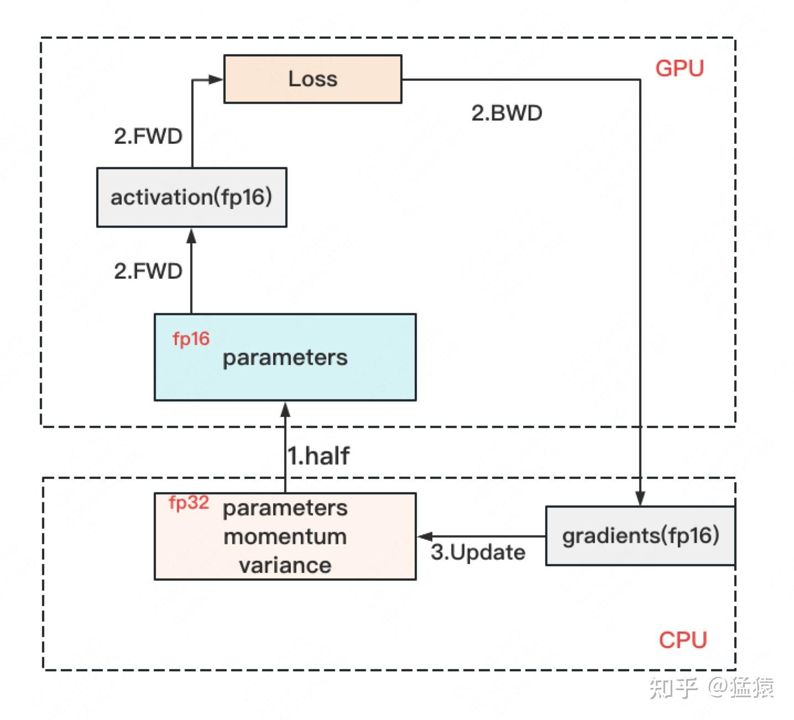

### 5.2 ZeRO-Infinity
ZeRO-infinity也是同理，它们在解决的事情都是：找个除GPU之外的地方，存数据。

## 六、其余的优化
- ZeRO ++ ：针对ZeRO3通信进行优化，通过权重量化、权重分层存储、梯度量化降低跨节点通信量
- DeepSpeed Ulysses：针对长序列训练，将各个样本在序列维度上分割给参与的GPU

## 参考资料

1. [大模型的分布式训练框架：deepspeed](https://mp.weixin.qq.com/s/kYeNjMsesfKfoZtJPRkciA)

2. [deepspeed-通过系统优化和压缩加速大规模模型推理和训练](https://www.armcvai.cn/2023-07-03/deepspeed-optimize.html)

3. [ZeRO: Memory Optimizations Toward Training Trillion Parameter Models](https://arxiv.org/pdf/1910.02054)

4. [数据并行下篇( DeepSpeed ZeRO，零冗余优化)](https://zhuanlan.zhihu.com/p/618865052)