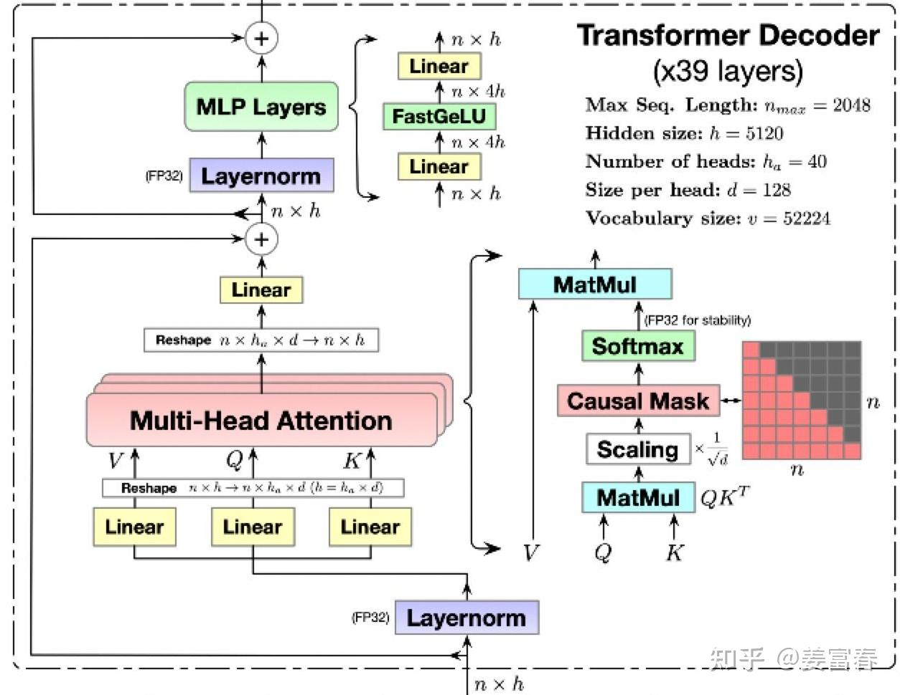
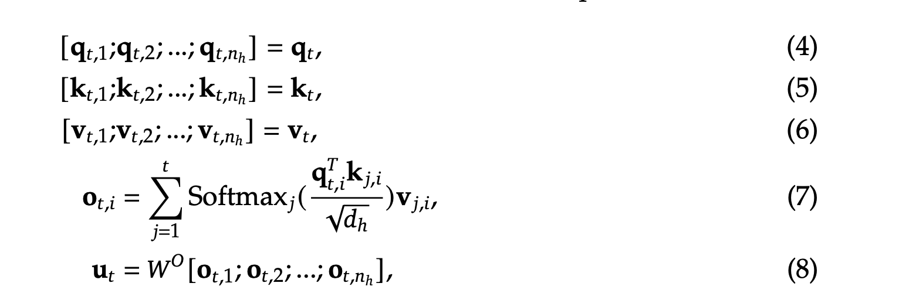
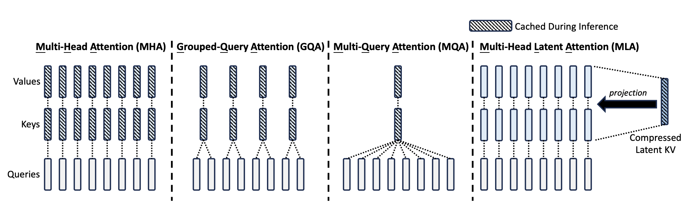
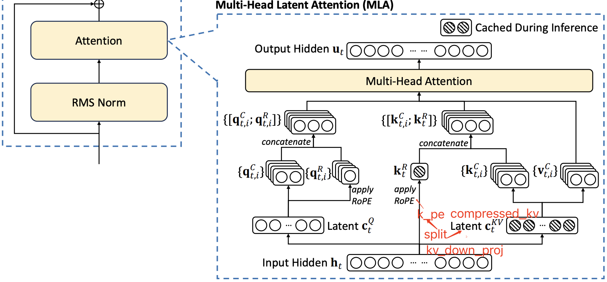
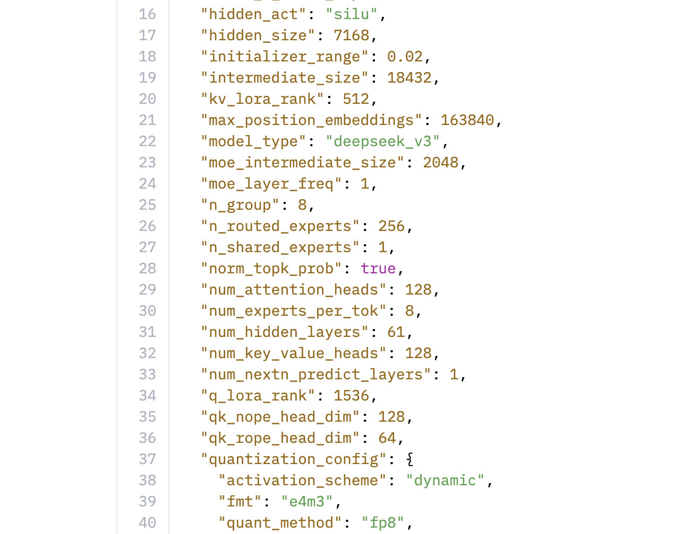
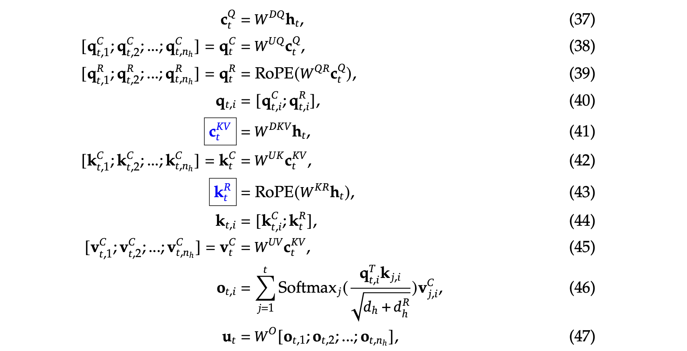

# Deepseek MLA 

## 简介

本文将讲解Deepseek MLA的原理和实现。

<!-- more -->

## 一、引言--Transformer and KVcache
LLM 推理分为两个阶段：prefill 阶段和 decode 阶段

- **prefill 阶段**：是模型对全部的 Prompt tokens 一次性并行计算，最终会生成第一个输出 token。
- **decode 阶段**：每次生成一个 token，直到生成 EOS（end-of-sequence）token，产出最终的 response。

在推理过程中，**由于模型堆叠了多层 Transformer，所以核心的计算消耗在 Transformer 内部，包括 MHA、FFN 等操作，其中 MHA 要计算 Q、K、V 矩阵，来做多头注意力的计算。**

### 1.1 Transformer结构

在 LLM 生成过程中，是一个基于前向序 token 列预测下一个 token 的过程，序列中的 token（无论是 prefill 阶段，还是 decode 阶段）只与它前面的 token 交互来计算 attention，我们也称这种 Attention 为 **Causal Attention**。矩阵计算上通过一个下三角的 Causal Attention Mask 来实现 token 交互只感知前向序列。如图所示，展现的 Transformer 内部的细节：

注：上图中的圆圈+表示残差加，残差是来自上一个模块的RMSNorm前的输入。

在传统的transformer结构中，以一个序列的t位置的token为例，计算一层Tansformer的attention过程，如列下公式所示:

注：这里的h代指head

### 1.2 KVcache

从公式（7）可以看到，在计算 Attention 时，$t$ 位置的 $q$ 只与 $t$ 位置前的 $k, v$ 做计算，所以我们有如下两个结论：

1. 计算前面的 $k, v$ 并不受后面 token 的影响。
2. 后面计算 $t+1, t+2, \dots, t+n$ 位置的 Attention，要使用前序的 $1 \to t$ 位置的 $k, v$ 的值是始终不变的。

所以为了加速训练和推理的效率，在 token-by-token 生成过程中，避免重复计算前序的 $k, v$。研究者们提出把前序计算好的 $k, v$ 缓存起来，这也就是目前主流的 KV-cache 机制。**KV-cache 本质是通过空间换时间的方法**。我们知道当前 LLM size 都比较大，GPU 的显存空间也是比较宝贵的，通过显存来保存 KV-cache 势必会带来访存的瓶颈。换句话说，**如果不用 KV-cache 模型**直接计算（重复计算前序 $k, v$），是个**计算密集型任务**；**增加了 KV-cache**，现在 $k, v$ 不是通过计算得到，而是从「存储介质」里读出来，GPT 内核与存储介质之间要频繁读写，这样**就变成了一个访存密集型任务**。所以使用了 KV-cache 的机制，解决的重复计算的问题，但访存的速率也就直接影响到训练和推理的速度。

### 1.3 KVcache的显存占用
与此同时，kvcache占据的显存量堪称恐怖。下面以Qwen72B模型为例，计算一下单个Token的kvcache显存占用量：

模型共 80 层，每层有 64 个 Head，每个 Head 的向量维度是 128，即：

$$
l = 80, \quad n_h = 64, \quad d_h = 128
$$

所以针对一个 token，缓存的 $k, v$ 数据总量：

$$
num_{kv} = 2 \times l \times n_h = 2 \times (80 \times 64)_{qwen\_72B} = 10240
$$

其中公式里的 $2$ 表示 1 个 $k$ 和 1 个 $v$。一个 token 就要缓存 10240 个 $k, v$，这个数是不是有点意料之外！这么多 $k, v$ 占了多少存储呢？我们假设模型推理阶段是半精度（bf16）参数，每个参数占 2 Byte。最终一个 token 的存储占用，如公式 (2) 计算所示：

$$
1token\_mem_{kv} = 2 \times num_{kv} \times d_h = 2 \times (10240 \times 128)_{qwen\_72B} = 2.62(MB)
$$

我们现在知道了一个 Token 计算后需要缓存的 $k, v$ 数量和存储量。那么对于一个实际的推理场景，还要考虑批量 Batch ($B$) 和 序列长度 Sequence_len ($S$) 两个维度，来确认整体 KV Cache 的存储消耗。例如如果Bs=1，S=1024，那么一个 Token 的 KV Cache 存储占用就是 2.62MB，那么1024个 Token 的 KV Cache 存储占用就是 2.62MB * 1024 = 2684MB。 单条序列的推理就会占这么多恐怖的显存。

## 二、减小KVcache的多种方法
### 2.1 优化方法总结

为了降低 KV Cache 的内存占用和访存开销，近年来提出了多种优化策略。主要包括以下几种：
1. **共享 KV（Key-Value Sharing）**

多个 Attention Head 共享一组 Key 和 Value 向量，从而减少存储的 KV 总数。代表方法包括：

- MQA（Multi-Query Attention）
- GQA（Grouped-Query Attention）

2. **窗口 KV（Windowed KV）**

限制 KV Cache 只保存一定窗口长度内的结果，超出窗口的部分被丢弃。这种方法能有效减少长序列下的内存占用，但可能会牺牲部分长文推理能力。代表方法：Longformer。

3. **量化压缩（Quantization）**

通过低比特量化（如 INT8、FP8）来压缩 KV 的存储大小。例如将每个数值从 FP16（2 字节）压缩为 INT8（1 字节），KV 存储空间可减少一半。

4. **计算优化（Computation Optimization）**

通过算法优化计算过程，减少 GPU 显存访问次数，提升推理效率。代表方法：[Flashattention技术详解](https://summer536.github.io/Notes/zh/posts/flashattention.html) 。

### 2.2 MQA（Multi-Query Attention）

MQA 方法的核心思想是让所有 Attention Head 共享同一组 Key 和 Value 向量。如图所示：

- 每一层仅保留一个 `k` 和一个 `v`
- 相比于 MHA 中的 `2 × l × n_h` 个 `k, v`，MQA 减少为 `2 × l` 个

这大幅减少了 KV Cache 的内存占用，但也可能带来一定的精度损失。

### 2.3 GQA（Grouped-Query Attention）

GQA 是 MHA 和 MQA 的折中方案：

- 将多个 Head 分为一组
- 每组共享一组 `k, v`
- 分组数量记为 `g`，每组包含 `n_h / g` 个 Head

当：

- `g = 1`：等价于 MQA
- `g = n_h`：等价于 MHA

KV Cache 数量为：  
$$
2 \times l \times g
$$

GQA 在保持性能的同时显著降低了内存消耗，是当前主流大模型（如 Llama2、Qwen）广泛采用的技术。

---

### 2.4 不同 Attention 方式的 KV Cache 占用对比

以单个 token 为例，不同 Attention 方法下缓存的 KV 数量如下：

| Attention 类型 | KV 数量（单 token） |
|----------------|---------------------|
| **MHA**        | $2 \times l \times d_h \times n_h$  |
| **MQA**        | $2 \times l \times d_h$         |
| **GQA**        | $2 \times l \times d_h \times g$ |
| **MLA**        | $l \times (d_c + d_q) \approx l \times d_h$ |

其中：
- `l`: 模型层数（如 80）
- `n_h`: 每层的 Head 数量（如 64）
- `g`: 分组数（通常取值小于 `n_h` 且能整除）

---

## 三、Deepseek MLA（Multi-Head Latent Attention）

### 3.1 低秩压缩介绍
[Inference第六题第一点](https://summer536.github.io/Notes/zh/posts/Inference.html)

### 3.2 MLA公式及原理
MLA的结构如下图所示：

MLA和MHA对比如下：

首先列举一下各个参数的含义及其大小（以deepseek-v3为例）：

MLA完整的计算公式如下所示：

在论文中提到，每个Transformer层，只缓存了上述公式蓝框的向量$k_t^R$和$c_t^{KV}$！！！

- $d_c$：MLA低秩压缩KV的维度，$(d_c = 512)$，kv_lora_rank
- $d_q$：MLA低秩压缩Q的维度 $(d_q = 1536)$，q_lora_rank
- $d_h$：是单个 head 的向量维度 （$d_h = 128$），num_hidden_size
- $n_h$：是每层 head 的数量（$n_h = 128$），num_attention_heads
- $d$：中间隐藏层维度，$d = d_h \times n_h$（$d = 128 \times 128 = 16384$）
- $d_{nope}$：NoPE的维度，（$d_{nope} = 128$），qk_nope_head_dim
- $d_{rope}$：RoPE的维度，（$d_{rope} = 64$），qk_rope_head_dim
- $W^{DQ} \in \mathbb{R}^{d_q \times d}$是低秩变换矩阵
- $W^{UQ} \in \mathbb{R}^{d_q \times n_h \times d_{nope}}$是升维度投影矩阵（nope维度）
- $W^{QR} \in \mathbb{R}^{d_q \times n_h \times d_{rope}}$是升维度投影矩阵（rope维度）
- $W^{DKV} \in \mathbb{R}^{d_c \times d}$是低秩变换矩阵
- $W^{UK}、W^{UV} \in \mathbb{R}^{d_c \times n_h \times d_{nope}}$是升维度投影矩阵（nope维度）
- $W^{KR} \in \mathbb{R}^{d_c \times 1 \times d_{rope}}$是升维度投影矩阵（rope维度）

#### 3.2.1 Q 向量计算

1. 在 DeepSeek-V3 中，Q 向量采用了低秩压缩的方式。首先，将输入向量$h_t \in \mathbb{R}^{d}$投影到一个 **$d_q = 1536$**（对应模型配置文件中的 `q_lora_rank` 参数）维的低维空间，得到 Latent $c_t^Q$：
   $$
   c_t^Q = W^{DQ} h_t \in \mathbb{R}^{d_q}
   $$

2. 然后，再将$c_t^Q \in \mathbb{R}^{d_q}$投影到$\mathbb{R}^{n_h \times d_{nope}}$的多头向量空间上，得到了 Q 向量的第一部分：$q_t^C$。
   $$
   q_t^C = W^{UQ} c_t^Q \in \mathbb{R}^{n_h \times d_{nope}}
   $$

3. 再将其投影到$\mathbb{R}^{n_h \times d_{rope}}$上，并使用 RoPE 嵌入位置信息，得到 Q 向量的第二部分：$q_t^R$。
   $$
   q_t^R = \text{RoPE}(W^{QR} c_t^Q) \in \mathbb{R}^{n_h \times d_{rope}}
   $$

4. 最后，将这两部分进行 `concat` 拼接得到最终的 Q 向量：$q_t$。
   $$
   q_t = [q_t^C, q_t^R] \in \mathbb{R}^{n_h \times (d_{nope} + d_{rope})}
   $$

#### 3.2.2 K V向量计算

1. 计算$KV$向量时，首先，将输入向量$h_t \in \mathbb{R}^{d}$投影到一个 **$d_c = 512$**（对应模型配置文件中的 `kv_lora_rank` 参数）维的低维空间，得到Latent $c_t^{KV}$：
$$
c_t^{KV} = W^{DKV} h_t \in \mathbb{R}^{d_c}
$$

2. 然后，和$Q$向量的计算过程类似，$K$向量的第一部分$k_t^C$是将$c_t^{KV}$通过投影解压缩到$\mathbb{R}^{n_h \times d_{nope}}$的多头向量空间上，计算公式如下：
$$
k_t^C = W^{UK} c_t^{KV} \in \mathbb{R}^{n_h \times d_{nope}}
$$

3. 和$Q$向量不同，$K$向量的第二部分的$k_t^R$是将输入向量投影到$\mathbb{R}^{1 \times d_{rope}}$单头向量空间，并应用RoPE嵌入位置信息，计算公式如下：
$$
k_t^R = \text{RoPE}(W^{KR} c_t^{KV}) \in \mathbb{R}^{1 \times d_{rope}}
$$

4. 最后，和$Q$不同，完整的$K$是将$k_t^R$广播到每个head后再与$k_t^C$拼接得到：
$$
k_t =
\begin{bmatrix}
k_{t,1}^C & k_t^R \\
k_{t,2}^C & k_t^R \\
\vdots & \vdots
\end{bmatrix}
\in \mathbb{R}^{n_h \times (d_{nope} + d_{rope})}
$$

上述广播后拼接的方式意味着，每个head的RoPE部分是完全相同的。

$V$向量因为不需要执行ROPE操作，所以它的计算较为简单，直接将$c_t^{KV}$解压缩（升维）到$\mathbb{R}^{n_h \times d_{nope}}$即可：
$$
\mathbf{v}_t = W^{UV} c_t^{KV} \in \mathbb{R}^{n_h \times d_{nope}}
$$

**注意：$k_t^R$和$c_t^{KV}$是需要缓冲的向量（即需要存入KVcache中）。前面计算得到$q_t$、$k_t$和$\mathbf{v}_t$用来执行self-attention计算。**

#### 3.2.3 Self-Attention 计算

Self-Attention 的计算过程和传统的 **MHA** 一模一样。同样也是首先计算 **attention score**：

$$
p = \text{softmax}\left(\frac{q_t^\top k_t + \text{Mask}}{\sqrt{192}}\right) = \text{softmax}\left(\frac{q_t^C k_t^C + q_t^R k_t^R + \text{Mask}}{\sqrt{128 + 64}}\right) \in \mathbb{R}^{n_h \times n_h}
$$

计算对 $V$ 的加权和，并将所有 heads 压平（即 heads * head_dim），得到 Attention 输出：

$$
o = p \cdot \mathbf{v}_t \in \mathbb{R}^{n_h \times d_{nope}} \cong \mathbb{R}^{n_h \times d_{nope}}
$$

其中，$16384 = 128 \times 128 = \text{num attention heads} \times \text{v head dim}$。最后，经过另一个注意力输出矩阵的投影（7168 是 **hidden_size**，在参数17行），就能得到 MLA 的最终输出：

$$
u = W^O o \in \mathbb{R}^{7168}
$$

### 3.3 为什么只存$k_t^R$和$c_t^{KV}$就可以呢？

1. 首先对于Q部分是现计算的，不保存。（公式38-40）

2. 保存$c_t^{KV}$（公式41），不保存$W^{UK}$（公式42）因为它被吸收到了$W^{UQ}$(公式38)中。

3. 保存$k_t^R$则$K_{t,i}$的计算已经完整。（公式43-44）

4. 对于V，现在有$c_t^{KV}$，但是还缺一个$W^{UK}$，从哪儿来呢？
  
- 答：依旧是矩阵融合，它被吸收进了$W^{o}$(公式47)中。

#### 矩阵吸收计算
假设有两个向量变量 $x_1, x_2 \in \mathbb{R}^{3 \times 1}$ 都是 3 维的向量。有两个固定的变换矩阵 $P, Q \in \mathbb{R}^{2 \times 3}$ 分别对 $x_1, x_2$ 做线性变换得到新的向量 $x_1', x_2'$。最终求 $x_1', x_2'$ 两个向量的乘积。

1.常规计算

$$
x_1' = P x_1 \tag{a}
$$

$$
x_2' = Q x_2 \tag{b}
$$

$$
x_1'^T x_2' = (P x_1)^T * (Q x_2) = x_1^T P^T Q x_2 \tag{c}
$$

2.矩阵吸收计算

我们知道矩阵乘法是满足结合律的，对于公式 $(c)$ 我们可以先计算好两个变换矩阵的乘积：

$$
Q' = P^T Q \tag{d}
$$

然后通过 $Q'$ 与 $x_2$ 相乘，计算出 $x_2''$，而 $x_1$ 则不做任何操作：

$$
x_2'' = Q' x_2 \tag{e}
$$

再计算 $x_1$ 和 $x_2''$ 的乘积：

$$
x_1^T x_2'' = x_1^T Q' x_2 = x_1^T P^T Q x_2 = x_1'^T x_2' \tag{f}
$$

通过上面的例子我们可以看到，两种方法计算出的结果是一样的，但第二种方法是先做了矩阵乘法，相当于把 $x_1$ 的变换矩阵 $P$ 吸收到了 $x_2$ 的变换矩阵 $Q$ 里。

#### $W^{UK}$矩阵的吸收
假设当前无 RoPE，那么 $q, k$ 乘积计算如下，其中 $(i)$ 表示变换矩阵第 $i$ 个 Head 的切片：

$$
q_{t,i}^T \times k_{j,i} = (W_{(i)}^{UQ} c_t^Q)^T \times W_{(i)}^{UK} c_j^{KV} = (c_t^Q)^T \times (W_{(i)}^{UQ})^T W_{(i)}^{UK} \times c_j^{KV} 
$$

不加 RoPE，我们可以**提前计算好 $(W_{(i)}^{UQ})^T W_{(i)}^{UK}$**，也就上面说的 $W^{UK}$ 吸收到 $W^{UQ}$ 中，这样在做 $q$ 的变换的时候，也就同时计算了 $W^{UK}$ 矩阵的乘法。

因此，我们只需要缓存 $c_j^{KV}$，而不是缓存 $W_{(i)}^{UK} \times c_j^{KV}$ 的结果。$c_j^{KV}$ 维度只有 $d_c=512$ 的长度，而 $W_{(i)}^{UK} \times c_j^{KV}$ 是个 $d_c \to d$ 的变换，也就是完全恢复了隐层的维度 $d = d_h * n_h = 128 * 128$。**这也是 MLA 的压缩 KV Cache 的核心原理。**

### 3.4 为什么$q_t^R$和$k_t^R$不直接使用$q_t^C$和$k_t^C$乘RoPE对角矩阵，而是单独进行计算（公式39、43）呢？

先说结论：**直接RoPE会使公式42中的$W^{UK}$和位置敏感的RoPE矩阵耦合，从而影响$W^{UK}$和$W^{UQ}$的吸收融合**

#### 直接RoPE使得$W^{UK}$矩阵无法融合吸收

加上 RoPE 后，计算 $q, k$ 乘积，会在 $(W_{(i)}^{UQ})^T$ 和 $W_{(i)}^{UK}$ 之间，增加一个融合了相对位置的变量 $\mathcal{R}_{t-j}$，如公式 (7) 所示：

$$
q_{t,i}^T \times k_{j,i} = (\mathcal{R}_t W_{(i)}^{UQ} c_t^Q)^T \times \mathcal{R}_j W_{(i)}^{UK} c_j^{KV}
= (c_t^Q)^T \times (W_{(i)}^{UQ})^T \mathcal{R}_t^T \mathcal{R}_j W_{(i)}^{UK} \times c_j^{KV}
$$

$$
\times c_j^{KV} = (c_t^Q)^T \times (W_{(i)}^{UQ})^T \mathcal{R}_{t-j} W_{(i)}^{UK} \times c_j^{KV}
$$

中间这个分量 $(W_{(i)}^{UQ})^T \mathcal{R}_{t-j} W_{(i)}^{UK}$ 是随这相对位置变化而变化的，并不是个固定的矩阵，因此并不能提前计算好。所以论文中说 RoPE 与低秩变换不兼容。原文内容如下：

位置编码使用 RoPE，但 RoPE 与低秩 KV 不兼容。具体来说，RoPE 对 Q 和 K 都是位置敏感的。如果我们为$k_t^C$应用 RoPE，那么公式（42）中的$W^{UK}$（K 的权重矩阵）将与位置敏感的 RoPE 矩阵耦合。因此，在推理过程中，$W^{UK}$无法再被吸收到$W^{UQ}$（Q 的权重矩阵）中，因为与当前生成的 token 相关的 RoPE 矩阵将位于$W^{UQ}$和$W^{UK}$之间，而矩阵乘法不满足交换律。因此，我们必须在推理过程中重新计算所有前缀 token 的 k，这将极大地降低推理效率。

### 3.5 存储$k_t^R$和$c_t^{KV}$的维度是多少？与MHA、GQA相比，存储的小了多少？（单Token）

## 总结

## 待更新

## 参考资料

- [DeepSeek-V2: A Strong, Economical, and Efficient Mixture-of-Experts Language Model](https://arxiv.org/pdf/2405.04434)
- [deepseek技术解读(1)-彻底理解MLA（Multi-Head Latent Attention）](https://zhuanlan.zhihu.com/p/16730036197)
- [MLA 结构代码实现及优化](https://www.armcvai.cn/2025-02-10/mla-code.html)
- [缓存与效果的极限拉扯：从MHA、MQA、GQA到MLA](https://spaces.ac.cn/archives/10091)
- [细数DeepSeek MLA layer从naive实现开始的5大优化策略](https://mp.weixin.qq.com/s/F0goD1U6DZ7SQw2ElPTp5A)