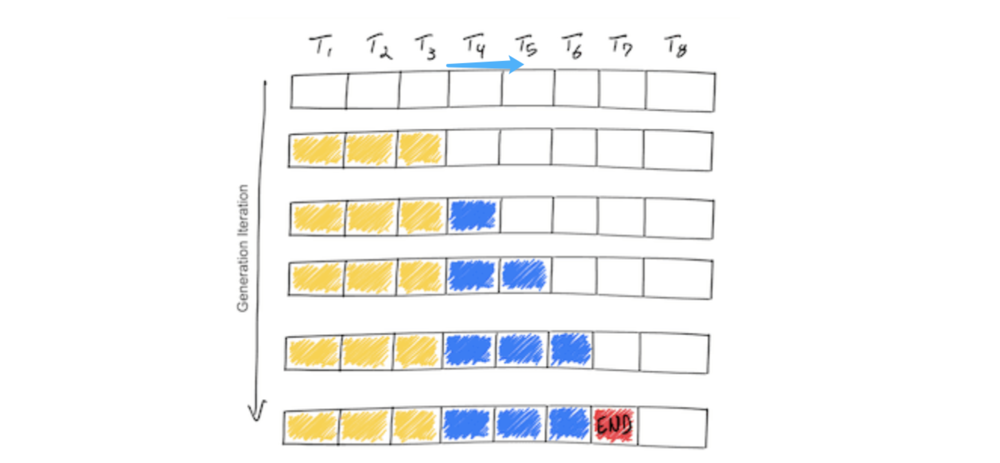
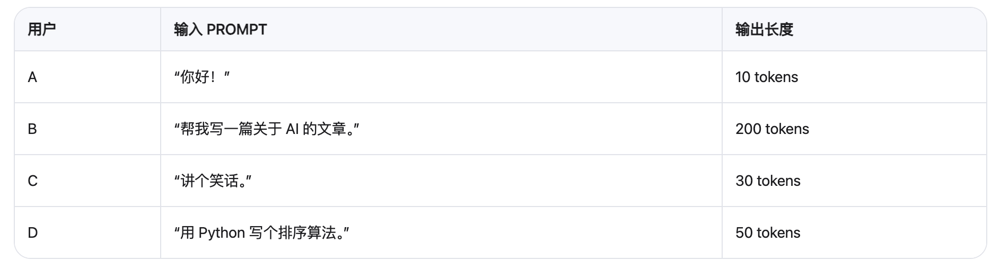
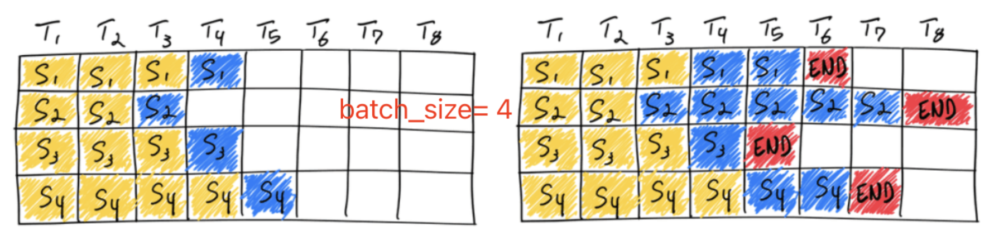
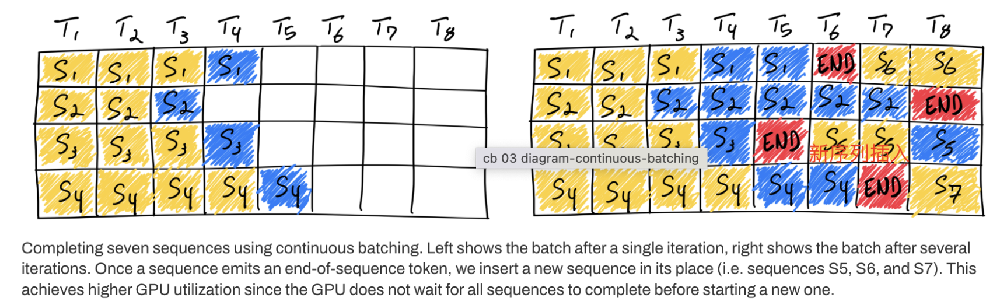
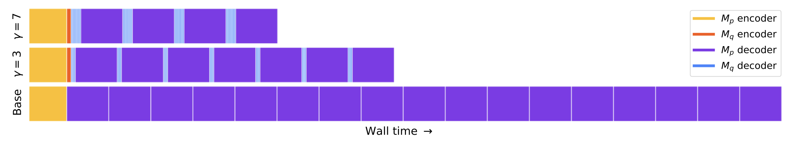
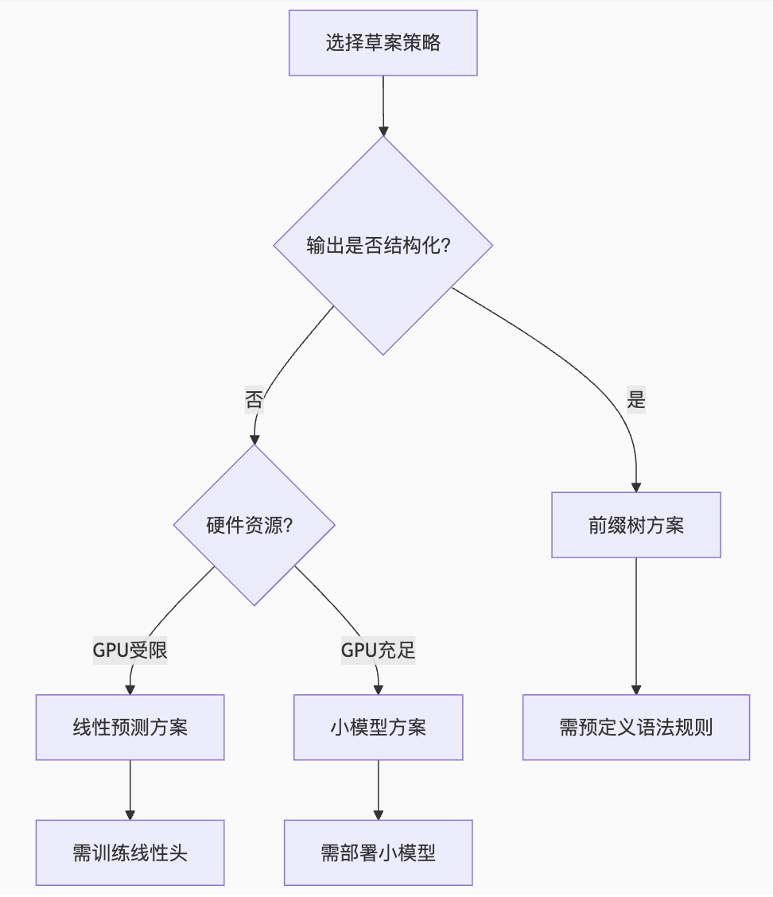

# Inference服务的一些常见问题
## 简介
记录一些常见的推理服务问题。

<!-- more -->

## 一. 大模型推理为什么要分为prefill和decode两个阶段？必须分开吗？

### 1. 什么是 Prefill 阶段？
在大语言模型的推理中，Prefill 阶段 是指处理输入提示（prompt）部分的过程：
- 输入：用户提供的初始 prompt（例如“讲个故事”）
- 输出：生成与 prompt 对应的 key/value 缓存（KV Cache），并输出第一个预测 token 的 logits
- 特点：
  - 输入长度较长（可能几百到几千 tokens）
  - **是一个密集的 attention 计算过程（可并行）**
  - 一次性处理整个 prompt，不产生新 token，只是准备 KV Cache，为后续 decode 做准备

### 2. 什么是 Decode 阶段？
Decode 阶段 是从第一个预测 token 开始，逐步生成后续 token 的过程：

- 每次只预测一个 token（或少量 token）
- 使用之前缓存的 key/value（KV Cache）加速 attention 计算
- 迭代进行，直到达到最大长度或遇到终止符（如 EOS）
- 特点：
  - **每步只处理一个 token（意味着对于同一个序列，无法并行）**
  - 利用 KV Cache 实现高效 attention



### 3. 为什么需要分开 Prefill 和 Decode 两个阶段？
1. 计算模式不同，**前者可并行，后者不可并行**
2. KV Cache 管理优化，前者生成整个prompt的KV Cache，后者在每一步更新KV Cache（添加新生成的那个token到kvcache中）
3. 吞吐 vs 延迟的权衡，Prefill 关注的是整体延迟（prompt 越长越耗时），Decode 关注的是生成每个 token 的响应时间（即“首字延迟”和“逐字延迟”）
4. 批处理优化（Batching）
- 在服务端，多个请求可以共享 prefill 阶段（batched prefill，这个和连续批处理不一样，Batched Prefill 就是将多个用户的 prompt 同时进行预处理（即同时运行它们的 attention 计算），从而提升 GPU 利用率和整体吞吐量。）
- Decode 阶段则更难合并，因为每个请求生成的 token 序列不同（decode阶段使用的是连续批处理技术，具体见下方介绍）

**vLLM、TensorRT-LLM、DeepSpeed、HuggingFace Transformers** 等 框架都会显式地将推理划分为 prefill 和 decode 阶段，以提升效率。

## 二. 阶跃星辰step3 AF分离推理系统 vs. deepseek EP推理系统

[赏析阶跃星辰step3 AF分离推理系统 vs. deepseek EP推理系统](https://mp.weixin.qq.com/s/CI_QZkmvh4mJh4PtXg__pw)


## 三. 介绍一下batch、batch size、以及动态批(dynamic batching)处理技术？

### 1. 什么是batch？
在传统的深度学习推理中，比如图像分类任务：所有请求先被收集起来达到固定 batch size后统一处理，处理完这个 batch 后再处理下一个。这个收集起来的任务就叫做一个batch。

在大模型推理中，**batch 是多个用户请求的集合，每个请求包含一个或多个 prompt**。也就是说一个batch中会包含不同用户发来的多个序列。

### 2. 什么是batch size？
Batch size 是每次处理请求的序列数量。

例如下图，我们将四个用户的请求收集起来，组成一个batch，然后进行推理。此时 **batch size = 4**。
如果我们设置batch size = 3，那么它只会收集前三个用户的请求然后处理，处理完成后第四个请求组成一个新的batch开始处理。


这里注意，一个batch中的不同序列可以有不同的长度。而不同长度也同时造成了GPU并行处理的困难。

为了统一 batch 内所有序列的长度，通常会对较短的序列进行 padding（比如用 token ID = 0 填充）
这样整个 batch 变成一个矩形矩阵（batch_size × max_seq_len），然后送入GPU进行并行处理。

Padding 带来的问题：
- 浪费计算资源（对 padding token 的 attention 计算无意义）
- 占用更多内存（KV Cache 也必须为最长序列预留空间）

为解决这一问题，引入了PagedAttention（页式注意力缓存）、DynamicBatching（动态批处理）技术等新技术。

### 3. 什么是动态批(dynamic batching)处理技术？
上面第2点讲到，在decoder阶段，GPU会并行处理一个batch中的多个序列，这些序列生成回答的长度是不同的。如果一个batch中所有序列都生成完了，GPU才会处理下一个batch。


那么举一个极端的例子，假如batchsize = 4，我们同时处理4个序列的推理生成，其中3个序列只回答了50个token，而有1个序列回答了5000个token。那么GPU必须等待这一个序列生成完毕，才能接受新的batch也就是4个新的序列。这就造成了极大的资源浪费。

动态批处理的本质就是让**GPU在处理一个batch的过程中，不断接受新的请求，并根据请求的长度动态调整batch size**。
1. 用户请求不断到来
2. 推理引擎维护一个“正在运行”的 batch
3. 新请求会被尝试添加进当前 batch（如果还有空间）
4. 如果 batch 已满或达到一定时间窗口，则启动一次推理
5. 在推理过程中，部分序列可能会完成（输出结束）
6. 完成的序列位置可以被新请求替代 → 形成新的 batch
7. 这个过程不断循环，保持 GPU 高利用率



上图显示了通过连续批处理技术连续完成 7 个序列的推理情况。左图显示了第一次迭代后的批次，右图显示了几次迭代后的批次。每当一个序列发出终止 token 时，我们会将一个新的序列插入其位置（例如序列 S5、S6 和 S7），这样 GPU 无需等待所有序列完成即可开始处理新的序列，从而实现更高的 GPU 利用率。

## 四. 推理引擎一般都可以设置哪些参数(以vLLM为例)？

✅ 1. --host 和 --port
作用：指定 HTTP 服务监听的地址和端口
```bash
--host 0.0.0.0 --port 8000
```

✅ 2. --max-model-len（最大序列长度）

控制模型能处理的最大 prompt + output token 数量,默认值通常为 4096 或根据模型设定
长 prompt 会占用更多显存和计算资源
```bash
--max-model-len 8192
```

✅ 3. --max-num-seqs（最大并发请求数）

**控制同时进行 decode 的最大序列数量（即 batch size 上限）**
影响吞吐和延迟平衡
```bash
--max-num-seqs 1024
```

✅ 4. --max-prefill-tokens（prefill 阶段最大 token 总数）

控制单个 prefill batch 中所有 prompt 的总 token 数
避免因长 prompt 导致 prefill 耗时过长或内存爆炸
```bash
--max-prefill-tokens 8192
```

✅ 5. --max-batched-token-mem（最大 batch token 显存）

控制分配给 KV Cache 的最大显存大小（单位是 token 数量）
可防止多个长 prompt 同时进入导致 OOM
```bash
--max-batched-token-mem 8192
```
✅ 6. --swap-space（交换空间）

指定临时存储 KV Cache 的 CPU 内存大小
当 GPU 显存不足时，部分序列会被“换出”到 CPU
```bash
--swap-space 10
```

✅ 7. --gpu-memory-utilization（GPU 显存利用率）

控制用于 KV Cache 的显存比例（默认 0.9）
设置太大会导致 OOM，太小则浪费资源
```bash
--gpu-memory-utilization 0.9
```

✅ 8. --max-input-length（最大输入长度）

控制每个请求中 prompt 的最大 token 数
防止用户提交超长 prompt 导致服务不稳定
```bash
--max-input-length 8192
```

✅ 9. --max-output-length（最大输出长度）

控制每个请求最多生成多少个 token
防止无限生成或长时间占用资源
```bash
--max-output-length 1024
```

## 五. 如何针对不同推理场景（单人、多用户、单卡、多卡）设置相应的参数最大化利用GPU性能？
待更新

## 六. 介绍一下投机推理（Speculative Decoding）？
投机采样是一种可以从根本上解码计算访存比的方法，保证和使用原始模型的采样分布完全相同。**它使用两个模型：一个是原始目标模型，另一个是比原始模型小得多的近似模型。近似模型用于进行自回归串行采样，而大型模型则用于评估采样结果**。解码过程中，某些token的解码相对容易，某些token的解码则很困难。因此，简单的token生成可以交给小型模型处理，而困难的token则交给大型模型处理。这里的小型模型可以采用与原始模型相同的结构，但参数更少，或者干脆使用n-gram模型。小型模型不仅计算量较小，更重要的是减少了内存访问的需求。

### 投机采样过程如下：

1. 用小模型 $M_q$ 做自回归采样连续生成 $\gamma$ 个 tokens。
2. 把生成的 $\gamma$ 个 tokens 和前缀拼接一起送进大模 $M_p$ 执行一次 forwards。
3. 使用大、小模型 logits 结果做比对，如果发现某个 token 小模型生成的不好，重新采样这个 token。重复步骤 1。
4. 如果小模型生成结果都满意，则用大模型采样下一个 token。重复步骤 1。

第 2 步中，将 $\gamma$ 个 tokens 和前缀拼成一起作为大模型输入，和自回归相比，尽管计算量一样，但是 $\gamma$ 个 tokens 可以同时参与计算，计算访存比显著提升。

第 3 步中，如何评价一个 token 生成的好坏？如果 $q(x) > p(x)$（$p, q$ 表示在大小模型采样概率，也就是 logits 归一化后的概率分布），则以一定 $1 - \frac{p(x)}{q(x)}$ 的概率拒绝这个 token 的生成，从一个新的概率分布 $p'(x) = \text{norm}(\max(0, p(x) - q(x)))$ 中重新采样一个 token。

**通俗来讲就是$p(x) < q(x)$的时候应该是小模型分布和大模型的分布存在突变(小模型出错的地方), 需要一定概率放弃, 然后从正常部分$[p(x)>q(x)]$的分布中去采样。**

我们看性能分析结果，下图是一个 encoder-decoder 结构网络的时间分解图。顶部一行显示了 $\gamma=7$ 的投机采样，中间一行显示了 $\gamma=3$ 的投机解码，$\gamma$ 是小模型一次生成 token 的数目。$M_p$ 是大模型，$M_q$ 是小模型。可见，使用投机采样，解码时间大幅缩减。




### 不同的投机采样策略
除了采用大小模型外，还有其他的一些方法进行投机推理,如线性头方案、前缀树方案。



### 投机解码是如何起作用的？为什么在高并发下没有甚至倒退？
投机解码本身是解决推理过程中的memory Bound的问题的。而在高并发下，推理变成了一个compute Bound的问题，因此效果不明显。

### 投机解码究竟省了什么？
首先，计算量肯定是没省的。
A.因为引入了小模型，它计算生成候选token的时候会增加一些计算量。
B.另外大模型并行验证K个候选token时，虽然只需要一次前向传播，但这次前向传播的计算量要比生成单个token时大（需要对K个token位置的logits进行计算和比较）。
C.还有就是小模型计算出来的候选序列有什么会被拒绝，那么这些token的计算相当于是白走了一次计算。

因此肯定是节省了访存，因为多个token和单个token访存速度差不多（都远远没有没打满带宽）所以减少访存次数是最重要的。
另外因为一次生成多个token，相比于每次生成一个token，它还减少了对KVcache的访问次数，以及kernel的启动和访存次数。（K次->1次）

减少了对什么的访存次数？权重矩阵、KVcache、kernel启动和访存次数


### 参考资料
1. [大模型推理妙招—投机采样（Speculative Decoding）](https://zhuanlan.zhihu.com/p/651359908)

2. [Fast Inference from Transformers via Speculative Decoding](https://proceedings.mlr.press/v202/leviathan23a/leviathan23a.pdf)


## 七. 介绍一下Deppseek的MLA（针对Hopper架构的优化），Hopper架构还引入了不同block得thread之间的共享内存机制？
### 1. 什么是低秩压缩？
低秩压缩是一种**利用矩阵的低秩近似特性来显著减少数据存储量或模型参数量的技术**。它的核心思想基于线性代数中的一个重要概念：矩阵的秩。

1. **秩是什么？**

   - 一个矩阵的秩衡量的是其行（或列）向量中线性无关的最大数目。
   - 简单理解，秩代表了矩阵所包含的独立信息或内在维度的数量。
   - 例如：
     - 一个单位矩阵（对角线为 1，其余为 0）的秩等于其维度（满秩）。
     - 一个所有元素都是 1 的矩阵，秩为 1（因为所有行/列都线性相关）。
     - 一个包含两行完全相同数据的矩阵，秩为 1（因为第二行不提供新信息）。

2. **低秩矩阵：**

   - 如果一个矩阵的实际秩 $r$ 远小于它的维度 $\min(m, n)$（其中 $m$ 是行数，$n$ 是列数），那么这个矩阵就被认为是低秩的。
   - 很多现实世界的数据（如图像、用户-物品评分矩阵、某些神经网络层的权重更新）天然具有或近似具有低秩特性。这意味着它们包含的信息可以被更少的“基础”成分有效地表示。

3. **低秩近似/压缩：**

   - 给定一个大型矩阵 $W$（维度 $m \times n$），低秩压缩的目标是找到两个较小的矩阵 $A$（维度 $m \times r$）和 $B$（维度 $r \times n$），使得它们的乘积 $A \cdot B$ 尽可能地接近原始矩阵 $W$。
   - 这里的 $r$ 就是目标秩，并且 $r \ll \min(m, n)$。
   - 关键点：**存储 $A$ 和 $B$ 只需要 $m \cdot r + r \cdot n = r \cdot (m + n)$ 个参数，而存储原始 $W$ 需要 $m \cdot n$ 个参数。因为 $r$ 很小，所以 $r \cdot (m + n)$ 远小于 $m \cdot n$，实现了显著的压缩。**
   - 数学基础：最优的低秩近似通常通过奇异值分解（SVD）来实现。SVD 将 $W$ 分解为 $U \cdot \Sigma \cdot V^T$，其中 $\Sigma$ 是一个包含奇异值（按重要性降序排列）的对角矩阵。保留前 $r$ 个最大的奇异值及其对应的 $U$ 和 $V$ 的列向量，就得到了秩为 $r$ 的最佳近似。


### 2. MLA
请直接阅读文章[DeepSeek_MLA](https://summer536.github.io/Notes/zh/posts/Deepseek_MLA.html)

### 参考资料
- [赏析阶跃星辰step3 AF分离推理系统 vs. deepseek EP推理系统](https://mp.weixin.qq.com/s/CI_QZkmvh4mJh4PtXg__pw)
- [deepseek技术解读(1)-彻底理解MLA（Multi-Head Latent Attention）](https://zhuanlan.zhihu.com/p/16730036197)
- [缓存与效果的极限拉扯：从MHA、MQA、GQA到MLA](https://spaces.ac.cn/archives/10091)
- [MLA原理介绍（极简版）](https://zhuanlan.zhihu.com/p/21366443341)
- [somequestion-deepseek](https://chat.deepseek.com/a/chat/s/44ba73d0-0e08-450b-9b3f-98de2eaaed6d)