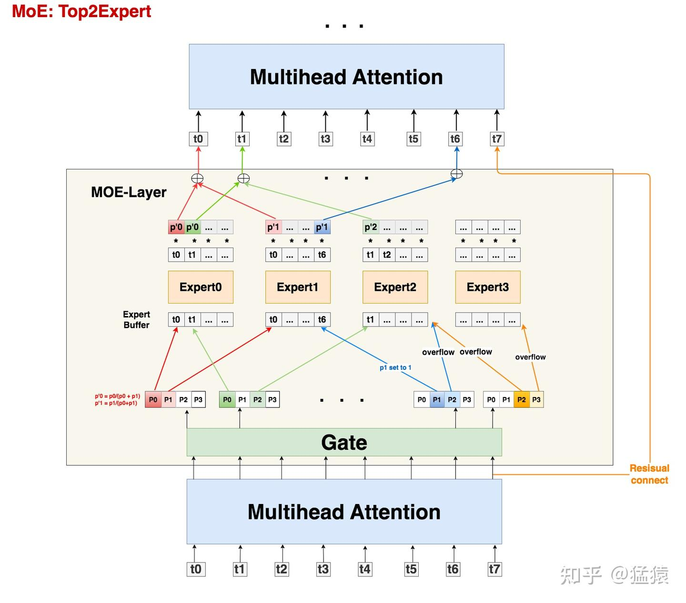
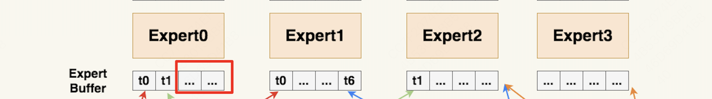

# MoE：混合专家模型

## 简介

本文将基于DeepSpeed的MoE模型架构--Gshard来讲解MoE的原理和实现。

作为最早将MoE应用在Transformer上的模型，Gshard提出的框架和思想一直影响至今。后续很多LLM MoE的架构改进，都是在Gshard的这一套逻辑上做的迭代，比如loss改造、topKexpert的选择，稀疏矩阵计算优化等等。所以从Gshard入手，更利于对基础的把握。

<!-- more -->

## 一、概述
我们看一下Gshard的MoE架构示意图，整篇文章将围绕这张图展开。

首先我需要给出一个概念：所谓MoE架构其实就是将传统Transformer架构的FFN layer 替换为MoE layer，其中每个MoE-Layer由一个门控(Gate)和若干个专家(experts)组成，每个专家都是一个小的神经网络，专家之间通过门控机制（Gate）来决定Token应该被哪个专家处理。

我们从下往上看：
1. Token经过MHA layer后，做为MoE layer的输入；
2. 门控(Gate)根据Token的输入，计算出每个专家的权重（例如：对于Token0即图中t0，它计算出来对应Expert0的权重最高；Expert1次之）；
3. Token0**依照前两个最高概率分别发送到Expert0和Expert1**（Top2Expert策略）。此时由于负载均衡的考虑，每个Expert均有最大负载量，如果Token想要前往的Expert负载已满，则放弃前往该Expert。那么这时会出现三种情况，
    - A. Token被两个Expert均接受（例如t0与t1）；
    - B. Token只被一个Expert接受（例如t6只被E1接受，E2拒绝）；
    - C. Token被两个Expert均拒绝（例如t7），此时Token0会发送到Expert0，并行计算。

4. 每个Expert都会对进来的Token进行计算，并输出权重结果，对应于第3点中的A、B、C三种情况，Token的最终权重计算方法分为一下三种:
    - A. Token的最终权重为两个Expert的加权计算结果(例如图中p0p1的红色部分)；
    - B. Token的最终权重为该Expert的权重结果(例如图中p1的蓝色部分)；
    - C. Token不经过任何Expert，直接通过残差连接的方式，原样发去下一层的Attention上(例如图中最右侧的黄线-残差加)。

### 需解决的问题
以上就是MoE layer的计算过程，其实不难对吧？接下来我们主要详细探究以下几个问题：

- 输入到MoE的数据shape?  (2.1节)
- 如何解决Expert负载不均衡?  (2.2节)
- Expert溢出了怎么办？(这个其实上面的过程已经回答了)
- 每个Expert可能计算的Token数不一致，可能会造成通信和计算的不均衡问题，如何解决？  (2.3节)
- 由于负载不均衡导致不经过任何Expert计算的Token数过大，如何解决？

好，下面我们一一解答，解答了这五个问题，我们就可以对MoE有一个比较全面的认识了。

## 二、MoE详解

### 2.1 MoE架构及其输入

我们再来仔细看一下MoE的架构，该layer主要就是由Expert和Gate组成。

- **Expert**：术业有专攻。假设我的输入数据是“我爱吃炸鸡”，在原始的 Transformer 中，我们把这 5 个 token 送去一个 FFN 层做处理。但是现在我们发现这句话从结构上可以拆成“主语-我”、“谓语-爱吃”、“宾语-炸鸡”。秉持着术业有专攻的原则，我**把原来的 1 个 FFN 拆分成若干个 expert，分别用来单独解析“主语”、“谓语”、“宾语”，这样可能会达到更好的效果**。
- **Gate**：那么我**怎么知道要把哪个 token 送去哪个 expert 呢**？很简单，再训练一个 gate 神经网络，让它判断。

当然，这里并不是说 expert 就是用来解析主谓宾，只是举一个例子说明：不同 token 代表的含义不一样，因此我们可以用不同 expert 来对它们做解析。**除了训练上也许能达到更好的效果外，MoE 还能帮助我们在扩大模型规模的同时保证计算量是非线性增加的（因为每个 token 只用过 topK 个 expert，不用全量 expert），这也是我们说 MoE-layer 是稀疏层的原因**。

最后需要注意的是，在之前的表述中，我们说 expert 是从 FFN 层转变而来的，这很容易让人错理解成 expert 就是对 FFN 的平均切分。实际上你可以任意指定每个 expert 的大小，每个 expert 甚至可以 $\geq$ 原来单个 FFN 层，这并不会改变 MoE 的核心思想：token 只发去部分 expert 时的计算量会小于它发去所有 expert 的计算量。

**MoE输入**

所有 tokens 正常过 Attention 层得到 MoE-layer 的输入，我们记输入数据的尺寸为 $(S, M)$，其中：

- $ S $：输入 batch 中的 token 数量，例如图中 $ S = 8 $
- $ M $：token_embedding 维度

需要注意的是，我们一般是以 batch 的形式组织输入数据的（图中 batch_size = 1）。假设 Attention 层输入数据的维度是 $(\text{batch\_size}, \text{seq\_len}, M)$，那么有：
$$
S = \text{batch\_size} * \text{seq\_len}
$$

接下来，我们就要使用线性层 Gate 帮助我们判断 token 应该送去哪个 expert 了。在别的 MoE 架构中，Gate 有时也被称为 Router（路由）。Gate 的尺寸大小为 $(M, E)$，其中 $E$ 表示 expert 的数量。

**输入数据 $(S, M)$ 过 Gate $(M, E)$ 后，得到 prob 数据 $(S, E)$，它的含义是：每个 token 去向每个 expert 的概率**。

由于在 Gshard 中我们使用的是 top2Expert，因此对每个 token，我们只关心它概率最大的两个 expert。在图中，我们用深色表示最大概率，浅色表示次大概率。例如对 token0 来说，它被送去 expert0 的概率最大，被送去 expert1 的概率次大。

### 2.2 Expert负载均衡(空间上)

Token发去expert的概率不是我们能控制的，在实际操作中，可能某些expert接收到了好多token，而某些expert接收的token寥寥无几，我们管这种现象叫expert负载不均。Gshard框架做了如下几个优化方案:

- capacity 和 capacity factor(设置容量): **为每个expert设置capacity（expert buffer），限制它能处理的最大token数量**，多出来的token算为溢出，在top2Expert都溢出的情况下，该token会被直接发去下一层attention。

- Random Routing(减少溢出情况): **每个token一定会被发去1st Expert，在此基础上我们通过random routing加噪的方式，重新选出2nd expert**。在做完capacity + random routing后，我们最终确认了每个token要发去的top2expert和其对应的权重，通过加权计算的方式，确认Moe-Layer最终的输出结果。

- Auxiliary Loss(尽量保证负载均衡): 添加辅助损失函数，**对expert负载不均的情况做进一步惩罚**。

#### 2.2.1 capacity 和 capacity factor(设置容量)

那么容量应该怎么设置呢？在我们的例子中，一共有 8 个 token 和 4 个 expert，在理想的负载均衡的情况下，每个 expert 应该接收 $\frac{8}{4} = 2$ 个 token。考虑到这里采用的是 top2Expert，因此最终每个 expert 接收的 token 上限最好是 $(\frac{8}{4}) * 2 = 4$，这也是我们图中 expert buffer 的长度。

但这并不说明 capacity 一定要是 $\frac{S}{E} * K$。我们可以在此基础上使用 capacity factor，根据需要让每个 expert 多处理或少处理一些 token；你甚至还能设置一个容量下界（min_capacity），所以最终 capacity 可以按如下公式定义：

$$
\text{capacity} = \max\left(\frac{S}{E} * K * \text{capacity\_factor}, \text{min\_capacity}\right)
$$

回到图中的例子上来，我们发现 t0 和 t1 都正常发去 top2Expert 了。但是对于 t6，它的 2nd expert 已经装满了；对于 t7，它的 1st 和 2nd expert 都满了。所以 t6 和 t7 都发生了溢出。那么我们要怎么处理溢出的情况？别着急，我们马上来看。

#### 2.2.2 Random Routing(减少溢出情况)

对于每个 token，该处理方法会**以 100% 的概率发去 1st expert**；但是**对于它的 2nd expert**，我们可以不以 100% 发送，而是**以一定的概率（例如从 uniform(0,1) 中随机抽取一个数 $p$，将其作为概率）发送**，这样就能节省对 expert capacity 的消耗。

另一种解决方法是由DeepSpeed给出的，做了稍微不同的处理：以图中 t0 为例，1st expert 它是肯定要发去的。但是在选择 2nd expert 时，它做了一些加噪处理：对产出的每个概率（更确切地说是 logit），它从某种分布中采样 4 个噪声，加在这 4 个 logit 上，然后 mask 掉 1st expert 位置的 logit，再从剩下的 3 个 logit 中找到最大的作为其 2nd Expert。

现在我们已经选出最终的 top2Expert，我们再回到没有加噪时的 4 个概率上，取出相应位置的概率，做 normalize 计算：
$$
P_0' = \frac{P_0}{P_0 + P_1}, \quad P_1' = \frac{P_1}{P_0 + P_1}
$$

$P_0'$ 和 $P_1'$ 是一种权重（weight），该 token 过 expert0 和 expert1 后会分别得到一个输出 token，我们可以对 2 个输出 token 做加权计算，得到最终的输出 token。

（为了看起来方便这里再放一下这个图吧）

#### 2.2.3 Auxiliary Loss(尽量保证负载均衡)

除了 capacity 和 random routing 外，Gshard 还通过增加一项辅助损失函数（Auxiliary Loss）来尽量保证 expert 的负载均衡，其定义如下：
$$
l_{aux} = \frac{1}{E} \sum_{e=1}^{E} \frac{c_e}{S} * m_e
$$

其中：
- $E$：专家数量
- $c_e$：某个专家的 buffer 中已经存下的 token 数量（一般指该专家作为 1st 专家时接收到的 token 数）
- $S$：总 token 数量
- $m_e$：某个专家的 buffer 中已经存下的 token 在该专家上的 avg(weight)（token 考虑范围也是那些将该专家作为 1st 专家的 token）

我们将这个辅助损失添加在正常 loss 之后，我们的目标也是**最小化这个辅助损失**。这个辅助损失设计已经非常直觉，就不过多阐述了。值得一提的是，之所以引入 $m_e$ 项，是为了让辅助损失函数可以 bwd 求导（因为只考虑 $\frac{c_e}{S}$ 这项，它受制于 argmax，是不可求导的，实在难理解也没关系，记住就好）。

### 2.3 Expert负载均衡(计算与通信)

我们上述的优化方法，**只能“缓解”负载不均，而不能保证解决负载不均**。也就是说，存在一些Expert，它的Expert buffer没有填满，这可怎么办呢？

最直接的方法，就是**在没有buffer中空出来的位置，用0向量填充，我们称为Zero padding**。更具体地说，最终每个expert上的输入数据维度为$(E, C, M)$，其中$C$表示capacity。0填充的好处是，我们保证每个expert上要处理的输入数据维度是一样的，这有利于硬件层面的后续处理（例如多卡通讯间的负载均衡等）。

## 总结
我们通过概述和方法详解，对MoE的原理和实现有了一个比较全面的认识。

现在回头看一、中给出的五个问题，我们清晰地回答了前四个问题，但还遗留了最后一个问题：

当发生溢出情况时，不是所有token都会被expert正常处理的，我们称这种对溢出的操作为**drop tokens**。如果被drop掉的tokens数量太多，也是一种信息损失（它们都没经过任何expert解析），我们当然可以通过调整capacity来缓解这个问题，但**过大的capacity会引起更严重的zero padding问题（影响到矩阵的稀疏程度）**，所以这也是后续一些MoE模型架构侧重的优化。

那么这个问题就等我以后学习到了再写吧......

## 待更新

## 参考资料

1. [DeepSpeed-Megatron MoE并行训练（原理篇）](https://zhuanlan.zhihu.com/p/681154742)

