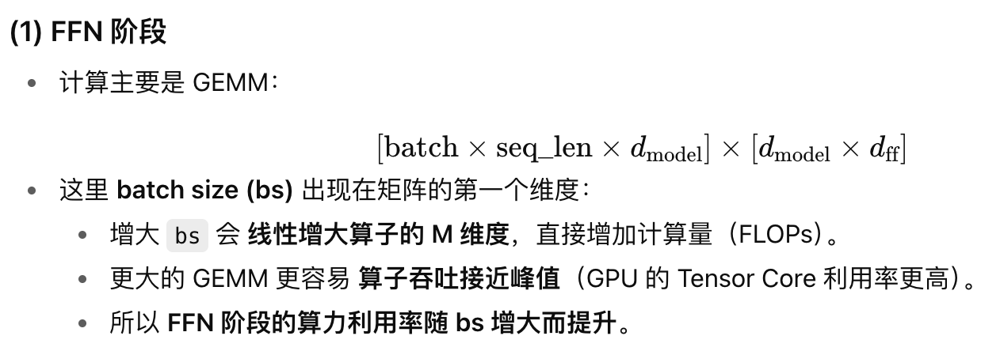

# Step3 AF分离推理系统 vs. deepseek EP推理系统

## 简介

本文将讲阶跃星辰step3 提出的Attnetion-FFN分离推理系统

<!-- more -->

## 一、Deepseek EP推理系统回顾

让我们先简单回顾一下deepseek的推理系统的关键点：采用了**大规模EP部署达到更大吞吐更低延迟这个目标**，具体是

1. MLA attention部分采用DP，moe部分采用EP，在此之前，如果我没记错的话，业界普遍更流行TP

2. deepseek手上最高端的卡是h800，h800具有**高计算访存比**和**低通信带宽**的特点

3. 在2的基础上，设计出了**MLA attention，计算访存比高达512，十分逼近h800 roofline甜点位576**，第一次将**low rank decomposition**这种还能在推理上玩的方法带进大家的视野

4. 在2的基础上，moe部分采用了256个总专家数+8个激活专家数+1个共享专家数的配置，稀疏度非常高，从而降低了通信量，并结合fp8精度进一步降低了通信量

5. 由于EP all2all通信非常昂贵，引入了**two batch overlap**来掩盖4所述的通信开销

6. 在1的基础上，EP需要做**负载均衡**

7. **PD分离**

### DP + EP推理系统的优势
这套系统方案是没有毛病的，针对h800 GPU高度定制化了模型架构，并且**相比采用TP推理，DP+EP推理在多个方面具有优势**：

1. MLA的kv_head_num=1适合DP不适合TP，因为TP会在每个TP rank复制这个head

2. 在固定服务节点的部署上，TP需要在多个实例上重复多份模型参数，但EP你可以理解为把专家全局部署在所有卡上，所以**EP相比TP不会造成参数冗余，从而节约了显存，有利于堆叠更大的batch size，提升吞吐**

3. EP相比TP缓解了**memory volume bound**的问题，假设使用TP，671B的模型部署到16张H800，一次推理的激活专家只有37B，有634B的模型参数是冗余的，一次推理中它们没有参与计算但是占用了大量的显存，导致batch size很难打高，EP的话，每张卡至少两个专家（一个路由专家和一个共享专家），每张卡的参数量近似等于它的激活37B参数，**在保证足够大的batchsize和负载均衡的条件下，所有expert都处于一个完全激活的状态，相当于由一个稀疏的MOE变成了一个稠密模型，没有显存空间的浪费**

4. DP attention和EP MoE相比TP attention+MoE都具有对h800更友好的矩阵尺寸

### DP + EP推理系统的局限性
这在2000多张h800上面确确实实能够达到很高的吞吐很低的延迟，加上训练只花了500多万美金，当时引起了非常大的轰动。但是这里是有一定的**局限性**的：

1. **batchsize要足够大**：如果不够大，expert不能完全激活，那么此时MFU(model float util）会很低，这个其实增加expert的激活数就可以解决，但是h800通信受限，为了不受通信带宽的影响，被迫做得高度稀疏，减少all2all通信量。

2. EP负载均衡：deepseek特别**强调了要EP负载均衡**，因为稍有不慎，系统性能将会被多干活的expert card拖累

3. 大规模EP：这个方法足够general吗？成也大规模或许"瓶颈"也在于大规模EP，在deepseek r1/v3上或许可行，假设后面专家数更多了，达到了1024甚至2048了，那么这个时候batchsize还能够大到把每个专家都激活？并且这个时候还有负载均衡的挑战，那这个就未必了

所以在此基础上催生了step3这种在deepseek肩膀上应运而生的作品

## 二、step3 AF分离推理系统

### AF分离推理系统的优势（相比DP + EP推理系统）

1. **部署规模降低**，DSv3需要320块GPU运行一个decoding实例，而Step-3仅需32块

2. Attention-FFN分离(简称AFD): Attention和FFN具有不同的计算访存特点，**FFN与context length无关，attention与context length相关**，那么分离开来，**解除了context length对FFN的影响，我专注于堆batchsize就可以打满FFN阶段的MFU**

3. 负载均衡得到高效缓解：EP存在众所周知的负载不平衡问题，而AFD可以结合**TP-EP混合策略来平衡计算效率、通信流量和负载均衡**

4. AFD支持**更加灵活的硬件部署**，为更多芯片带来了机会：AFD支持把attention和FFN映射到不同特点的芯片来计算，然而大规模EP强制同构芯片

这个声称需要注意的是，你千万不要觉得他就各方面都比deepseek好了，因为step3的这个工作是限制于inference的decoding范围的，不适用于prefill和training阶段。而且这里也感叹一下，写paper的技巧也很重要，你得找对对象，step3拿deepseek来直接对比，毫无疑问更加具有吸引力，因为attention和FFN分离的工作，step3其实不是第一个做。

### AF的核心观点：
1. **decoding阶段的最大开销来自于attention的设计**，见如下table6，而不是总参数量或者moe的激活参数量（论文有数据支撑）

2. attention的decoding开销不仅仅来自于kv cache，还有计算访存比，有的对于某些硬件来说太高了，导致计算量严重拖累了decoding速度，因此**需要根据不同的硬件特点设计attention**，比如MLA 512的计算访存比在h800上面性能很不错，但是一到h20或者a800就会存在计算访存比过高的情况。为此step3设计出了MFA，可以较为均衡的支持多种硬件（论文有数据支撑）

3. 和2一样，**MoE部分也需要根据不同的硬件特点来设计**，MoE的稀疏度需要综合考虑硬件的算力、显存带宽和通信带宽，没那么稀疏的话可能会造成无法掩盖通信开销，过于稀疏的话可能打不高MoE部分的MFU（论文有公式推导）

4. AFD部署，**attention和FFN在decoding阶段存在不同的特点，前者和context length相关，后者和context length无关**，因此可以分而治之，**使得后者在足够batchsize的情况下可以实现高MFU**，并且attention实例可以通过很容易的scaling来handle动态context length，不影响到FFN。

    
    

### AF的精彩之处：
在以上基础上，全文最精彩的部分是第五章，model-system codesign.

1.attention部分的model-system codesign.这一部分我个人觉得挺精彩，如上图，MFA的设计让attention的计算量和访存量都保持在了一个较低的状态，同时计算访存比相比MLA更加让各种硬件处于一种舒服的状态(A800 910B H20)，就算相比一些硬件，计算访存比可能偏低，但是可以通过量化和MTP的方式，达到roofline甜点位。（所以这也告诉广大paper工作者，并不是某些指标一味跟着最高端的GPU走，把它们搞得越牛逼越好，有时候换个思路，你设计一个更加均衡更加具有“国情”的东西也是很有意义的），在作者的知乎中也提到了一些模型层面还可以进一步做创新尝试的idea，有兴趣的可以去看看

2.FFN部分，作者提出了几个目标，TPOT=50ms的同时尽可能高MFU，这里作者计算出了一个FFN MoE部分针对各大硬件(H20 910B A800 H800)的一个最低稀疏度，具体推导本文省略，可以去看看paper，这里就是一个典型的model-system-hardware design了，基于这些硬件的特点以及我的AFD系统的特点，来推算我的MoE需要多大batchsize以及这个MoE稀疏度到底如何设计才能实现TPOT=50ms的同时尽可能高MFU。

3.最后，讲了在类似于L20这种非旗舰型显卡上面，如何也能让MoE部分实现TPOT=50ms的同时尽可能高MFU，反正扩展就完事了

## 参考资料

1. [赏析阶跃星辰step3 AF分离推理系统 vs. deepseek EP推理系统](https://mp.weixin.qq.com/s/CI_QZkmvh4mJh4PtXg__pw)

2. [Step-3推理系统：从PD分离到AF分离（AFD）](https://zhuanlan.zhihu.com/p/1932920900203807997)

3. [AF分离简析](https://zhuanlan.zhihu.com/p/1936186774318736564)

4. [也聊聊最近比较热的AF分离推理](https://zhuanlan.zhihu.com/p/1936203042581100089)