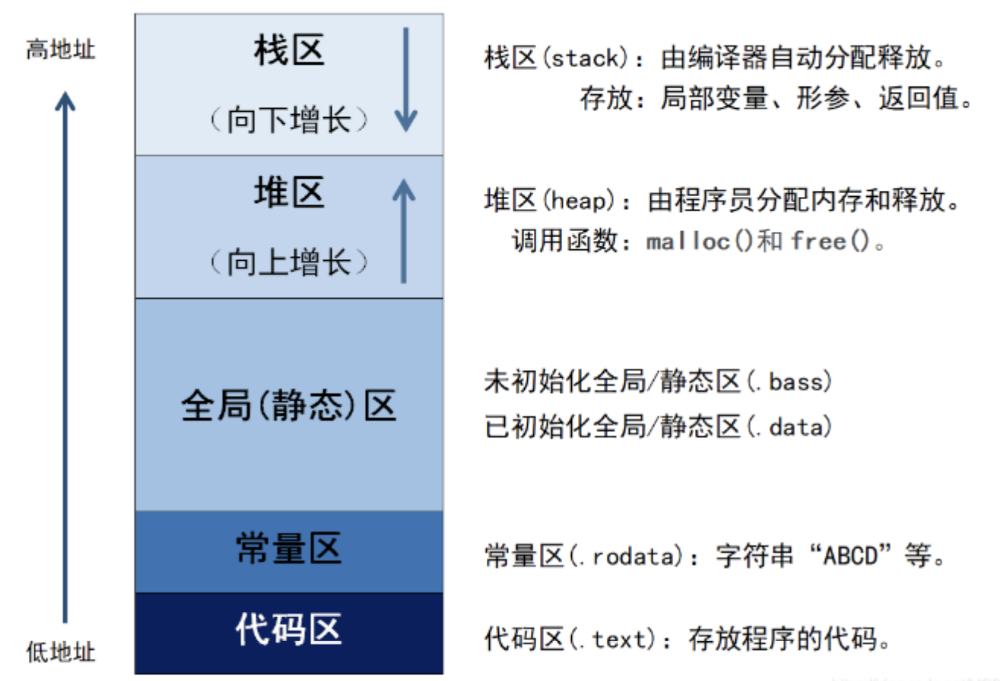
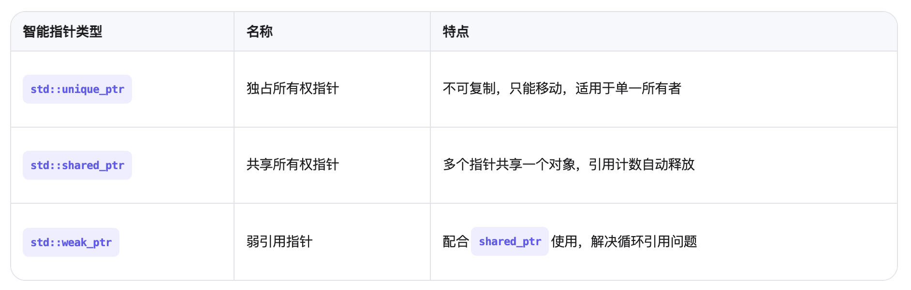

# CPP八股
## 简介
记录一些常见的CPP八股问题。

<!-- more -->

## 一. C++基础部分

### 1. 指针和引用

指针是变量，存储的是另一个变量的地址。引用是一个变量的别名。
- 指针可以为空，引用不能为空。
- 指针本身占用内存，引用不占用内存。
- 指针需要使用解引用操作符*来访问其指向的值，引用不需要。
- 指针指向对象可变，引用指向对象不可变（绑定了就不能变）。

### 2.数据类型

整型：char, short, int, long, long long
- short int: 2字节
- int: 4字节
- long int: 4字节
- long long int: 8字节

头文件climits定义了符号常量，如INT_MAX, INT_MIN, LONG_MAX, LONG_MIN, LLONG_MAX, LLONG_MIN等。表示整型变量的最大值和最小值。

无符号整型：表示非负整数，可增大变量范围，但只能表示正数。内存大小与上面对应的整型相同。（只是把第一位即表示正负的符号位去掉，换成表示大小的位）
unsigned char, unsigned short, unsigned int, unsigned long, unsigned long long
- unsigned short int: 2字节
- unsigned int: 4字节
- unsigned long int: 4字节
- unsigned long long int: 8字节


### 3.const
1. 基本用法：const修饰变量，表示该变量不可修改。
2. - 常量指针（底层const；指向常量的指针）：const int *p = &a; 表示p指向的值不可修改，但p可以指向其他地址。
    - 指针常量（顶层const；指针是一个常量）：int *const p = &a; 表示p指向的值可以修改，但p不能指向其他地址。


3. 常量引用：const int &a = 10; 表示引用的值是常量，不能通过引用修改。
4. 常量成员函数，表示该函数不会修改对象的成员变量，允许const对象调用。
    ```cpp
    class MyClass {
    public:
        void func1() const { /* OK */ }
        void func2()      { /* OK */ }
    };

    const MyClass obj;
    obj.func1(); // ✅ 正确：const 对象可以调用 const 成员函数
    obj.func2(); // ❌ 错误：不能调用非 const 成员函数
    ```
5. 常量对象，表示该对象的成员变量不可修改。
6. 在函数参数中使用const修饰参数，表示该参数不可修改。
    ```cpp
    void func(const int &a) {
        a = 10; // ❌ 错误：不能修改 const 参数
    }
    ```
7. 在函数返回值中使用const修饰返回值，表示该返回值不可修改。

### 4. constexpr和const的区别
上段解释了const的用法，这里我们引入constexpr并介绍二者的区别。
首先介绍一下编译期和运行期
- **编译期**：是指代码被编译成可执行文件的过程中的阶段 。
在这个阶段，编译器会对源代码进行词法分析、语法分析、语义检查、优化和生成目标代码等操作。
所有**在编译期间就能确定的值或行为，称为编译期常量或编译期计算**。
    ```cpp
    int a = 5 + 3; // 5+3 是编译期就能计算出来的结果：8
    ```
- **运行期**：是指代码被编译成可执行文件后，在运行时执行的过程。
在这个阶段，程序会根据输入数据和运行时环境，动态地执行代码。
所有**在运行时才能确定的值或行为，称为运行期常量或运行期计算**。
    ```cpp
    int x;
    std::cin >> x;
    int b = x + 1; // x 的值在运行时才确定，所以 b 是运行时变量
    ```
1. constexpr和const的核心区别：**const可以定义编译期和运行期常量，而constexpr只能定义编译期常量**。
2. constexpr变量：在复杂系统中可能无法分辨一个变量是不是常量表达式（**常量表达式是 C++ 中那些在编译期就能被完全求值的表达式，它们的值在程序运行前就已经确定，用于支持编译期计算、模板元编程、静态检查等高级特性**），可将变量声明为constexpr，编译器会进行检查，确保该变量在编译期就能确定。
3. constexpr函数：是指能用于常量表达式的函数，函数的所有返回类型和形参都是字面类型，且函数体只有一条return语句。（有点像inline函数，可以在编译阶段展开）

constexpr的好处：
- 为一些不能被修改的数据提供保障，它们如果写成变量会有被意外修改的风险，写成constexpr后，编译器会进行检查，确保该变量在编译期就能确定。
- 提高效率：constexpr函数在编译时会被展开，避免了函数调用的开销。
- 相较于宏，没有更多的开销，且有类型安全检查更加可靠。

### 5. Volatile
**volatile 是 C++ 中一个类型修饰符（type qualifier） ，用于告诉编译器：该变量的值可能会在程序不可控的情况下被改变 ，因此不能对它进行某些优化。**（与const绝对对立）

case：
```cpp
while (flag == 0) {
    // 等待 flag 被外部设为 1
}
```
如果flag 不是 volatile，编译器可能认为它的值不会变，就将其优化为：
```cpp
if (flag == 0)
    while (true);  // 死循环
```
如果flag 是 volatile，编译器不会优化，会直接执行：
```cpp
while (flag == 0) {
    // 等待 flag 被外部设为 1
}
```


### 6. Static
**Static 的本质(静态本质)是：“延长生命周期” 或 “限制访问范围” 或两者兼具，具体取决于使用场景。** 
1. 静态变量：使用static修饰的变量为静态变量，它的生命周期为程序运行期间，且只初始化一次。
2. 静态函数：使用static修饰的函数为静态函数。
    - 一个类中的静态函数(即静态成员函数)只能访问该类的静态成员变量而不可访问非静态成员变量或函数。
    - 静态函数不能被声明为虚函数。
    - 静态函数不能被声明为inline函数。
    - 静态函数不能被声明为constexpr函数。
    - 静态函数不能被声明为mutable函数。
    - 静态函数不能被声明为volatile函数。
    - 静态函数不能被声明为extern函数。
3. 静态成员变量：使用static修饰的成员变量为静态成员变量。
所有类的对象共享同一个静态成员变量，且只初始化一次。静态成员变量必须外部定义，以便为其分配空间。
    ```cpp
    class ExampleClass ‹
    public:
    static int staticVar; // 靜态成员变量声明
    ｝；
    //1 静态成员变量定义
    int ExampleClass: :staticVar = 0;
    ```
4. 静态局部变量：在函数内部使用static修饰的变量为静态局部变量，它的生命周期为程序运行期间，但它只对函数内可见。


### 7. Static静态局部变量和局部变量的区别
1. 局部变量（Local Variable）
```cpp
void func() {
    int a = 10; // 每次调用函数时都会重新创建和初始化
    a++;
    std::cout << a << std::endl;
}
```
2. 静态局部变量（Static Local Variable）
```cpp
void func() {
    static int b = 10; // 只在第一次调用时初始化
    b++;
    std::cout << b << std::endl;
}
```


### 8. define、typedef（using）、inline的区别
1. define：宏定义，是预处理器处理的，在编译前会进行文本替换，没有类型检查，可能会导致一些意想不到的问题。
    ```cpp
    #define MAX(a, b) ((a) > (b) ? (a) : (b))
    ```
2. typedef：类型别名，是编译器处理的，有类型检查，可以提高代码的可读性。
    ```cpp
    typedef int MyInt;
    typedef unsigned long ulong;
    ```
    c++11 引入了using，推荐使用using定义类型别名。
    ```cpp
    using MyInt = int;
    using ulong = unsigned long;
    ```
3. inline：内联函数：告诉编译器尝试将函数调用直接替换为函数体内容 ，减少函数调用开销；但是**这只是对编译器的一个“建议”，编译器可能会忽略。**
    - 常用于短小精悍(不能存在循环语句、不能存在过多的条件判断语句)、频繁调用的函数；
    - 可以在头文件中多次定义而不会违反 ODR（One Definition Rule）；
    - 有类型检查，比宏更安全；
    ```cpp
    inline int add(int a, int b) {
        return a + b;
    }
    ```


### 9. new和malloc函数区别：
1. **new（+delete） 是 C++ 运算符，负责内存分配和构造对象，语义完整且类型安全，底层可能调用类似 malloc 的机制；**

2. **malloc（+free） 是 C 语言标准库函数，只负责分配内存，语义不完整且类型不安全，底层直接调用系统调用。**

3. **new会调用构造函数，malloc不会。**

4. **delete会调用析构函数，free不会。**

5. **new分配内存时，返回的指针类型与对象类型严格匹配，而malloc分配内存时，返回的指针类型是void\*，需要进行类型转换。**

使用示例对比：
1. new:
    ```cpp
        int* p1 = new int;           // 分配一个 int，并调用其构造函数（如果是类）
        int* p2 = new int[10];       // 分配一个 int 数组
        MyClass* obj = new MyClass(); // 分配并调用构造函数
    ```
2. malloc:
    ```cpp
    int* p1 = (int*)malloc(sizeof(int));         // 分配一个 int 的内存
    int* p2 = (int*)malloc(10 * sizeof(int));    // 分配一个 int 数组
    MyClass* obj = (MyClass*)malloc(sizeof(MyClass)); // 分配内存，但未调用构造函数
    ```


### 10. extern
**extern 是 C++ 中用于声明变量或函数在别处定义 的关键字，告诉编译器“这个符号的定义在其他地方，不要报错”。** 它是实现跨文件访问和 C/C++ 混合编程的重要机制

1. 声明变量：一般用于多文件编程，声明变量在其他文件中定义。
    ```cpp
    // file.h
    extern int globalVar;  // 声明，不是定义
    // file.cpp
    int globalVar = 10;    // 定义
    ```
2. 声明函数：一般用于多文件编程，声明函数在其他文件中定义。但是**函数其实不用声明，因为函数在编译时会自动被声明。**
    ```cpp
    // file.h
    extern void func();  // 声明，不是定义
    ```
3. extern "C"：用于声明函数在 C 语言中定义，告诉编译器“这个函数在 C 语言中定义，不要进行 C++ 的名称修饰”。(实现c++和c混合编程)
    ```cpp
    extern "C" {
        void func();
    }
    ```

### 11. 前置++和后置++的区别
**对于内置类型（如 int） ：编译器优化后两者性能差别不大；**

**对于类类型(或自定义类型)：前置++i没有内存拷贝，没有额外拷贝，效率比较高。**

1. 前置++和后置++都是自增运算符，但是它们有不同的返回值。
    - 前置++返回的是自增后的值，后置++返回的是自增前的值。
    ```cpp
    int i = 5;
    int a = ++i; // a = 6，i = 6 ← 先自增再赋值
    int b = i++; // b = 6，i = 7 ← 先赋值再自增
    ```
2. 底层实现机制（对类类型）：前置++i没有内存拷贝，没有额外拷贝，效率比较高。
    ```cpp
    MyClass& operator++() {
        // 执行自增逻辑
        return *this;
    }
    ```
    后置i++多了一个临时变量保存原始值，存在拷贝构造开销，效率低。
    ```cpp
    MyClass operator++(int) {
    MyClass old = *this; // 保存旧值
    // 执行自增逻辑
    return old;          // 返回旧值
    }
    ```

### 12. std：：atomic介绍：
一个普通的问题 a++ 是原子操作吗？
答案：不是。

原因：a++ 需要先读取a的值，然后自增，最后返回自增后的值。这个过程不是原子操作，因为**读取和写入a的值不是原子操作**。其一般对应三条指令，首先将变量a对应的内存值搬运到某个寄存器（如eax）中，然后将该寄存器中的值自增1，再将该寄存器中的值搬运回a代表的内存中
```cpp
mov eax,dword Ptr ［al #（1）
inc eax # (2)
mov dword ptr ［al,eax #（3）
```
看如下的例子，分析如下：
```cpp
int a= 0；
// 线程1（执行过程对应上文汇编指令（1）（2）（3））
void thread_func1() {
atti
｝
// 线程2（执行过程对应上文汇编指令（4） （5）（6））
void thread_func2 () {
a++；
｝
```
我们预想的结果是线程1和线程2的三条指令各自执行，最终a的值变为2，但是由于操作系统线程调度的不确定性，
线程1执行完指令（1）和（2）后，eax寄存器中的值变为1，此时操作系统切换到线程2执行，执行指令（3）（4）（5），此时eax的值变为1；接着操作系统切回线程1继续执行，执行指令（6），得到a的最终结果1。

解决办法：C++11新标准发布后改变了这种困境，新标准提供了对整形变量原子操作的相关库，即std：：atomic，这是一个模板类型：
```cpp
template<class T>
struct atomic;
```
```cpp
std::atomic<int> counter(0);
counter++; // 这是一个原子操作，线程安全
```

### 13. 函数指针和指针函数的区别
1. 什么是函数指针？

    **函数指针是指向函数的指针变量，它保存的是函数的地址。通过函数指针可以像调用函数一样使用它。**
    示例：
    ```cpp
    #include <iostream>
    using namespace std;

    // 函数定义
    int add(int a, int b) {
        return a + b;
    }

    int main() {
        // 定义函数指针并赋值
        int (*funcPtr)(int, int) = &add;

        // 调用函数
        int result = funcPtr(3, 4);
        cout << "Result: " << result << endl; // 输出 7

        return 0;
    }
    ```
    使用场景：
    1. **回调函数**：函数指针常用于实现回调机制，允许将函数的地址传递给其他函数，以便在适当的时候调用。
    2. **函数指针数组**：可以使用函数指针数组实现类似于状态机的逻辑，根据不同的输入调用不同的函数。
    3. **动态加载库**：函数指针可用于在运行时动态加载库中的函数，实现动态链接库的调用。
    4. **多态实现**：在C++中，虚函数和函数指针结合使用，可以实现类似于多态的效果。
    5. **函数指针作为参数**：可以将函数指针作为参数传递给其他函数，实现一种可插拔的函数行为。
    6. **实现函数映射表**：在一些需要根据某些条件调用不同函数的情况下，可以使用函数指针来实现函数映射表。
2. 什么是指针函数？
    **指针函数是指返回值为指针的函数，即返回一个地址。**
    示例：
    ```cpp
    #include <iostream>
    using namespace std;

    // 指针函数：返回一个指向 int 的指针
    int* getArray() {
        static int arr[] = {1, 2, 3, 4, 5}; // 必须是 static 或动态分配，否则返回局部变量地址会出错
        return arr;
    }

    int main() {
        int* p = getArray();
        cout << p[2] << endl; // 输出 3
        return 0;
    }
    ```

### 14. struct和class的区别
**struct结构体中的成员默认是公有的(public)，class类中的成员默认是私有的(private)。**

**struct结构体中默认是public继承，class类中默认是private继承。**


### 15.C++中四种强制类型转换
在 C++ 中，**强制类型转换（Cast）** 用于显式地将一种类型的值转换为另一种类型。与 C 风格的 (type)value 转换相比，C++ 提供了更安全、语义更清晰的四种标准强制类型转换操作符：


**上行转换：把派生类（子类）的指针或引用转换成基类（父类）表示**

**下行转换：把基类（父类）的指针或引用转换为派生类（子类）表示**

1. **static_cast （上行转换安全，下行转换不安全）**

    没有运行时类型检查来保证转换的安全性

    进行上行转换（把派生类的指针或引用转换成基类表示）是安全的

    进行下行转换（把基类的指针或引用转换为派生类表示），由于**没有动态类型检查，所以是不安全的。**
    - 用于基本数据类型之间的转换，如把int转换成char。
    - 把任何类型的表达式转换成void类型。
2. **dynamic_cast（只能用于存在虚函数的父子关系的强制类型转换，但是它上下行转换都安全）**

    在进行**下行转换时，dynamic_cast具有类型检查（信息在虚函数中）的功能，比static_cast更安全。**

    转换后必须是类的指针、引用或者void*，基类要有虚函数，可以交叉转换。

    **dynamic本身只能用于存在虚函数的父子关系的强制类型转换**；对于指针，转换失败则返回nullptr，对于引用，转换失败会抛出异常。

3. **reinterpret_cast**

    可以将整型转换为指针，也可以把指针转换为数组；
    
    可以在指针和引用里进行肆无忌惮的转换，平台移植性比价差。
4. **const_cast**

    常量指针转换为非常量指针，并且仍然指向原来的对象。常量引用被转换为非常量引用，并且仍然指向原来的对象。
    
    **去掉类型的const或volatile属性。**

**既然dynamic_cast比较安全 那还留着static_cas干啥呢？ 直接全用dynamic_cast不好吗？**

不能。虽然 dynamic_cast 更安全，但它有严格的使用限制、性能开销和语义局限，而 static_cast 在很多非多态或非运行时检查场景中是更合适甚至唯一的选择。

dynamic_cast 的限制：
1. 只能用于具有虚函数的类（即多态类型）
    ```cpp
    class Base {};  // 没有虚函数
    class Derived : public Base {};
    Base* base = new Derived();
    Derived* d = dynamic_cast<Derived*>(base); // ❌ 编译错误！
    ```
    dynamic_cast 要求类必须是“polymorphic”，即至少有一个虚函数（包括虚析构函数）。 

2. 性能开销大：运行时通过 RTTI（Run-Time Type Information）检查对象的实际类型, 开销较大。

3. 不适用于基本数据类型和非多态类之间的转换
    ```cpp
    double d = 3.14;
    int i = dynamic_cast<int>(d); // ❌ 错误！dynamic_cast 不能用于基本类型
    ```


## 二. C++的内存管理

### 1.C++内存分区


**什么是高地址低地址？**

内存地址 是 CPU 访问内存的“编号”，就像房间号一样。内存地址从一个起始点开始编号，比如从 0x00000000 到某个最大值（如 0xFFFFFFFF）。

地址越小（如 0x1000），称为低地址 ；
地址越大（如 0xFFFF0000），称为高地址 。

可以想象为一排房间：
```cpp
[0x0000] [0x0001] [0x0002] ... [0xFFFF]
  ↑        ↑                     ↑
低地址    中间地址             高地址
```

从低地址到高地址依次为：

1. **代码区**：存放程序的机器指令（即编译后的二进制代码）；是**只读**的，防止程序意外修改自身；

2. **常量区**：存放常量（如字符串常量、const 修饰的变量）；

3. **全局区**：存放全局变量和静态变量（包括静态局部变量）；分为两个板块：
    - 已初始化数据段（Data Segment）：存放显式初始化的全局变量和静态变量 ；
    - 未初始化数据段（BSS Segment）：存放未显式初始化的全局变量和静态变量；

4. **堆区**：动态分配内存，用于存储动态分配的内存（如 new 和 malloc 分配的内存）；生命周期由程序员手动控制；**向高地址方向扩展** ；容易造成内存泄漏或碎片化；

5. **栈区**：存放局部变量、函数参数、返回值等；自动管理：进入函数时分配，退出函数时释放；**向低地址方向扩展** ；容量有限，不适合分配大型对象；

### 2.堆和栈的区别
堆手动管，栈自动跑；
堆向上长，栈往下掉；
堆慢且大，栈快又小；
函数调用靠栈，动态分配用堆。


### 3.内存泄露是什么，如何避免内存泄露？
1. 什么是内存泄露？

    **内存泄漏（memory leak）是指由于疏忽或错误造成了程序未能释放掉不再使用的内存的情况**。内存泄漏并非指内存在物理上的消失，而是应用程序分配某段内存后，由于设计错误，失去了对该段内存的控制，因而造成了内存的浪费。

    **可以使用Valgrind,mtrace进行内存泄漏检查。**

2. 内存泄漏的分类

    （1）**堆内存泄漏（Heap leak）**

    对内存指的是程序运行中根据需要分配通过malloc,realloc new等从堆中分配的一块内存，再是完成后必须通过调用对应的free或者 delete 删掉。如果程序的设计的错误导致这部分内存没有被释放，那么此后这块内存将不会被使用，就会产生 Heap Leak。

    （2） **系统资源泄露（Resource Leak）**

    主要指程序使用系统分配的资源比如 Bitmap,handle,SOCKET 等没有使用相应的函数释放掉，导致系统资源的浪费，严重可导致系统效能降低，系统运行不稳定。

    （3）**没有将基类的析构函数定义为虚函数**

    当基类指针指向子类对象时，**如果基类的析构函数不是virtual，那么子类的析构函数将不会被调用，子类的资源没有正确是释放，因此造成内存泄露。**

3. 什么操作会导致内存泄露？

    **指针指向改变，未释放动态分配内存。**

4. 如何避免内存泄露？

    (1) 使用智能指针

    (2) 使用RAII（资源获取即初始化）（Resource Acquisition Is Initialization）
        - 把资源（内存、文件、锁）封装在对象中；
        - 在构造函数中申请，在析构函数中释放；
        - 利用栈对象生命周期自动管理资源；
        

    ```cpp
    class FileGuard {
        public:
            FileGuard(FILE* f) : file(f) {}
            ~FileGuard() { if (file) fclose(file); }
        private:
            FILE* file;
        };
    ```

    (3) 避免裸指针操作。尽量避免直接使用 new 和 delete；优先使用容器（如 std::vector, std::string）；使用封装好的资源管理类；

    (4) 使用工具检测内存泄漏

5. 构造函数、析构函数必须要为虚函数吗？

    （1）构造函数不需要

    （2）**析构函数需要**。当派生类对象中有内存需要回收时，如果析构函数不是虚函数，不会触发动态绑定，只会调用基类析构函数，导致派生类资源无法释放，造成内存泄漏。

### 4.什么是智能指针，有哪些种类？
1. 什么是智能指针？

    **智能指针是一种自动管理内存的指针，它会在对象生命周期结束时自动释放内存。**

    智能指针（Smart Pointer） 是 C++ 中用于自动管理动态内存的对象，它通过封装裸指针（raw pointer），在适当的时候自动释放所指向的资源，从而避免内存泄漏 和资源泄露 。
    
    核心思想是：利用对象生命周期控制资源的生命周期（RAII 原则） 。 

2. 智能指针的种类
    
    (1) unique_ptr：表示对对象的**独占所有权** ；**不允许拷贝构造和赋值操作**；支持移动语义（move semantics）；在离开作用域时自动调用析构函数并释放资源；

    ```cpp
    #include <memory>

    std::unique_ptr<int> p(new int(42));
    // std::unique_ptr<int> p2 = p; // ❌ 错误：不允许拷贝
    std::unique_ptr<int> p2 = std::move(p); // ✅ 可以移动
    ```
    
    (2) shared_ptr：表示对对象的**共享所有权** ；内部使用**引用计数** （reference count）；每次复制增加计数，每次析构减少计数；当**引用计数为 0 时，自动释放资源**；

    ```cpp
    #include <memory>

    std::shared_ptr<int> p1(new int(42));
    std::shared_ptr<int> p2 = p1; // ✅ 引用计数增加到 2

    std::cout << p1.use_count() << std::endl; // 输出 2
    ```

    (3) weak_ptr：是对 shared_ptr 管理对象的**弱引用** ；不影响引用计数；**不能直接访问对象，必须通过 lock() 转换为 shared_ptr**；
    
    主要用于打破**循环引用**（在使用 std::shared_ptr 时，如果两个对象互相持有对方的 shared_ptr，就会形成循环引用（cyclic reference） 。这种情况下，它们的引用计数永远不会变为 0，即使这两个对象已经不再被外界使用，也无法释放！） ；

    ```cpp
    #include <memory>
    #include <iostream>

    struct A;
    struct B;

    struct A {
        std::shared_ptr<B> b_ptr;
        ~A() { std::cout << "A destroyed\n"; }
    };

    struct B {
        // std::shared_ptr<A> a_ptr; // ← 这里是 shared_ptr！导致循环引用
        std::weak_ptr<A> a_ptr; // 用 weak_ptr 打破循环
        ~B() { std::cout << "B destroyed\n"; }
    };

    int main() {
        auto a = std::make_shared<A>(); 
        auto b = std::make_shared<B>();

        a->b_ptr = b; // A 持有 B 的 shared_ptr
        b->a_ptr = a; // B 持有 A 的 weak_ptr → 不影响引用计数

        // 正常释放 A 和 B，不会造成内存泄漏
    }
    ```

**unique_ptr → 最安全、最轻量、性能最好；**

**shared_ptr → 当需要共享所有权时；**

**weak_ptr → 配合 shared_ptr，防止循环引用；**


## 三. C++面向对象编程

## 四. C++的STL

## 五. C++泛型编程

## 六. C++11新特性