# Flashattention

## 简介

Flashattention是一种高效的注意力机制计算方法，由斯坦福大学研究团队在2022年提出。它通过优化GPU内存访问模式，显著提高了Transformer模型中注意力计算的速度并降低了内存使用。作为大模型训练和推理的关键优化技术，Flashattention已被广泛应用于各种大型语言模型中。

<!-- more -->

## 一、Flashattention-V1

### 1.1 标准注意力机制
给定输入二维矩阵 $Q, K, V \in \mathbb{R}^{N \times d}$，其中 $N$ 是输入序列的长度，$d$ 是自注意力机制头的长度。Softmax 是按行应用的，注意力输出矩阵 $O \in \mathbb{R}^{N \times d}$ 的计算公式如下：
$$
\begin{align*}
S &= Q K^\mathrm{T} \in \mathbb{R}^{N \times N}, \quad
P = \text{softmax}(S) \in \mathbb{R}^{N \times N}, \quad
O = P V \in \mathbb{R}^{N \times d}.
\end{align*}
$$
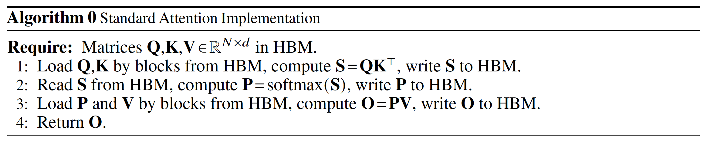
标准的 Attention 运算大致可以描述为以下三个步骤：
- 将 Q,K 矩阵以块的形式从 HBM 中加载到 SRAM 中，计算 S=QK ，将 S 写入到 HBM 中。
- 将 S 矩阵从 HBM 中加载到 SRAM 中，计算 P=Softmax(S) ，将 P 写入到 HBM 中。
- 将 P,V 矩阵以块的形式从 HBM 中加载到 SRAM 中，计算 O=PV ，将 O 写入到 HBM 中。

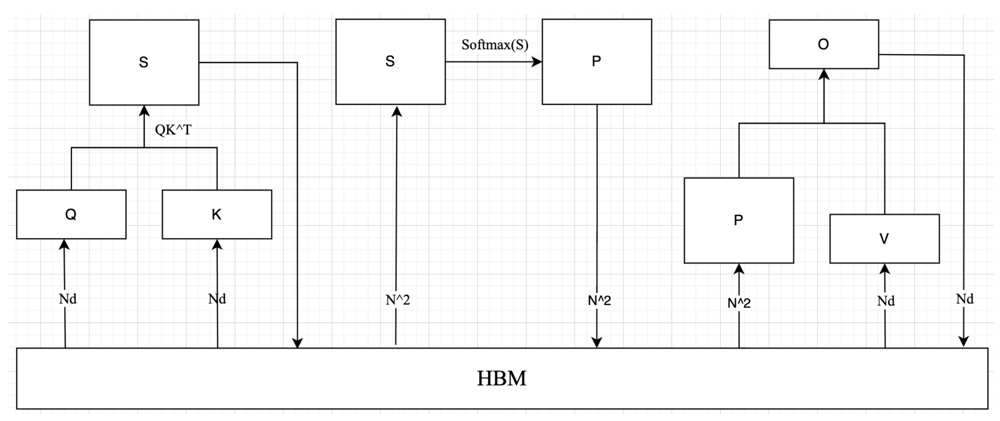

self-attention 算子涉及到的和 HBM 数据传输过程如上图所示，很明显需要从 HBM 中读取 5 次，写入 HBM 3 次，HBM 访存量 $MAC = 4N^2 + 3Nd$，很明显标准注意力的 HBM 访问代价 $MAC$ 随序列长度增加呈二次方增长。

而 self-attention 的计算量为 $4N^2d+N^2$，标准注意力算子的操作强度 $= \frac{4N^2d+N^2}{4N^2 + 3Nd}$。公式可看出，标准注意力算子是一个很明显的内存受限型算子。
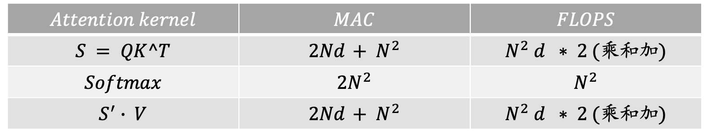

### 1.2 FAV1整体介绍

#### 挑战
在Flash Attention出来之前，已经有了很多了fusedattention算子，但是仔细看，可以发现这其实不是真正的融合算子，只是把matmul kernel、scale kernel、softmax kernel的接口在一个fusedattention算子里面按照计算顺序调了一下，这种手法最多减少了pytorch、TF等框架对算子的调度开销，其实不能真正解决对HBM或者显存的memory traffic。

**融合MHA的挑战在于两点：**

1.解决softmax，因为softmax是一个row-wise（以行为单位）的操作，必须要遍历softmax一行才能得到结果，由此，后面的matmul不得不等待这个过程，导致并行性降低

2.在寄存器和shared memory复用数据做计算，而不是去HBM或显存上去读数据来计算，然而寄存器数量和shared memory (也就是图中的SRAM) 大小都有限，在左图的情况下，显然无法将softmax的结果存到这两个存储单元里面供下一个matmul复用，下一个matmul不得不去HBM或显存上读数据

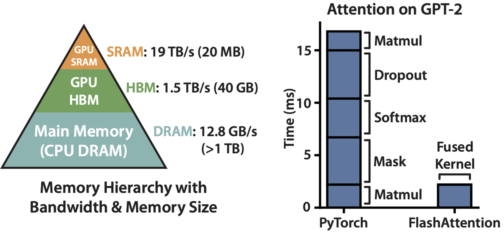

#### 整体思想
FAV1算法整体做到了如下的两部分：
- Tiling（在前向和后向传递中使用）:
  1. （解决挑战1）Online Softmax 实现在一个 for 循环中计算 
$m_i$ 和 $d_i$ ，**FlashAttention-v1 基于它的思想更进一步，实现在一个 for 循环中计算 $m_i$ 、$d_i$ 和注意力输出 $O_i$ ，也就是说，在一个 kernel 中实现 attention 的所有操作**。

  2. （解决挑战2）再**通过分块 Tiling 技术**，将输入的 Q、K、V 矩阵拆分为多个块，将其从较慢的 HBM 加载到更快的 SRAM 中，从而大大减少了 HBM 访问次数（内存读/写的次数），然后分别计算这些块的注意力输出，最后，将每个块的输出按正确的归一化因子缩放之后相加后可得到精确的注意力输出。
- 重新计算（仅在后向传递中使用）:核心思想为不为反向传递存储S、P矩阵，但是输出softmax的l和m，在反向传播时，重新计算S、P矩阵。

### 1.3 FAV1算法流程

<!--  -->
<!-- 

  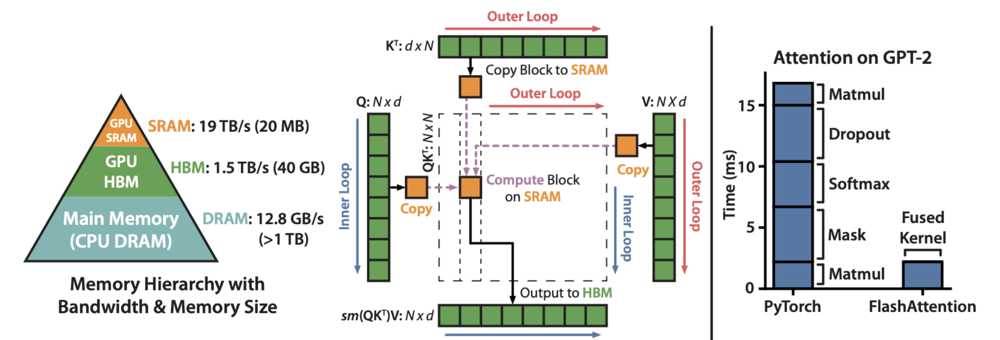

 -->
Flashattention总体的算法流程图如下：
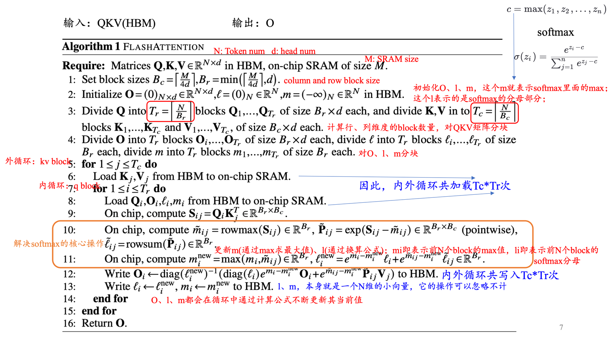

---
1. 设置块的行大小 $B_r = \frac{M}{4d}$，块的列大小为 $B_c = \min\left(\frac{M}{4d}, d\right)$ 。 $\min$ 函数的目的是防止块大小 $B_r \times B_c > M/4$，这样就无法把 4 个这样的块放到 SRAM 里，后面我们会看到为什么是 $4 \times B_r \times B_c$ 的块。
.png)
---
2. 我们把结果矩阵O初始化为零，后面会逐步把中间结果累加进去，所以零是合适的初始值。类似的是l(注意：对于每一行来说，它是一个标量，用于累加指数和，由于输出有N行，所以这里的l是长度为N的向量)。m用于记录每一行当前最大的值，所以也是长度为N，而-inf是求max的合适初始值。
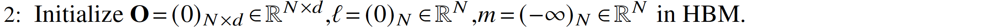
---
3. 设置块的行大小$B_r = \frac{M}{4d}$，块的列大小为$B_c = \min\left(\frac{M}{4d}, d\right)$。$\min$函数的目的是防止块大小$B_r \times B_c > M/4$，这样就无法把4个这样的块放到SRAM里，后面我们会看到为什么是$4 \times B_r \times B_c$的块。
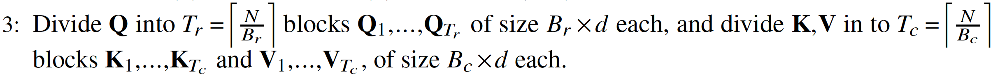
---
4. 根据前面的计算，结果矩阵$O$需要切分成$𝐵𝑟×𝑑$的块来存放中间结果。长度为$N$的$l$和$m$也要切分成$𝐵𝑟$个元素的块，用于存放这些行当前的指数累加值和当前最大值。
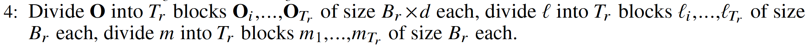

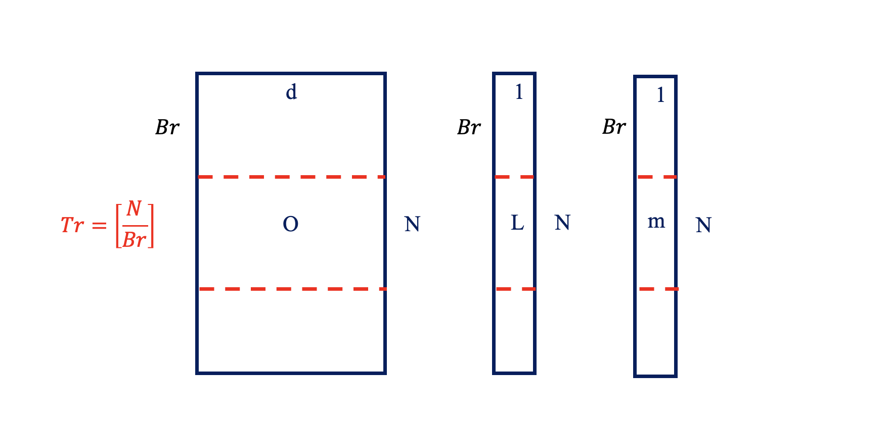
---
算法图
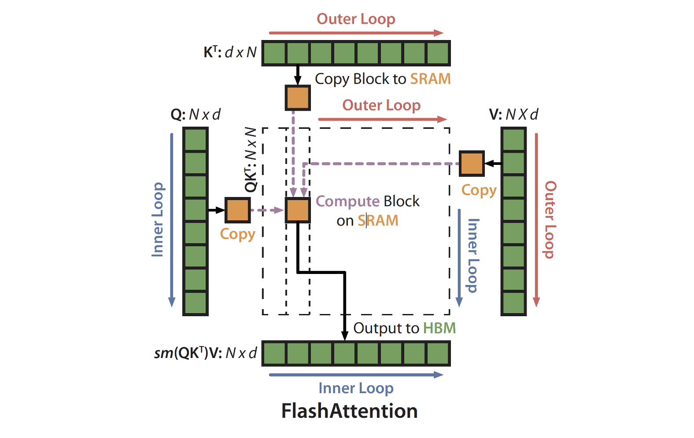
- 这个图展示了第5步开始的两层循环，**逻辑就是外层循环的下标 $j$ 就是循环 $K^T$ 和 $V$，而内存循环的下标就是循环 $Q$**。首先外层循环取出大小为 $d \times B_c$ 的 $ K_j^T$ 和大小为 $B_c \times d$ 的 $V_j$，然后内层循环遍历整个 $Q$，比如当前是 $i$，也就是大小为 $B_r \times d $ 的 $Q_i$。我们就可以计算 $O = softmax(Q_i K_j^T V_j)$。不过要记住，这是部分的计算结果，所以我们要保存（更新）中间统计量 $m$ 和 $l$，等到 $j+1$ 的下一次循环时，内层循环还会再次遍历 $Q$，那个时候会计算 $O = softmax(Q_i K_{j+1}^T V_{j+1})$，然后把这次的结果合并到最终的结果里。包括统计量也需要同步更新。
- **内循环一次 $Q_i$ 填满一次 $O、l、m$，共循环$T_r$次**
- **外循环一次 $K_j^T、V_j$ 更新一次 $O、l、m$，共循环$T_c$次**
- **整体循环结束$O、l、m$ 就是最终结果**
---
5. 这是外层循环，j表示K和V的下标。
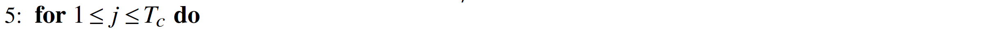
---
6. 我们首先把$K_j$和$V_j$从HBM加载到SRAM。根据前面的讨论，这会占据SRAM **约50%** 的存储。($B_c = \min\left(\frac{M}{4d}, d\right)$，如果$B_r = \frac{M}{4d}$，$2 \times B_r \times d = \frac{M}{2}$，正好占50%的SRAM; 如果$B_r = d$, 则说明$d < \frac{M}{4d}$，占SRAM会小于50%)
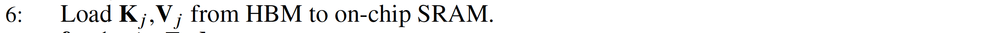
---
7. 内循环，i表示Q的下标。
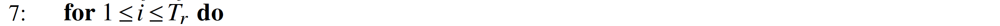
---
8. 把$Q_i(B_r \times d)$和$O_i(B_r \times d)$加载进SRAM，同时把$l_i(B_r)$和$m_i(B_r)$也加载进去。$Q_i$和$O_i$会**占据50%的显存**。而$l_i$和$m_i$比较小，根据**论文作者的说法**可以放到寄存器里。
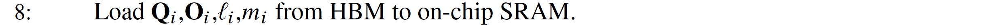
---
9. 计算分块矩阵$Q_i(B_r \times d)$和$K_j$的转置$(d \times B_c)$的乘积，得到score $S_{ij}(B_r \times B_c)$。
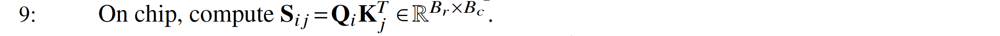
我们可以看到这里不需要计算$N \times N$的得分S矩阵，也就是不需要“materialized”。而只需要很小的$S_{ij}$。
我们来看一个简单的示例：这里假设外层循环下标$j=3$，内层循环下标$i=2$，$N=25$，块大小是5（这里假设下标从1开始）。那么计算如下图所示：
$$
Q_i \cdot K_j^T = (B_r \times d) \cdot (d \times B_c) = B_r \times B_c
$$

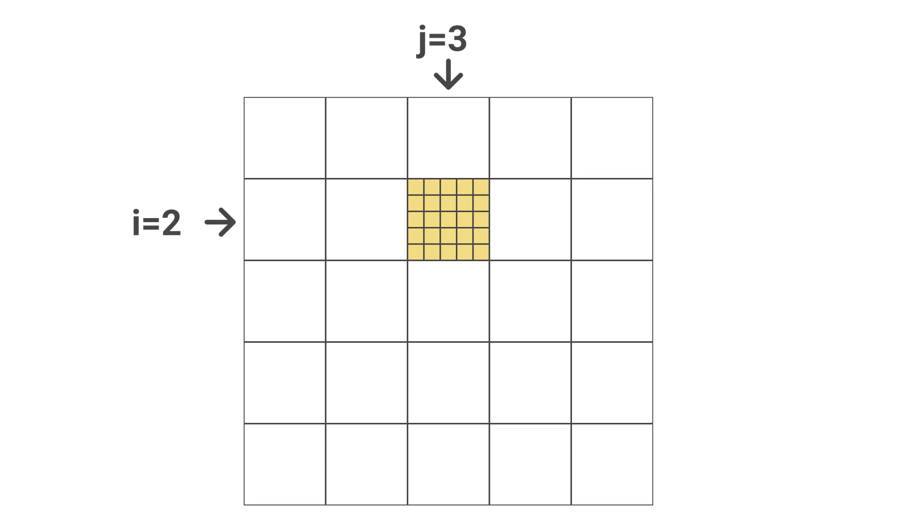
- 上图计算的是attention得分是Query为第6-10个token，Key是第11-15个token。
---
10. 计算$\tilde{m}_{ij}$、$\tilde{l}_{ij}$和$\tilde{P}_{ij}$，使用前面的公式就可以简单的得出。
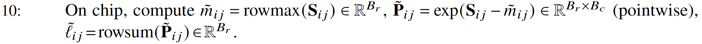
- $\tilde{m}_{ij}$是逐行计算的，找到每一行的最大值。
- $\tilde{P}_{ij}$是逐点运算，把$S_{ij}$减去第$i$行的最大值$\tilde{m}_{ij}$（注意：这个下标$j$表示这是第$j$次计算，其实是一个值而不是向量），然后在计算指数。
- $\tilde{l}_{ij}$也是逐行计算，把每一行的$\tilde{P}_{ij}$加起来。

---
11. 
- $m_i$包含了在当前块（$j=3$）之前所有块的最大值（按行），比如上面的例子，$m_i$保存了$j=1$和$j=2$（图中的绿色块）块第6~10行的最大值。而$\tilde{m}_{ij}$是上一步得到的当前块（黄色）的最大值。因此取它们两者的最大值就得到前3个块（绿色加黄色块共15列）的最大值。
- $l_i^{new}$的计算也是类似的，只不过求和前需要用当前的$e^{-m_i^{new}}$修正，具体可参考[Naive -> Safe -> Online Softmax](https://summer536.github.io/Notes/zh/posts/softmax.html)。
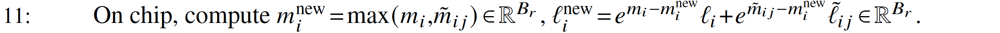
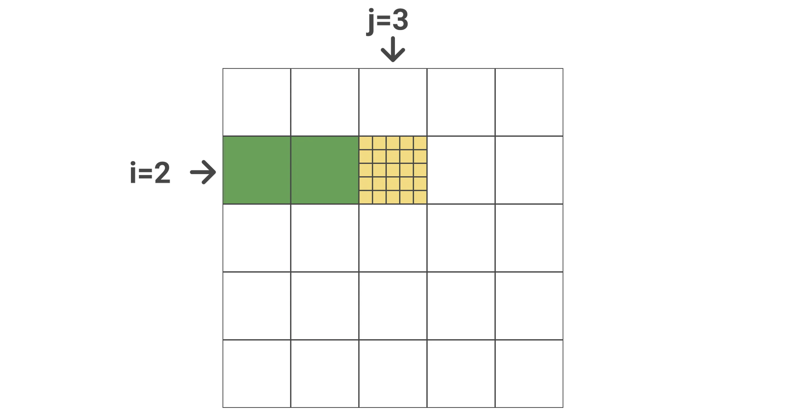

---
12. 这里先介绍一下$diag(l_i)$，它是一个对角矩阵，对角线上的元素是$l_i$。(diag( )将一个$N*1$的向量变成$N*N$的对角矩阵, 如下图左侧矩阵)为什么要搞出这么复杂的东西呢？目的就是把前面我们更新l的公式能写成矩阵乘法的形式，这样才能在GPU上高效计算。
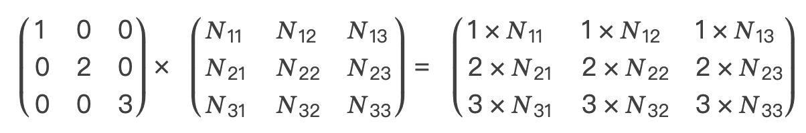
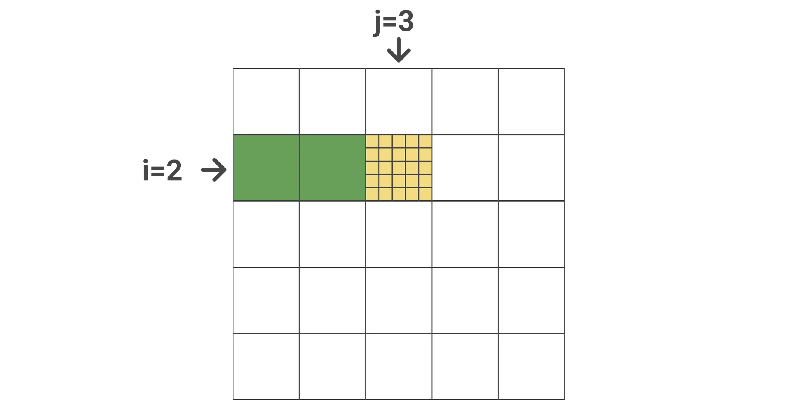

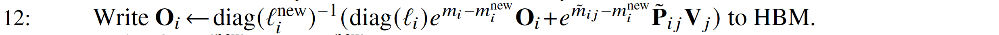
第12步公式的**绿色部分是更新当前块（$j=3$）之前的块（$j<3$）的 softmax 值**。

我们回忆一下前面的例子：在一开始 $x^1 = [x_1 = 1, x_2 = 3]$，前两个数的 softmax 值是：

$$
l = e^{1-3} + e^{3-3}
$$

$$
PV = [e^{1-3}, e^{3-3}]
$$

$$
O = \left[ \frac{e^{1-3}}{e^{1-3} + e^{3-3}}, \frac{e^{3-3}}{e^{1-3} + e^{3-3}} \right]
$$

现在 $x^2 = [x_3 = 2, x_4 = 4]$ 加入，使得最大值变成了 4，并且指数的和也增加了。所以第一步的需要重新计算。怎么重新计算呢？因为之前的 PV 没有保存，所以我们可以用 $l$ 乘以 $O$ 恢复出 PV。论文中是矩阵的形式，也就是 $diag(l_i) \times O_i$。恢复出来的 R 再乘以 $e^{m_i - m_i^{new}}$ 就是修正后的 PV，也就是 $e^{x_i - max(x)} V_j$。

也就是说，对于上面的例子，做这一步之后PV将会计算为:
$$
PV =l\times O \times e^{m_i - m_i^{new}} =[e^{1-3}, e^{3-3}] \times e^{3-4} = [e^{1-4}, e^{3-4}]
$$

而**公式的黄色部分是当前块（$j=3$），$e^{\tilde{m}_{ij} - m_i^{new}}$ 是当前块的最大值减去 $j \leq 3$ 所有块的最大值，这是对当前指数 $\tilde{P}_{ij}$ 的修正**。代入$\tilde{P}_{ij} = e^{S_{ij} - \tilde{m}_{ij}}$（第十步），那么可以发现其实就是 $e^{S_{ij} - m_i^{new}}$。黄色部分乘$V_j$则完成了当前块的$O_i = softmax(Q_i K_j^T V_j)$除最后一步softmax要除以$l$的所有步骤。

**最后把新的 PV 除以新的 $l$ 存到 $O$ 里(完整softmax的最后一步)，只不过这里的除法也是用矩阵乘法来表示，也就是最前面的 $(diag(l_i^{new}))^{-1}$。因为对角矩阵的逆就是它对角线元素的逆，也就是变成了除法。**

---
13. 把最新的累计量$l_r,m_r$写回HBM，注意它们的大小都是$B_r$。
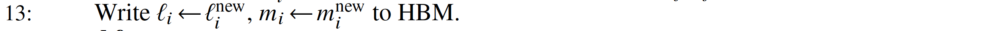

---
14.-16. 结束循环，返回最终矩阵O。

### 1.4 FAV1算法的数学证明
#### 1.4.1 Online Softmax
这个证明略，详细内容见笔记[Naive -> Safe -> Online Softmax](https://summer536.github.io/Notes/zh/posts/softmax.html)

#### 1.4.2 如何证明最终计算的O是正确的？
我们用**数学归纳法**来证明算法的正确性，这里我们用外循环下标 $0 \leqslant j \leqslant T_c$ 来进行归纳。

首先我们记 $K_{:,j} \in R^{jB_c \times d}$ 为 K 的前 $jB_c$ 行，$V_{:,j} \in R^{jB_c \times d}$ 为 V 的前 $jB_c$ 行。

令 $S_{:,j} = QK^{T}_{:,j} \in R^{N \times jB_c}$，$P_{:,j} = \text{softmax}(S_{:,j}) \in R^{N \times jB_c}$。

$K_{:,j}$ 是 K 的前 $jB_c$ 行，所以 $K_{:,j}^T \in R^{d \times jB_c}$ 是 K 的前 $jB_c$ 列，所以 $S_{:,j}$ 是矩阵 Q 乘以 K 的前 $jB_c$ 列（行是 N）。而 $P_{:,j}$ 是前 $jB_c$ 列的 softmax，这正是我们之前算法外层循环。

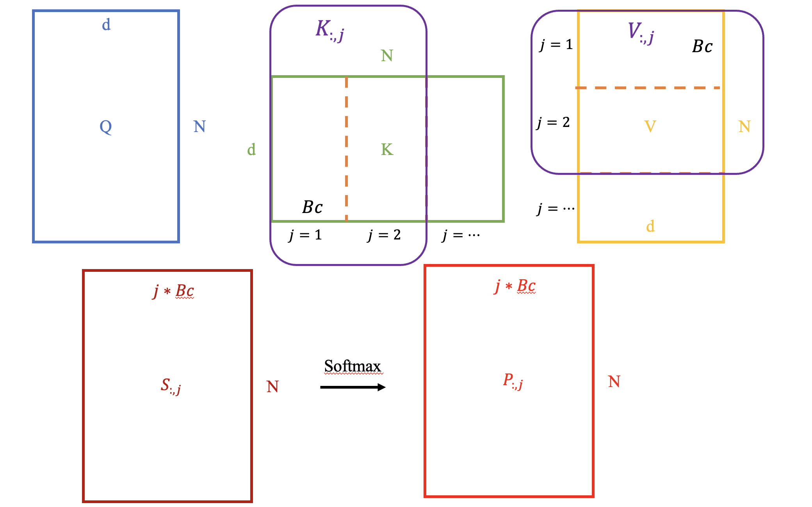

令 $m^{(j)}, l^{(j)}, O^{(j)}$ 是算法在第 j 次外循环结束后 HBM 保存的累积量和 $\text{softmax}(QK^TV)$（部分正确）的结果。**注意：对于固定的 i，这些量在每次外循环 j 结束后都会被更新到 HBM 中，下一次外循环时又加载回来。** 我们想证明：第 j 次外循环结束后，HBM 中的值为：

$$
m^{(j)} = \text{rowmax}(S_{:,j}) \in R^N
$$

$$
l^{(j)} = \text{rowsum}(\exp(S_{:,j} - m^{(j)})) \in R^N
$$

$$
O^{(j)} = P_{:,j}V_{:,j} \in R^{N \times d}
$$

根据算法的初始化（第 1 和 2 行），$j=0$ 是显然是正确的，因为累积量 $m$ 初始化为 $-\infty$，$l$ 初始化为 0，$O$ 也是初始化为 0。

---
假设 $j$ 时结论是正确的，那么我们希望证明 $j+1$ 是上面三个式子也是正确的。

首先我们看累积量 $m$，它的更新算法是：$\tilde{m}^{(j+1)} = \max(m^{(j)}, \tilde{m})$，其中 $\tilde{m} \in R^N$ 是块 $j$ 的最大值（按行），因此它等于 $\max(S_{:,j:j+1})$。根据归纳，而 $m^{(j)} = \max(S_{:,j})$，所以：

$$
m^{(j+1)} = \max(m^{(j)}, \tilde{m}) = \max(\max(S_{:,j:j+1}), \max(S_{:,j})) = \text{rowmax}(S_{:,j+1})
$$

这就**证明了对于 $j+1$，第一个等式是成立的**。类似的，我们的更新 $l$ 的算法是：

$$
l^{(j+1)} = \left(e^{m^{(j)} - m^{(j+1)}} l^{(j)} + e^{\tilde{m} - m^{(j+1)}} \tilde{l}\right)
$$

其中 $\tilde{l} = \text{rowsum}(\exp(S_{:,j:j+1} - \tilde{m})) \in R^N$。因此：

$$
l^{(j+1)} = e^{m^{(j)} - m^{(j+1)}} l^{(j)} + e^{\tilde{m} - m^{(j+1)}} \text{rowsum}(\exp(S_{:,j:j+1} - \tilde{m}))
$$

而根据归纳：

$$
l^{(j)} = \text{rowsum}(\exp(S_{:,j} - m^{(j)}))
$$

代入上式得到：

$$
\begin{aligned}
l^{(j+1)} &= e^{m^{(j)} - m^{(j+1)}} \text{rowsum}(\exp(S_{:,j} - m^{(j)})) + e^{\tilde{m} - m^{(j+1)}} \text{rowsum}(\exp(S_{:,j:j+1} - \tilde{m})) \\
&= \text{rowsum}(\exp(S_{:,j} - m^{(j+1)})) + \text{rowsum}(\exp(S_{:,j:j+1} - m^{(j+1)})) \\
&= \text{rowsum}(\exp(S_{:,j+1} - m^{(j+1)}))
\end{aligned}
$$

所以**在 $j+1$ 时第二个式子成立**。

为了证明第三个式子，我们令 $V_{:,j:j+1}$ 为 V 的第 $jB_c$ 列到 $(j+1)B_c-1$ 列。证明过程如下：

$$
\begin{aligned}
\mathbf{O}^{(j+1)} &= \text{diag}(\ell^{(j+1)})^{-1} (\text{diag}(\ell^{(j)}) e^{m^{(j)} - m^{(j+1)}} \mathbf{O}^{(j)} + e^{\tilde{m} - m^{(j+1)}} \exp(\mathbf{S}_{:,j:j+1} - \tilde{m}) \mathbf{V}_{:,j:j+1}) \\
&= \text{diag}(\ell^{(j+1)})^{-1} (\text{diag}(\ell^{(j)}) e^{m^{(j)} - m^{(j+1)}} \mathbf{P}_{:,j} \mathbf{V}_{:,j} + e^{-m^{(j+1)}} \exp(\mathbf{S}_{:,j:j+1}) \mathbf{V}_{:,j:j+1}) \\
&= \text{diag}(\ell^{(j+1)})^{-1} (\text{diag}(\ell^{(j)}) e^{m^{(j)} - m^{(j+1)}} ({\text{diag}(\ell^{(j)})})^{-1} \exp(\mathbf{S}_{:,j} - m^{(j)}) \mathbf{V}_{:,j} + e^{-m^{(j+1)}} \exp(\mathbf{S}_{:,j:j+1}) \mathbf{V}_{:,j:j+1}) \\
&= \text{diag}(\ell^{(j+1)})^{-1} (e^{-m^{(j+1)}} \exp(\mathbf{S}_{:,j}) \mathbf{V}_{:,j} + e^{-m^{(j+1)}} \exp(\mathbf{S}_{:,j:j+1}) \mathbf{V}_{:,j:j+1}) \\
&= \text{diag}(\ell^{(j+1)})^{-1} (\exp(\mathbf{S}_{:,j} - m^{(j+1)}) \mathbf{V}_{:,j} + \exp(\mathbf{S}_{:,j:j+1} - m^{(j+1)}) \mathbf{V}_{:,j:j+1}) \\
&= \text{diag}(\ell^{(j+1)})^{-1} \left( \exp \left( \begin{bmatrix} \mathbf{S}_{:,j} & \mathbf{S}_{:,j:j+1} \end{bmatrix} - m^{(j+1)} \right) \right) \begin{bmatrix} \mathbf{V}_{:,j} \\ \mathbf{V}_{:,j:j+1} \end{bmatrix} \\
&= \text{softmax}(\mathbf{S}_{:,j+1}) \mathbf{V}_{:,j+1}.
\end{aligned}
$$

下面我们一步一步地来看这个证明过程。

1. **第一行** 这就是算法的更新公式。在前面的 step 12 详细介绍了。

2. **第二行** 第一个是用归纳假设 $\mathbf{O}^{(j)} = P_{:,j} V_{:,j}$，第二个就是指数合并，$e^{\tilde{m}}$ 抵消掉。

3. **第三行** 利用前面的定义：$P_{:,j} = \text{softmax}(S_{:,j})$，也就是说 $P_{:,j}$ 到块 j 时的 $S_{:,j}$ 的 softmax。根据 softmax 和 l 及 m 的关系，我们有：

   $$
   S_{:,j} = e^{S_{:,j} - m^{(j)}} / \begin{pmatrix} l_1^{(j)} & \dots & 0 \\ \vdots & \ddots & \vdots \\ 0 & \dots & l_N^{(j)} \end{pmatrix} = (\text{diag}(l^{(j)}))^{-1} e^{S_{:,j} - m^{(j)}}
   $$

   代入即可得到第三行。
4) **第四行** $(\text{diag}(l^{(j)}))^{-1}$ 和 $\text{diag}(l^{(j)})$ 抵消，$e^{m^{(j)}}$ 和 $\exp(-m^{(j)})$ 抵消，就得到第四行。

5) **第五行** 把 $e^{-m^{(j+1)}}$ 合并到 $\exp(\dots)$ 里面就得到第五行。

6) **第六行** 把 $A \times B + C \times D$ 写成 $[A, C] \times [B, D]^T$ 的矩阵乘法（向量内积）。

7) **第七行** 就是 softmax 的定义。注意：我们需要把 $[\mathbf{S}_{:,j}, \mathbf{S}_{:,j:j+1}]$ 合并成 $[\mathbf{S}_{:,j+1}]$，$[\mathbf{V}_{:,j}, \mathbf{V}_{:,j:j+1}]$ 合并成 $[\mathbf{V}_{:,j+1}]$。

所以对于 $j+1$，我们证明的 3 个公式都是成立的，因此用数学归纳法可以证明对于 $j = 0, \dots, T_c$ 都是成立的。

当 $j = T_c$ 时，根据第七行和 $\mathbf{S}$ 的定义，$\mathbf{O}^{(T_c)} = \text{softmax}(\mathbf{S}_{:,T_c} \mathbf{V}_{:,T_c}) = \text{softmax}(QK^T)V$。

#### 1.4.3 如何证明计算FLOPS为$O(N^2d)$?
算法最主要的 FLOPs 用于矩阵乘法。在内层循环（算法第 9 行），我们需要计算 $Q_i K_j^T \in R^{B_r \times B_c}$，其中 $Q_i \in R^{B_r \times d}$，$K_j^T \in R^{d \times B_c}$，这需要 $O(B_r B_c d)$ 的 FLOPs。内外循环相乘是 $T_c T_r = \left\lceil \frac{N}{B_c} \right\rceil \left\lceil \frac{N}{B_r} \right\rceil$ 次，因此总的 TLOPs 为：

$$
O\left(\frac{N^2}{B_c B_r} B_r B_c d\right) = O(N^2 d)
$$

关于额外的空间，我们需要O(N)的空间来存储累计量(l,m)。

#### 1.4.4 如何证明算法只需要$Θ(𝑁^2 𝑑^2 𝑀^{−1})$的HBM访问？
证明：我们首先分析标准 Attention 实现的 IO 情况。输入 $Q, K, V \in R^{N \times d}$ 在 HBM 中，最终的输出 $O \in R^{N \times d}$ 也要写回到 HBM。

第一步是计算 $QK^T$，这是 $(N \times d)$ 矩阵乘以 $d \times N$ 矩阵，输入 Q 和 K 需要读入，结果 $S \in R^{N \times N}$ 需要写回 HBM，因此 HBM 访问量是 $O(Nd + N^2)$。

第二步是 $P = \text{softmax}(S)$，输入和输出都是 $N^2$，因此访问 HBM 为 $O(N^2)$。

最后一般是 $O = PV$，P 和 V 需要读入 SRAM，结果写回 HBM，所以访问 HBM 为 $O(Nd + N^2)$。

综上，**标准 Attention 算法需要 $O(Nd + N^2)$ 的 HBM 读写量**。

---

接下来我们来看 FlashAttention 算法。

外层循环只遍历一次，因此 K 和 V 只从 HBM 加载到 SRAM 一次，Q 和 O 需要遍历 $T_c$ 次，每次都完整的把它们加载一遍。因此 HBM 的访问量是 $O(Nd + NdT_c) = O(NdT_c)$。

下面来看 $B_c$ 和 $B_r$ 的约束条件。我们需要大小为 $B_c \times d$ 块 $K_j, V_j$ 能够放到 SRAM 里，因此：

$$
B_c \times d = O(M) \Leftrightarrow B_c = O\left(\frac{M}{d}\right)
$$

类似的，大小为 $B_r \times d$ 的块 $Q_i$ 和 $O_i$ 也需要能放进去，因此：

$$
B_r \times d = O(M) \Leftrightarrow B_r = O\left(\frac{M}{d}\right)
$$

最后，我们需要 $S_{ij} \in R^{B_r \times B_c}$ 也能放进去，因此：

$$
B_r B_c = O(M)
$$

因此，我们这样设置：

$$
B_c = O\left(\frac{M}{d}\right), \quad B_r = O\left(\min\left(\frac{M}{d}, \frac{M}{B_c}\right)\right) = O\left(\min\left(\frac{M}{d}, d\right)\right)
$$

因此有：

$$
T_c = \frac{N}{B_c} = O\left(\frac{Nd}{M}\right)
$$

所以有 $O(NdT_c) = O(N^2d^2M^{-1})$。证毕。

## 二、Flashattention-V2

## 三、Flashattention-V3

## 总结

## 待更新

## 参考文献

1. [Dao, T., et al. (2022). FlashAttention: Fast and Memory-Efficient Exact Attention with IO-Awareness.](https://proceedings.neurips.cc/paper_files/paper/2022/file/67d57c32e20fd0a7a302cb81d36e40d5-Paper-Conference.pdf)
2. [Dao, T., et al. (2023). FlashAttention-2: Faster Attention with Better Parallelism and Work Partitioning. ](https://arxiv.org/pdf/2307.08691)
3. [Flash Attention V1论文解读-李理](https://fancyerii.github.io/2023/10/23/flashattention/)
4. [Flash Attention V1论文解读-Zhang](https://www.armcvai.cn/2024-10-02/flashattention1-paper.html)
5. [Flash Attention V2论文解读-Zhang](https://www.armcvai.cn/2024-10-05/flashattention2-paper.html)
6. [Flash Attention V3论文解读-Zhang](https://www.armcvai.cn/2024-10-06/flashattention3-paper.html)
7. [flashattention1-2-3 系列总结-Zhang](https://www.armcvai.cn/2024-10-07/flashattention1-2-3-summary.html)
8. [Flash Attention1-真正意义上的scale dot product attention的算子融合-AI不止算法](https://mp.weixin.qq.com/s?__biz=Mzg2ODk4MzE2MQ==&mid=2247483875&idx=1&sn=a23ef737b03e5bdec1892a8818de0704&chksm=cea549f5f9d2c0e3832f10031de98dd4a243fd2411ffdacb434cc64a473452a148fc149ded47&scene=21#wechat_redirect)
9. [FlashAttentionV1V2算法解释-AI不止算法Bilibili](https://www.bilibili.com/video/BV1gzBqY4Evw?spm_id_from=333.788.videopod.sections&vd_source=f058beebb64c488b55915da416ee6086)