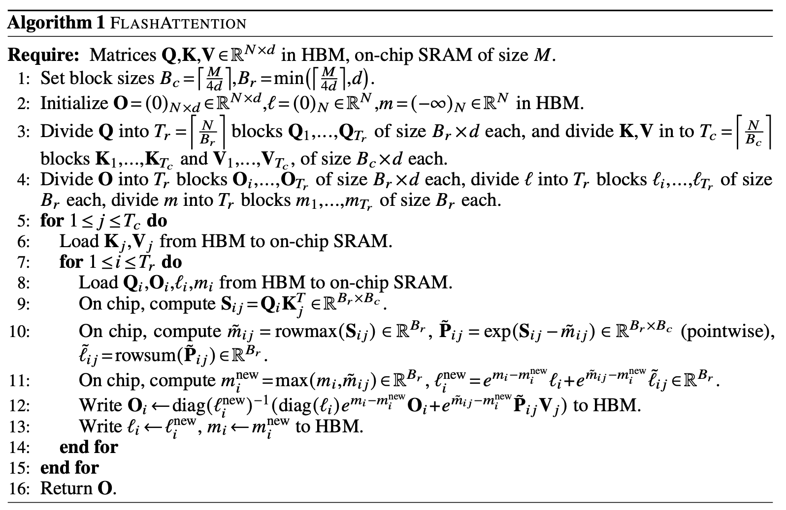
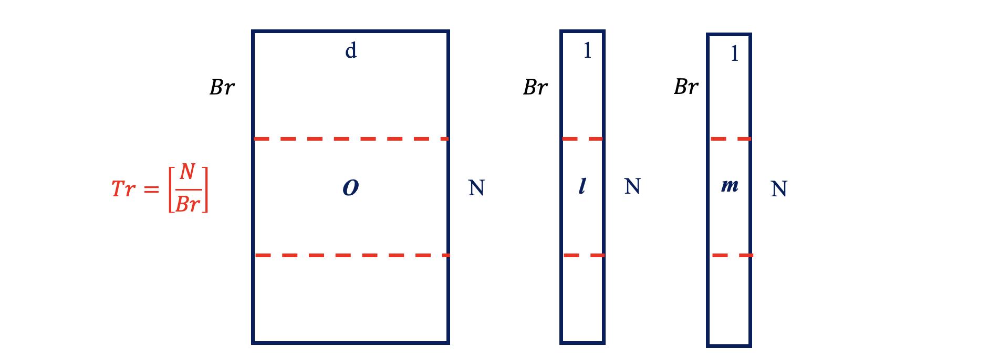
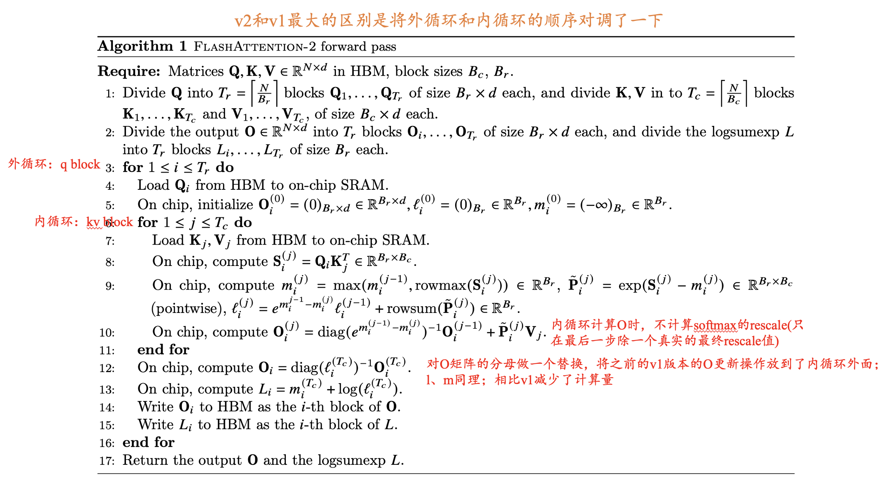

# Flashattention

## 简介

Flashattention是一种高效的注意力机制计算方法，由斯坦福大学研究团队在2022年提出。它通过优化GPU内存访问模式，显著提高了Transformer模型中注意力计算的速度并降低了内存使用。作为大模型训练和推理的关键优化技术，Flashattention已被广泛应用于各种大型语言模型中。

<!-- more -->

## 一、Flashattention-V1

### 1.1 标准注意力机制
给定输入二维矩阵 $Q, K, V \in \mathbb{R}^{N \times d}$，其中 $N$ 是输入序列的长度，$d$ 是自注意力机制头的长度。Softmax 是按行应用的，注意力输出矩阵 $O \in \mathbb{R}^{N \times d}$ 的计算公式如下：
$$
\begin{align*}
S &= Q K^\mathrm{T} \in \mathbb{R}^{N \times N}, \quad
P = \text{softmax}(S) \in \mathbb{R}^{N \times N}, \quad
O = P V \in \mathbb{R}^{N \times d}.
\end{align*}
$$

标准的 Attention 运算大致可以描述为以下三个步骤：
- 将 Q,K 矩阵以块的形式从 HBM 中加载到 SRAM 中，计算 S=QK ，将 S 写入到 HBM 中。
- 将 S 矩阵从 HBM 中加载到 SRAM 中，计算 P=Softmax(S) ，将 P 写入到 HBM 中。
- 将 P,V 矩阵以块的形式从 HBM 中加载到 SRAM 中，计算 O=PV ，将 O 写入到 HBM 中。


self-attention 算子涉及到的和 HBM 数据传输过程如上图所示，很明显需要从 HBM 中读取 5 次，写入 HBM 3 次，HBM 访存量 $MAC = 4N^2 + 3Nd$，很明显标准注意力的 HBM 访问代价 $MAC$ 随序列长度增加呈二次方增长。

而 self-attention 的计算量为 $4N^2d+N^2$，标准注意力算子的操作强度 $= \frac{4N^2d+N^2}{4N^2 + 3Nd}$。公式可看出，标准注意力算子是一个很明显的内存受限型算子。


### 1.2 FAV1整体介绍

#### 挑战
在Flash Attention出来之前，已经有了很多了fusedattention算子，但是仔细看，可以发现这其实不是真正的融合算子，只是把matmul kernel、scale kernel、softmax kernel的接口在一个fusedattention算子里面按照计算顺序调了一下，这种手法最多减少了pytorch、TF等框架对算子的调度开销，其实不能真正解决对HBM或者显存的memory traffic。

**融合MHA的挑战在于两点：**

1.解决softmax，因为softmax是一个row-wise（以行为单位）的操作，必须要遍历softmax一行才能得到结果，由此，后面的matmul不得不等待这个过程，导致并行性降低

2.在寄存器和shared memory复用数据做计算，而不是去HBM或显存上去读数据来计算，然而寄存器数量和shared memory (也就是图中的SRAM) 大小都有限，在左图的情况下，显然无法将softmax的结果存到这两个存储单元里面供下一个matmul复用，下一个matmul不得不去HBM或显存上读数据


#### 整体思想
FAV1算法整体做到了如下的两部分：
- Tiling（在前向和后向传递中使用）:
  1. （解决挑战1）Online Softmax 实现在一个 for 循环中计算 
$m_i$ 和 $d_i$ ，**FlashAttention-v1 基于它的思想更进一步，实现在一个 for 循环中计算 $m_i$ 、$d_i$ 和注意力输出 $O_i$ ，也就是说，在一个 kernel 中实现 attention 的所有操作**。

  2. （解决挑战2）再**通过分块 Tiling 技术**，将输入的 Q、K、V 矩阵拆分为多个块，将其从较慢的 HBM 加载到更快的 SRAM 中，从而大大减少了 HBM 访问次数（内存读/写的次数），然后分别计算这些块的注意力输出，最后，将每个块的输出按正确的归一化因子缩放之后相加后可得到精确的注意力输出。
- 重新计算（仅在后向传递中使用）:核心思想为不为反向传递存储S、P矩阵，但是输出softmax的l和m，在反向传播时，重新计算S、P矩阵。

### 1.3 FAV1算法流程

<!--  -->
<!-- <p align="center">
  
</p> -->
Flashattention总体的算法流程图如下：


---
1. 设置块的行大小 $B_r = \frac{M}{4d}$，块的列大小为 $B_c = \min\left(\frac{M}{4d}, d\right)$ 。 $\min$ 函数的目的是防止块大小 $B_r \times B_c > M/4$，这样就无法把 4 个这样的块放到 SRAM 里，后面我们会看到为什么是 $4 \times B_r \times B_c$ 的块。
.png)
---
2. 我们把结果矩阵O初始化为零，后面会逐步把中间结果累加进去，所以零是合适的初始值。类似的是l(注意：对于每一行来说，它是一个标量，用于累加指数和，由于输出有N行，所以这里的l是长度为N的向量)。m用于记录每一行当前最大的值，所以也是长度为N，而-inf是求max的合适初始值。

---
3. 设置块的行大小$B_r = \frac{M}{4d}$，块的列大小为$B_c = \min\left(\frac{M}{4d}, d\right)$。$\min$函数的目的是防止块大小$B_r \times B_c > M/4$，这样就无法把4个这样的块放到SRAM里，后面我们会看到为什么是$4 \times B_r \times B_c$的块。

---
4. 根据前面的计算，结果矩阵$O$需要切分成$𝐵𝑟×𝑑$的块来存放中间结果。长度为$N$的$l$和$m$也要切分成$𝐵𝑟$个元素的块，用于存放这些行当前的指数累加值和当前最大值。



---
算法图

- 这个图展示了第5步开始的两层循环，**逻辑就是外层循环的下标 $j$ 就是循环 $K^T$ 和 $V$，而内存循环的下标就是循环 $Q$**。首先外层循环取出大小为 $d \times B_c$ 的 $ K_j^T$ 和大小为 $B_c \times d$ 的 $V_j$，然后内层循环遍历整个 $Q$，比如当前是 $i$，也就是大小为 $B_r \times d $ 的 $Q_i$。我们就可以计算 $O = softmax(Q_i K_j^T V_j)$。不过要记住，这是部分的计算结果，所以我们要保存（更新）中间统计量 $m$ 和 $l$，等到 $j+1$ 的下一次循环时，内层循环还会再次遍历 $Q$，那个时候会计算 $O = softmax(Q_i K_{j+1}^T V_{j+1})$，然后把这次的结果合并到最终的结果里。包括统计量也需要同步更新。
- **内循环一次 $Q_i$ 填满一次 $O、l、m$，共循环$T_r$次**
- **外循环一次 $K_j^T、V_j$ 更新一次 $O、l、m$，共循环$T_c$次**
- **整体循环结束$O、l、m$ 就是最终结果**
---
5. 这是外层循环，j表示K和V的下标。

---
6. 我们首先把$K_j$和$V_j$从HBM加载到SRAM。根据前面的讨论，这会占据SRAM **约50%** 的存储。($B_c = \min\left(\frac{M}{4d}, d\right)$，如果$B_r = \frac{M}{4d}$，$2 \times B_r \times d = \frac{M}{2}$，正好占50%的SRAM; 如果$B_r = d$, 则说明$d < \frac{M}{4d}$，占SRAM会小于50%)

---
7. 内循环，i表示Q的下标。

---
8. 把$Q_i(B_r \times d)$和$O_i(B_r \times d)$加载进SRAM，同时把$l_i(B_r)$和$m_i(B_r)$也加载进去。$Q_i$和$O_i$会**占据50%的显存**。而$l_i$和$m_i$比较小，根据**论文作者的说法**可以放到寄存器里。

---
9. 计算分块矩阵$Q_i(B_r \times d)$和$K_j$的转置$(d \times B_c)$的乘积，得到score $S_{ij}(B_r \times B_c)$。

我们可以看到这里不需要计算$N \times N$的得分S矩阵，也就是不需要“materialized”。而只需要很小的$S_{ij}$。
我们来看一个简单的示例：这里假设外层循环下标$j=3$，内层循环下标$i=2$，$N=25$，块大小是5（这里假设下标从1开始）。那么计算如下图所示：
$$
Q_i \cdot K_j^T = (B_r \times d) \cdot (d \times B_c) = B_r \times B_c
$$


- 上图计算的是attention得分是Query为第6-10个token，Key是第11-15个token。
---
10. 计算$\tilde{m}_{ij}$、$\tilde{l}_{ij}$和$\tilde{P}_{ij}$，使用前面的公式就可以简单的得出。

- $\tilde{m}_{ij}$是逐行计算的，找到每一行的最大值。
- $\tilde{P}_{ij}$是逐点运算，把$S_{ij}$减去第$i$行的最大值$\tilde{m}_{ij}$（注意：这个下标$j$表示这是第$j$次计算，其实是一个值而不是向量），然后在计算指数。
- $\tilde{l}_{ij}$也是逐行计算，把每一行的$\tilde{P}_{ij}$加起来。

---
11. 
- $m_i$包含了在当前块（$j=3$）之前所有块的最大值（按行），比如上面的例子，$m_i$保存了$j=1$和$j=2$（图中的绿色块）块第6~10行的最大值。而$\tilde{m}_{ij}$是上一步得到的当前块（黄色）的最大值。因此取它们两者的最大值就得到前3个块（绿色加黄色块共15列）的最大值。
- $l_i^{new}$的计算也是类似的，只不过求和前需要用当前的$e^{-m_i^{new}}$修正，具体可参考[Naive -> Safe -> Online Softmax](https://summer536.github.io/Notes/zh/posts/softmax.html)。


---
12. 这里先介绍一下$diag(l_i)$，它是一个对角矩阵，对角线上的元素是$l_i$。(diag( )将一个$N*1$的向量变成$N*N$的对角矩阵, 如下图左侧矩阵)为什么要搞出这么复杂的东西呢？目的就是把前面我们更新l的公式能写成矩阵乘法的形式，这样才能在GPU上高效计算。


第12步公式的**绿色部分是更新当前块（$j=3$）之前的块（$j<3$）的 softmax 值**。

我们回忆一下前面的例子：在一开始 $x^1 = [x_1 = 1, x_2 = 3]$，前两个数的 softmax 值是：

$$
l = e^{1-3} + e^{3-3}
$$

$$
PV = [e^{1-3}, e^{3-3}]
$$

$$
O = \left[ \frac{e^{1-3}}{e^{1-3} + e^{3-3}}, \frac{e^{3-3}}{e^{1-3} + e^{3-3}} \right]
$$

现在 $x^2 = [x_3 = 2, x_4 = 4]$ 加入，使得最大值变成了 4，并且指数的和也增加了。所以第一步的需要重新计算。怎么重新计算呢？因为之前的 PV 没有保存，所以我们可以用 $l$ 乘以 $O$ 恢复出 PV。论文中是矩阵的形式，也就是 $diag(l_i) \times O_i$。恢复出来的 R 再乘以 $e^{m_i - m_i^{new}}$ 就是修正后的 PV，也就是 $e^{x_i - max(x)} V_j$。

也就是说，对于上面的例子，做这一步之后PV将会计算为:
$$
PV =l\times O \times e^{m_i - m_i^{new}} =[e^{1-3}, e^{3-3}] \times e^{3-4} = [e^{1-4}, e^{3-4}]
$$

而**公式的黄色部分是当前块（$j=3$），$e^{\tilde{m}_{ij} - m_i^{new}}$ 是当前块的最大值减去 $j \leq 3$ 所有块的最大值，这是对当前指数 $\tilde{P}_{ij}$ 的修正**。代入$\tilde{P}_{ij} = e^{S_{ij} - \tilde{m}_{ij}}$（第十步），那么可以发现其实就是 $e^{S_{ij} - m_i^{new}}$。黄色部分乘$V_j$则完成了当前块的$O_i = softmax(Q_i K_j^T V_j)$除最后一步softmax要除以$l$的所有步骤。

**最后把新的 PV 除以新的 $l$ 存到 $O$ 里(完整softmax的最后一步)，只不过这里的除法也是用矩阵乘法来表示，也就是最前面的 $(diag(l_i^{new}))^{-1}$。因为对角矩阵的逆就是它对角线元素的逆，也就是变成了除法。**

---
13. 把最新的累计量$l_r,m_r$写回HBM，注意它们的大小都是$B_r$。


---
14.-16. 结束循环，返回最终矩阵O。

### 1.4 FAV1算法的数学证明
#### 1.4.1 Online Softmax
这个证明略，详细内容见笔记[Naive -> Safe -> Online Softmax](https://summer536.github.io/Notes/zh/posts/softmax.html)

#### 1.4.2 如何证明最终计算的O是正确的？
我们用**数学归纳法**来证明算法的正确性，这里我们用外循环下标 $0 \leqslant j \leqslant T_c$ 来进行归纳。

首先我们记 $K_{:,j} \in R^{jB_c \times d}$ 为 K 的前 $jB_c$ 行，$V_{:,j} \in R^{jB_c \times d}$ 为 V 的前 $jB_c$ 行。

令 $S_{:,j} = QK^{T}_{:,j} \in R^{N \times jB_c}$，$P_{:,j} = \text{softmax}(S_{:,j}) \in R^{N \times jB_c}$。

$K_{:,j}$ 是 K 的前 $jB_c$ 行，所以 $K_{:,j}^T \in R^{d \times jB_c}$ 是 K 的前 $jB_c$ 列，所以 $S_{:,j}$ 是矩阵 Q 乘以 K 的前 $jB_c$ 列（行是 N）。而 $P_{:,j}$ 是前 $jB_c$ 列的 softmax，这正是我们之前算法外层循环。


令 $m^{(j)}, l^{(j)}, O^{(j)}$ 是算法在第 j 次外循环结束后 HBM 保存的累积量和 $\text{softmax}(QK^TV)$（部分正确）的结果。**注意：对于固定的 i，这些量在每次外循环 j 结束后都会被更新到 HBM 中，下一次外循环时又加载回来。** 我们想证明：第 j 次外循环结束后，HBM 中的值为：

$$
m^{(j)} = \text{rowmax}(S_{:,j}) \in R^N
$$

$$
l^{(j)} = \text{rowsum}(\exp(S_{:,j} - m^{(j)})) \in R^N
$$

$$
O^{(j)} = P_{:,j}V_{:,j} \in R^{N \times d}
$$

根据算法的初始化（第 1 和 2 行），$j=0$ 是显然是正确的，因为累积量 $m$ 初始化为 $-\infty$，$l$ 初始化为 0，$O$ 也是初始化为 0。

---
假设 $j$ 时结论是正确的，那么我们希望证明 $j+1$ 是上面三个式子也是正确的。

首先我们看累积量 $m$，它的更新算法是：$\tilde{m}^{(j+1)} = \max(m^{(j)}, \tilde{m})$，其中 $\tilde{m} \in R^N$ 是块 $j$ 的最大值（按行），因此它等于 $\max(S_{:,j:j+1})$。根据归纳，而 $m^{(j)} = \max(S_{:,j})$，所以：

$$
m^{(j+1)} = \max(m^{(j)}, \tilde{m}) = \max(\max(S_{:,j:j+1}), \max(S_{:,j})) = \text{rowmax}(S_{:,j+1})
$$

这就**证明了对于 $j+1$，第一个等式是成立的**。类似的，我们的更新 $l$ 的算法是：

$$
l^{(j+1)} = \left(e^{m^{(j)} - m^{(j+1)}} l^{(j)} + e^{\tilde{m} - m^{(j+1)}} \tilde{l}\right)
$$

其中 $\tilde{l} = \text{rowsum}(\exp(S_{:,j:j+1} - \tilde{m})) \in R^N$。因此：

$$
l^{(j+1)} = e^{m^{(j)} - m^{(j+1)}} l^{(j)} + e^{\tilde{m} - m^{(j+1)}} \text{rowsum}(\exp(S_{:,j:j+1} - \tilde{m}))
$$

而根据归纳：

$$
l^{(j)} = \text{rowsum}(\exp(S_{:,j} - m^{(j)}))
$$

代入上式得到：

$$
\begin{aligned}
l^{(j+1)} &= e^{m^{(j)} - m^{(j+1)}} \text{rowsum}(\exp(S_{:,j} - m^{(j)})) + e^{\tilde{m} - m^{(j+1)}} \text{rowsum}(\exp(S_{:,j:j+1} - \tilde{m})) \\
&= \text{rowsum}(\exp(S_{:,j} - m^{(j+1)})) + \text{rowsum}(\exp(S_{:,j:j+1} - m^{(j+1)})) \\
&= \text{rowsum}(\exp(S_{:,j+1} - m^{(j+1)}))
\end{aligned}
$$

所以**在 $j+1$ 时第二个式子成立**。

为了证明第三个式子，我们令 $V_{:,j:j+1}$ 为 V 的第 $jB_c$ 列到 $(j+1)B_c-1$ 列。证明过程如下：

$$
\begin{aligned}
\mathbf{O}^{(j+1)} &= \text{diag}(\ell^{(j+1)})^{-1} (\text{diag}(\ell^{(j)}) e^{m^{(j)} - m^{(j+1)}} \mathbf{O}^{(j)} + e^{\tilde{m} - m^{(j+1)}} \exp(\mathbf{S}_{:,j:j+1} - \tilde{m}) \mathbf{V}_{:,j:j+1}) \\
&= \text{diag}(\ell^{(j+1)})^{-1} (\text{diag}(\ell^{(j)}) e^{m^{(j)} - m^{(j+1)}} \mathbf{P}_{:,j} \mathbf{V}_{:,j} + e^{-m^{(j+1)}} \exp(\mathbf{S}_{:,j:j+1}) \mathbf{V}_{:,j:j+1}) \\
&= \text{diag}(\ell^{(j+1)})^{-1} (\text{diag}(\ell^{(j)}) e^{m^{(j)} - m^{(j+1)}} ({\text{diag}(\ell^{(j)})})^{-1} \exp(\mathbf{S}_{:,j} - m^{(j)}) \mathbf{V}_{:,j} + e^{-m^{(j+1)}} \exp(\mathbf{S}_{:,j:j+1}) \mathbf{V}_{:,j:j+1}) \\
&= \text{diag}(\ell^{(j+1)})^{-1} (e^{-m^{(j+1)}} \exp(\mathbf{S}_{:,j}) \mathbf{V}_{:,j} + e^{-m^{(j+1)}} \exp(\mathbf{S}_{:,j:j+1}) \mathbf{V}_{:,j:j+1}) \\
&= \text{diag}(\ell^{(j+1)})^{-1} (\exp(\mathbf{S}_{:,j} - m^{(j+1)}) \mathbf{V}_{:,j} + \exp(\mathbf{S}_{:,j:j+1} - m^{(j+1)}) \mathbf{V}_{:,j:j+1}) \\
&= \text{diag}(\ell^{(j+1)})^{-1} \left( \exp \left( \begin{bmatrix} \mathbf{S}_{:,j} & \mathbf{S}_{:,j:j+1} \end{bmatrix} - m^{(j+1)} \right) \right) \begin{bmatrix} \mathbf{V}_{:,j} \\ \mathbf{V}_{:,j:j+1} \end{bmatrix} \\
&= \text{softmax}(\mathbf{S}_{:,j+1}) \mathbf{V}_{:,j+1}.
\end{aligned}
$$

下面我们一步一步地来看这个证明过程。

1. **第一行** 这就是算法的更新公式。在前面的 step 12 详细介绍了。

2. **第二行** 第一个是用归纳假设 $\mathbf{O}^{(j)} = P_{:,j} V_{:,j}$，第二个就是指数合并，$e^{\tilde{m}}$ 抵消掉。

3. **第三行** 利用前面的定义：$P_{:,j} = \text{softmax}(S_{:,j})$，也就是说 $P_{:,j}$ 到块 j 时的 $S_{:,j}$ 的 softmax。根据 softmax 和 l 及 m 的关系，我们有：

   $$
   S_{:,j} = e^{S_{:,j} - m^{(j)}} / \begin{pmatrix} l_1^{(j)} & \dots & 0 \\ \vdots & \ddots & \vdots \\ 0 & \dots & l_N^{(j)} \end{pmatrix} = (\text{diag}(l^{(j)}))^{-1} e^{S_{:,j} - m^{(j)}}
   $$

   代入即可得到第三行。
4) **第四行** $(\text{diag}(l^{(j)}))^{-1}$ 和 $\text{diag}(l^{(j)})$ 抵消，$e^{m^{(j)}}$ 和 $\exp(-m^{(j)})$ 抵消，就得到第四行。

5) **第五行** 把 $e^{-m^{(j+1)}}$ 合并到 $\exp(\dots)$ 里面就得到第五行。

6) **第六行** 把 $A \times B + C \times D$ 写成 $[A, C] \times [B, D]^T$ 的矩阵乘法（向量内积）。

7) **第七行** 就是 softmax 的定义。注意：我们需要把 $[\mathbf{S}_{:,j}, \mathbf{S}_{:,j:j+1}]$ 合并成 $[\mathbf{S}_{:,j+1}]$，$[\mathbf{V}_{:,j}, \mathbf{V}_{:,j:j+1}]$ 合并成 $[\mathbf{V}_{:,j+1}]$。

所以对于 $j+1$，我们证明的 3 个公式都是成立的，因此用数学归纳法可以证明对于 $j = 0, \dots, T_c$ 都是成立的。

当 $j = T_c$ 时，根据第七行和 $\mathbf{S}$ 的定义，$\mathbf{O}^{(T_c)} = \text{softmax}(\mathbf{S}_{:,T_c} \mathbf{V}_{:,T_c}) = \text{softmax}(QK^T)V$。

#### 1.4.3 如何证明计算FLOPS为$O(N^2d)$?
算法最主要的 FLOPs 用于矩阵乘法。在内层循环（算法第 9 行），我们需要计算 $Q_i K_j^T \in R^{B_r \times B_c}$，其中 $Q_i \in R^{B_r \times d}$，$K_j^T \in R^{d \times B_c}$，这需要 $O(B_r B_c d)$ 的 FLOPs。内外循环相乘是 $T_c T_r = \left\lceil \frac{N}{B_c} \right\rceil \left\lceil \frac{N}{B_r} \right\rceil$ 次，因此总的 TLOPs 为：

$$
O\left(\frac{N^2}{B_c B_r} B_r B_c d\right) = O(N^2 d)
$$

关于额外的空间，我们需要O(N)的空间来存储累计量(l,m)。


#### 1.4.4 如何证明算法只需要$Θ(𝑁^2 𝑑^2 𝑀^{−1})$的HBM访问？
证明：我们首先分析标准 Attention 实现的 IO 情况。输入 $Q, K, V \in R^{N \times d}$ 在 HBM 中，最终的输出 $O \in R^{N \times d}$ 也要写回到 HBM。

第一步是计算 $QK^T$，这是 $(N \times d)$ 矩阵乘以 $d \times N$ 矩阵，输入 Q 和 K 需要读入，结果 $S \in R^{N \times N}$ 需要写回 HBM，因此 HBM 访问量是 $O(Nd + N^2)$。

第二步是 $P = \text{softmax}(S)$，输入和输出都是 $N^2$，因此访问 HBM 为 $O(N^2)$。

最后一般是 $O = PV$，P 和 V 需要读入 SRAM，结果写回 HBM，所以访问 HBM 为 $O(Nd + N^2)$。

综上，**标准 Attention 算法需要 $O(Nd + N^2)$ 的 HBM 读写量**。

---

接下来我们来看 FlashAttention 算法。

外层循环只遍历一次，因此 K 和 V 只从 HBM 加载到 SRAM 一次，Q 和 O 需要遍历 $T_c$ 次，每次都完整的把它们加载一遍。因此 HBM 的访问量是 $O(Nd + NdT_c) = O(NdT_c)$。

下面来看 $B_c$ 和 $B_r$ 的约束条件。我们需要大小为 $B_c \times d$ 块 $K_j, V_j$ 能够放到 SRAM 里，因此：

$$
B_c \times d = O(M) \Leftrightarrow B_c = O\left(\frac{M}{d}\right)
$$

类似的，大小为 $B_r \times d$ 的块 $Q_i$ 和 $O_i$ 也需要能放进去，因此：

$$
B_r \times d = O(M) \Leftrightarrow B_r = O\left(\frac{M}{d}\right)
$$

最后，我们需要 $S_{ij} \in R^{B_r \times B_c}$ 也能放进去，因此：

$$
B_r B_c = O(M)
$$

因此，我们这样设置：

$$
B_c = O\left(\frac{M}{d}\right), \quad B_r = O\left(\min\left(\frac{M}{d}, \frac{M}{B_c}\right)\right) = O\left(\min\left(\frac{M}{d}, d\right)\right)
$$

因此有：

$$
T_c = \frac{N}{B_c} = O\left(\frac{Nd}{M}\right)
$$

所以有 $O(NdT_c) = O(N^2d^2M^{-1})$，证毕。

### 1.5 代码实现
FlashAttention-1 的分块计算 python 代码如下。其余部分代码和并行代码还没有写，后续更新[可参考](https://www.armcvai.cn/2024-10-07/flashattention1-2-3-summary.html)
```python
def block_flashattn(Q, K, V, block_size=32):
    N, Dim = Q.shape
    
    # 1, Load Q K and write S. and Compute S[r][i] by matrix multiply 
    S = np.zeros([N, N], "float32")
    O = np.zeros([N, Dim], "float32")
        
    for r in range(0, N):
       for i in range(0, N):
           # QK^T
           for j in range(0, Dim):
               S[r][i] += Q[r][j] * K[i][j]
    
    for r in range(0, N):  
        # Softmax
        mm = np.zeros([N],  "float32")
        dd = np.zeros([N],  "float32")
        m = np.zeros([N // block_size],  "float32")
        d = np.zeros([N // block_size],  "float32")
        
        for b in range(0, N // block_size):
            # Calculate m,d of single block
            for i in range(0, block_size):
                mm[b*block_size + i], dd[b*block_size + i] = online_softmax_update(
                    mm[b*block_size + i-1] if i > 0 else MIN_M,
                    dd[b*block_size + i-1] if j > 0 else 0,
                    S[r, b*block_size + i], 
                    1,
                )
            
            # Merge all block's result to total
            m[b], d[b] = online_softmax_update(
                m[b-1] if b > 0 else MIN_M,
                d[b-1] if b > 0 else 0,
                mm[(b + 1) * block_size - 1], # 当前块的 mm 和  dd
                dd[(b + 1) * block_size - 1])
        
        # PV: [N, N] * [N, Dim] -> [N, dim]
        for c in range(0, Dim):
            o = 0
            for b in range(0, N //block_size):
                # Calculate single block
                oo = 0
                for i in range(0, block_size):
                    oo = flashattn_update(
                        mm[b * block_size + i], # 当前迭代位置的 m
                        dd[b * block_size + i], # 当前迭代位置的 d
                        mm[b * block_size + i-1] if i > 0 else MIN_M,
                        dd[b * block_size + i-1] if i > 0 else 0,
                        oo,
                        S[r, b * block_size + i], # 当前迭代位置的 s[r,i]
                        V[b * block_size + i, c],
                        1
                    )
                
                # Merge all blocks to total
                o = flashattn_update(
                    m[b],
                    d[b],
                    m[b - 1] if b > 0 else MIN_M,
                    d[b - 1] if b > 0 else 0,
                    o,
                    mm[(b + 1) * block_size - 1],
                    dd[(b + 1) * block_size - 1],
                    oo,
                )
            O[r][c] = o
            
    return O
```

### 1.6 总结
总的来说，FlashAttention 在**算法层面通过重排注意力计算，并利用经典技术（分块和重计算）显著加速了注意力计算，将内存占用从二次方降低到线性**。使得在 sequence length 偏长和 attention 计算处于内存密集型的情况下有着明显的加速效果。并直接带来了相对于优化基准 2-4 倍的实际运行时间加速，以及高达 10-20 倍的内存节省，并且计算结果是精确而非近似的。

核心思想总结：flash attention 本质上是通过分块方法和 online_softmax 思想的减少内存读写次数/内存带宽时间，具体讲就是减少了 hbm -> sram 的内存搬运数据量，也就提高了 self-attention 操作强度。

V1版本还有一些可优化的地方：
- Q的循环可以放在外面，消除每次KV外循环都要去访问Q的开销；
- 每次外循环都需要去用presum/cursum去rescale中间结果以得到最终结果，这些计算可以通过算法消除，使得尽可能减少CUDA core的计算，增加tensor core的计算，因为tensorcore的FLOPS比cuda core大得多，然而在多数真实情况下，tensor core和cuda core很难overlap，或者overlap的比率很低，所以减少cuda core的计算以提升性能

## 二、Flashattention-V2

### 2.1 FAV2整体介绍
#### 挑战
FlashAttention-V1 远达不到优化矩阵乘法（GEMM）操作的速度，仅达到理论最大 FLOPs/s 的 25-40%。作者观察到，这种**低效是由于 GPU 上不同线程块和 warp 之间的工作分配不理想，导致了 SM 低占用率或不必要的共享内存读写**。
#### 整体思想
FlashAttention-2是对FlashAttention-1的改进，在1的基础上性能可以再提升2倍，达到50%-73%的A100 peak perf。
1. 减少了非矩阵乘法运算（non-matmul）的计算量FLOPs。

2. 在batchsize和numheads非常小的情况下（小于SM个数，此时会有SM空闲），对seqlen维度充分并行，从而充分利用GPU SM资源。

3. 如何在一个thread block内部分配任务给不同的warps，以减少访问共享内存次数和warp的通信开销。
下面对应这三点详细讲解其算法内容。

### 2.2 FAV2算法详解
总体算法流程如下图:

- 对调了v1版本的内外循环
- （前向传播）在内循环中删除了矩阵$O$计算softmax的分母rescale步骤，仅在内循环结束后执行一次最终的rescale
- （后向传播）不保存每一块的最大值 $m^{(j)}$ 和指数和 $\ell^{(j)}$ 用于反向传播。只存储 log sumexp，即 $L(j) = m^{(j)} + \log(\ell^{(j)})$。

#### 2.2.1 减少非矩阵乘运算
现代GPU有针对matmul（GEMM）专用的Tensor Cores，算力很高。以A100为例，其FP16/BF16 tensorcore的理论峰值吞吐量为312 TFLOPS，但FP32非矩阵乘法在CUDA core上仅有19.5 TFLOPS，可以理解为每个non-matmul FLOP比mat-mul FLOP昂贵16倍。虽然在不涉及到访存的情况下，tensorcore和CUDA core是有可能同时并行工作，但是在真实场景中，受内存带宽限制，很难并行重叠。所以为了达到高吞吐量（尽可能让tensorcore来计算），希望尽可能将时间花在matmul的计算上。

为了减少non-matmul计算量，2在1基础上做了如下算法上的改进：

**交换循环顺序，Q的行为外循环，KV的列为内循环，一次性出一个结果块O(i)，使得内循环结束后只做一次rescaling就可以得到O的最终结果**，从而减少非matmul的计算；

（作为对比： **V1的KV的列为外循环,Q的行为内循环,一次出全部的结果O(i),但是需要通过外循环来不断更新这个O(i), 直到外循环结束更新为正确的O(i)**）

具体为：

1. 在计算局部 attention 时，先不考虑 softmax 的分母 $\sum e^{x_i}$，即

   $$
   \ell^{(i+1)} = e^{m^{(i)} - m^{(i+1)}} \ell^{(i)} + \text{rowsum}\left(e^{\mathbf{S}^{(i+1)} - m^{(i+1)}}\right),
   $$

   在计算 $\mathbf{O}^{(1)}$ 时省略 $\text{diag}\left(\ell^{(1)}\right)^{-1}$：

   - FlashAttention-1: $\mathbf{O}^{(1)} = \bar{\mathbf{P}}^{(1)} \mathbf{V}^{(1)} = \text{diag}\left(\ell^{(1)}\right)^{-1} e^{\mathbf{S}^{(1)} - m^{(1)}} \mathbf{V}^{(1)}$
   - FlashAttention-2: $\mathbf{O}^{(1)} = e^{\mathbf{S}^{(1)} - m^{(1)}} \mathbf{V}^{(1)}$

2. 由于省略了 $\text{diag}\left(\ell^{(i)}\right)^{-1}$，更新 $\mathbf{O}^{(i+1)}$ 时不再需要 rescale $\ell^{(i)} / \ell^{(i+1)}$，但是 softmax 的分子部分还是要更新，其实就是更新中间 max，即：

   - FlashAttention-1: $\mathbf{O}^{(2)} = \text{diag}\left(\ell^{(1)} / \ell^{(2)}\right)^{-1} \mathbf{O}^{(1)} + \text{diag}\left(\ell^{(2)}\right)^{-1} e^{\mathbf{S}^{(2)} - m^{(2)}} \mathbf{V}^{(2)}$
   - FlashAttention-2:
     $$
     \tilde{\mathbf{O}}^{(2)} = \text{diag}\left(e^{m^{(1)} - m^{(2)}}\right) \tilde{\mathbf{O}}^{(1)} + e^{\mathbf{S}^{(2)} - m^{(2)}} \mathbf{V}^{(2)} = e^{s^{(1)} - m} \mathbf{V}^{(1)} + e^{s^{(2)} - m} \mathbf{V}^{(2)}
     $$

3. 由于更新 $\mathbf{O}^{(i+1)}$ 未进行 rescale，最后一步时需要将 $\tilde{\mathbf{O}}^{(\text{last})}$ 乘上 softmax 的真实分母 $\text{diag}\left(\ell^{(\text{last})}\right)^{-1}$ 来得到正确的输出，对应：

   - FlashAttention-2: $\mathbf{O} = \text{diag}\left(\ell^{(2)}\right)^{-1} \tilde{\mathbf{O}}^{(2)}$

这也带来的代价就是，每次内循环都需要从HBM读KV，但更多的**好处是不同q的计算是独立的，没有额外的同步和rescale成本**，因为每个外循环就会算出一个完整的O结果，如果按k来拆，因为softmax需要归一化，就需要1中的各种rescale，以及做gemm时warp的同步和reduce，这会在第三点讲到。

#### 2.2.2 对seqlen维度充分并行
这一点主要考虑到batchsize*numheads小于SM个数的情况下，无法打满SM算力，此时seqlen一般都很大，需要对seqlen维度充分并行。**主要的实现就是在于FlashAttention-2将Q移到了外循环，KV移到了内循环，由于改进了算法使得warps之间不再需要相互通信去处理Q，所以外循环可以放在不同的block上。** 

**前向传播** 我们将它们调度到不同的线程块上，这些线程块之间不需要通信。我们还像 FlashAttention 中那样在批量维度和头的数量维度上并行化。序列长度上的并行化提高了占用率（GPU 资源的使用率），当批量大小和头的数量较小时，这种并行化带来了加速。


#### 2.2.3 更好的warps任务划分

如上图，FlashAttention-2 将 $Q$ 移到了外循环 $i$，$K, V$ 移到了内循环 $j$，并将 $Q$ 分为 4 个 warp，所有 warp 都可以访问 $K$ 和 $V$。这样做的好处是：  
1. **原来 FlashAttention 每次 KV 内循环 $i++$ 会导致 $O_i$ 也变换（而 $O_i$ 需要通过 HBM 读写），现在每次内循环 $j++$ 处理的都是 $O_i$，此时 $O_i$ 是存储在 SRAM 上的。** 
2. **而且各个 warp 不用再像 1 在 shared memory 上做 reduce。** 
3. **至于 KV 的 load&store 次数也变多了，但是 $Q$ 和 $O$ 的 load&store 次数表少了，在访存量方面应该打个平手。**

**前向传播**。在每个块中，FlashAttention 将 K 和 V 分配给 4 个 warps，同时保持 Q 对所有 warps 都可访问。每个 warp 计算 $QK^T$ 的一部分，随后需要与 V 的一部分相乘，并通过通信汇总结果。这种方案被称为“split-K”方案。然而，这种方式效率不高，因为所有 warp 都需要将中间结果写入共享内存，进行同步后再汇总，这些共享内存的读写操作拖慢了前向传播的速度。

FlashAttention-2 优化这一点，改为将 Q 分配给 4 个 warp，同时保持 K 和 V 对所有 warps 可访问。每个 warp 在计算 $QK^T$ 的一部分后，直接与 V 的共享部分相乘，得到最终输出。这样无需 warps 之间的通信，大大减少了共享内存的读写操作，从而提升了速度（见第 4 节）。

**反向传播**。将 warps 分区以避免“split-K”方案。不过，由于 $Q, K, V, O, dO, dQ, dK, dV$ 等输入和梯度之间的复杂依赖关系，仍然需要一定的同步操作。尽管如此，避免“split-K”方案可以减少共享内存的读写操作，从而带来加速效果。

**调整块大小**。增大块大小通常可以减少共享内存的加载和存储操作，但也会增加所需寄存器的数量以及共享内存的总使用量。一旦块大小超过一定阈值，寄存器溢出会导致显著的性能下降，或者所需的共享内存量超过 GPU 的可用空间，导致内核无法执行。通常我们根据头维度 $d$ 和设备的共享内存大小，选择 $\{64, 128\} \times \{64, 128\}$ 大小的块。

我们针对每个头维度手动调优块大小，因为基本上只有 4 种块大小可供选择。但这个过程可以通过自动调优来避免手动调节的麻烦，作者未来将对块大小自动调优进行探索。


### 2.3 代码实现
待更新

### 2.4 总结
待更新

## 三、Flashattention-V3
### 3.1 整体介绍
#### 挑战
FlashAttention-2 的缺陷是对训练提速较多，对推理加速不大：主要是因为推理阶段查询的长度通常是 1，这意味着如果批量大小小于 GPU 上流处理器（SM）的数量（A100 GPU 上有 108 个 SM），那么 atttention 操作只能使用一小部分 GPU！尤其是在使用较长的上下文时，由于需要更小的批量大小以适应 GPU 内存，批量大小为 1 的情况下，FlashAttention 的 GPU 利用率不到 1%。

#### 整体思想
FlashAttention-3 提出了**Flash-Decoding**，在前作对 batch size 和 query length 并行的基础上增加了一个新的并行化维度：keys/values 的序列长度，代价是最后一个小的归约步骤。主要解决了 FlashAttention-2 在推理阶段 GPU 利用率低的问题。

### 3.2 Flash-Decoding
FlashAttention1-2 的注意力计算的并行过程可视化如下图所示：

可以看出，FlashAttention **只在查询块($Q$)和批次大小维度上(bs)进行并行处理**，因此在解码过程中无法充分利用 GPU 的全部计算资源。(推理阶段几乎全部都是$Q=1$，上述两个并行的前者失效)

Flash-Decoding 基于 FlashAttention，并**增加了一个新的并行化维度：键/值的序列长度($K,V$)**。它结合了上述两种方法的优点。与 FlashAttention 一样，它将非常少量的额外数据存储在全局内存中，但只要上下文长度足够长，即使批次大小很小，也能充分利用 GPU。

Flash-Decoding 在前作对 batch size 和 query length 并行的基础上增加了一个新的并行化维度：keys/values 的序列长度，**代价是最后一个小的归约步骤**。


Flash-Decoding 的工作流程分为三个步骤：

1. 首先，将键/值拆分成更小的块。
2. 然后，使用 FlashAttention 并行计算查询与每个拆分块的注意力值，同时为每行和每个块记录一个额外的标量：注意力值的 log-sum-exp。
3. 最后，通过对所有拆分块进行归约，结合 log-sum-exp 调整各个块的贡献，计算出最终的结果。
上述步骤之所以可行，是因为注意力/softmax 可以迭代计算（前作的贡献）。在 Flash-Decoding 中，它在两个层次上使用：在拆分内（类似于 FlashAttention）和跨拆分来执行最终归约。

步骤（1）不涉及任何GPU operation，因为KV chunk是full KV的view作者实现了两个单独的kernel分别执行step（2）和（3）。**虽然这里多了一个kernel launch，但是从结果来看，开销远小于对seqlen维度的parallelism获得的收益**

### 3.3 V3针对Hopper架构的优化
待更新

### 3.4 代码实现
待更新
### 3.5 总结
待更新

## 总结
-  **V1版本使用分块计算完成了attention算子的访存性能提升**
-  **V2版本在V1的基础上，通过交换内外循环，减少了非矩阵乘运算的计算量，并行化处理了seqlen维度，并减少了warps之间的通信开销**
-  **V3版本在V2的基础上，通过增加一个并行化维度($K,V$维度)，解决了V2在推理阶段GPU利用率低的问题**


## 待更新
- FlashAttention高性能地支持多样的attention mask！（之前仅支持下三角矩阵等常见的mask类型）[参考文章](https://mp.weixin.qq.com/s?__biz=Mzg2ODk4MzE2MQ==&mid=2247484548&idx=1&sn=0f30f3c124c923d250b4df5eb3bf82e8&chksm=cf2114177acc7c099886614c923c75f0fbedab04ed4f5c7813b3ff52a5b74004325e7af55e0b&scene=126&sessionid=1747114199#rd)

- 3.3优化 [参考文章](https://www.bilibili.com/video/BV19koLYUEe8?spm_id_from=333.788.videopod.sections&vd_source=f058beebb64c488b55915da416ee6086)

- V1V2V3的代码实现
## 参考资料

1. [Dao, T., et al. (2022). FlashAttention: Fast and Memory-Efficient Exact Attention with IO-Awareness.](https://proceedings.neurips.cc/paper_files/paper/2022/file/67d57c32e20fd0a7a302cb81d36e40d5-Paper-Conference.pdf)
2. [Dao, T., et al. (2023). FlashAttention-2: Faster Attention with Better Parallelism and Work Partitioning. ](https://arxiv.org/pdf/2307.08691)
3. [Shah J, et al.  (2024). Flashattention-3: Fast and accurate attention with asynchrony and low-precision](https://arxiv.org/pdf/2407.08608)
3. [Flash Attention V1论文解读-李理](https://fancyerii.github.io/2023/10/23/flashattention/)
4. [Flash Attention V1论文解读-Zhang](https://www.armcvai.cn/2024-10-02/flashattention1-paper.html)
5. [Flash Attention V2论文解读-Zhang](https://www.armcvai.cn/2024-10-05/flashattention2-paper.html)
6. [Flash Attention V3论文解读-Zhang](https://www.armcvai.cn/2024-10-06/flashattention3-paper.html)
7. [flashattention1-2-3 系列总结-Zhang](https://www.armcvai.cn/2024-10-07/flashattention1-2-3-summary.html)
8. [Flash Attention1-真正意义上的scale dot product attention的算子融合-AI不止算法](https://mp.weixin.qq.com/s?__biz=Mzg2ODk4MzE2MQ==&mid=2247483875&idx=1&sn=a23ef737b03e5bdec1892a8818de0704&chksm=cea549f5f9d2c0e3832f10031de98dd4a243fd2411ffdacb434cc64a473452a148fc149ded47&scene=21#wechat_redirect)
9. [FlashAttentionV1V2算法解释-AI不止算法Bilibili](https://www.bilibili.com/video/BV1gzBqY4Evw?spm_id_from=333.788.videopod.sections&vd_source=f058beebb64c488b55915da416ee6086)
10. [Flash Attention2-对1在GPU并行性和计算量上的一些小优化-AI不止算法](https://mp.weixin.qq.com/s?__biz=Mzg2ODk4MzE2MQ==&mid=2247483887&idx=1&sn=c97b4a392ee4aa13fbc3e454ce74970f&chksm=cea549f9f9d2c0efe263f352119262120cad861a29aa4cf1bc61ac3a2bb178b9a5e0783f4989&scene=21#wechat_redirect)
12. [FlashAttention for inference出来了，专治小batchsize大上下文长度的实时生成式推理](https://mp.weixin.qq.com/s?__biz=Mzg2ODk4MzE2MQ==&mid=2247484042&idx=1&sn=1a5b129d559f01e2994149a0283a23a0&chksm=cea54a9cf9d2c38aae5fe39515473eb264edc30a264f70bf44eeb9ffa32f3d5760283ba4cd1a&scene=21#wechat_redirect)