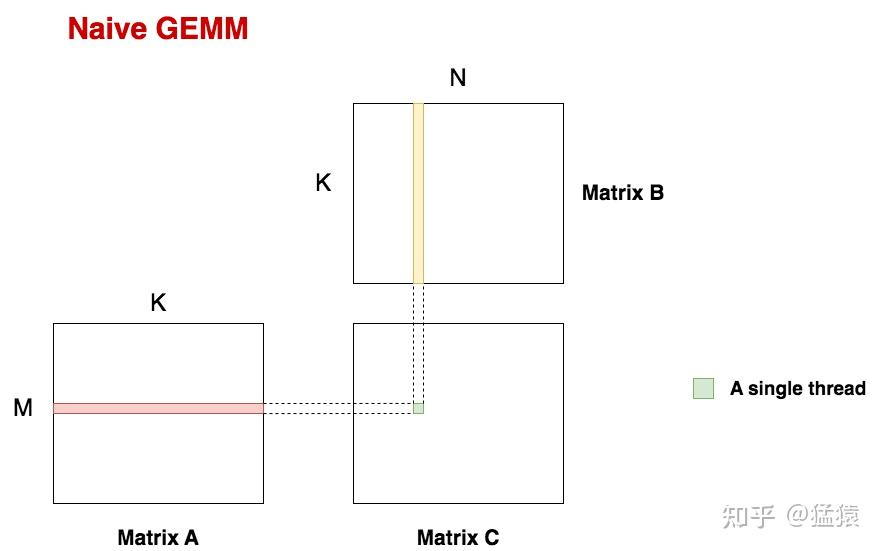
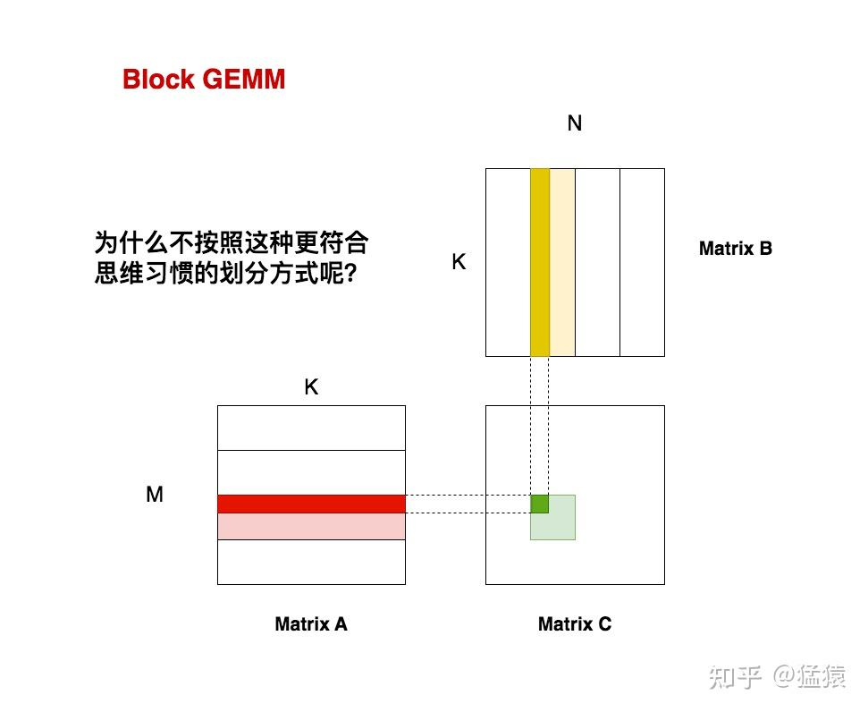
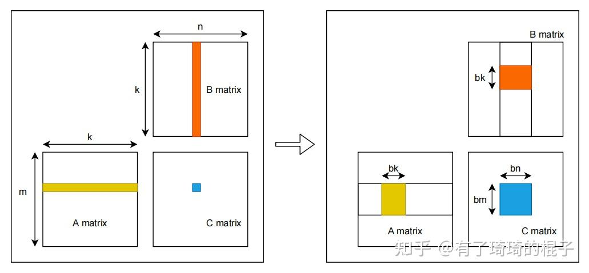
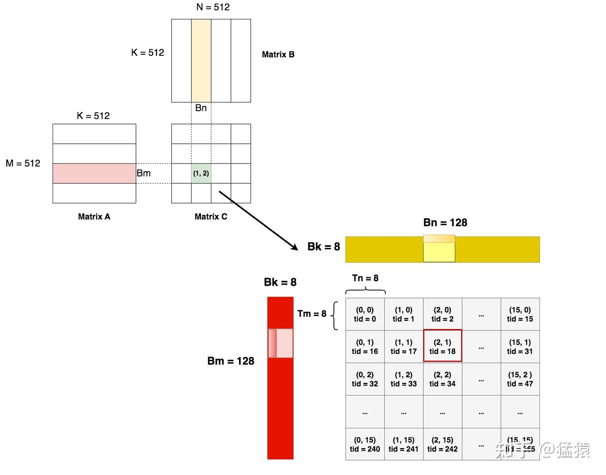
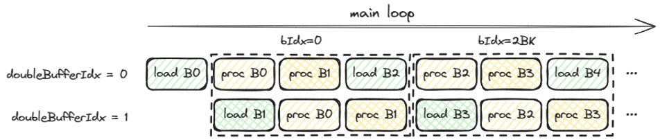
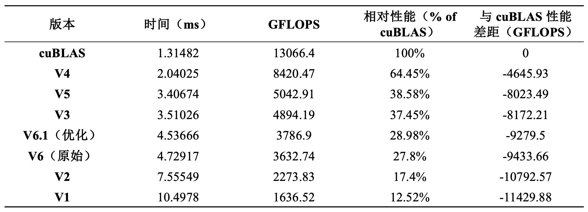

# GEMM

HPC优化的核心思想，怎么样让数据放在更近的存储上来掩盖计算的延时，从而减少存储墙的影响。<br>
计算$C = A * B$，其中A是M * K的矩阵，B是K * N的矩阵，C是M * N的矩阵，数据类型是Float32。

## V1. navie gemm
### 参数设置
const int M = 2048;<br>
const int N = 2048;<br>
const int K = 2048;


```cpp
__global__ void matrixMulGPU(float* A, float* B, float* C, int M, int N, int K) {
    int row = blockIdx.y * blockDim.y + threadIdx.y;
    int col = blockIdx.x * blockDim.x + threadIdx.x;
    float sum = 0.0f;
    
    if (row < M && col < N) {
        for (int k = 0; k < K; ++k) {
            sum += A[row * K + k] * B[k * N + col];
        }
        C[row * N + col] = sum;
    }
}
```
- 每个thread负责读取A矩阵的一行和B矩阵的一列，计算得到C矩阵的一个元素，一共需要M*N个thread；

### 性能分析
- 分析可知，线程每次计算一个c矩阵的元素，都需要从A矩阵和B矩阵中分别读取K个元素，所以从global memory中读取的次数为2K*MN，写的次数为M*N。由于在读取数据消耗了大量的时间，无法充分发挥GPU的算力。
## V2. shanred memory 
> 💡 **Note**如何确定分块数量？每一个 Block 该负责多大的矩阵乘？每一个 thread 又应该负责多大的矩阵乘？[https://zhuanlan.zhihu.com/p/688610975]<br>

> 💡 **Note**为什么沿着k维度切?<br>

如果按照这种方法切块的话，会重复读取数据。例如对于图中的一块A（高亮），它和B中的若干块对应，也就意味着A的这个分块会被重复加载若干次（和naive GEMM是一个道理）。但是如果我们竖着切A，横着切B（此时A和B都是沿着K方向切割的），这样所有的A分块和B分块都只会被加载1次。可以能帮助我们节省加载数据的时间。

```cpp
static_assert((bm * bk + bk * bn) * sizeof(float) <= 48 * 1024, "share memory is out of 48KB!");

__global__ void matrixMulGPU(float* A, float* B, float* C, int M, int N, int K) { 
    int tidx = threadIdx.x;
    int tidy = threadIdx.y;
    int row = blockIdx.y * blockDim.y + threadIdx.y;
    int col = blockIdx.x * blockDim.x + threadIdx.x;
    float sum = 0.0f;

    //define shared memory
    __shared__ float sA[bm][bk];
    __shared__ float sB[bk][bn];

    //rewrite
    //每个线程维护自己的 sum 寄存器，每轮 tile 计算贡献加到 sum 中，最后一次性把总和写回全局内存。
    for (int bk_id = 0; bk_id < K; bk_id += bk){        //for (int bk_id = 0, bk_id < K, bk_id += bk) // 错误：逗号应为分号

        if (row < M && bk_id + tidx < K){
            sA[tidy][tidx] = A[(row * K) + (bk_id + tidx)];
        } else{
            sA[tidy][tidx] = 0.0f;
        }

        if (col < N && bk_id + tidy < K){
            sB[tidy][tidx] = B[((bk_id + tidy)) * N + (col)];
        } else{
            sB[tidy][tidx] = 0.0f;
        }

        __syncthreads();

        for (int k = 0; k < bk;  ++k){
            sum += sA[tidy][k] * sB[k][tidx];
        }
        __syncthreads(); 
    }

    if (row < M && col < N) {  
        C[row * N + col] = sum;
    }
}
```

- 每次取A矩阵的一个分块（bm,bk），取B矩阵的一个分块（bk,bn），将两者相乘得到分块矩阵C（bm,bn）;
- 对A矩阵，向右找到下一个分块；对B矩阵，向下找到下一个分块，然后再相乘得到分块矩阵C，累加到上一个分块矩阵C上;
- 如此循环，当我们遍历完所有的A分块和B分块后，就可以得到最终的分块矩阵C了。也就是我们图中的高亮绿块（bm,bn）。
### 性能分析
- 性能计算
  - 计算一个尺寸为bm*bn的矩阵C，需要从global memory中读取（bm,bk）的A和（bk,bn）的B，从global memory中读取的次数为bm*bk+bk*bn,需要计算$\frac{K}{bk}$次，所以总的读取次数位K（bm+bn）;
   - 总的block数目为：$\frac{M * N}{bm * bn}$;
   - 最终的读取次数为：$MNK(\frac{1}{bm} + \frac{1}{bn})$<br>
由此与v1相比，访存量减少为$\frac{1}{2}*(\frac{1}{bn} + \frac{1}{bm})$，可知bn,bm越大时，分块情况下对global memory的读写次数越少，使得gpu相对花更多的时间在计算而不是在读数上，更有效利用gpu。
- 待优化点<br>
可以将global memory分块加载到shared memory中，那是否可以将shared memory分块加载到register中？
## V3. 一个矩阵计算多个元素

```cpp
static_assert((bm * bk + bk * bn) * sizeof(float) <= 48 * 1024, "share memory is out of 48KB!");

__global__ void matrixMulGPU(float* A, float* B, float* C, int M, int N, int K) { 
    //change the one thread calculate [1] to [1,2
    //                                        3,4]
    int tidx = threadIdx.x * size;
    int tidy = threadIdx.y * size;
    int row = blockIdx.y * size * blockDim.y + threadIdx.y * size;
    int col = blockIdx.x * size * blockDim.x + threadIdx.x * size;
    //change the float to arrays
    float sum[size][size] = {0.0f};

    __shared__ float sA[bm][bk];
    __shared__ float sB[bk][bn];

    for (int bk_id = 0; bk_id < K; bk_id += bk){   

        // Here is threadIdx.x instead of tidx
        if (row < M && bk_id + threadIdx.x < K){
            // We must put two rows data into sharemem
            sA[tidy + 0][threadIdx.x] = A[((row + 0) * K) + (bk_id + threadIdx.x)];
            sA[tidy + 1][threadIdx.x] = A[((row + 1) * K) + (bk_id + threadIdx.x)];
        }

        // Here is threadIdx.y instead of tidy
        if (bk_id + threadIdx.y < K && col < N){ //think this conditioon
            sB[threadIdx.y][tidx + 0] = B[((bk_id + threadIdx.y) * N) + (col + 0)];
            sB[threadIdx.y][tidx + 1] = B[((bk_id + threadIdx.y) * N) + (col + 1)];
        }

        __syncthreads();

        //Extract the (size*size) float data from the array separately
        for (int k = 0; k < bk;  ++k){
            float a0 = sA[tidy + 0][k];
            float a1 = sA[tidy + 1][k];
            float b0 = sB[k][tidx + 0];
            float b1 = sB[k][tidx + 1];

            sum[0][0] += a0 * b0;  //bug1: here is += instead of =
            sum[0][1] += a0 * b1;
            sum[1][0] += a1 * b0;
            sum[1][1] += a1 * b1;
        }
        __syncthreads();
    }

    if ((row + 0)  < M && (col+0) < N) C[(row + 0) * N + (col+0)] = sum[0][0];
    if ((row + 1)  < M && (col+0) < N) C[(row + 1) * N + (col+0)] = sum[1][0];
    if ((row + 0)  < M && (col+1) < N) C[(row + 0) * N + (col+1)] = sum[0][1];
    if ((row + 1)  < M && (col+1) < N) C[(row + 1) * N + (col+1)] = sum[1][1];
}
```
对于一个线程而言，它现在拥有：tm * tk个A矩阵的寄存器值，tk * tn个B矩阵的寄存器值，以及tm * tn个C矩阵的寄存器值。通过这些寄存器的值，需要计算tm * tn个数。这需要tm * tn条FFMA指令。
### 性能分析
- 由上面对global memory的分析可知，对shared memory进行分块访存量会减少$\frac{1}{2}*(\frac{1}{tn} + \frac{1}{tm})$。<br>
- 使用向量化读取
## V4. 向量化读取
> 💡 **Note** 使用float4的优点？<br>

> ❎ **warning** A矩阵不能用float4读取，因为我们这边要读取的A矩阵是四个列方向连续的元素。如果直接使用向量化读取的话，是读取的行方向！
```cpp
static_assert((bm * bk + bk * bn) * sizeof(float) <= 48 * 1024, "share memory is out of 48KB!");

__global__ void matrixMulGPU(float* A, float* B, float* C, int M, int N, int K) { 

    int tidx = threadIdx.x * size;
    int tidy = threadIdx.y * size;
    int row = blockIdx.y * size * blockDim.y + threadIdx.y * size;
    int col = blockIdx.x * size * blockDim.x + threadIdx.x * size;

    float sum[size][size] = {0.0f};

    __shared__ float sA[bm][bk];
    __shared__ float sB[bk][bn];

    // float4* A_float4 = reinterpret_cast<float4*>(A);
    float4* B_float4 = reinterpret_cast<float4*>(B);

    for (int bk_id = 0; bk_id < K; bk_id += bk) {   
          
        if (row < M && bk_id + threadIdx.x < K) {
            // A矩阵改回普通读取
            sA[tidy + 0][threadIdx.x] = A[(row + 0) * K + bk_id + threadIdx.x];
            sA[tidy + 1][threadIdx.x] = A[(row + 1) * K + bk_id + threadIdx.x];
            sA[tidy + 2][threadIdx.x] = A[(row + 2) * K + bk_id + threadIdx.x];
            sA[tidy + 3][threadIdx.x] = A[(row + 3) * K + bk_id + threadIdx.x];
        }

        if (bk_id + threadIdx.y < K && col < N) {
            // 向量化读取B矩阵数据
            float4 b_vec = B_float4[((bk_id + threadIdx.y) * N + col) / 4]; //可以想象为B矩阵的列数整体缩小为1/4
            sB[threadIdx.y][tidx + 0] = b_vec.x;
            sB[threadIdx.y][tidx + 1] = b_vec.y;
            sB[threadIdx.y][tidx + 2] = b_vec.z;
            sB[threadIdx.y][tidx + 3] = b_vec.w;
        }

        __syncthreads();

        #pragma unroll
        for (int k = 0; k < bk; ++k) {
            float a0 = sA[tidy + 0][k];
            float a1 = sA[tidy + 1][k];
            float a2 = sA[tidy + 2][k];
            float a3 = sA[tidy + 3][k];

            float4 b_reg = make_float4(sB[k][tidx + 0], //b0
                                      sB[k][tidx + 1],  //b1
                                      sB[k][tidx + 2],  //b2
                                      sB[k][tidx + 3]); //b3

            sum[0][0] += a0 * b_reg.x;
            sum[0][1] += a0 * b_reg.y;
            sum[0][2] += a0 * b_reg.z;
            sum[0][3] += a0 * b_reg.w;
            sum[1][0] += a1 * b_reg.x;
            sum[1][1] += a1 * b_reg.y;
            sum[1][2] += a1 * b_reg.z;
            sum[1][3] += a1 * b_reg.w;
            sum[2][0] += a2 * b_reg.x;
            sum[2][1] += a2 * b_reg.y;
            sum[2][2] += a2 * b_reg.z;
            sum[2][3] += a2 * b_reg.w;
            sum[3][0] += a3 * b_reg.x;
            sum[3][1] += a3 * b_reg.y;
            sum[3][2] += a3 * b_reg.z;
            sum[3][3] += a3 * b_reg.w;
        }
        __syncthreads();
    }

    if ((row + 0)  < M && (col+0) < N) C[(row + 0) * N + (col+0)] = sum[0][0];
    if ((row + 0)  < M && (col+1) < N) C[(row + 0) * N + (col+1)] = sum[0][1];
    if ((row + 0)  < M && (col+2) < N) C[(row + 0) * N + (col+2)] = sum[0][2];
    if ((row + 0)  < M && (col+3) < N) C[(row + 0) * N + (col+3)] = sum[0][3];
    if ((row + 1)  < M && (col+0) < N) C[(row + 1) * N + (col+0)] = sum[1][0];
    if ((row + 1)  < M && (col+1) < N) C[(row + 1) * N + (col+1)] = sum[1][1];
    if ((row + 1)  < M && (col+2) < N) C[(row + 1) * N + (col+2)] = sum[1][2];
    if ((row + 1)  < M && (col+3) < N) C[(row + 1) * N + (col+3)] = sum[1][3];
    if ((row + 2)  < M && (col+0) < N) C[(row + 2) * N + (col+0)] = sum[2][0];
    if ((row + 2)  < M && (col+1) < N) C[(row + 2) * N + (col+1)] = sum[2][1];
    if ((row + 2)  < M && (col+2) < N) C[(row + 2) * N + (col+2)] = sum[2][2];
    if ((row + 2)  < M && (col+3) < N) C[(row + 2) * N + (col+3)] = sum[2][3];
    if ((row + 3)  < M && (col+0) < N) C[(row + 3) * N + (col+0)] = sum[3][0];
    if ((row + 3)  < M && (col+1) < N) C[(row + 3) * N + (col+1)] = sum[3][1];
    if ((row + 3)  < M && (col+2) < N) C[(row + 3) * N + (col+2)] = sum[3][2];
    if ((row + 3)  < M && (col+3) < N) C[(row + 3) * N + (col+3)] = sum[3][3];
}
```
### 性能分析

- 向量化读取数据时，warp会采用LDS.128指令，一个warp共需取4*32 = 128个数，已经超过warp单次memory transaction允许的取数上限（通常每次最多读取 128 字节）。所以该warp会把取数过程拆成4个串行的phase（即4次串行的memory transcation）：即0～7，8～15，16～23，24～31。这时bank conflict被定义在每个phase（也就是1/4个warp之内）。
## V5. B矩阵向量化读取 + 双缓冲优化
```cpp
// 确保共享内存不超过限制 (现在需要两倍的共享内存空间用于双缓冲)
static_assert(2 * (bm * bk + bk * bn) * sizeof(float) <= 48 * 1024, "share memory is out of 48KB!");

__global__ void matrixMulGPU(float* A, float* B, float* C, int M, int N, int K) { 

    int tidx = threadIdx.x * size;
    int tidy = threadIdx.y * size;
    int row = blockIdx.y * size * blockDim.y + threadIdx.y * size;
    int col = blockIdx.x * size * blockDim.x + threadIdx.x * size;

    float sum[size][size] = {0.0f};

    // 双缓冲共享内存定义 - 为A和B矩阵各创建两个缓冲区
    __shared__ float sA[2][bm][bk];
    __shared__ float sB[2][bk][bn];

    float2* B_float2 = reinterpret_cast<float2*>(B);
    
    // 当前使用的缓冲区索引
    int bufferIdx = 0;
    
    // 预加载第一个数据块到第一个缓冲区
    if (row < M && threadIdx.x < bk) {
        sA[0][tidy + 0][threadIdx.x] = A[(row + 0) * K + threadIdx.x];
        sA[0][tidy + 1][threadIdx.x] = A[(row + 1) * K + threadIdx.x];
    }

    if (threadIdx.y < bk && col < N) {
        float2 b_vec = B_float2[(threadIdx.y * N + col) / 2];
        sB[0][threadIdx.y][tidx + 0] = b_vec.x;
        sB[0][threadIdx.y][tidx + 1] = b_vec.y;
    }
    
    __syncthreads();

    // 主循环 - 使用双缓冲策略
    for (int bk_id = 0; bk_id < K; bk_id += bk) {   
        // 下一个缓冲区索引
        int nextBufferIdx = 1 - bufferIdx;
        
        // 如果不是最后一个数据块，预加载下一个数据块到另一个缓冲区
        if (bk_id + bk < K) {
            if (row < M && threadIdx.x < bk) {
                sA[nextBufferIdx][tidy + 0][threadIdx.x] = A[(row + 0) * K + (bk_id + bk) + threadIdx.x];
                sA[nextBufferIdx][tidy + 1][threadIdx.x] = A[(row + 1) * K + (bk_id + bk) + threadIdx.x];
            }

            if (threadIdx.y < bk && col < N) {
                float2 b_vec = B_float2[((bk_id + bk + threadIdx.y) * N + col) / 2];
                sB[nextBufferIdx][threadIdx.y][tidx + 0] = b_vec.x;
                sB[nextBufferIdx][threadIdx.y][tidx + 1] = b_vec.y;
            }
        }

        // 使用当前缓冲区进行计算
        #pragma unroll
        for (int k = 0; k < bk; ++k) {
            float a0 = sA[bufferIdx][tidy + 0][k];
            float a1 = sA[bufferIdx][tidy + 1][k];

            float2 b_reg = make_float2(sB[bufferIdx][k][tidx + 0],
                                      sB[bufferIdx][k][tidx + 1]);

            sum[0][0] += a0 * b_reg.x;
            sum[0][1] += a0 * b_reg.y;
            sum[1][0] += a1 * b_reg.x;
            sum[1][1] += a1 * b_reg.y;
        }
        
        // 切换缓冲区
        bufferIdx = nextBufferIdx;
        
        // 同步以确保下一个数据块已完全加载
        __syncthreads();
    }

    if ((row + 0) < M && (col+0) < N) C[(row + 0) * N + (col+0)] = sum[0][0];
    if ((row + 0) < M && (col+1) < N) C[(row + 0) * N + (col+1)] = sum[0][1];
    if ((row + 1) < M && (col+0) < N) C[(row + 1) * N + (col+0)] = sum[1][0];
    if ((row + 1) < M && (col+1) < N) C[(row + 1) * N + (col+1)] = sum[1][1];
}
```

- 双缓冲
   - __shared__ float sA[2][bm][bk];<br>
    __shared__ float sB[2][bk][bn]; <br>
    使用两个 buffer 来预加载下一块数据，避免等待时间
- 预加载
    - 预加载第一块数据到共享内存
    - 使用 float2 向量化方式读取 B 矩阵，每次读取两个浮点数
- 分块计算
    - 预加载下一个数据块至另一个缓冲区
    - 当前缓冲区进行矩阵乘计算
    - 切换缓冲区
### 性能分析
取矩阵B需要取一个列向量，而矩阵B在Shared Memory中是按行存储的，加载的这个列向量上的数据，全在一个bank上，所以会导致bank conflict。

## V6. 共享内存bank冲突优化
bank conflict是针对一个warp内的threads定义的。不同的warp间不存在bank conflict这个概念。
下面是两个实现，第一个是与v5一样的tile size和寄存器复用，第二个好似更大的tile size和更多的寄存器复用。
```cpp
// 添加padding以避免bank冲突
#define PADDING 1

// 确保共享内存不超过限制 (现在需要两倍的共享内存空间用于双缓冲)
static_assert(2 * (bm * (bk+PADDING) + (bk+PADDING) * bn) * sizeof(float) <= 48 * 1024, "share memory is out of 48KB!");

__global__ void matrixMulGPU(float* A, float* B, float* C, int M, int N, int K) { 

    int tidx = threadIdx.x * size;
    int tidy = threadIdx.y * size; 
    int row = blockIdx.y * size * blockDim.y + threadIdx.y * size;
    int col = blockIdx.x * size * blockDim.x + threadIdx.x * size;

    float sum[size][size] = {0.0f};

    // 双缓冲共享内存定义 - 为A和B矩阵各创建两个缓冲区，添加padding以避免bank冲突
    __shared__ float sA[2][bm][bk+PADDING];
    __shared__ float sB[2][bk][bn+PADDING];

    float2* B_float2 = reinterpret_cast<float2*>(B);
    
    // 当前使用的缓冲区索引
    int bufferIdx = 0;
    
    // 预加载第一个数据块到第一个缓冲区
    if (row < M && threadIdx.x < bk) {
        sA[0][tidy + 0][threadIdx.x] = A[(row + 0) * K + threadIdx.x];
        sA[0][tidy + 1][threadIdx.x] = A[(row + 1) * K + threadIdx.x];
    }

    if (threadIdx.y < bk && col < N) {
        float2 b_vec = B_float2[(threadIdx.y * N + col) / 2];
        sB[0][threadIdx.y][tidx + 0] = b_vec.x;
        sB[0][threadIdx.y][tidx + 1] = b_vec.y;
    }
    
    __syncthreads();

    // 主循环 - 使用双缓冲策略
    for (int bk_id = 0; bk_id < K; bk_id += bk) {   
        // 下一个缓冲区索引
        int nextBufferIdx = 1 - bufferIdx;
        
        // 如果不是最后一个数据块，预加载下一个数据块到另一个缓冲区
        if (bk_id + bk < K) {
            if (row < M && threadIdx.x < bk) {
                sA[nextBufferIdx][tidy + 0][threadIdx.x] = A[(row + 0) * K + (bk_id + bk) + threadIdx.x];
                sA[nextBufferIdx][tidy + 1][threadIdx.x] = A[(row + 1) * K + (bk_id + bk) + threadIdx.x];
            }

            if (threadIdx.y < bk && col < N) {
                float2 b_vec = B_float2[((bk_id + bk + threadIdx.y) * N + col) / 2];
                sB[nextBufferIdx][threadIdx.y][tidx + 0] = b_vec.x;
                sB[nextBufferIdx][threadIdx.y][tidx + 1] = b_vec.y;
            }
        }

        // 使用当前缓冲区进行计算
        #pragma unroll
        for (int k = 0; k < bk; ++k) {
            float a0 = sA[bufferIdx][tidy + 0][k];
            float a1 = sA[bufferIdx][tidy + 1][k];

            float2 b_reg = make_float2(sB[bufferIdx][k][tidx + 0],
                                      sB[bufferIdx][k][tidx + 1]);

            sum[0][0] += a0 * b_reg.x;
            sum[0][1] += a0 * b_reg.y;
            sum[1][0] += a1 * b_reg.x;
            sum[1][1] += a1 * b_reg.y;
        }
        
        // 切换缓冲区
        bufferIdx = nextBufferIdx;
        
        // 同步以确保下一个数据块已完全加载
        __syncthreads();
    }

    if ((row + 0) < M && (col+0) < N) C[(row + 0) * N + (col+0)] = sum[0][0];
    if ((row + 0) < M && (col+1) < N) C[(row + 0) * N + (col+1)] = sum[0][1];
    if ((row + 1) < M && (col+0) < N) C[(row + 1) * N + (col+0)] = sum[1][0];
    if ((row + 1) < M && (col+1) < N) C[(row + 1) * N + (col+1)] = sum[1][1];
}

// 添加一个新的优化版本，使用更大的tile size和更多的寄存器复用
__global__ void matrixMulGPU_optimized(float* A, float* B, float* C, int M, int N, int K) { 

    int tidx = threadIdx.x * size;
    int tidy = threadIdx.y * size;
    int row = blockIdx.y * size * blockDim.y + threadIdx.y * size;
    int col = blockIdx.x * size * blockDim.x + threadIdx.x * size;

    // 使用寄存器数组存储计算结果
    float sum[size][size] = {0.0f};
    float reg_a[size];
    float2 reg_b;

    // 双缓冲共享内存定义 - 为A和B矩阵各创建两个缓冲区，添加padding以避免bank冲突
    __shared__ float sA[2][bm][bk+PADDING];
    __shared__ float sB[2][bk][bn+PADDING];

    float2* B_float2 = reinterpret_cast<float2*>(B);
    
    // 当前使用的缓冲区索引
    int bufferIdx = 0;
    
    // 预加载第一个数据块到第一个缓冲区
    if (row < M && threadIdx.x < bk) {
        sA[0][tidy + 0][threadIdx.x] = A[(row + 0) * K + threadIdx.x];
        sA[0][tidy + 1][threadIdx.x] = A[(row + 1) * K + threadIdx.x];
    }

    if (threadIdx.y < bk && col < N) {
        float2 b_vec = B_float2[(threadIdx.y * N + col) / 2];
        sB[0][threadIdx.y][tidx + 0] = b_vec.x;
        sB[0][threadIdx.y][tidx + 1] = b_vec.y;
    }
    
    __syncthreads();

    // 主循环 - 使用双缓冲策略
    for (int bk_id = 0; bk_id < K; bk_id += bk) {   
        // 下一个缓冲区索引
        int nextBufferIdx = 1 - bufferIdx;
        
        // 如果不是最后一个数据块，预加载下一个数据块到另一个缓冲区
        if (bk_id + bk < K) {
            if (row < M && threadIdx.x < bk) {
                sA[nextBufferIdx][tidy + 0][threadIdx.x] = A[(row + 0) * K + (bk_id + bk) + threadIdx.x];
                sA[nextBufferIdx][tidy + 1][threadIdx.x] = A[(row + 1) * K + (bk_id + bk) + threadIdx.x];
            }

            if (threadIdx.y < bk && col < N) {
                float2 b_vec = B_float2[((bk_id + bk + threadIdx.y) * N + col) / 2];
                sB[nextBufferIdx][threadIdx.y][tidx + 0] = b_vec.x;
                sB[nextBufferIdx][threadIdx.y][tidx + 1] = b_vec.y;
            }
        }

        // 使用当前缓冲区进行计算，增加寄存器复用
        #pragma unroll
        for (int k = 0; k < bk; ++k) {
            // 预加载数据到寄存器
            reg_a[0] = sA[bufferIdx][tidy + 0][k];
            reg_a[1] = sA[bufferIdx][tidy + 1][k];
            reg_b = make_float2(sB[bufferIdx][k][tidx + 0], sB[bufferIdx][k][tidx + 1]);

            // 计算矩阵乘法
            sum[0][0] += reg_a[0] * reg_b.x;
            sum[0][1] += reg_a[0] * reg_b.y;
            sum[1][0] += reg_a[1] * reg_b.x;
            sum[1][1] += reg_a[1] * reg_b.y;
        }
        
        // 切换缓冲区
        bufferIdx = nextBufferIdx;
        
        // 同步以确保下一个数据块已完全加载
        __syncthreads();
    }

    // 写回结果
    if ((row + 0) < M && (col+0) < N) C[(row + 0) * N + (col+0)] = sum[0][0];
    if ((row + 0) < M && (col+1) < N) C[(row + 0) * N + (col+1)] = sum[0][1];
    if ((row + 1) < M && (col+0) < N) C[(row + 1) * N + (col+0)] = sum[1][0];
    if ((row + 1) < M && (col+1) < N) C[(row + 1) * N + (col+1)] = sum[1][1];
}
```
## cuBlas
```cpp
/////////////gemm的gpu实现(cublas版本)////////////////////
//编译时需要链接cublas库 nvcc -o cublas gemmcublas.cu -lcublas
#include <cuda_runtime.h>
#include <iostream>
#include <cstdlib>
#include <cublas_v2.h> //引入cublas计算库

const int M = 2048;
const int N = 2048;
const int K = 2048;


int main() {
    float *h_A = new float[M * K];
    float *h_B = new float[K * N];
    float *h_C = new float[M * N];
    
    for (int i = 0; i < M * K; ++i) {
        h_A[i] = i;
    }
    for (int i = 0; i < K * N; ++i) {
        h_B[i] = i;
    }

    float *d_A, *d_B, *d_C;
    cudaMalloc(&d_A, M * K * sizeof(float));
    cudaMalloc(&d_B, K * N * sizeof(float));
    cudaMalloc(&d_C, M * N * sizeof(float));

    cudaMemcpy(d_A, h_A, M * K * sizeof(float), cudaMemcpyHostToDevice);
    cudaMemcpy(d_B, h_B, K * N * sizeof(float), cudaMemcpyHostToDevice);

    // 初始化cuBLAS
    cublasHandle_t handle; //这是cuBLAS库的上下文句柄，用于管理资源（如流、内存）和状态（如数学模式）。所有cuBLAS函数调用都需要通过此句柄。
    cublasCreate(&handle); //初始化cuBLAS库，分配资源并返回一个句柄。固定写法 ，通常在程序开始时调用一次。

    // 设置alpha和beta参数（C = alpha * A * B + beta * C）
    const float alpha = 1.0f;
    const float beta = 0.0f;

    cudaEvent_t start, stop;
    cudaEventCreate(&start);
    cudaEventCreate(&stop);
    cudaEventRecord(start, 0);

    /////////////////////////////////////////cubalsSgemm函数原型/////////////////////////////////////
    //     cublasStatus_t cublasSgemm(
    //     cublasHandle_t handle,                                //1.上下文句柄
    //     cublasOperation_t transa, cublasOperation_t transb,   //2.3.是否转置矩阵A和B：CUBLAS_OP_N=不转置，CUBLAS_OP_T=转置
    //     int m, int n, int k,                                  //4.5.6. m n k分配对应 C(m,n) = alpha * A(m,k) * B(k,n) + beta * C(m,n)
    //     const float *alpha,                                   //7. 缩放因子alpha
    //     const float *A, int lda,  //8.矩阵A(m,k)(必须为指向GPU内存的指针), 9.int lda:矩阵A的主维度（行优先时为列数，列优先时为行数）我们这里输入K
    //     const float *B, int ldb,  //10.矩阵B(k,n)  11.int ldb:矩阵B的主维度,由于我们想让它以行优先存储，因此这里输入它的列数 N
    //     const float *beta,                                    //12. 缩放因子beta
    //     float *C, int ldc         //13.矩阵C(m,n)  14.int ldc:矩阵C的主维度,由于我们想让它以行优先存储，因此这里输入它的列数 N
    //      );
    /////////////////////////////////////////cubalsSgemm函数原型/////////////////////////////////////

    //注意：cuBLAS假设矩阵按列优先存储！如果代码中是行优先的数据(例如C/C++)，则可以通过以下两种方式转换cuBLAS为行优先
    //     1.交换矩阵A和B的顺序并转置。（这个方法有点麻烦）
    //     2.调整主维度（lda/ldb/ldc）主维度是矩阵在内存中的行数（行优先）或列数（列优先）。
    ////我们这个代码中是采用的方法2！！！！！！！！


    // 调用cubalsgemm函数
    for (int i = 0; i < 200; ++i){
        cublasSgemm(handle, CUBLAS_OP_N, CUBLAS_OP_N,
            M, N, K, &alpha, d_A, K, d_B, N, &beta, d_C, N);
    }

    cudaEventRecord(stop, 0);
    cudaEventSynchronize(stop);
    float milliseconds = 0;
    cudaEventElapsedTime(&milliseconds, start, stop);
    milliseconds /= 200;
    std::cout << "cuBlLAS矩阵乘法时间: " << milliseconds << "毫秒" << std::endl;

    double flops = 2.0 * M * N * K;
    double gflops = flops / (milliseconds/1000 * 1e9);
    std::cout << "GFLOPS: " << gflops << std::endl;

    cudaMemcpy(h_C, d_C, M * N * sizeof(float), cudaMemcpyDeviceToHost);
    std::cout << "C[0][0] = " << h_C[0] << std::endl;
    
    // 清理掉cuBLAS
    cublasDestroy(handle); // 释放cublas资源（程序结束前调用）

    cudaFree(d_A);
    cudaFree(d_B);
    cudaFree(d_C);

    delete[] h_A;
    delete[] h_B;
    delete[] h_C;

    return 0;
    // cuBlLAS矩阵乘法时间: 1.31482毫秒
    // GFLOPS: 13066.4
    // C[0][0] = 5.85977e+12
}
```
- 使用cublas时没有对矩阵进行转置，转置后性能比这个稍差
    - 原因：1. cuBLAS 以列为主访存，导致访存不连续（非 coalesced），性能下降<br>
          2. GPU L2/L1 cache 命中率下降<br>
           3. warp 级别的访存未对齐

 
## 性能对比

1. [https://zhuanlan.zhihu.com/p/410278370] -CUDA 矩阵乘法终极优化指南
2. [https://zhuanlan.zhihu.com/p/435908830] - 深入浅出GPU优化系列：GEMM优化(一)
3. [https://zhuanlan.zhihu.com/p/703256080] -从啥也不会到CUDA GEMM优化
4. [https://blog.csdn.net/LostUnravel/article/details/138034380] -[CUDA 学习笔记] 如何优化 CUDA 矩阵乘内核以获得类似 cuBLAS 的性能: 工作日志