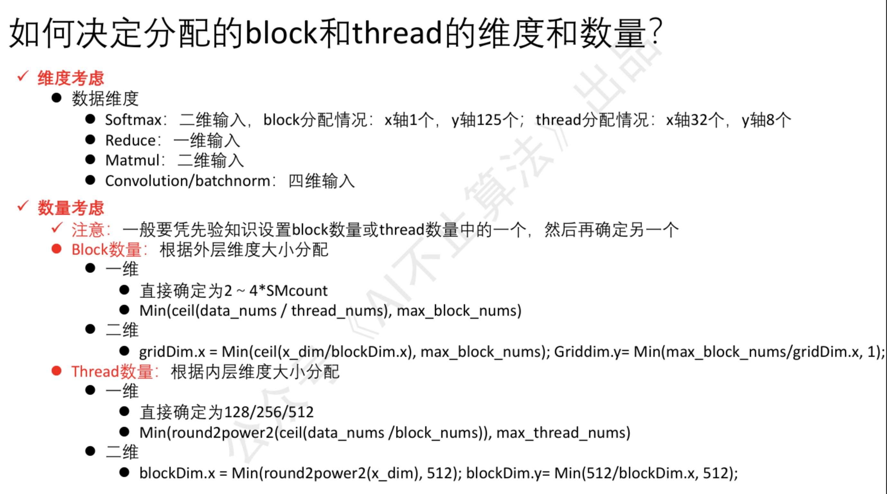

# Interview

## 一. C++
C++是基础，会在面试校招生和社招两年内时考察。

### 1. 堆和栈的区别？
1. 管理方式：栈由编译器管理，堆由程序员手动管理；
2. 碎片问题：栈不存在碎片问题，堆很容易产生碎片；
3. 分配方式：栈是编译器自动分配的，堆是(new,delete/malloc,free)分配。
4. 分配效率：栈的效率比堆高；

### 2. 以下四行代码会调用到什么函数？
// A是一个C++类
A a1(1); //构造函数
A a2(2); //构造函数
a2 = a1; // 拷贝赋值，operator=
A a3 = a1; //拷贝构造函数（使用已经初始化的对象a1去初始化一个没有初始化过的对象a3，符合拷贝构造函数定义）

### 3. C++类的拷贝构造函数有哪几种调用场景？
1. 对象作为函数的参数，以值传递的方式传入函数体；（扩展，当拷贝构造函数的参数不是引用类型(const MyClass& other)，而是值类型(MyClass other)的时候，可能存在**循环调用拷贝构造函数的情况，造成栈溢出**）
```cpp
void foo(MyClass obj);   // obj 需要拷贝构造
MyClass a;
foo(a);  // 调用拷贝构造函数
```
2. 对象作为函数返回值，以值传递的方式从函数返回；（扩展，现代编译器会采用RVO(return value optimization)**返回值优化**来避免拷贝构造）
```cpp
MyClass foo() {
    MyClass obj;
    return obj;  // 返回值需要拷贝构造（可能被 RVO/NRVO 优化掉）
}
```
3. 对象需要通过另外一个未初始化过的对象进行初始化；（如上2.题中的第四个函数）

#### 3.1 C++中如何访问类的私有成员？
1. 友元函数
2. 通过目标类的成员函数访问
```cpp
#include <iostream>

class MyClass {
private:
    int privateData;
public:
    // 构造函数
    MyClass(int data) : privateData(data) {}

    // 2.类的访问器函数，可获取私有成员的值
    int getPrivateData() const {
        return privateData;
    }
    // 1.友元函数
    friend int accessPrivate(MyClass& obj);       
};

int accessPrivate(MyClass& obj) {
    return obj.privateData;
}

int main() {
    MyClass obj(42);

    obj.privateData //❌ 私有变量无法被直接访问
    std::cout << "Private data: " << obj.getPrivateData() << std::endl;//✅ 可通过类的成员函数访问
    std::cout << "Private data: "  << accessPrivate(obj) << std::endl;//✅ 可通过友元函数访问
    return 0;
}
```

### 4.哪些函数不能是虚函数？
答出两三个常见的即可，并说明为什么不能是虚函数。

虚函数的本质是通过 **虚函数表指针（vptr）+ 虚函数表（vtable）** 实现的多态；属于运行时阶段(runtime)而非编译时阶段(compile time)；虚函数必须是类的成员函数

1. **静态成员函数**：静态成员函数属于类本身，而不属于类的任何对象，没有this指针，无法实现多态；（扩展，**静态二字表面其在编译器阶段已经确定**，无法在运行时动态绑定）
2. **构造函数**（析构函数是不是虚函数？可以是）：对象创建过程中，虚函数表指针vptr还未初始化，无法实现动态绑定；（扩展，如果类要作为基类并被多态使用 → 析构函数一定要是虚函数（因为它要对父类和子类同时析构）；如果不作为基类则不需要。）
3. **友元函数**：友元函数不是类的成员函数，它只是被授予了访问类的私有成员的权限；
4. **内联函数**：同静态一样，内联函数在编译器阶段已经确定；

扩展：**虚函数和纯虚函数的区别**：虚函数是基类中用 virtual 修饰的函数，可以有函数体，子类可以选择是否重写override。**纯虚函数**是用 =0 定义的虚函数，没有函数体，**要求子类必须override实现**。

### 5. unique_ptr、shared_ptr、auto_ptr的区别？
1. unique_ptr：不支持拷贝，只支持指针所有权的转移；
2. shared_ptr：支持拷贝，内部有引用计数，最后一个 shared_ptr 析构时才释放资源；
3. auto_ptr：拷贝或赋值时，所有权会转移，被赋值的一方失去所有权，置为 nullptr。（**C++11已弃用**）


```cpp
#include <iostream>
#include <memory>

// 1. unique ptr
int main() {
    std::unique_ptr<int> ptr1;
    ptr1.reset(new int(42)); //或者std::unique_ptr<int> ptr1(new int(42)); 因为unique_ptr 的构造函数接受裸指针，但赋值必须用 reset 或初始化。
    std::unique_ptr<int> ptr2;
    ptr2 = ptr1; //❌ unique_ptr不支持拷贝
    ptr2 = std::move(ptr1); //✅ 指针的所有权随之转移 print ptr1.get()会得到 nullptr
    return 0;
}


// 2. shared ptr
int main() {
    std::unique_ptr<int> ptr1(new int(43));
    std::shared_ptr<int> ptr2;
    ptr2 = ptr1 //✅ 引用计数+1，ptr1.use_count() == ptr2.use_count() == 2
    return 0；
}
```

### 6.四种强制类型转换是什么？它们的区别？
1. **const_cast**：去掉或添加 const / volatile 限定。
2. **static_cast**：基本类型转换（**上、下行转换都可用**），但使用它实现父类转子类(下行转换)不太安全。（扩展，如果程序员可以确认该父类转子类是安全的情况下，优先用static_cast比dynamic_cast性能更佳）
3. **dynamic_cast**：仅用于**下行转换**，**安全**，失败返回 nullptr。
4. **reinterpret_cast**：用于底层类型之间的转换，例如float=>float4。

**注意：上行转换是绝对安全的**

```cpp
#include <iostream>

// 定义父类
class Shape {};

// 定义子类
class Circle : public Shape {};

int main() {
    Circle circle;// 创建子类对象

    // 向上转换：子类指针转换为父类指针，绝对安全。
    Shape* shapePtr = &circle; //不需要显式写，编译器会自动优化为 Shape* shapePtr = static_cast<Shape*>(&circle); 

    // 向下转换：父类指针转换为子类指针，程序员确保安全时可用static_cast，开销小；
    Circle* circlePtr = static_cast<Circle*>(shapePtr);

    // 向下转换：父类指针转换为子类指针，程序员无法确保安全时可用dynamic_cast，开销大；
    Circle* circlePtr = dynamic_cast<Circle*>(shapePtr);

    return 0;
}
```

### 7.const和constexper的区别？
1. const只表示**只读语义**，constexpr表示**常量语义**；
2. constexpr用作修饰编译期常量，可以在编译期提前处理以减少runtime时间；可广泛用于模版参数（因为模版参数是要在编译期确定的）
```cpp
const int a = 1 + 1;  //它是变量，在runtime时计算得出，不可传入模版参数
constexpr int b = 1 + 1; //它是常量，在编译期即可被编译器算出确定，可传入模版参数
```

### 8. shared_ptr中的引用计数用什么数据结构实现？可以用static变量来实现吗？为什么？
int*

不能！

**static修饰的变量属于类所有**，而每个shared_ptr的是同一类的不同对象，如果采用static修饰，则不同的shared_ptr的引用计数都是同一个变量，会导致计数错误。见如下例子

```cpp
shared_ptr<int> ptr1(new int(42)); //ptr1是shared_ptr类的一个对象
shared_ptr<int> ptr2(new int(43)); //同理，ptr2是shared_ptr类的另一个对象
shared_ptr<int> ptr3;

ptr3 = ptr2; //此时ptr3的引用计数 == ptr2的引用计数 == 2，ptr1的引用计数为1

//如果采用static变量来实现shared_ptr的引用计数，则ptr1、ptr2、ptr3的引用计数都是同一个变量，都为2，ptr1计数错误了。

```

### 9. shared_ptr中的引用计数可以用int类型吗？如果可以，下面的代码会发生什么？
```cpp
class shared_ptr {
    int count; //如果这里用int类型
}

shared_ptr<T> a = make_shared<T>(1); //此时a的计数为1
shared_ptr<T> b = a; //此时b的计数为2（拷贝构造函数在a的引用计数器上+1 = b的计数），a的计数还为1，但是a本该也为2
shared_ptr<T> c = a; //同理c的计数为2，a的计数为1，但是a本该也为2 
```
以上代码如果使用正确的int*,则可正确计数。因为**int*是指针，指向同一块空间，b、c计数改变时，它们的计数器为同一块buffer，a也会更着同时变化的**。


### 10. 以下代码可以如何优化？这是什么优化原理？（RAII）
我们想让编译器自动释放一些资源，这样可以让我们不用手动释放资源，避免资源泄露。

这就用到了RAII（Resource Acquisition Is Initialization）特性：在main函数中将对象初始化为一个局部变量，在使用完成后编译器会自动调用对象的析构函数，从而释放资源。

```cpp
#include <iostream>
#include <memory>

class Resource {
public:
    // 构造函数
    Resource() {
        std::cout << "Resource acquired." << std::endl;
    }

    // 析构函数
    ~Resource() {
        std::cout << "Resource released." << std::endl;
    }

    void use() {
        std::cout << "Using the resource." << std::endl;
    }
};

int main() {
    // 初始化局部变量
    Resource r = Resource();

    // 使用 resource 对象
    r.use();

    // main 函数结束时，resource 对象的生命周期结束，其析构函数会被自动调用
    // 这将释放 Resource 对象所占用的资源

    return 0;
}
//输出
//Resource acquired.
//Using the resource.
//Resource released.

```

### 11. 多个if else下都是高度重复的代码，并且调用了大量的函数参数，可以如何简化这段代码？
```cpp
void TestFun()
{
    int a, b, c;
    .....   // 巴拉巴拉的一堆变量

    if (条件1)
    {
        // 除了几个变量不同外都是相同的代码块
        // 其中使用a、b、c....一堆变量
        func(a,b,c,d,e,f,g...)
    }
    if (条件2）
    {
        // 除了几个变量不同外都是相同的代码块
        // 其中使用a、b、c....一堆变量
    }
    if (条件3)
    {
        // 除了几个变量不同外都是相同的代码块        // 其中使用a、b、c....一堆变量
    }
}
```
答：lambda表达式
```cpp
#include <iostream>
using namespace std;

void TestFun()
{
    int a = 10, b = 20, c = 30;   // 公共变量
    int d = 40, e = 50;           // 公共变量

    // 定义一个 lambda，把重复的代码放在里面
    auto lambdaFun = [&](int param) {
        // 这里可以直接用外部变量 a,b,c,d,e（因为我们用 & 捕获了） ！！！！！！只写特殊变量param即可
        cout << "a+b+c = " << (a + b + c) << endl;
        cout << "d*e   = " << (d * e) << endl;

        // 只有 param 是不同的
        cout << "param = " << param << endl;
    };

    // 不同条件下，只传不同的参数
    bool 条件1 = true;
    bool 条件2 = false;
    bool 条件3 = true;

    if (条件1) {
        lambdaFun(100);   // param1
    }
    if (条件2) {
        lambdaFun(200);   // param2
    }
    if (条件3) {
        lambdaFun(300);   // param3
    }
}
//输出
a+b+c = 60
d*e   = 2000
param = 100

a+b+c = 60
d*e   = 2000
param = 300
```

### 12. 模版函数有哪些编译方式？哪个更好？
一体化编译会增加编译时间，分离式编译会多次重复显式实例化，且多个cpp可能实例化同一模板造成维护困难；前者可能造成可执行文件膨胀（由于每个cpp文件都会导入.h头文件，头文件中由于已经实例化因此会造成重复代码的导入）。

但仍然一般**推荐一体化编译**

1. **一体化编译** ：模板类或函数的 声明 + 定义都放在头文件。调用时**编译器能直接看到完整定义，从而实例化**。最常见的方式，C++STL、NV的cutlass 等很多组件都是这样。
```cpp
// MyTemplate.h
template<typename T>
T add(T a, T b);

T add(T a, T b) {
    return a + b;
}
```

2. **分离式编译**：模板的 声明放在 .h，定义放在 .cpp。因为编译器在看到 .h 时并不知道 **.cpp 里的定义，所以必须显式实例化**需要的类型，否则会报链接错误。
```cpp
// MyTemplate.h
template<typename T>
T add(T a, T b);

// MyTemplate.cpp
#include "MyTemplate.h"
template<typename T>
T add(T a, T b) { return a + b; }

// 显式实例化
template int add<int>(int, int);
template double add<double>(double, double);
```

### 13. 模板实例化、特例化、偏特化的概念？
1. 模板实例化：编译器在看到具体类型时，根据模板生成对应的具体函数或类。
```cpp
// 函数模板
template <typename T>
T add(T a, T b) { return a + b; }

int main() {
    add(1, 2);       // 隐式实例化 -> 生成 add<int>(int, int)
    add(1.1, 2.2);   // 隐式实例化 -> 生成 add<double>(double, double)

    // 显式实例化
    template int add<int>(int, int);
}

```
2. 模板特例化：为某个特定类型提供完全不同的实现，覆盖原有的通用模板。
```cpp
// 通用模板
template <typename T>
class Printer {
public:
    void print(T val) { std::cout << val << std::endl; }
};

// 特例化：char* 的打印方式不同
template <>
class Printer<char*> {
public:
    void print(char* val) { std::cout << "C-string: " << val << std::endl; }
};
```
3. 模板偏特化：不是针对某一个完全确定的类型，而是针对 一类类型模式 提供特殊实现。

**部分参数特化**（个数上的偏特化）
```cpp
#include <iostream>

// 原始的模板定义
template <typename T1, typename T2>
class MyTemplate {
public:
    void print() {
        std::cout << "General template" << std::endl;
    }
};

// 部分参数偏特化，对第二个参数特化为 int 类型
template <typename T1>
class MyTemplate<T1, int> {
public:
    void print() {
        std::cout << "Partial specialization with T2 = int" << std::endl;
    }
};

int main() {
    MyTemplate<double, char> obj1;
    obj1.print(); // 调用通用模板的 print 函数

    MyTemplate<double, int> obj2;
    obj2.print(); // 调用部分特化模板的 print 函数

    return 0;
}
```

**参数范围的偏特化**（范围上的偏特化）
```cpp
#include <iostream>

// 原始的模板定义
template <typename T>
class MyTemplate {
public:
    void print() {
        std::cout << "General template" << std::endl;
    }
};

// 类型范围偏特化，对指针类型进行特化
template <typename T>
class MyTemplate<T*> {
public:
    void print() {
        std::cout << "Partial specialization for pointer types" << std::endl;
    }
};

int main() {
    MyTemplate<int> obj1;
    obj1.print(); // 调用通用模板的 print 函数

    int num = 10;
    MyTemplate<int*> obj2(&num);
    obj2.print(); // 调用指针类型偏特化模板的 print 函数

    return 0;
}
```

### 14. 使用模版来实现一个斐波那契数列（看看就好）
这个是个模版元函数的典型例子，利用了模版的递归性
```cpp
#include <iostream>
using namespace std;

// 1.使用static确保生成的value是属于整个类Fibonacci，而非某个对象，因此该类的所有成员可以直接访问无需每个对象都初始化这个变量
// 2.使用constexpr， 最终结果 55 在编译期就能算出来，运行时只是打印
template<int N>
struct Fibonacci {
    static constexpr int value = Fibonacci<N - 1>::value + Fibonacci<N - 2>::value;
};

template<>
struct Fibonacci<1> {
    static constexpr int value = 1;
};

template<>
struct Fibonacci<0> {
    static constexpr int value = 0;
};

int main() {
    const int result = Fibonacci<10>::value;
    cout << result << endl;
    return 0;
}
```

### 15.以下代码会调用哪些函数？讲讲C++的右值有哪些？
cpp中右值 (rvalue) 指的是：**不能出现在赋值语句左边的值**。
右值有两种类型，纯右值和将亡值。
1. **纯右值**：字面值（例：0、1、2），表达式（例：x+y），返回的对象
2. **将亡值**：属于对象，但即将被销毁，可以“窃取资源”。例如 std::move(a)、 static_cast<A&&>(a)中的a（对应下方代码的o = std::move(obj)中的obj）。

```cpp
class BigObj {
public:
    explicit BigObj(size_t length)
        : length_(length), data_(new int[length]) {
    }

    // 析构
    ~BigObj() {
     if (data_ != NULL) {
       delete[] data_;
        length_ = 0;
     }
    }

    // 拷贝构造函数
    BigObj(const BigObj& other) = default;

    // 赋值运算符
    BigObj& operator=(const BigObj& other) = default;

    // 移动构造函数
    BigObj(BigObj&& other) : data_(nullptr), length_(0) {
        data_ = other.data_;
        length_ = other.length_;
        //移动构造函数后，没有将原对象回复默认值
    }
    
    // 移动赋值函数
    BigObj& operator=(BigObj&& other) noexcept {
    if (this != &other) {
        delete[] data_;
        data_ = other.data_;
        length_ = other.length_;
        other.data_ = nullptr;
        other.length_ = 0;
    }
    return *this;
}


private:
    size_t length_;
    int* data_;
};

BigObj func(int a, int b){
}//RVO

int main() {
   BigObj obj(1000); //构造函数
   BigObj o; //构造函数

   {
    o = std::move(obj); //移动赋值（因为o已经被创建了，因此这里不是拷贝构造函数），将obj转为右值
   }//析构o对象
   //{}表示一个作用域，离开这个作用域o马上就会被析构

   return 0;//析构ocj对象
}
```


## 二. 操作系统
这一块纯八股，知道操作系统调度算法、进程线程和虚拟物理地址即可

### 16.为什么要有虚拟地址？物理地址和虚拟地址的区别？
举个例子说明：

比如，单片机，它只有物理地址没有虚拟地址，因此如果单片机上有程序，我继续输入新的程序就会把就程序给cover掉。它没有内存抽象等的保护因此会出现这种情况，因此催生出来虚拟地址。

1. **内存抽象**：虚拟地址为程序提供了一个**抽象的内存环境**，使得程序在运行时不需要考虑物理内存地址；**程序使用的是逻辑地址，由操作系统映射到物理地址**。
2. **内存空间扩展**：通过虚拟地址技术，操作系统可以提供比物理内存更大的虚拟内存空间；这使得多个程序可以并行，每个程序拥有独属于自己的一块内存。
3. **内存保护**：**不同进程拥有不同的虚拟地址空间**，一个进程的代码和数据不能访问另一个进程的，确保了相互隔离和安全。
4. **内存管理**：操作系统可以通过分页(page)或分段(Segmentation)技术来动态的实现内存的分配和回收，提升内存利用率。

### 16.1 既然虚拟内存地址要比物理内存空间要大，那岂不是会出现物理内存不够用的情况？如何解决？
当物理内存不足时，操作系统会使用**页置换（Page Replacement）**的方法将一些不常用的内存从物理内存移动到磁盘上的交换区 (Swap) 中，腾出空间。

当这些页再次被访问时，会发生缺页中断 (Page Fault)，再把它们从磁盘加载回内存。

常见算法：

- FIFO (先进先出)：最先进入内存的页最先被换出；
- **LRU (最近最少使用)**：优先换出最长时间没被访问的页（扩展：大模型推理里面比如说kvcache等也会使用LRU进行管理）；
- LFU (最少使用频率)：优先换出使用次数最少的页。

**LRU的Leetcode一定要做，考的概率很大**

### 17. 进程和线程的区别？
**进程是操作系统资源分配的基本单位，线程是CPU调度的基本单位。**
- 进程每个进程有自己独立的虚拟地址空间、代码段、数据段和堆栈。切换开销大、通信复杂，但更稳定，适合高隔离场景；
- 同一进程内的线程共享进程的地址空间和资源，但各自有独立的栈和寄存器。切换开销小、通信简单，但容易互相影响，适合高并发计算场景。


## 三. AI-HPC基础

### 18. FP32、FP16、BF16三者在IEEE754标准下的区别？
| 类型  | 总位数 | 符号位 | 指数位 | 尾数位 | 指数偏置 | 范围 | 典型应用场景 |
|-------|--------|--------|--------|--------|----------------|------|--------------|
| FP32  | 32     | **1**      | **8**      | **23**     | 127      | ~±3.4e38 | 高精度计算、训练 |
| FP16  | 16     | **1**      | **5**      | **10**     | 15       | ~±6.5e4  | AI推理、节省内存 |
| BF16  | 16     | **1**      | **8**      | **7**      | 127      | ~±3.4e38 | AI训练、兼顾范围和效率 |


### 19. FP16与BF16的对比？
BF16更适合training，因为指数位宽，动态范围大，**减少梯度爆炸和梯度消失**，更有利于backward；

FP16更适合推理，推理只有forward，不涉及backward，因此不考虑梯度问题，只考虑精度即可。FP16**尾数位多，对精度更友好**

### 20. 写出代码计算1+(1/2)+(1/3)+(1/4)+...+(1/n)
[float 数据类型的一些坑（大数吃小数）](https://blog.csdn.net/xieyihua1994/article/details/106137932)

重点提取：

1. 在浮点数计算前，会先将其转为二级制的科学计数。ep.(-1)^sign * 1.f * 2^e
2. 浮点数加法需要先对齐指数位再相加, ep.0.5+0.125 = (-1)^0 * **1.0** * 2^(-1) + (-1)^0 * **0.01** * 2^(-1) = (-1)^0 * **1.01** * 2^(-1) 
3. 大数加小数时，为了对齐指数位，需要左移动1.f的小数点，当移动超过23位时，小数变成了0（例如：(-1)^0 * **0.0** * 2^(-1)），就意味着+的这个数就是0。此时会出现**大数吃小数**的情况（例如：16777216 + 1 = 16777216）

**注意，这种情况只出现在浮点数运算中，整数运算不会出现**

```cpp
#include <iostream>
using namespace std;

int main(){
    long i, n; //int表示32位的整数，long 表示更大位的整数，long long会保证至少64位的整数
    double sum;
    cin >> n;
    
    sum = 0.0;
    for(i = n; i >= 1; --i){ //这里for采用--i而不是++i就是为了防止大数吃小数的情况发生
        sum += 1.0/i; //这里必须是1.0，不能是1，因为这是浮点数除法不是整数除法
    }
    cout << sum << endl;
    return 0;
}
```
### 21. INT8和FP8在IEEE754标准下的区别？

| 类型  | 总位数 | 符号位 | 指数位 | 尾数位 | 典型应用场景 |
|-------|--------|--------|--------|--------|--------------|
| INT8  | 8      | 1      | 0      | 7      | 量化推理、存储节省、嵌入式计算 |
| FP8   | 8      | 1      | 4 或 5 | 3 或 2 | AI 推理加速、低精度训练（Edge TPU / GPU TensorCore） |

### 22. INT8和FP8的优劣势对比
1. 二者都是为模型量化而生，fp8相对于int8在精度上面不具有理论优势，因为**int8为均匀数据类型**，在值域内都是均匀的，数和数之间间隔为1，但**fp8不是均匀数据类型**，数与数之间间隔不定，但是个数一定为3个，这也导致了在数**值小的范围里面，fp8的精度优于int8，但是在数值偏大的范围里面，int8精度优于fp8**。

2. **fp8可以用来做模型训练**（例如Deepseek就使用fp8精度做的训练），并且fp8训练的模型可以**直接使用fp8进行推理**。**Int8不能用作推理**因为值域里面全是整数，没法求导，从而没法计算梯度。

3. fp8量化理论上相对int8不需要校准(calibration)，直接设置input scale和output scale为1即可量化，（注意：实际上多数fp8量化项目还是做了calibration），int8需要calibration

### 23. Attention包含哪些算子？使用pytorch搭建一下。
```python
import torch
import torch.nn as nn
import torch.nn.functional as F

class SimpleAttention(nn.Module):
    ## d_model表示hidden size, d_head表示head num
    ## 单头注意力：hiddensize = head num;
    ## 多头注意力：hiddensize = head num * headsize;
    def __init__(self, d_model, d_head):
        super().__init__()
        self.d_head = d_head
        self.W_q = nn.Linear(d_model, d_head) ##将输入的hiddensize维度转为headnum维度，进行Attention计算
        self.W_k = nn.Linear(d_model, d_head) ##nn.Linear(输入维度, 输出维度, bias=True默认)
        self.W_v = nn.Linear(d_model, d_head)
        self.W_o = nn.Linear(d_head, d_model) ##Attention计算后的结果（维度为 d_head）映射回原始模型维度 d_model

    def forward(self, x):
        """
        x:    [bs, seq_len, d_model]
        mask: [seq_len, seq_len] 注意力分数是一个 seq*seq 的矩阵，因此掩码矩阵要和它shape一致
        """
        bs, seq_len, _ = x.shape

        ## QKV linear
        Q = self.W_q(x)  #[bs, seq_len, d_model] -> [bs, seq_len, d_head]
        K = self.W_k(x)  #[bs, seq_len, d_model] -> [bs, seq_len, d_head]
        V = self.W_v(x)  #[bs, seq_len, d_model] -> [bs, seq_len, d_head]

        ## RoPE
        Q, K = apply_rope(Q, K, cos, sin)

        ## Q*(K^T) / sqrt(d_head)
        attn_socres = torch.matmul(Q, K.transpose(-2, -1)) / (self.d_head ** 0.5) #[bs, seq_len, seq_len]
            # -2 -1表示K的倒数第一和第二维度也就是[seq_len, d_head],transpose为[d_head, seq_len]

        ## Mask
        if mask is not None:
            attn_socres = attn_socres.masked_fill(causal_mask == 0, float('-inf'))  #[bs, seq_len, seq_len]
            # causal_mask矩阵shape与attn_socres一样，需要掩码的地方值为0，不需要的地方值为1
            # masked_fill函数是将attn_socres矩阵中和causal_mask矩阵为0的位置相同的位置 将其值置为-inf
            # softmax会将-inf的值的概率算为0（这也是为什么Mask要放在Softmax前面的原因）
        
        ## Softmax
        attn_weights = torch.softmax(attn_socres, dim=-1) #[bs, seq_len, seq_len]
            # dim=-1表示对最后一个维度进行softmax，每一行（比如第 i 行）表示：第i个token对所有其他token的原始注意力分数
            # 所以要在每行内部做 softmax —— 也就是在最后一个维度（列方向）上操作。

        ## O = attn_weights * V
        output = torch.matmul(attn_weights, V) #[bs, seq_len, d_head]
        output = self.W_o(output) #[bs, seq_len, d_model]

        return output

# ======================
# 使用示例
# ======================
if __name__ == "__main__":
    d_model = 128
    d_head = 64
    seq_len = 8
    bs = 2

    model = SimpleAttention(d_model, d_head)
    x = torch.rand(bs, seq_len, d_model)

    out = model(x)
    print("输入形状:", x.shape)
    print("输出形状:", out.shape)

```


## 四. X86CPU体系结构

CPU的这些问题问到的概率比较小，可能只有一些做端侧ARM架构的公司问问。

### 24. CPU上有哪些并行策略？
1. 指令级别并行：流水线、超标量
2. 线程级并行：超线程、多核多线程openMP
3. 数据级并行：如SIMD单指令多数据、向量化

### 25. CPU和GPU架构的区别？
主要针对以下几点回答即可：
1. 核心数量：CPU核心数量少，GPU核心数量多（GPU还有很多专有的计算核心比如TensorCore）
2. 并行策略：CPU以24.题中三大并行策略为主，GPU则只以线程级并行为主
3. 片上内存：CPU的三级cache占很大比例，GPU的片上内存则比较小
4. 带宽：CPU的内存带宽比较小（DDR5），GPU的内存带宽比较大（HBM）
5. CPU以控制密集型任务为主，GPU以计算密集型任务为主
6. CPU是以低延迟为中心的，GPU是以高吞吐量为中心的

### 26. CPU是如何体现自己是以低延迟为中心的？
1. **流水线**：消除指令间依赖关系，使得指令与指令间可以overlap，从而减少指令执行的延迟；
2. **分支预测**：跳过if else判断语句，根据预测结果直接执行if body 或者else body；
3. **预取**：预先加载指令和数据到cache中，减少等待时间；
4. **指令融合**:例如将mul和add融合成一个指令fma(fused multiply-add)，fma的延迟要小于mul与add的延迟之和
5. 面积超大的L1 、L2 、L3 cache，可以缓存更多的指令和数据，减少内存访问的延迟；
6. **乱序执行**：根据指令的依赖关系，乱序执行指令，从而提高指令的并行度；以下面代码为例
```cpp

1. MUL R9, R10, R11  ; R9 = R10 * R11
2. MUL R12, R9, R11  ; R12 = R9 * R11
3. ADD R13, R10, R11  ; R13 = R10 + R11
4. ADD R13, R10, R11  ; R14 = R9 + R11
//CPU会识别到1.2.之间的依赖关系，它可能会先执行3.（乱序执行）
//CPU识别到4.是一个R10和R11的乘法+R9的加法，它可能会进行融合为fma（指令融合）
```

### 27. CPU的存储层次架构是怎样的？它们的速度、容量如何？
结构由外到内是：内存->L3 cache->L2 cache->L1 cache->寄存器

速度：由外到内变快

容量：由外到内变小

### 28. CPU cache的三种组织结构？
1. 直接映射：每个主存块只能映射到 cache 中唯一的一个位置。结构简单，查找快。但冲突率高，不同的内存块可能竞争同一个 cache 行。
2. 全相联：主存中的任意块可以放到 cache 的任意位置。冲突率最低，命中率高。但硬件开销大，查找慢。
3. 组相联：折中方案，把 cache 分成若干组，每组内有多行（称为“路”）。主存块先通过 模运算定位到某一组，再在组内“全相联”查找。

**直接映射、全相联和组相联。直接映射简单但冲突多；全相联命中率高但硬件复杂；组相联是折中方案，现代 CPU 大多采用组相联结构。**

### 29. CPU优化访存的方法？
- 三级cache（经常读取的数据就放在L1 cache中）
- 预读取：取未来可能会用到的数据到cache上。GPU需要通过软件的手段实现prefetch，但cpu有专门的硬件单元来实现prefetch（但是这个我们无法控制，这是cpu的机密）
- 访存连续（访存不连续时，可能会导致cache miss，就只能从内存上读了，性能下降）

CPU只要保证访存连续就好，不需要像GPU一样还得考虑那些bank conflict那些的。


### 30. 以下代码你觉得存在哪些问题？该如何优化？
```cpp
std::vector<float> in(N, 1.0f);
float acc = 0.0f;
for(int i = 0; i < N; i++) { //只能串行
    acc += in[i]; //问题在这里，i=1的计算必须要等待i=0的计算完成，同理i=2...
}

//优化后（相比上面优化前，理论是快十倍，实际大概快8、9倍左右）
//=>CSAPP 第五章
std::vector<float> in(N, 1.0f);
float acc0 = 0.0f; //先定义10个变量
float acc1 = 0.0f;
float acc2 = 0.0f;
float acc3 = 0.0f;
,...
for(int i = 0; i < N; i+=10) { //每十个迭代进行展开，十个加法并行起来（超标量）
      acc0 += in[i];
      acc1 += in[i+1]; //此时acc1不依赖acc0
      acc2 += in[i+2];
      acc3 += in[i+3];
      ...
}
```
我们假设加法延迟是五个周期（假设加法发射端口有两个，0和1），绘制示意图如下：


在第一个周期的时候，两个端口会发射两条加法指令，分别是acc0 += in[0]和acc1 += in[1]，在第二个周期的时候，两个端口会发射两条加法指令，分别是acc2 += in[2]和acc3 += in[3]，以此类推。

第二、三、四周期每个周期同样发射两条指令。

在第五个周期，最先发射的两个指令就执行完成了，此时指令并行数量为最大2 * 5 = 10条。
也是**从第五个周期开始，（如果之后继续发射指令不停止的话）cpu的加法算力从第五个周期起就打满了**。

### 31. CPU、GPU的峰值算力如何计算？
CPU：

**单 CPU 算力 = CPU 核数 * 单核主频 * 每周期计算操作数**

GPU：（以A100为例）


1.A100 **fp16** GPU CUDA core算力 = **CUDA core个数 * GPU频率 * 单个cuda core每周期计算操作数** = [108（SM数量） * 256（每SM的fp16指令吞吐）]* [1.41 * e9 （每秒周期数）] * [2（乘加)]= 78TFLOPS

2.A100 fp32 GPU CUDA core算力 = CUDA core个数 * GPU频率 * 单个cuda core每周期计算操作数 = [108（SM数量） * 64（每SM的fp32指令吞吐)] * [1.41 * e9] * [2（乘加)] = 19.5TFLOPS

3.A100 fp16 GPU tensor core算力 = tensor core个数 * GPU频率 * 单个tensor core每周期计算操作数 =  [108（SM数量）* 4（tensorcore数量每SM）] * [1.41 * e9] * [256（指令/周期） * 2（乘加)] = 312TFLOPS


### 32. CPU流水线级数是否越多越好？
不是，级数过多会造成以下问题：
1. 级与级之间的紧凑程度很难控制，这会造成级与级间的空隙，俗称流水线气泡(bubble)
2. 每一级都需要独立的电路单元（例如30.题中的不同颜色对应于不同的独立电路单元），这会极大增大芯片面积，时序电路也会难以设计
3. 对compiler的要求也会增高，因为需要compiler生成更高质量的代码以减小流水线气泡
4. 如果不用compiler，自己手动排布流水线，那么这个排布的难度也是极大的。


## 五. GPU体系结构与CUDA编程

### 33. 给一个CUDA kernel如何分配block和thread数？如何取到最优的block和thread数？


最优的block数量和thread数量很难一次性确定，一般需要借助Nsight compute来分析occupancy

以下是一些实战经验：

可以**先根据数据的shape将block和thread数分配到一个好写代码的程度**，例如数据是[1024*1024]，那我就可以分配1024个block处理1024行，256/512/1024个thread处理一列，这样写代码会非常方便。（至于这三个thread具体取哪个好，对于一般的算子来说没啥差别，可能只对Gemm会影响大点）

对于**thread数量**，有个必要条件：一个**kernel的blockDim应该至少>=该GPU的一个SM的(最大线程数/block数量)**。例如，对于3090显卡，它一个SM上的最大线程数为1536，最大block数为16，则cuda kernel的blockDim至少应该大于1536 / 16 = 96。否则，无法在理论上达到100%的Occupancy。（占用率也不是越大越好，其实大于70%就差不多了，再往上kernel的性能就和占用率关系不大了）

对于**block数量**，看看occupancy，看看full wave数量和tail wave，根据这些metric来调整block数量，使得**full wave尽可能多，tail wave中的block数量也尽可能多，occupancy尽可能大**，对此cuda也提供了一些API来计算使得occupancy最大的block数量。

*图中，左侧的full wave为2，占比为2/3，tail wave中只有一个block，占比为1/4，这俩的占比都不高，所以需要调整block数量；调整后右侧的full wave占比为4/5，tail wave占比为2/4，这俩的占比都高了，因此对应kernel的性能也会更好*


**究极经验公式：**(这样设置一般差不了，Gemm例外，得特调)
- block数量设置 1~4倍的SM数量
- thread数量设置 256/512


### 34. 假设有N个数，但是你分配了小于N的总线程数，此时可以处理完全部数据吗？如果可以，如何处理？
可以处理，伪代码如下

```cpp
int i = blockIdx.x * blockDim.x + threadIdx.x;
while(i < N){
    //do something
    i += blockDim.x * gridDim.x;
}
```

### 35. shared memory bank conflict的定义是什么样的？（易错）
**bank conflict**仅存在于**同一phase**的**不同slot**（slot：槽，针对单个bank内的概念，与不同bank间无关）之间，说存在同一warp的不同线程间是不正确的。

那什么是同一phase？分三种情况：（1byte = 8bits）
1. 每个线程访问4bytes(例如float)：一个warp内的32个线程处于同一phase 
2. 每个线程访问8bytes(例如double)：一个warp内的前16个线程处于同一phase，后16个线程处于另一个phase 
3. 每个线程访问16bytes：一个warp内的前8个线程处于同一phase。

问：T0和T16访问同一slot会不会bank conflict？答：不会（T0和T16线程不属于同一个phase）

问：T0 T1访问同一slot会不会bank conflict？答：不会（虽然T0和T1线程属于同一个phase，但是它们访问的是bank中的同一slot）

问：T0 照常访问当前的0，T1也访问0会不会bank conflict？答：不会（这个case就是上面这个问题的典型，此时会触发广播操作，不会有conflict的）

问：T0 照常访问当前的0，T1访问原本T16访问的那块数据T16会不会bank conflict？答：会（此时T0和T1线程属于同一个phase，且它们访问的是同一bank中的不同slot）

下图中绿色、蓝色代表了两个phase（对应于情况2.），而slot是同一bank内的概念，比如说数据块0的左半部分和16的左半部分它们就属于bank0的不同slot。**无论phase如何构成，一个bank中只存一个cacheline中的4bytes数据，一个cacheline永远都固定有32个bank**。cacheline是固定大小的，128bytes，因此才有了同一phase的三种情况，它本质上是要匹配上cacheline的。


### 36. 如何解决bank conflict？
[CUDA shared memory避免bank conflict的swizzling机制解析](https://zhuanlan.zhihu.com/p/4746910252)
首先传统的transpose.cu计算如下：
```cpp
__global__ void transpose_naive(int* d_A, int M, int N, int* d_B){
    int row = blockIdx.y * blockDim.y + threadIdx.y;
    int col = blockIdx.x * blockDim.x + threadIdx.x;

    __shared__ int s_data[32][32];

    if(row < M && col < N){
        s_data[threadIdx.x][threadIdx.y] = d_A[row * N + col];
        __syncthreads();
        int n_col = blockIdx.y * blockDim.y + threadIdx.x;
        int n_row = blockIdx.x * blockDim.x + threadIdx.y;

        if(n_row < N && n_col < M){
            d_B[n_row * M + n_col] = s_data[threadIdx.y][threadIdx.x];
        }
    }
}
```
两种方法解决bank conflict：
- 方法1：padding
```cpp
__shared__ int s_data[32][32+1];
```
- 方法2：swizzling
swizzling是一个异或的算法。
```cpp
__global__ void transpose_swizzling(int* d_A, int M, int N, int* d_B){
    int row = blockIdx.y * blockDim.y + threadIdx.y;
    int col = blockIdx.x * blockDim.x + threadIdx.x;

    __shared__ int s_data[32][32];

    if(row < M && col < N){
        s_data[threadIdx.x][threadIdx.y^threadIdx.x] = d_A[row * N + col]; //这里就是swizzling
        __syncthreads();
        int n_col = blockIdx.y * blockDim.y + threadIdx.x;
        int n_row = blockIdx.x * blockDim.x + threadIdx.y;

        if(n_row < N && n_col < M){
            d_B[n_row * M + n_col] = s_data[threadIdx.y][threadIdx.y^threadIdx.x]; //这里就是swizzling
        }
    }
}
```

### 37. 如何高效访问global memory？
1. Aligned Memory access对齐：要获取的Memory首地址可以整除L1/L2 cache line大小，即对齐；
2. Coalesced Memory access连续：warp的32个thread请求的是连续的内存块；

### 38. 以下几种访问global memory的case，效率(实际利用数据量/总访问数据量)为多少？


1. **100%** :线程需要了多少就拿进来多少，没有多余访问，且符合37题中给出的两点高效策略；
2. **100%** :同上，没有多余访问，且符合37题中给出的两点高效策略；
3. **50%** :warp中前16个线程访问了64-128,而后16个线程访问了192-256,是不连续的内存块。读取时会读取0-256的所有内存；
4. **1/N** 

### 39. 如果访问global memory的效率低，那是否意味着未被利用到的数据就没用了？如果有，举一个例子说明
不是，未被利用到的数据会存在L2/L1 cache中（这个cache就是给38题中的两个糟糕的case擦屁股的），在某些存在重复访问某块显存的算例中，这些存在cache上的数据可以被快速的访问到。

举例：GEMM。

### 40. constant memory的作用是什么？举个例子说明
常量内存没有具体的硬件存储单元，是**全局内存的一种虚拟地址形式，内存空间小，只读，但是读取的速度要比global memory更快**。常量内存有两个特性：
1. **高速缓存常量**：如下，在host端使用cudaMemcpyToSymbol来传递卷积核函数常量到常量内存，后续使用该核函数的时候会比读global memory快很多；
```cpp
__constant__ float kernel[KERNEL_SIZE * KERNEL_SIZE];

int main() {
    // 初始化卷积核
    float h_kernel[KERNEL_SIZE * KERNEL_SIZE] = {
        ...
    };
    // 拷贝到constant memory
    cudaMemcpyToSymbol(kernel, h_kernel, sizeof(h_kernel));
    ......
    conv2D<<<numBlocks, threadsPerBlock>>>(...);
}
```

2. 它支持**将单个值广播到warp中的每一个线程，不用每个线程都load**；如果每个half-warp/full-warp中的线程需要访问不同的内存地址，这种情况下不适合使用常量内存。

### 41. SIMD和SIMT的区别？
传统CPU和当前一些通用AI加速器比如昇腾NPU使用的是SIMD编程，通用GPU通常采用SIMT编程。

重点关注前4个对比：

1. SIMD默认是由单线程issue的一条向量指令，SIMT默认是多线程同时issue一条相同指令；

2. 寄存器角度，SIMD是共用一套寄存器，SIMT是每个线程都有私有寄存器

3. SIMD与SIMT的算力对比：由于SIMD的寄存器原因，**SIMD想要算力打满必须打满其寄存器**，例如对于向量宽度为4的SIMD，如果只用了3个slot的话，SIMD就浪费了一个计算单元。而**SIMT就没有这个问题，它的算力和寄存器打不打满没关系，只要能把cuda core都利用起来就行。**

4. 随着线程数的增多，SIMD只能将向量的维度不断加大，而这样的话会产生更多的向量浪费，功耗也会变高；SIMT则没有这个问题。

5. SIMD和SIMT逻辑单元面积对比：单线程下，SIMD相对SIMT需要n倍的逻辑单元。即**单个线程的面积SIMD基本接近SIMT的n倍面积**。

6. 每次更新SIMD指令（mmx -> sse -> sse4.2 -> avx -> avx2 -> avx512 -> amx）都是增加其寄存器个数、寄存器位数、ALU宽度，而SIMT是增加core数。

7. 编程上，SIMD使用C++ Intrinsic，而且每一套ISA调用不同的Intrinsic，还得手动控制/分配内存器；SIMT使用CUDA即C/C++编程模型即可。

### 42. 讲讲Independent thread scheduling（独立线程调度）的概念？
**独立线程调度功能是由Volta架构引入的，它允许每个线程独立执行，无需等待其他线程。**

**Volta之前，每个warp只有一个公共的活跃PC**（Program Counter程序计数器）可以参与到warp scheduler的仲裁，所以一个分支到底后要弹栈取出另一个分支的pc，然后开始执行另一个分支，导致以前是分支前串行执行，这个现象叫做warp divergence。（如下图的上半部分）

**Volta之后，每个线程都有自己的PC，可以独立执行，无需等待其他线程。**可以同时参与执行仲裁，这样能形成**交错执行**的效果。注意：这里可不是两个分支都执行，而是两个分支的线程交错执行。**交错的好处就是可以掩盖同一分支不同线程执行不同指令的延迟。**（如下图下半部分，掩盖了Stall）。

从程序实现的需求上看，一些问题从算法上就很难避免divergence。Independent thread scheduling可以更好的帮助其隐藏延迟，从而减少divergence的性能损失，但并不能减少divergence本身。但**假如这些延迟本来就被隐藏得很好，或者说本来就几乎没什么stall（比如等待访存结束），那它对性能的帮助就几乎没有了。**

在CUDA中，哪怕只有if语句，也会发生warp divergence，因为warp内的线程条件可能不同。但由于没有else，只会执行一条路径，不需要像if/else那样多走一遍，因此不会对性能造成显著影响。


### 42.1 如何避免warp divergence？
如下代码会产生warp divergence：
```cpp
int tid = blockIdx.x * blockDim.x + threadIdx.x;
if(tid % 2 == 0){
    ...//同一warp中的偶数线程执行这边
}else{
    ...//同一warp中的奇数线程执行这边
}
```
解决方法：**warp divergence是针对同一warp内的概念，那我们就尽量让同一warp中的线程执行相同的指令即可**。

```cpp
if((tid/32) % 2 == 0){ //tid/32是warp id，%2是判断奇偶。使得同一warp执行相同指令
    ...//偶数warp进入这边
}else{
    ...//奇数warp进入这边
}
```

### 43. GPU是从哪些方面体现出自己是以提高吞吐为中心的？
重点理解第一点：

1. GPU会**尽可能减少空闲，总会有warp在run**：每个cycle，warp scheduler都会schedule一个warp到dispatch port发射，当发生数据依赖导致stall时，调度算法会schedule其它可用的warp到dispatch port发射，当当前warp执行的function unit忙碌时，**调度算法会schedule不忙碌且不存在数据依赖关系的warp去dispatch发射**，总之，**每个cycle，warp都在发射或者在执行指令**

2. 核数多，但每个核所占面积小
3. cache面积小
4. 控制单元面积小

### 44. GPU的存储层次结构是什么？

1. **寄存器**（Register）
- 片上 / 片外：**片上存储**。寄存器是 GPU 中最接近计算单元的存储，**直接集成在每个流处理器(SM)核心内**。
- 速度：速度极快，几乎和 GPU 核心的计算速度同步，能够在**一个时钟周期内完成读写操作**，是 GPU 存储层次中访问速度最快的部分。
- 容量大小：容量有限，**每个线程只能使用几百个寄存器**，具体取决于 GPU 的架构和设计。

2. **共享内存**（Shared Memory）
- 片上 / 片外：**片上存储**。共享内存位于 GPU 芯片上，**供一个线程块内的所有线程共享使用**。
- 速度：速度很快，访问延迟较低，通常在**几个时钟周期内**就能完成读写操作，仅次于寄存器的访问速度。
- 容量大小：容量相对寄存器较大，但仍然有限，一般在几十 KB 到几百 KB 之间。例如，NVIDIA 的一些 GPU 的共享内存大小为 48KB 或 96KB。

3. **L1/L2 缓存**（L1/L2 cache）
- 片上 / 片外：**片上存储**。L1 和 L2 缓存是位于 GPU 芯片上的高速缓存，用于减少对全局内存的访问次数。
- 速度：速度较快，**L1 缓存的访问速度比 L2 缓存更快**。L1 缓存的访问延迟通常在**几个到十几个时钟周期**，L2 缓存的访问延迟相对较长，但仍然远低于全局内存。
- 容量大小：L1 缓存容量较小，一般在**几 KB 到几十 KB 之间**；L2 缓存容量相对较大，通常在**几百 KB 到几 MB 之间**。例如，NVIDIA 的某些 GPU 的 L1 缓存大小为 64KB，L2 缓存大小为 40MB。

- L1与Shared Memory共分几十KB的内存e。

4. **全局内存**（Global Memory）
- 片上 / 片外：**片外存储**。全局内存通常是 GPU 板载的高速 DRAM/HBM（动态随机存取存储器），位于 GPU 芯片外部。
- 速度：速度相对较慢，访问延迟较高，通常在**几十到几百个时钟周期**。与片上存储相比，全局内存的读写速度明显较低。
- 容量大小：容量较大，一般在几 GB 到几十 GB 之间。例如，常见的消费级 GPU 的全局内存容量为 4GB、8GB 或 16GB，而专业级 GPU 的全局内存容量可能更大，达到 32GB 甚至更多。

5. **常量内存**（Constant Memory）
- 片上 / 片外：常量内存属于**片上存储**。它是 GPU 芯片上**专门用于存储常量数据的一块特殊内存区域**。
- 速度：访问速度较快。当多个线程同时访问相同的常量数据时，常量内存能够提供高效的访问，因为它具有缓存机制。GPU 会将常量数据缓存起来，这样后续的访问可以直接从缓存中获取，从而减少了访问延迟。一般来说，访问常量内存的延迟比访问全局内存要低得多，通常在**几十个时钟周期左右**。
- 容量大小：容量相对有限，一般在几十 KB 左右。例如，NVIDIA 的一些 GPU 架构中，常量内存的大小为 64KB。由于其容量较小，通常用于存储那些在整个核函数执行过程中不会发生变化的常量数据，如数学常量、配置参数等。

6. **本地内存**（Local Memory）
- 片上 / 片外：从概念上讲，本地内存是为每个线程单独分配的私有存储空间，但实际上它通常是**片外存储**。**当寄存器数量不足以存储线程所需的所有数据时，剩余的数据会被存放到本地内存中**。**本地内存通常是基于全局内存实现**的，因此在物理上位于 GPU 板载的 DRAM 中。
- 速度：访问速度较慢。由于**本地内存本质上依赖于全局内存，其访问延迟较高，与全局内存的访问延迟相当，通常在几十到几百个时钟周期**。而且，本地内存的访问模式可能会导致额外的性能开销，例如当多个线程的本地内存访问发生冲突时，会进一步降低访问效率。
- 容量大小：容量相对较大，其大小与全局内存相关，因为**它是全局内存的一部分**。但对于单个线程来说，其可用的本地内存空间也受到一定限制，并且具体大小取决于 GPU 的架构和配置。

- **Local Memory是给寄存器溢出（register spill）情况擦屁股的！**

### 45. 寄存器溢出（register spill）是什么？
寄存器不够用了，不得不把数据存到内存；在寄存器数量不够用的时候，比如GEMM里面通常一个线程会使用很多寄存器；

在编程时是不希望它发生的，因为发生了不管去内存/显存/local memory还是L1 cache里面读，延迟远大于读寄存器，因此会降低性能。

### 46. register spill的解决方法？如何减少register pressure？
1. **控制循环展开(loop unrolling)的数量**。（循环展开本质上是给循环拆开都分配一遍寄存器以增加并行度，很类似30题。这样就会造成寄存器压力较大）。

2. 将变量的定义移动到要用到它之前，如下代码：
```cpp
int a = 1;
...
...
...
int c = a;
```
改为：
```cpp
...
...
...
int a = 1;
int c = a;
```

3. 在kernel签名处设置launch_bounds**限制MAX_THREADS_PER_BLOCK和MIN_BLOCKS_PER_SM**，那么编译器在编译时将会调整寄存器使用量，减少寄存器压力，从而增大占有率（如何调整呢，它会自动调整让寄存器使用量至少满足MIN_BLOCKS_PER_SM一个SM上的最小block驻留数）

例子：
场景：优化一个向量加法内核。

未使用 launch_bounds 的版本
```cpp
__global__ void vecAdd(float* A, float* B, float* C, int N) {
    int idx = blockIdx.x * blockDim.x + threadIdx.x;
    if (idx < N) C[idx] = A[idx] + B[idx];
}
```
编译器不知道内核的预期block size，可能激进分配寄存器，导致Occupancy较低。

使用 launch_bounds 的版本
```cpp
// 提示编译器：此内核将用256线程/block，且至少需要4个block/SM
__global__ void __launch_bounds__(256, 4) vecAdd(float* A, float* B, float* C, int N) {
    int idx = blockIdx.x * blockDim.x + threadIdx.x;
    if (idx < N) C[idx] = A[idx] + B[idx];
}
```
编译器会优先保证：
- 每个线程块使用 ≤ 256线程（实际启动时也必须≤256）。
- 每个SM至少驻留4个线程块（优化寄存器分配达到这个目的）。
同时，你在main函数里面启动的grid和block需要配合launch bounds，实际线程数量不能超过256。

**为什么控制SM上驻留的最小block数量就能控制寄存器呢？**

这是因为如果不控制SM的block数量，SM可能会激进地分配过多的寄存器给一个block，这样的话如果多个block驻留到该SM上就会造成后续的block寄存器不够用，从而造成register spill。而设置最小block数量后（比如4个），则是告诉SM你分配的寄存器至少要满足比如4个block的需求。


### 47. float4类型的作用是什么？是否总能带来性能的提升？

float4是使用一条指令同时读取了4个元素，相比传统读取减少了三个load指令，从而减少了访存延迟，增大仿存带宽。

**它并不是总能带来正收益，相反有可能造成负收益**

20*32个数据用了float4读取后只需要5个warp，不用float4则需要20个warp，可用看出线程数量降低了，那么这有可能影响了GPU的并行度，占有率降低，（20个warp比5个warp哪个更好呢？不好说，但是一般20个warp是保险点。launch 20个warp stall的概率比较低，因为可调度的warp变多了。N-cu的表现为eligible warps的比例是比较高的）

所以应该找到一个合适的tradeoff点，使得既没有影响GPU并行度，也利用了float4对带宽的优势，这个主要是根据数据量决定，以及**使用nsight compute来profile查看warp state和 scheduler statisitcs的eligible warps比例，如果比例大，那么可以使用float4**（这个比例表示当前cycle下发射warp的可选择性，越大代表可选择的warp数越多，一般要大于1）


### 48. CUDA kernel launch耗时主要是耗在哪里？

主要包括以下两部分：

1. CUDA kernel是**由CPU提交到GPU kernel engine**的，这个提交是需要耗时的。

2. 提交之后，需要**等待资源**。每代GPU的kernel engine数量不一样，但是总的来说，每一个kernel都会进入到kernel engine（可以理解为一个队列）排队，当kernel的**输入数据通过copy engine拷贝到了GPU**且**kernel处于kernel engine队头时**，该kernel才会被执行。


### 49. GPU上的异步和同步是什么意思？
异步分两个，其一是指**CPU和GPU并行执行任务**，其二是GPU上的非default stream间并行执行任务（**GPU stream的异步**）。

同步指CPU等待GPU的执行完成再执行下一步任务或者GPU上的stream等待另一个stream执行完再执行下一个任务。

### 50. 什么是GPU的occupancy？它主要受哪些因素的影响呢？

occupancy是**指SM上活跃的warp或block数 除以 该SM的最大活动warp或block数**。

主要受以下因素的影响：

**寄存器用量限制**：假设一个SM上最多提供65536个寄存器，该SM理论支持的最多48个warp活跃。现在假设一个kernel中的一个线程使用56个寄存器，则它的occupancy算法为：首先该kernel的每个warp将会使用32*56个寄存器，则该kernel最多有$65536/(32*56) = 36$个warp活跃，则该kernel的occupancy为$36/48 = 0.75$。

**Shared mem用量** 假设一个SM上最大smem为32678bytes，该SM理论支持的最多48个warp活跃。现在假设一个kernel中的一个block（128线程）使用5120bytes的smem，且还有固定1024bytes的系统占用，则它的occupancy算法为：首先该kernel的每个warp将会使用$(5120+1024)/4= 1536$个字节的smem，则该kernel最多有$32678/1536 = 20$个warp活跃，则该kernel的occupancy为$20/48 = 0.42$。

实际占有率不同于理论占有率，它受一些其他因素影响比如负载不均衡（33题），需要实际去跑kernel，通过ncu来判断占有率的大小！


### 51. 对于reduce类的算子，考虑shape为[M,N]，N>1，reduce后的shape为[M,1]，那么对于M>>N的情况如何做优化？

其实reduce算子我们觉得优化个差不多就够了，因为这个算子在模型推理中的使用频率不高，并且即使根据不同的长度去做针对性的优化，性能提升也有限，对核心的performance影响很小。因此这里只是对面试的一个解答，回答思路即可。

核心：**尽可能的用满GPU 的 SM 数量**，full wave占比高一点，tail wave中的实际执行比例也要高一点。令其尽量为sms（满SM数量）。

1. 对于M, 
    - If M < sms 分配M个block，每个block的threads数量128 256 512（经验值即可）
    - Else if sms < M < 2*sms 分配sms个block，再用for循环处理剩余M

    - Else if 2*sms < M < 3*sms 分配2*sms个block，再用for循环处理剩余M

2. 对于N，
    - If N < 1024, 该行分配1个block，每个block循环处理ceil(1024 / threads)次

    - Else 1024 < N < 2048, 改行分配2个block，每个block循环处理ceil(1024 / threads)次

    - Else a * 1024 < N < (a +1) * 1024, 改行分配a+1个block，每个block循环处理ceil(1024 / threads)次
 
3. 对于M<<N, => N方向分配多个block处理，数据直接从global memory到register做reduce。

4. 对于M>>N, => N方向分配1个block处理，数据可以先保存到shared memory再reduce。
 
以上，非标准答案，if else分类的越细，分配粒度越细，性能越好


## 六. 大模型量化

### 52. 介绍一下calibration(校准)的原理？为什么要做calibration？
Calibration用于**确定激活值（Activation）（注意不针对weight权重）的缩放因子（scale）和零点（zero-point），以便将浮点数转换为整数（如 INT8）**。利用样本数据对模型进行一遍推理，推理结果中求出scale和zero-point，后续的量化过程中根据这两个值来量化激活值。

为什么要做它？ **activation激活值的动态变化范围大**，所以需要用真实数据提前推理一遍拿到activation的范围，以此减小activation的量化误差。

### 52.1 关于calibration的算法请介绍几个？
宗旨都是找出最小量化误差，量化误差越小，量化精度越高。例如有：

**minmax**：直接拿activation的实时min和max代入下面公式
$$
scale = \frac{max - min}{2^{bit}-1}
$$

**KL散度**：
1. 统计激活值的直方图（Histogram），并假设其服从某种概率分布（如高斯分布）。
2. 选择一个最优的截断点（threshold），将大于该阈值的部分截断，减少 outliers 的影响。
3. 通过 KL 散度（Kullback-Leibler Divergence） 计算量化后分布和原始分布之间的距离，选择最优阈值，此阈值即min和max，然后再运用min max算法

### 53. 量化产生的精度问题，一般能采用什么方法来解决？

**通过打印的方法，找到哪个op和layer造成的问题比较大**：
1. 打印fp32和int8每层量化layer的值并计算二者间的误差（比如MSE）

2. 根据MSE排序，大的优先fall back回fp32

**通过经验的方法，找到哪个op和layer造成的问题比较大（一般是第一个或者最后一个layer）**：

1. 第一个量化的layer，因其首先被量化，作为量化的入口，引起的误差可能最大，可以试着先fall back。
2. 最后一个量化的layer，因其最后被量化，作为量化的出口，误差累计最大，可以试着先fall back。

**二分法（算法层面解决）**：

不断fall back一半所有量化layer数量，最终找出引起误差的目标layer。


## 七. 大模型推理

### 54 BERT transformer和GPT transformer的区别？

1. Encoder vs Decoder
2. 双向注意力 vs 单向注意力，前者考虑左右上下文理解文本语义时更全面，比如完形填空，后者只能看到过往的token，然后来生成将来的token。
3. bert通过Masked Language Model（MLM）的方式，随机掩盖输入文本中的某些词，然后让模型预测这些被掩盖的词，类似于完形填空；gpt通过预测下一个词来做训练

### 55.为什么当前大模型都是Decoder-only架构？
抄着背一背

1. 从研究经验上来讲，该架构对下游任务的Zero-shot和Few-shot任务**泛化能力更强**。
2. 相比于双向注意力，decoder架构的下三角矩阵为满秩状态，**建模能力更强**。
3. decoder架构的kv cache可以复用，**对多轮对话更加友好**。
4. decoder only+ next token预测的模式，每个位置所能接触的信息相比其他架构有限，因此预测下一个token的难度更大，训练出的**模型通用表征能力更强**。

### 56. 为什么存在kv cache，而不存在q cache？


忽略1/sqrt(dk)，


加入Causal Mask会变成这样:


可以看出**在序列的t位置，Q只有当前位置的 qt 参与了计算，而K和V多个位置参与了计算**，所以需要KV Cache，而不需要Q Cache。

那我现算kv不就好了，为啥要存下来呢？

其实**计算 K、V 矩阵的过程是个典型的内存密集型过程**，它需要加载每一层的 K、V linear weight。也就是如果不做任何缓存，假设 prompt 长度很短而输出长度接近 token 的最大长度 4096，到了最后一个 token 的时候，单是重复计算前面每个 token 的 K、V 矩阵，就需要读取内存 4096 * layer数量 * 2(k和v) * hidden size * hidden size= 40T ，每次 2 个字节，要知道 H100 的显存带宽只有 3.35 TB/s，4090 更是只有 1 TB/s，这单是最后一个 token 就得耗掉一张卡几十秒的时间来算出kv。这样，token 的输出就会越来越慢。

可以看[Deepseek_MLA.md](https://summer536.github.io/Notes/zh/posts/Deepseek_MLA.html)的1.3节对kv cache的显存占用计算进行了分析。

### 57. 大模型训练过程中，是哪些部分占用了显存？大模型推理呢？
参考资料：[分析transformer模型的参数量、计算量、中间激活、KV cache - 知乎](https://zhuanlan.zhihu.com/p/624740065)
- 训练：**weights(fp16/bf16) + gradient(fp16/bf16) + Adam优化器一阶动量(fp32) + Adam二阶动量(fp32)** + Adam存储备份的weights(fp32)和gradients(fp32)

- 推理：**weights(fp16) + kv cache(fp16)** + 中间激活值

### 58. 接上题，给定大模型的参数量，估计训练和推理的显存占用
参考资料：[分析transformer模型的参数量、计算量、中间激活、KV cache - 知乎](https://zhuanlan.zhihu.com/p/624740065)

假如现在有7b大模型,batch size为8，seqlen为8192，hidden_size为4096，layer数量为80
- 训练：7 * 2(weights) + 7 * 2(gradient) + 7 * 4 * 2(Adam一阶和二阶动量) + 7 * 4(Adam存储备份的weights) = 112GB
**（一般会将备份的gradients丢掉）**

- 推理：kv cache(fp16) = bs * seqlen * hidden_size * layer * 2(fp16) * 2(k和v) = 8 * 8192 * 4096 * 80 * 2 * 2 = 85GB;  
总推理显存占用 = 85GB + 7 * 2(weights) + 中间激活值（每层的中间激活都不会复用，用完即删除，其占用可忽略。如果非要计算的话，算一个最大的中间激活即Q*K的输出(bs,num_heads,seqlen,seqlen)即可） = 85GB + 14GB = 99GB

### 59. 讲一下Deepseek MLA机制
详细见[Deepseek_MLA.md](https://summer536.github.io/Notes/zh/posts/Deepseek_MLA.html)


1. **非RoPE部分**：qc=Wq * input，kc=Wk * input, vc = Wv * **input三者的W换成了LoRA似的降秩和升秩矩阵**，即q_no_rope=input * WDQ * WUQ, kv同理
2. **RoPE部分**：仅针对qk，不针对v，q和k的rope分量是deepseek额外增加的，head size为64，q_rope由input * WDQ * WQR得到，k_rope由input * WKR得到, k需要做Broadcast。
3. **非rope部分和rope部分concat起来**得到q=[qc;q_rope] k=[kc;k_rope]，v=[vc]，在naive版本中，scale dot product attn处**naive版本仍然是MHA**。
4. 在优化的矩阵吸收版本中(https://www.bilibili.com/video/BV1F5NvzbEdy/）， **矩阵吸收版本：含rope部分的qk做MQA，不含RoPE部分做MHA**。


### 60. MLA相比于MQA、GQA、MHA的优势？
详细见[Deepseek_MLA.md](https://summer536.github.io/Notes/zh/posts/Deepseek_MLA.html)的2.4小节

MLA缓存的Latent KV比较短（相当于**2.25个MQA的缓存量**），但MLA有恢复全head k,v 的能力（通过WUQ和WUK），**特征表达能力显著比GQA、MQA要强**。所以MLA能做到**又快又省又强**。


### 61. MoE模型相比于非MoE模型的变化？

MLP：指FFN前馈神经网络，是transformer中除了self attention之外的另一个重要的组成部分。

原本的非MoE模型其hidden_states（即self attention的输出）直接送到MLP就可以了。

现在MoE将MLP分为了各个专家（deepseek中还将专家分为了 *共享专家(所有token全部使用)* 以及 *路由专家(token分发)* 两种）。MoE中每个token需要经过门控网络(**Router**)，计算出每个**专家的权重**，然后根据权重将token送到对应的**专家中计算，计算过程依然是MLP**。最后再多个专家计算出来的**weight做一个加权和**然后再输出。  

### 62. 以上MoE kernel的潜在优化点？


先讲单卡：
1. routered expert（上图中间红框）的优化：**不同路由专家间的权重计算可以采用Group GEMM**来加速，并且可以**融合Swiglu**的做融合算子减小launch开销。

- 普通GEMM：一次调用处理一个矩阵乘，主要用于常规的矩阵乘法。
- Batch GEMM：多个独立 GEMM一次 kernel 启动并行计算。主要用于几个共享专家权重的并行计算。
- **Group GEMM**：同样适用于多个独立GEMM同时计算，并且它允许一组 GEMM 的矩阵大小不同。主要用于不同路由专家间的权重计算。Batch gemm就是Group gemm的一种特殊情况。
- 这里重点讲一下不同路由专家间的权重计算的优化思路： 首先不同专家分配得到的Token的id和数量都是不一样的，有的多有的少，也就是矩阵乘 $A*B$ 的Ashape（因为token数不一样，该矩阵行数不一样）不同；与此同时不同专家的weight也是不一样的，也就是矩阵乘 $A*B$ 的B大小不同。所以这时最naive的办法就是对每个专家都launch一个GEMM让他们分别计算；其次想到的优化手段就是将A的shape padding到一样，然后就可以做BatchGEMM了；最后的优化就是使用GroupGEMM，它允许A的shape不同，非常适用于这里。

2. 做一些**kernel算子的优化**：比如优化TopK kernel，sort kernel（调cub::Sort）等。

再讲多卡（多GPU间做EP专家并行）：

需要优化3和4两个算子的性能，主要是通信的开销。

3. all to all dispatch：负责上图中copy_input_tokens右侧箭头的token分发

4. all to all combine：负责上图中routered experts红框下方的unpermuted，跨卡的token聚合。并且这个是unpermuted是可以和下方的reduce_output做算子的融合的。

- [一点浅见：deepep 为什么快？](https://zhuanlan.zhihu.com/p/28867733102)这篇文章详细介绍了all to all dispatch以及all to all combine的概念和优化。简言之，前者就是做token给不同路由专家的分发，后者就是做不同路由专家的计算结果的聚合。

### 63. 推理和训练的GPU的侧重性：
**训练要用高端大卡，推理性能低的卡就可以。**

**训练需要高通信带宽，高精度浮点运算**

**训练要用高精度FP32,BF16；推理低精度即可FP16，INT8**


### 64. 我们都知道随着句子长度seqlen的增加，似乎transformer的计算量越来越多，那么对于encoder而言，seqlen的增加，计算量、访存量和计算密度是一直增加吗？对于decoder呢？
[参考论文](https://arxiv.org/abs/2302.14017)

encoder(bert)和decoder(gpt2)的**计算量**和**访存量**随seqlen的变化:


1. 左图显示二者计算量随seqlen是线性增加的。
2. 右图显示二者访存量GPT2是增加很多的，原因是decode是生成式模型，随着seqlen的增加，生成下一个token需要访问的kv cache会越来越多。


encoder(bert)和decoder(gpt2)的**计算密度**（=计算量/访存量）随seqlen的变化：


3. 这里有个有趣的现象，**bert的计算密度是先增大后减小的**，为什么呢？

- 这是因为在attention里面 **$q * k$** 得到的 S 的 shape 是 [batch size, head num, seqlen, seqlen] ，**计算量和seqlen成平方阶**，以及 $q*k$ 后面的 **attention mask 和 softmax 等 elementwise 操作**的**访存量增长也和 seqlen 成平方阶**，所以随着 seqlen 的逐渐增大，bert里面的计算量和访存量都会增加。
- 并且**seqlen小的时候**整个模型层面**FFN**（batch size, seqlen，hidden size)*(hidden size, hidden size)相对attention的访存量和计算量**呈主导**趋势，所以此时计算密度增大
- 但是seqlen达到某个拐点后（**seqlen>hiddensize后**) **attention 开始呈主导趋势**，访存量由于**attention mask和softmax的存在增长的更多，所以计算密度总体呈减小**态势。

4. **GPT的计算密度始终没变**，这是因为decode阶段seqlen始终为1，只对k len有影响，增加的计算量和访存量比例大致相等，所以整体计算密度稳定。

### 65. Flash attention V1解决了什么问题，它可以直接用于推理吗？
详细见[Flashattention.md](https://summer536.github.io/Notes/zh/posts/flashattention.html)


上图self attention算子中如果不做算子融合，他们都是[seqlen, seqlen]的中间buffer，占用的显存空间很大的。Flash attention V1做的就是做这些算子的融合。

**不可以直接用于推理，后续有专门的flash-decoding 来做推理上的优化（本质上是在K len维度做了并行）。** 见81题。


## 八. Leetcode
几个快速排序学一下