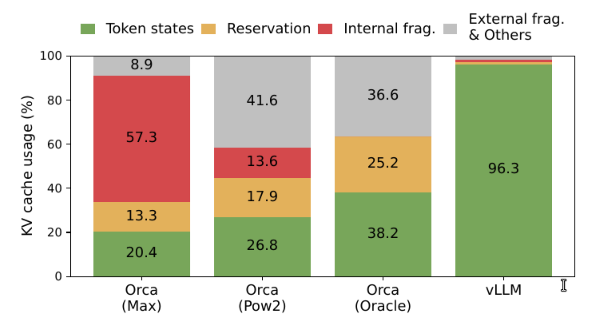
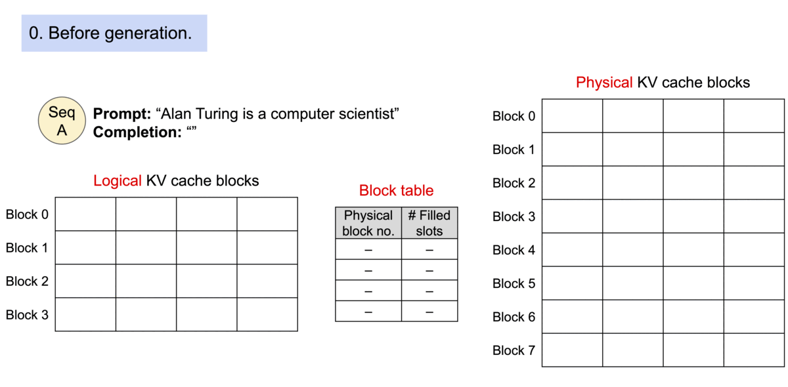
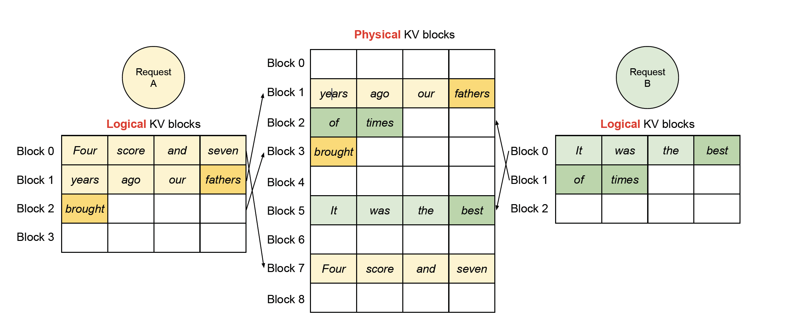
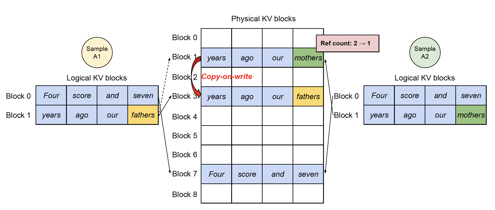
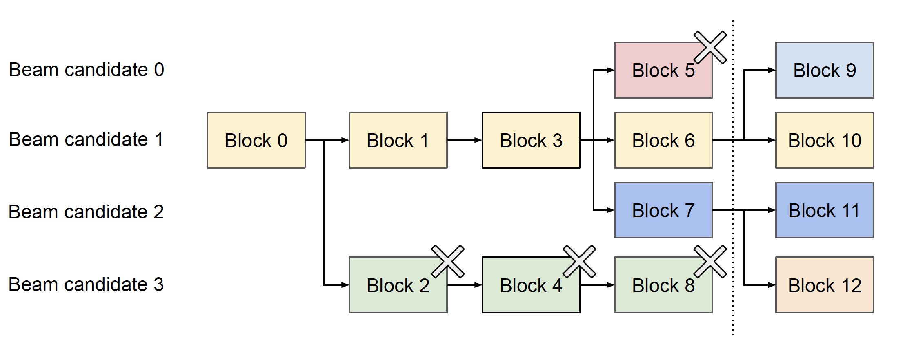
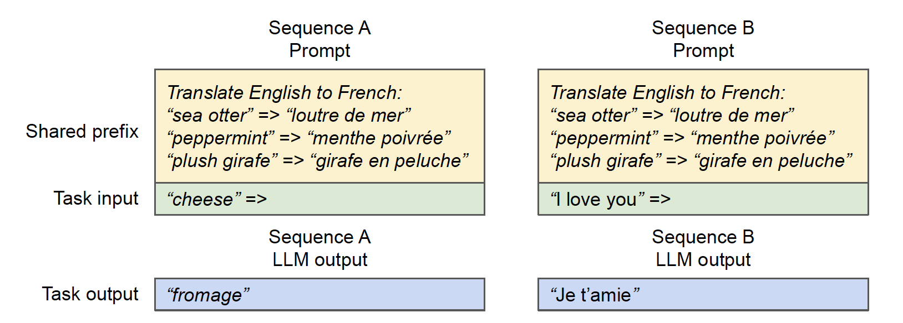

# Pagedattention

## 简介

PagedAttention是对kv cache所占空间的分页管理，是一个典型的**以内存空间换计算开销**的手段，vllm和tenorRT-llm都应用了这个手段来节约kv cache占用的memory，和现今大模型训练的recompute中间activation用于bwd的以计算开销换内存空间的手段恰好相反。

<!-- more -->

# 一、背景

## 1. kv cache
PagedAttention主要是对kv cache所占空间的分页管理，因此本文有必要先来简单介绍一下kv cache。

1. **kv cache的来源**：
decoder推理中，对于每个输入的 prompt，在计算第一个 token 输出的时候，每个 token 的 attention 肯定是都要从头计算, 但是在后续 token 的生成中，**需要concat前面每一个 token 的 K 和 V**，由于模型参数矩阵是不变的，此时只有刚生成的那个 token 的 K 和 V 需要从头计算，所以可以把之前token的K和V缓存起来避免重复计算，这个就叫kv cache。

2. **kv cache的占用的显存空间**：
每个decoder layer，每个 token 的 K、V 矩阵都是 embedding_size=num_heads * head_size，要计算总的Token需要再乘上 seqlen和 batch size，就可以计算出每个layer的 kv Cache 所需的存储容量了。例如，如果 batch size = 8，在 LLaMA 2-70B 中，80 层layer的 KV Cache 一共需要 80 * 8192 * 4096 * 8 * 2Byte = 40 GB。相比 LLaMA 2-70B(fp16)的140 GB 的参数量，其实还好。

3. **kv cache节省的FLOPS**：
每个token的 K、V 矩阵计算一共需要 2 (K+V) * 2 (mul+add) * embedding size * embedding size = 4 * 8192 * 8192 这么多计算量，乘以seqlen、num_layer和 batch size，一共省了 4096 * 80 * 8 * 4 * 8192 * 8192 = 640 TFLOPs的计算量，当然，因seqlen和embedding size和num layer而异。

4. **kv cache读取的weight大小和读取时间**：
K=input乘Wk，V=input乘Wv，我们还需要去显存中读取这两个linear的weight，weight的shape为[batch size, seqlen, embedding size, embedding size]，还是带入以上的取值，那么这**两个weight的参数量为4096 * 80 * 2 * 8192 * 8192** , 查阅A100和H100的显存带宽可以知道，已经是最先进的HBM了，不是老的GDDR了，A100 HBM带宽为2 TB/s，H100 HBM带宽为3.35 TB/s，那么带宽/参数大小就是读取时间，**大约有几十秒，这显然延迟太高了**，还不说每次token generation都要去读然后来计算K V，所以kv cache非常有必要，即使占了很大显存都要用。

## 2. 新的挑战
kvcache的出现，确实节省了decoder阶段的计算量，加快了其推理速度，但是也带来了新的挑战。kv cache所占的空间也确实是大且有浪费的。

KV cache有它独特的地方：**它在解码时会动态变化，并且输出长度和生命周期也是不能提前知道的。这些特性导致现存系统的如下问题**：

首先，**现存系统会存在大量内部(internal)和外部(external)碎片(fragment)**。为了把KV cache存放在连续的空间，这些系统会为一个请求提前分配(pre-allocate)最大可能长度（max seq len）的cache，这会导致内部碎片，因为实际长度可能远远小于最大长度。而这些内部内存碎片白白浪费了，只有等等这个请求结束才能释放。而且即使我们可以提前预料到生成结果的长度，比如512。我们在一开始(比较解码第一个输出token)就预留了512个token的cache空间，这些空间也不能被其它请求使用。此外，**由于每个输入请求的长度不同，也会导致大量的外部碎片**。下图显示了在现存系统中，只有20.4% - 38.2%的KV cache内存是真正被用于存储有用的token。

那么，对症下药，解决办法主要集中在两个方面：

1. KV cache不一定必须存放在连续的空间；
2. KV cache不一定必须按照max seq len来申请，可以动态的根据当前senlen的长度来定；

# 二、PagedAttention思想

## 1. PagedAttention方案详解
受操作系统中虚拟内存和分页机制启发，vLLM 提出了 PagedAttention 注意力算法，以实现 KV Cache 的动态内存分配，而不是像之前一样为每个 seq 都分配固定大小的 [max_seq_len, hidden_size] 连续内存空间用于存储 kv cache。

具体来说，PagedAttention **将每个序列从逻辑上划分为一定数量的 blocks（块），每个 block 包含每个 seq 一定数量 tokens 的 key 和 value**，并把这些**逻辑 blocks 通过 block table 映射到固定大小的 物理 blocks 上**，物理 blocks 可能不连续，即 kv 可能不连续分布。一句话总结就是构建 blocks 表， 并将 seq 的 kv tokens 划分成逻辑 blocks 并映射到物理 blocks 上。

从kernel角度看：pagedattention CUDA kernel通过block table拿到对应的physical block序号，然后CUDA线程ID计算每个seq每个token的offset从而fetch相应的block，拿到kv，继续做attention的计算

使用 PagedAttention 的请求的生成过程如下图所示：

这种方式带来的**内存浪费仅出现在序列的最后一个块中**，实际中带来了近乎最优的内存使用，浪费不到 4%。这种内存效率的提升大大提高了系统能够同时处理的序列数量，增加了 GPU 的利用率，并显著提升了处理吞吐量。

PagedAttention 这种结构类似于操作系统中的虚拟内存，其中将块视为页，将 tokens 视为字节，将序列视为进程。序列的逻辑连续块通过块表映射到非连续的物理块中。当新的 tokens 被生成时，这些物理块会按需分配。

**多请求序列解码情况：**

上面的例子演示的是一个请求的解码过程。**实际的情况是每一步vLLM都会从后续队列里选择一些请求来batching，并且为新的逻辑block分配物理block。然后把多个请求的prompt和最近生成的tokens拼成一个大的sequence给到vLLM的kernel**(GPU的kernel)。这个实现了PagedAttention算法的kernel会访问这些逻辑block的cache并且为每一个请求都生成一个新的token，并且把这一步的KV cache也保存到物理block里。如果block大小越大，那么这个kernel读取的次数就会越小，但是内部碎片也会越大。

在上图的例子里，有两个请求。我们可以看到**两个逻辑相邻的block物理上并不需要相邻。相反，两个请求最后一个物理块(3和2)是相邻的**，这反而可以让kernel的效率更高（因为kernel的读取只是最后生成的Token，之前的不管，这些不同序列生成的最后Token对应的不同Block（如上图的Block2和Block3）在内存上连续的）。

## 2. PagedAttention的内存共享优势
PagedAttention 借助块表实现了灵活的内存共享机制。类似于进程间共享物理页面的方式，PagedAttention 中的不同序列可以通过将各自的逻辑块映射到相同的物理块来共享内存资源。为了确保共享的安全性，PagedAttention 跟踪物理块的引用次数，并采用**写时复制（copy-on-write）策略**以防止数据冲突。

### 并行采样(Parallel sampling)
在代码生成等常见，为了结果的多样性，对于同一个prompt，我们可能会在每一步都随机采样多个(而不是一个)token。

上图是一个例子，由于**两个结果的prompt是相同的，因此KV cache可以共享**。为了实现共享，我们在block table里的每个block里增加一个引用计数，比如这里的第7个物理block和第1个物理block都映射到两个逻辑block。现在假设第1个sample先执行，那么它需要在物理block1写入token “father”，因为这个物理block被多于1个人用到，所以vLLM把block1复制一份到物理block3，然后修改sample1的映射为block3，然后再把”father”的cache写入，同时减少block1的引用计数。接着第2个sample执行，这个时候block1的引用计数为1，也就是它独享，所以可以放心写入。这就是所谓的Copy On Write机制——也就是多个使用者共享一个资源，**大家可以共享读，但是如果某人要写，那么它就需要Copy一份，然后在它自己的那份上修改**。

如果Prompt很长，则这种共享会非常有价值。

### beam search
beam search是在每一个时刻都保留k个(有时候k会变，比如topp，但是不影响原理)最优路径。比如下图：

这里beam size是2，也就是每次保留最好的两条路径。一开始的prompt是相同的，假设是block 0，接着它展开为block 1和block 2，接着展开为3和4，这几步只有2个候选路径，没啥好说。接着block 3展开为block 567，block 4展开为block8，最优的是block 6和7。这个时候我们要**保留路径6和7的KV cache，我们发现它们的路径有很大一部分是重合的(block 013)**。

前面也说过，beam search的top路径会有很多相似的子路径，因此PagedAttention能够充分利用这一点来提高共享比例。

### 共享前缀
在很多应用中，比如In-context learning，我们会增加很长的few-shot examples。比如：

上面是一个机器翻译的例子，在input之前有很长的前缀。另外包括chatbot，我们也会设置system角色的prompt。这些都是可以共享的。

# 三、PagedAttention源码解析

# 参考资料
1. [Efficient Memory Management for Large Language Model Serving with PagedAttention](https://arxiv.org/pdf/2309.06180)

2. [PagedAttention论文解读](https://fancyerii.github.io/2023/11/01/pagedattention/)

3. [PagedAttention/KV cache--大模型推理服务框架vLLM要点简析](https://mp.weixin.qq.com/s?__biz=Mzg2ODk4MzE2MQ==&mid=2247483932&idx=1&sn=a2b05f9bbd4bf266b140c6deb7b8d034&chksm=cf208735a0d88c834a705799b8bcc50a765aa12ce3a3beb2ab375d43f680f0339ec23f19d40d&scene=126&sessionid=1747114269#rd)

4. [vllm优化技术速览](https://www.armcvai.cn/2024-10-26/vllm-optimize.html)

5. [vllm 优化之 PagedAttention 源码解读](https://www.armcvai.cn/2024-11-17/vllm-pagedattention.html)

6. [CUDA PagedAttention kernel源码解析--大模型推理服务框架vLLM要点简析（下）](https://mp.weixin.qq.com/s?__biz=Mzg2ODk4MzE2MQ==&mid=2247483998&idx=1&sn=edc575269cf34f579303e08cca221d0d&chksm=cfc5789a6f4739a3790d605bc30007c1385eb96946a740eacfe2ca20ae31861b4914b758a5b4&scene=126&sessionid=1747114269#rd)