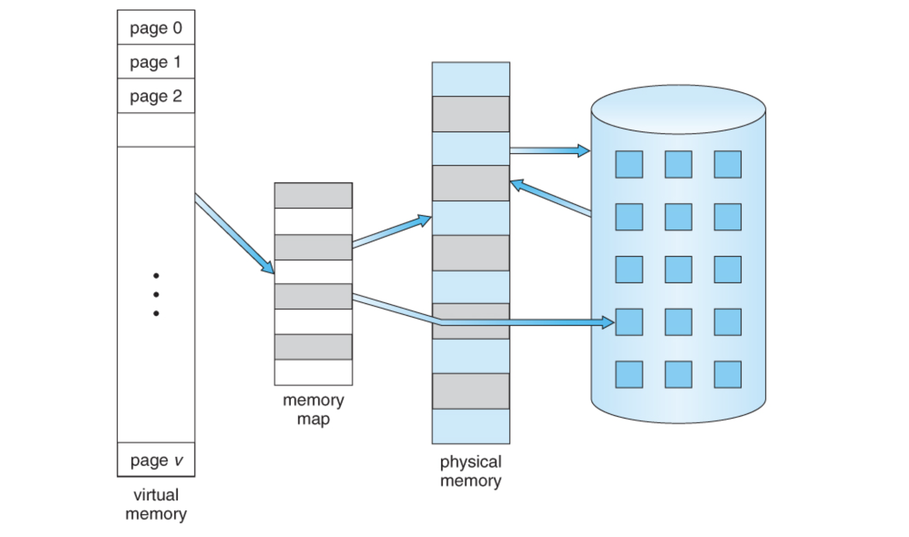

# Pagedattention

## 简介

PagedAttention是对kv cache所占空间的分页管理，是一个典型的**以内存空间换计算开销**的手段，vllm和tenorRT-llm都应用了这个手段来节约kv cache占用的memory，和现今大模型训练的recompute中间activation用于bwd的以计算开销换内存空间的手段恰好相反。

<!-- more -->

## 一、背景

### 1. kv cache
PagedAttention主要是对kv cache所占空间的分页管理，因此本文有必要先来简单介绍一下kv cache。

1. **kv cache的来源**：
decoder推理中，对于每个输入的 prompt，在计算第一个 token 输出的时候，每个 token 的 attention 肯定是都要从头计算, 但是在后续 token 的生成中，**需要concat前面每一个 token 的 K 和 V**，由于模型参数矩阵是不变的，此时只有刚生成的那个 token 的 K 和 V 需要从头计算，所以可以把之前token的K和V缓存起来避免重复计算，这个就叫kv cache。

2. **kv cache的占用的显存空间**：
每个decoder layer，每个 token 的 K、V 矩阵都是 embedding_size=num_heads * head_size，要计算总的Token需要再乘上 seqlen和 batch size，就可以计算出每个layer的 kv Cache 所需的存储容量了。例如，如果 batch size = 8，在 LLaMA 2-70B 中，80 层layer的 KV Cache 一共需要 80 * 8192 * 4096 * 8 * 2Byte = 40 GB。相比 LLaMA 2-70B(fp16)的140 GB 的参数量，其实还好。

3. **kv cache节省的FLOPS**：
每个token的 K、V 矩阵计算一共需要 2 (K+V) * 2 (mul+add) * embedding size * embedding size = 4 * 8192 * 8192 这么多计算量，乘以seqlen、num_layer和 batch size，一共省了 4096 * 80 * 8 * 4 * 8192 * 8192 = 640 TFLOPs的计算量，当然，因seqlen和embedding size和num layer而异。

4. **kv cache读取的weight大小和读取时间**：
K=input乘Wk，V=input乘Wv，我们还需要去显存中读取这两个linear的weight，weight的shape为[batch size, seqlen, embedding size, embedding size]，还是带入以上的取值，那么这**两个weight的参数量为4096 * 80 * 2 * 8192 * 8192** , 查阅A100和H100的显存带宽可以知道，已经是最先进的HBM了，不是老的GDDR了，A100 HBM带宽为2 TB/s，H100 HBM带宽为3.35 TB/s，那么带宽/参数大小就是读取时间，**大约有几十秒，这显然延迟太高了**，还不说每次token generation都要去读然后来计算K V，所以kv cache非常有必要，即使占了很大显存都要用。


### 2. 新的挑战
kvcache的出现，确实节省了decoder阶段的计算量，加快了其推理速度，但是也带来了新的挑战。kv cache所占的空间也确实是大且有浪费的。

KV cache有它独特的地方：**它在解码时会动态变化，并且输出长度和生命周期也是不能提前知道的。这些特性导致现存系统的如下问题**：

首先，**现存系统会存在大量内部(internal)和外部(external)碎片(fragment)**。为了把KV cache存放在连续的空间，这些系统会为一个请求提前分配(pre-allocate)最大可能长度（max seq len）的cache，这会导致内部碎片，因为实际长度可能远远小于最大长度。而这些内部内存碎片白白浪费了，只有等等这个请求结束才能释放。而且即使我们可以提前预料到生成结果的长度，比如512。我们在一开始(比较解码第一个输出token)就预留了512个token的cache空间，这些空间也不能被其它请求使用。此外，**由于每个输入请求的长度不同，也会导致大量的外部碎片**。下图显示了在现存系统中，只有20.4% - 38.2%的KV cache内存是真正被用于存储有用的token。


那么，对症下药，解决办法主要集中在两个方面：

1. **KV cache不一定必须存放在连续的空间**；
2. **KV cache不一定必须按照max seq len来申请，可以动态的根据当前senlen的长度来定**；

### 3. 分页管理
PagedAttention 受到了操作系统的虚拟内存和分页机制的启发，这里简要介绍一下操作系统的分页管理。

操作系统把内存划分成固定大小的分页(page)，一个进程的虚拟内存就是一系列分页。在用户(进程)看来，它的地址空间是连续的，但实际不然。操作系统会把每个分页和物理的分页建立映射。比如一个页面32k，进程的虚拟内存是320k(实际当然远大于此，比如4GB)，也就是10个分页。目前进程在使用前3个页面，那么操作系统就会把这3个页面真正的加载到物理内存里，剩下那7个页面可能缓存在磁盘里。当进程访问第4个页面时，会发生缺页中断，然后去缓存里找到这个页面放到内存，并且建立虚拟内存和物理内存的映射。如果物理内存不够用了，操作系统也会把暂时不用的分页换到磁盘缓存里。




## 二、PagedAttention思想

### 1. PagedAttention方案详解
受操作系统中虚拟内存和分页机制启发，vLLM 提出了 PagedAttention 注意力算法，以实现 KV Cache 的动态内存分配，而不是像之前一样为每个 seq 都分配固定大小的 [max_seq_len, hidden_size] 连续内存空间用于存储 kv cache。

具体来说，PagedAttention **将每个序列从逻辑上划分为一定数量的 blocks（块），每个 block 包含每个 seq 一定数量 tokens 的 key 和 value**，并把这些**逻辑 blocks 通过 block table 映射到固定大小的 物理 blocks 上**，物理 blocks 可能不连续，即 kv 可能不连续分布。一句话总结就是构建 blocks 表， 并将 seq 的 kv tokens 划分成逻辑 blocks 并映射到物理 blocks 上。

从kernel角度看：pagedattention CUDA kernel通过block table拿到对应的physical block序号，然后CUDA线程ID计算每个seq每个token的offset从而fetch相应的block，拿到kv，继续做attention的计算

使用 PagedAttention 的请求的生成过程如下图所示：


这种方式带来的**内存浪费仅出现在序列的最后一个块中**，实际中带来了近乎最优的内存使用，浪费不到 4%。这种内存效率的提升大大提高了系统能够同时处理的序列数量，增加了 GPU 的利用率，并显著提升了处理吞吐量。

PagedAttention 这种结构类似于操作系统中的虚拟内存，其中将块视为页，将 tokens 视为字节，将序列视为进程。序列的逻辑连续块通过块表映射到非连续的物理块中。当新的 tokens 被生成时，这些物理块会按需分配。

**多请求序列解码情况：**

上面的例子演示的是一个请求的解码过程。**实际的情况是每一步vLLM都会从后续队列里选择一些请求来batching，并且为新的逻辑block分配物理block。然后把多个请求的prompt和最近生成的tokens拼成一个大的sequence给到vLLM的kernel**(GPU的kernel)。这个实现了PagedAttention算法的kernel会访问这些逻辑block的cache并且为每一个请求都生成一个新的token，并且把这一步的KV cache也保存到物理block里。如果block大小越大，那么这个kernel读取的次数就会越小，但是内部碎片也会越大。


在上图的例子里，有两个请求。我们可以看到**两个逻辑相邻的block物理上并不需要相邻。相反，两个请求最后一个物理块(3和2)是相邻的**，这反而可以让kernel的效率更高（因为kernel的读取只是最后生成的Token，之前的不管，这些不同序列生成的最后Token对应的不同Block（如上图的Block2和Block3）在内存上连续的）。

### 2. PagedAttention的内存共享优势
PagedAttention 借助块表实现了灵活的内存共享机制。类似于进程间共享物理页面的方式，PagedAttention 中的不同序列可以通过将各自的逻辑块映射到相同的物理块来共享内存资源。为了确保共享的安全性，PagedAttention 跟踪物理块的引用次数，并采用**写时复制（copy-on-write）策略**以防止数据冲突。


#### 并行采样(Parallel sampling)
在代码生成等常见，为了结果的多样性，对于同一个prompt，我们可能会在每一步都随机采样多个(而不是一个)token。


上图是一个例子，由于**两个结果的prompt是相同的，因此KV cache可以共享**。为了实现共享，我们在block table里的每个block里增加一个引用计数，比如这里的第7个物理block和第1个物理block都映射到两个逻辑block。现在假设第1个sample先执行，那么它需要在物理block1写入token “father”，因为这个物理block被多于1个人用到，所以vLLM把block1复制一份到物理block3，然后修改sample1的映射为block3，然后再把”father”的cache写入，同时减少block1的引用计数。接着第2个sample执行，这个时候block1的引用计数为1，也就是它独享，所以可以放心写入。这就是所谓的Copy On Write机制——也就是多个使用者共享一个资源，**大家可以共享读，但是如果某人要写，那么它就需要Copy一份，然后在它自己的那份上修改**。

如果Prompt很长，则这种共享会非常有价值。

#### beam search
beam search是在每一个时刻都保留k个(有时候k会变，比如topp，但是不影响原理)最优路径。比如下图：


这里beam size是2，也就是每次保留最好的两条路径。一开始的prompt是相同的，假设是block 0，接着它展开为block 1和block 2，接着展开为3和4，这几步只有2个候选路径，没啥好说。接着block 3展开为block 567，block 4展开为block8，最优的是block 6和7。这个时候我们要**保留路径6和7的KV cache，我们发现它们的路径有很大一部分是重合的(block 013)**。

前面也说过，beam search的top路径会有很多相似的子路径，因此PagedAttention能够充分利用这一点来提高共享比例。

#### 共享前缀
在很多应用中，比如In-context learning，我们会增加很长的few-shot examples。比如：


上面是一个机器翻译的例子，在input之前有很长的前缀。另外包括chatbot，我们也会设置system角色的prompt。这些都是可以共享的。


##  三、PagedAttention源码解析
### 1. PagedAttention kernel签名
PagedAttention 内核的实现函数和常规 Attention 的实现相比**最明显的就是多了 blocks 相关参数**，以及 k_cache 的尺寸变成了 [num_blocks, num_kv_heads, head_size/x, block_size, x]，很明显了多了 num_blocks 和 block_size 维度（v_cache 变量也是），用于表示一个 seq 用多少个 blocks 存储，以及每个 block 存储多少个 tokens。
```c++
__global__ void single_query_cached_kv_attention_kernel(
  scalar_t* __restrict__ out,             // [bs, num_heads, head_size]
  const scalar_t* __restrict__ q,         // [bs, num_heads, head_size]
  const scalar_t* __restrict__ k_cache,   // [num_blocks, num_kv_heads, head_size/x, block_size, x]，最后一个x是vectorize，一个thread fetch一个vector
  const scalar_t* __restrict__ v_cache,   // [num_blocks, num_kv_heads, head_size, block_size], num_blocks * block_size=seqlen
  const int* __restrict__ head_mapping,   // [num_heads]，q与kv的head map
  const float scale,
  const int* __restrict__ block_tables,   // [bs, max_num_blocks_per_seq],2d数组，每个子数组是每个seq的存储kv的physical block nums
  const int* __restrict__ context_lens,   // [bs]，每个句子的长度
  const int max_num_blocks_per_seq, //(max(context_lens) + block_size - 1) / block_size 
  const float* __restrict__ alibi_slopes, // [num_heads]
  const int q_stride,
  const int kv_block_stride,//类似于pytorch的stride，每个physical block的stride
  const int kv_head_stride) //类似于pytorch的stride，每个head的stride

```
| 参数名             | 类型                            | 含义                                                                                   |
|------------------|-------------------------------|------------------------------------------------------------------------------------|
| `out`            | `scalar_t*`                   | 输出结果，attention 的输出值，形状为 `[bs, num_heads, head_size]`                |
| `q`              | `const scalar_t*`             | 查询向量 Q，形状为 `[bs, num_heads, head_size]`                                 |
| `k_cache`        | `const scalar_t*`             | 分页存储的 Key 缓存，形状为 `[num_blocks, num_kv_heads, head_size/x, block_size, x]`   |
| `v_cache`        | `const scalar_t*`             | 分页存储的 Value 缓存，形状为 `[num_blocks, num_kv_heads, head_size, block_size]`      |
| `head_mapping`   | `const int*`                  | Q 头到 KV 头的映射数组，用于 GQA/MQA，形状为 `[num_heads]`                              |
| `scale`          | `const float`                 | softmax 前的缩放因子（通常是 `1.0 / sqrt(head_size)`）                                 |
| `block_tables`   | `const int*`                  | 每个 sequence 使用的物理块编号表，形状为 `[bs, max_num_blocks_per_seq]`           |
| `context_lens`   | `const int*`                  | 每个 sequence 的实际长度，形状为 `[bs]`                                          |
| `max_num_blocks_per_seq` | `const int`         | 每个 sequence 最多使用的 block 数量                                                   |
| `alibi_slopes`   | `const float*`                | ALiBi 位置编码的斜率参数，形状为 `[num_heads]`                                         |
| `q_stride`       | `const int`                   | Q 张量的 stride，用于定位数据                                                         |
| `kv_block_stride`| `const int`                   | KV 缓存中每个 block 的 stride                                                         |
| `kv_head_stride` | `const int`                   | KV 缓存中每个 head 的 stride                                                          |

- **scalar_t**: 可变的数据类型
- __restrict__：告诉编译器，指针是唯一的，不会被其他指针修改。

在看具体的kernel前，必须要知道每个block和thread代表什么，这里每个block x处理一个head，每个block y处理一个seq，每个thread x处理最低维度head size的具体的计算。


```c++
dim3 grid(num_heads, num_seqs); // 每个head处理一个seq
dim3 block(NUM_THREADS); // 每个thread处理head size的具体的计算
```

### 2. kernel 主逻辑

- 配置线程块内的线程如何组织（thread group 大小、warp 数量）
- 每个线程处理的数据粒度（每个 thread 处理 head_size 中的部分数据）
- 向量化加载 Key/Query 数据以提升内存带宽利用率
- 明确 block 和 grid 的映射关系：一个 block 负责一个 attention head，blockIdx.y 对应 sequence ID

```c++
/////////////////1. 线程组大小设置/////////////////
  constexpr int THREAD_GROUP_SIZE = MAX(WARP_SIZE / BLOCK_SIZE, 1);// 每个thread_group 处理blocksize中的1个token，每个token又有numheads * headsize个element，每个block有block size个token，WARP_SIZE一般=32

/////////////////2. 线程组数量/////////////////
  constexpr int NUM_THREAD_GROUPS = NUM_THREADS / THREAD_GROUP_SIZE; // Note: This assumes THREAD_GROUP_SIZE divides NUM_THREADS
  //这个值表示有多少个 thread groups 在并行工作。

/////////////////3. 每组处理的 token 数量/////////////////
  //每组thread处理的token数量，最小为1
  constexpr int NUM_TOKENS_PER_THREAD_GROUP = (BLOCK_SIZE + WARP_SIZE - 1) / WARP_SIZE;

/////////////////4. Warp 数量与线程信息提取/////////////////
  constexpr int NUM_WARPS = NUM_THREADS / WARP_SIZE; 
  const int thread_idx = threadIdx.x; //线程索引
  const int warp_idx = thread_idx / WARP_SIZE; //warp编号
  const int lane = thread_idx % WARP_SIZE; //线程在warp中的编号

/////////////////5. 线程组与block的映射关系/////////////////
  const int head_idx = blockIdx.x; // 一个block负责一个head，headsize*blocksize的数据
  const int num_heads = gridDim.x; // 总共有多少个head
  const int kv_head_idx = head_mapping[head_idx]; // q head id --> kv head id
  //head_mapping 是为了支持 GQA（Grouped Query Attention），允许不同 Q head 共享同一个 KV head
  const int seq_idx = blockIdx.y; // y维度的一个block负责一个seq

/////////////////6. 向量化访存优化/////////////////
  // 每个thread group 向量化load&store
  constexpr int VEC_SIZE = MAX(16 / (THREAD_GROUP_SIZE * sizeof(scalar_t)), 1); 
  using K_vec = typename Vec<scalar_t, VEC_SIZE>::Type;
  using Q_vec = typename Vec<scalar_t, VEC_SIZE>::Type;

/////////////////7. 每个线程处理的数据量/////////////////
  // 1个thread group处理一个head里面的head size
  constexpr int NUM_ELEMS_PER_THREAD = HEAD_SIZE / THREAD_GROUP_SIZE;
  constexpr int NUM_VECS_PER_THREAD = NUM_ELEMS_PER_THREAD / VEC_SIZE;

/////////////////8. 当前线程在 thread group 中的位置/////////////////
  // 当前thread所在的thread group
  const int thread_group_idx = thread_idx / THREAD_GROUP_SIZE;
  // 当前thread在thread group内的offset
  const int thread_group_offset = thread_idx % THREAD_GROUP_SIZE;
```

搞明白了这些基本信息后，才方便写后续的CUDA kernel逻辑，比如循环怎么个循环法，每个block和每个thread算哪部分，现在开始计算MHA，q还是照常load。

```c++
  const scalar_t* q_ptr = q + seq_idx * q_stride + head_idx * HEAD_SIZE;//获取当前 Q 的指针位置
  // q：输入的 Q 向量张量，形状为 [num_seqs, num_heads, head_size]
  // seq_idx：当前 sequence ID（由 blockIdx.y 提供）
  // head_idx：当前 attention head ID（由 blockIdx.x 提供）
  // q_stride：Q 张量中每个 sequence 的 stride（即 num_heads * head_size）

  //每个block x负责一个head，那么这里申请一块shared mem来存每个thread x读到的head size维度数据
  //shape为[线程数量][每个线程的向量数量]
  __shared__ Q_vec q_vecs[THREAD_GROUP_SIZE][NUM_VECS_PER_THREAD];
  //Q_vec 是一个向量类型（如 float4），表示一次读取 VEC_SIZE 个元素
  //THREAD_GROUP_SIZE：每个 thread group 中有多少个线程
  //NUM_VECS_PER_THREAD：每个线程需要读多少个向量（即整个 head_size 分成多少份 vector）

  for (int i = thread_group_idx; i < NUM_VECS_PER_THREAD; i += NUM_THREAD_GROUPS) {
    //i 表示当前线程在该线程组内要处理第几个向量块（vec）
    //循环步长是 NUM_THREAD_GROUPS，表示多个线程组之间轮流处理不同的 vec

    const int vec_idx = thread_group_offset + i * THREAD_GROUP_SIZE;//计算当前线程要读取的偏移量
    //thread_group_offset：当前线程在其所属线程组内的编号（0 ~ THREAD_GROUP_SIZE - 1）
    //i * THREAD_GROUP_SIZE：当前处理的是第 i 轮向量块
    //vec_idx：在整个 head_size 维度上的向量索引

    // 每个thread读取的q vector都放在q_vecs, 求出当前thread处理的q的最后一维的offset=q_ptr + vec_idx * VEC_SIZE
    q_vecs[thread_group_offset][i] = *reinterpret_cast<const Q_vec*>(q_ptr + vec_idx * VEC_SIZE);
  }
```

### 3. kv cache的读取
接下来的重点在于如何去计算这个token，以及token的head size offset，找到后load其kv进寄存器与q做计算即可。这部分也是**整个pagedattention的核心**。
```c++
///////////////1. 定位当前 sequence 的 block table 和长度////////
  const int* block_table = block_tables + seq_idx * max_num_blocks_per_seq;
  const int context_len = context_lens[seq_idx];

///////////////2. 计算当前 sequence 的 block 数量////////
  const int num_blocks = (context_len + BLOCK_SIZE - 1) / BLOCK_SIZE;

///////////////3. 每个warp去读取一个k的physical block，循环遍历////////
  for (int block_idx = warp_idx; block_idx < num_blocks; block_idx += NUM_WARPS) {
    // 获取当前 block 的物理编号
    const int physical_block_number = block_table[block_idx];//physical block数量

///////////////4. 在当前physical block中找到当前thread group负责的局部token id////////
    for (int i = 0; i < NUM_TOKENS_PER_THREAD_GROUP; i++) {
      // 在当前physical block中找到当前thread group负责的局部token id，thread group 负责的 token 数量为 NUM_TOKENS_PER_THREAD_GROUP
      const int physical_block_offset = (thread_group_idx + i * WARP_SIZE) % BLOCK_SIZE;
      // 求出token在当前seq的所有block的全局token id
      const int token_idx = block_idx * BLOCK_SIZE + physical_block_offset;
      K_vec k_vecs[NUM_VECS_PER_THREAD];

      for (int j = 0; j < NUM_VECS_PER_THREAD; j++) {
        // k_cache.shape=[num_blocks, num_kv_heads, head_size/x, block_size, x]
        // 根据以上shape算出当前seq的具体k cache的block size这一维度的offset
        const scalar_t* k_ptr = k_cache + physical_block_number * kv_block_stride
                                        + kv_head_idx * kv_head_stride
                                        + physical_block_offset * x;
        // 因为是向量化LOAD，还需要计算出vec的全局id，和vec内元素的局部offset
        const int vec_idx = thread_group_offset + j * THREAD_GROUP_SIZE;
        const int offset1 = (vec_idx * VEC_SIZE) / x;
        const int offset2 = (vec_idx * VEC_SIZE) % x;
        k_vecs[j] = *reinterpret_cast<const K_vec*>(k_ptr + offset1 * BLOCK_SIZE * x + offset2);
      }
      // 以上完成了对q k的load后就可以开始做scale dot production
      float qk = scale * Qk_dot<scalar_t, THREAD_GROUP_SIZE>::dot(q_vecs[thread_group_offset], k_vecs);
```
做完计算后，后面会是用一系列reduce操作计算softmax，再像上面这样去load v，然后再做gemv，最终输出，代码比较类似，故在此省略。

### 4. UT 测试
ut入口在test_attention.py的test_single_query_cached_kv_attention函数，重点看看如何创建的block table和kv cache：（其实就是随机初始化了，主要知道里面表示的是什么东西就可以）

```python
 # Create the block tables.
    max_num_blocks_per_seq = (max_context_len + block_size - 1) // block_size
    block_tables = [] # 2d数组，每个子数组是一个seq的kv存储的physical block nums
    for _ in range(num_seqs):
        block_table = [
            random.randint(0, NUM_BLOCKS - 1)
            for _ in range(max_num_blocks_per_seq)
        ]
        block_tables.append(block_table)
    block_tables = torch.tensor(block_tables, dtype=torch.int, device="cuda")

    # Create the KV caches.
    # 每个layer的kv cache
    key_caches, value_caches = kv_cache_factory(NUM_BLOCKS, block_size, 1,
                                                num_kv_heads, head_size, dtype,
                                                seed)

    # 测试第1个layer的kv cache就可

    key_cache, value_cache = key_caches[0], value_caches[0] 
```

最后传到kernel，输出到output，大功告成

```python
    output = torch.empty_like(query)
    attention_ops.single_query_cached_kv_attention(
        output,
        query,
        key_cache,
        value_cache,
        head_mapping,
        scale,
        block_tables,
        context_lens,
        block_size,
        max_context_len,
        alibi_slopes,
    )
```

## 四、总结
PagedAttention 的核心创新在于**分页式键值缓存（KV Cache）管理机制** ，其灵感源自操作系统虚拟内存的分页策略。与传统连续分配的 KV 缓存不同，它将键值对划分为固定大小的“物理块”（block），并通过 **块映射表（Block Table）** 实现非连续内存管理。这种设计打破了传统注意力机制对连续显存的依赖，显著提升了显存利用率，解决了长序列推理中显存浪费和长度限制的瓶颈问题。

其次，其 GPU 并行优化策略 具备创新性：通过 **线程组（Thread Group）协作** 和 **向量化访存** 技术，将多线程协作细化到单个 token 的 head 数据加载，结合 warp 级并行处理物理块，最大化内存带宽利用率。此外，支持 GQA（Grouped Query Attention） 和 ALiBi（Positional Bias） 等变体，通过 head_mapping 和 token_idx 实现多头共享 KV 缓存及动态位置编码，进一步降低计算冗余并适配多样化模型架构。

该技术推动了大语言模型推理的工程化突破，成为高效框架（如 vLLM、TensorRT-LLM）的核心组件，使 24GB 显存支持 500K tokens 生成成为可能，广泛应用于长文本生成、流式对话等场景，为长上下文理解和生成提供了高效解决方案。

## 参考资料
1. [Efficient Memory Management for Large Language Model Serving with PagedAttention](https://arxiv.org/pdf/2309.06180)

2. [PagedAttention论文解读](https://fancyerii.github.io/2023/11/01/pagedattention/)

3. [PagedAttention/KV cache--大模型推理服务框架vLLM要点简析](https://mp.weixin.qq.com/s?__biz=Mzg2ODk4MzE2MQ==&mid=2247483932&idx=1&sn=a2b05f9bbd4bf266b140c6deb7b8d034&chksm=cf208735a0d88c834a705799b8bcc50a765aa12ce3a3beb2ab375d43f680f0339ec23f19d40d&scene=126&sessionid=1747114269#rd)

4. [vllm优化技术速览](https://www.armcvai.cn/2024-10-26/vllm-optimize.html)

5. [vllm 优化之 PagedAttention 源码解读](https://www.armcvai.cn/2024-11-17/vllm-pagedattention.html)

6. [CUDA PagedAttention kernel源码解析--大模型推理服务框架vLLM要点简析（下）](https://mp.weixin.qq.com/s?__biz=Mzg2ODk4MzE2MQ==&mid=2247483998&idx=1&sn=edc575269cf34f579303e08cca221d0d&chksm=cfc5789a6f4739a3790d605bc30007c1385eb96946a740eacfe2ca20ae31861b4914b758a5b4&scene=126&sessionid=1747114269#rd)