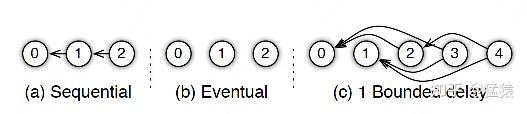
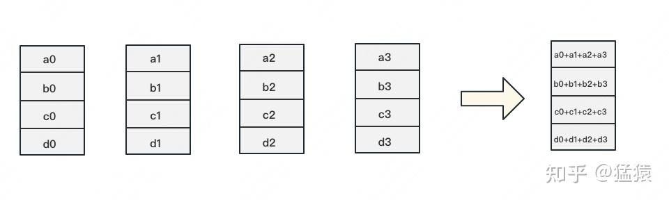
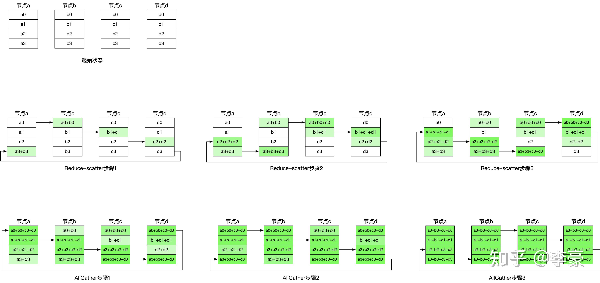

# 并行方法DP、TP、PP、EP、SP

## 简介

给你8张卡、16张卡DP怎么做？TP怎么做？EP（专家并行）怎么做？甚至还要了解一下SP（序列并行）。

如 tensor_parallel_size、pipeline_parallel_size、enable_expert_parallel、data_parallel_size）来手动设置 TP、PP、EP、DP 等并行策略

<!-- more -->

## 一、Data Parallel
数据并行（Data Parallel）是数据平均分配到GPU上并行处理的策略。**每个GPU上都拥有一份完整的模型副本**，**各自吃一份数据(mini-batch)，算一份梯度，最后对梯度进行累加**来更新整体模型。

数据并行主要分为以下三种方法：
- DP（Data Parallelism）：最早的数据并行模式，一般采用参数服务器(Parameters Server)这一编程框架。实际中多用于**单机多卡**
- DDP（Distributed Data Parallelism）：分布式数据并行，采用Ring AllReduce的通讯方式，实际中多用于**多机多卡场景**
- ZeRO：零冗余优化器。由微软推出并应用于其DeepSpeed框架中。严格来讲ZeRO采用**数据并行+张量并行**的方式，旨在**降低存储**。

### 1.数据并行（DP）

#### 1.1 主要框架

1. 默认的主卡（通常是 GPU 0）负责读取一个 batch 的数据，并将数据划分为多个 mini-batch 分别发送到其他 GPU；
2. 从主卡（GPU 0）复制一份最新的模型到所有 GPU 上；
3. 每张 GPU 独立执行前向传播（FWD），得到各自的输出；所有 GPU 的输出被发送回主卡（GPU 0）进行 loss 计算；
4. 这个 loss 被广播到所有 GPU 进行反向传播（BWD）；
5. 每张 GPU 分别计算自己的梯度，并将这些梯度返回给 GPU 0；GPU 0 聚合计算所有梯度用于更新模型参数，并广播到所有 GPU 上。这个操作为**AllReduce**。

前文说过，实现DP的一种经典编程框架叫“参数服务器”，在这个框架里，**计算GPU称为Worker，梯度聚合GPU称为Server**。在实际应用中，为了尽量减少通讯量，一般可选择一个Worker同时作为Server。比如GPU0既做计算（Worker），也做梯度聚合（Server），如上图。需要再额外说明几点：

- 1个Worker或者Server下可以不止1块GPU。
- Server可以只做梯度聚合，也可以梯度聚合+全量参数更新一起做。

#### 1.2 优缺点
优点：
  - 实现简单，易于理解
  - 适合单机多卡（小模型）

两个主要问题：
  - 存储开销大。每块GPU上都存了一份完整的模型，造成冗余。**（ZeRO对其进行了优化）**
  - 通讯开销大。Server需要和每一个Worker进行梯度传输。当Server和Worker不在一台机器上时，Server的带宽将会成为整个系统的计算效率瓶颈。**（DDP对其进行了优化）**

#### 1.3 梯度异步更新
了解上述的DP计算过程，我们不难发现一个问题：当Server在搬运数据，计算梯度的时候，Worker们在干嘛呢？

当然是在：摸鱼！！！

为了尽可能的压榨计算资源，老板们想出了一个办法：**梯度异步更新**。

梯度异步更新简单来讲就是：在第N轮计算中，Worker正常计算梯度，并向Server发送梯度请求。但是，该Worker并不会实际等到把聚合梯度拿回来，更新完参数W后再做计算。而是直接拿旧的W，吃新的数据，继续第N+1轮的计算。这样就保证在通讯的时间里，Worker也在马不停蹄做计算，提升计算通讯比。

当然，异步也不能太过份。只计算梯度，不更新权重，那模型就无法收敛。图中刻画的是延迟为1的异步更新，也就是在开始第12轮对的计算时，必须保证W已经用第10、11轮的梯度做完2次更新了。

参数服务器的框架下，**延迟的步数也可以由用户自己决定**，下图分别刻划了几种延迟情况：

- (a) 无延迟
- (b) 延迟但不指定延迟步数。也即在迭代2时，用的可能是老权重，也可能是新权重，听天由命。
- (c) 延迟且指定延迟步数为1。例如做迭代3时，可以不拿回迭代2的梯度，但必须保证迭代0、1的梯度都已拿回且用于参数更新。

**异步很香，但对一个Worker来说，只是等于W不变，batch的数量增加了而已，在SGD下，会减慢模型的整体收敛速度**。异步的整体思想是，比起让Worker闲着，倒不如让它多吃点数据，虽然反馈延迟了，但只要它在干活在学习就行。

### 2.分布式数据并行（DDP）
受通讯负载不均的影响，DP一般用于单机多卡场景。因此，DDP作为一种更通用的解决方案出现了，**既能多机，也能单机**。DDP首先要解决的就是通讯问题：**将Server上的通讯压力均衡转到各个Worker上**。实现这一点后，也就成就了DDP的核心思想：**去Server，留Worker**。

#### 2.1 主要框架
DDP与DP的实现过程类似，步骤1-4都一致，**不同的是第5步，DP是Server做AllReduce，而DDP是每个Worker做AllReduce**。实现的核心操作为**Ring AllReduce**，具体介绍见附录6.AllReduce。Ring-AllReduce通过环形拓扑结构，将数据分发到相邻的节点，从而实现高效的通信。

单卡总通讯量为$2(N - 1)\frac{\Phi}{N}$，随着$N$的增大，可以近似为$2\Phi$。全卡总通讯量为$2N\Phi$。

而对前文的 DP（Data Parallelism）来说，它的 Server 承载的通讯量是$N\Phi$，Workers 为$N\Phi$，全卡总通讯量依然为$2N\Phi$。**虽然通讯量相同，但搬运相同数据量的时间却不一定相同**。DDP 把通讯量均衡负载到了每一时刻的每个 Worker 上（**其通讯时间仅取决于逻辑环中最慢的两个 GPU 的连接，且不随GPU数量的增多而增多）**，而 DP 仅让 Server 做勤劳的搬运工。当越来越多的 GPU 分布在距离较远的机器上时，DP 的通讯时间是会增加的（**其通讯时间随GPU数量增多而增大**）。

如果一个节点上的所有 GPU 在环中彼此相邻，则该算法的功能最佳；这最小化了网络争用的量，否则这可能会显著降低 GPU-GPU 连接的有效带宽。

#### 2.2 缺点

DDP存在的问题：在N张卡进行训练，设模型参数量为M，采用全精度参数，则需要参数+梯度+优化器(Adam优化器需要存储一阶动量和二阶动量)=（4+4+8）*M空间。**占用显存空间过大！**

### 3.零冗余优化器（ZeRO）
ZeRO主要解决DP中每个GPU占用显存过大的问题，其主要思想是：**将优化器状态、梯度和模型参数进行分割，每个GPU只保存部分数据**。

ZeRO有三个阶段：
- ZeRO Stage 1：仅对优化器状态进行分割，每个GPU中仍有完整的模型参数和梯度数据
- ZeRO Stage 2：对优化器状态和梯度进行分割
- ZeRO Stage 3：对优化器状态、梯度和模型参数全部进行分割

具体的ZeRO实现过程详见文章[DeepSpeed](https://summer536.github.io/Notes/zh/posts/DeepSpeed.html)

## 二、Model Parallel
在数据并行训练中，一个明显的特点是每个 GPU 持有整个模型权重的副本。这就带来了冗余问题。另一种并行模式是模型并行，即模型被分割并分布在一个设备阵列上。

模型并行通常有两种：

- **张量并行（Tensor Parallelism）**: 也叫层内并行（intra-layer model parallel），在一个操作中实现并行计算，如矩阵-矩阵乘法。
- **流水线并行（Pipeline Parallelism）**: 也叫层间并行（inter-layer model parallel），在各层之间依次进行并行计算。

下面将详细介绍张量并行和流水线并行。

## 三、Pipeline Parallel

## 四、Tensor Parallel
张量并行（Tensor Parallelism）是将矩阵乘加运算分解在N个GPU设备上，**张量可以按横向或纵向进行切分，每个切片由独立的GPU 处理**。每块GPU 对其张量切片执行计算，最终将各自结果同步合并，重建出完整的计算结果。由于每块GPU 可以并行处理自己的张量切片，张量并行在速度和效率上都有提升，并且可以与其他并行策略配合使用。

**TP需要很大的卡间通信带宽，所以一般只适用于支持NVLink的单机GPU之间进行并行**。

张量并行是由Megatron-LM(Nvidia的分布式训练框架)提出，冷知识：Megatron是变形金刚（transformer）的反派主角霸天虎领袖--威震天。

### 1.权重不同切分方式
线性层(linear layer)是Transformer的架构模型训练的核心 kernel，其本质上是一种GEMM操作，我们在加载模型时，需要将权重做切分并并分发到不同的GPU设备上。随后，各GPU设备分别执行相应GEMM操作。

权重切分有两种方式：**按行和按列切分**。

#### 1.1 Forward
按不同方式切分权重后的线性层推理 forward 操作的可视化对比图如下图所示：

- 权重A如果按照行切分，那么GEMM的维度无法对齐，需要再把X按列切开才能做到矩阵乘法，并在对应GPU设备上分别执行GEMM得到Y1和Y2。然后再对Y1和Y2逐元素相加才能得到Y。
- 权重A按照列拆分直接计算得到Y1和Y2，然后concat即可。

#### 1.2 Backward

*行切分的backward计算图如下：*

- **f 和 g**：分别表示两个算子，每个算子都包含一组 forward + backward 操作。
- 图中的每一行，表示单独在一块 GPU 上计算的过程。
- **g 的 backward**：假定现在我们要对 $W_i$ 求梯度，则可推出（L是loss函数）
  $$
  \frac{\partial L}{\partial W_i} = \frac{\partial L}{\partial Y} \cdot \frac{\partial Y}{\partial Y_i} \cdot \frac{\partial Y_i}{\partial W_i} = \frac{\partial L}{\partial Y} \cdot \frac{\partial Y_i}{\partial W_i}
  $$
  也就是说，只要把 $\frac{\partial L}{\partial Y}$ 同时广播到两块 GPU 上，两块 GPU 就可以独立计算各自权重的梯度了。

  （$\frac{\partial Y}{\partial Y_i} = 1$表示局部输出 $Y_i$ 对整体输出 $Y$ 的逐元素贡献为 1。）
- **f 的 backward**：在上图中，我们只画了模型其中一层的计算过程。当模型存在多层时，梯度要从上一层向下一层传播。比如图中，梯度要先传播到 X，然后才能往下一层继续传递。这就是 f 的 backward 的作用。这里也易推出，
  $$
  \frac{\partial L}{\partial X} = \text{concat}\left[\frac{\partial L}{\partial X_1}, \frac{\partial L}{\partial X_2}\right]
  $$

*列切分的backward计算图如下：*

(这个图的XW1和XW2应该转一下，是竖着的长方形，不过不影响理解)

- **g 的 backward**：易推出
  $$
  \frac{\partial L}{\partial W_i} = \frac{\partial L}{\partial Y_i} * \frac{\partial Y_i}{\partial W_i}
  $$

- **f 的 backward**：因为对于损失$L$，$X$既参与了$XW_1$的计算，也参与了$XW_2$的计算。因此有
  $$
  \frac{\partial L}{\partial X} = \left. \frac{\partial L}{\partial X} \right|_1 + \left. \frac{\partial L}{\partial X} \right|_2
  $$
  其中$\left. \frac{\partial L}{\partial X} \right|_i$表示第$i$块GPU上计算到$X$时的梯度。

### 2.Transformer模型并行概览
标准的 transformer 层如图所示，其由一个自注意力（self-attention）模块和一个两层的多层感知机 (MLP)组成，可在这两个模块中分别引入模型并行（也叫张量并行）技术。

### 3.MLP层
MLP的计算过程如下：

其中，GELU是激活函数，A和B分别为两个线性层。在Transformer里，一般设$h' = 4h$。假设现在有N块GPU，我们要把MLP层的权重拆到上面做计算，要怎么拆分呢？Megatron提供的拆分办法如下：

在 MLP 层中，**对 A 采用“列切割”，对 B 采用“行切割”**。

- **f 的 forward 计算**：把输入 $X$ 拷贝到两块 GPU 上，每块 GPU 即可独立做 forward 计算。
- **g 的 forward 计算**：每块 GPU 上的 forward 计算完毕，取得 $Z_1$ 和 $Z_2$ 后，GPU 间做一次 AllReduce，相加结果产生 $Z$。
- **g 的 backward 计算**：只需要把 $\frac{\partial L}{\partial Z}$ 拷贝到两块 GPU 上，两块 GPU 就能各自独立做梯度计算。
- **f 的 backward 计算**：当当前层的梯度计算完毕，需要传递到下一层继续做梯度计算时，我们需要求得 $\frac{\partial L}{\partial X}$。则此时两块 GPU 做一次 AllReduce，把各自的梯度 $\left. \frac{\partial L}{\partial X} \right|_1$ 和 $\left. \frac{\partial L}{\partial X} \right|_2$ 相加即可。

为什么我们对 A 采用列切割，对 B 采用行切割呢？这样设计的原因是，我们尽量保证各 GPU 上的计算相互独立，减少通讯量。对 A 来说，需要做一次 GELU 的计算，而 GELU 函数是非线性的，它的性质如下：

也就意味着，如果对A采用行切割，我们必须在做GELU前，做一次AllReduce，这样就会产生额外通讯量。但是**如果对A采用列切割，那每块GPU就可以继续独立计算了**。一旦确认好**A做列切割，那么相应地B需要做行切割**了（仔细看，行切割之后再做列切割，其计算非常的丝滑，维度十分匹配）。

#### 通讯量计算
**MLP 层做 forward 时产生一次 AllReduce，做 backward 时产生一次 AllReduce**。附录6中讲了AllReduce 的过程分为两个阶段：Reduce-Scatter 和 All-Gather，每个阶段的通讯量都相等。现在我们设每个阶段的通讯量为$\Phi$，则一次 AllReduce 产生的通讯量为 $2\Phi$。**MLP 层的总通讯量为 $4\Phi$**。

根据上面的计算图，我们也易知：
$$
\Phi = b * s * h
$$

### 4.Self-Attention层
Self-Attention层为MHA+Linear的组合，其计算过程如下：

当head数量为1时，self-attention层的计算方法如下：

- seq_len, d_model 分别为本文维度说明中的 $s$ 和 $h$，也即序列长度和每个 token 的向量维度。
- $W^Q$, $W^K$, $W^V$ 即 attention 层需要做训练的三块权重。

当head数量为$n$时，下图展示了当num_heads = 2 时 attention 层的计算方法。即对每一块权重，我们都**沿着列方向（k_dim）维度切割**一刀。此时每个 head 上的 $W^Q$, $W^K$, $W^V$ 的维度都变成 $(d_model, k_dim // 2)$。每个 head 上单独做矩阵计算，最后将计算结果 concat 起来即可。整个流程如下：

可以发现，attention的多头计算简直是为张量模型并行量身定做的，因为每个头上都可以独立计算，最后再将结果concat起来。也就是说，**可以把每个头的参数放到一块GPU上**。则整个过程可以画成：

**对三个参数矩阵Q，K，V，按照“列切割”**，每个头放到一块GPU上，做并行计算。对**线性层B，按照“行切割”**。切割的方式和MLP层基本一致，其forward与backward原理也一致，这里不再赘述。
最后，在**实际应用中，并不一定按照一个head占用一块GPU来切割权重，我们也可以一个多个head占用一块GPU**，这依然不会改变单块GPU上独立计算的目的。所以实际设计时，我们**尽量保证head总数能被GPU个数整除**。

#### 通讯量计算
**MHA 层做 forward 时产生一次 AllReduce，做 backward 时产生一次 AllReduce**。根据上面的计算图，我们也易知：
$$
\Phi = b * s * h
$$

MHA总通讯量为$4\Phi$。

### 5.Embedding层
Embedding层一般由两个部分组成：

- word embedding：维度(v, h)，其中v表示词表大小。
- positional embedding：维度(max_s, h)，其中max_s表示模型允许的最大序列长度。

对positional embedding来说，max_s本身不会太长，因此每个GPU上都拷贝一份，对显存的压力也不会太大。但是对word embedding来说，词表的大小就很客观了，因此**需要把word embedding拆分到各个GPU上**，具体的做法如下：

#### 5.1 输入Embedding

对于输入X，过word embedding的过程，就是等于用token的序号去word embedding中查找对应词向量的过程。例如，输入数据为[0, 212, 7, 9]，数据中的每一个元素代表词序号，我们要做的就是去word embedding中的0，212，7，9行去把相应的词向量找出来。

假设词表中有300个词，现在我们将word embedding拆分到两块GPU上，第一块GPU维护词表[0, 150)，第二块GPU维护词表[150, 299)。当**输入X去GPU上查找时，能找到的词，就正常返回词向量，找到不到就把词向量中的全部全素都置0**。按此方式查找完毕后，**每块GPU上的数据做一次AllReduce，就能得到最终的输入**。
例如例子中，第一块GPU的查找结果为[ok, 0, ok, ok]，第二块为[0, ok, 0, 0]，两个向量一相加，变为[ok, ok, ok, ok]

#### 5.2 输出Embedding

需要注意的是，我们**必须时刻保证输入层和输出层共用一套word embedding**。而在backward的过程中，我们在输出层时会对word embedding计算一次梯度，在输入层中还会对word embedding计算一次梯度。在用梯度做word embedding权重更新时，我们**必须保证用两次梯度的总和进行更新**。

当模型的输入层到输入层都在一块GPU上时（即流水线并行深度=1），我们不必担心这点（实践中大部分用Megatron做并行的项目也是这么做的）。但若模型输入层和输出层在不同的GPU上时，我们就要保证在权重更新前，两块GPU上的word embedding梯度做了一次AllReduce。

### 6.Cross-entropy(计算交叉熵损失函数)层 
输出层过完embedding后的样子：

正常来说，我们需要对Y1和Y2做一次All-Gather，把它们concat起来形成Y，然后对Y的每一行做softmax，就可得到对于当前位置来说，每个词出现的概率。接着，再用此概率和真值组做cross-entropy即可。
但是All-Gather会产生额外的通讯量$b*s*v$。当词表v很大时，这个通讯开销也不容忽视。针对这种情况，可以做如下优化：

- 每块 GPU 上，我们可以先按行求和，得到各自 GPU 上的 `GPU_sum(e)`。
- 将每块 GPU 上的结果做 AllReduce，得到每行最终的 `sum(e)`，也就是 softmax 中的分母。此时的通讯量为 $b * s$。
- 在每块 GPU 上，即可计算各自维护部分的 $e / \text{sum}(e)$，将其与真值做 cross-entropy，得到每行的 loss，按行加总起来以后得到 GPU 上的 scalar Loss。
- 将 GPU 上的 scalar Loss 做 AllReduce，得到总 Loss。此时通讯量为 $N$。

这样，我们把原先的通讯量从 $b * s * v$ 大大降至 $b * s + N$。

## 五、TP+DP混合并行
在实际应用中，对Transformer类的模型，采用**最经典方法是张量模型并行 + 数据并行，并在数据并行中引入ZeRO做显存优化**。

其中，node表示一台机器，一般我们在**同一台机器的GPU间做张量模型并行**。在**不同的机器上做数据并行**。图中颜色相同的部分，为一个数据并行组。凭直觉，我们可以知道这么设计大概率和两种并行方式的通讯量有关。具体来说，**它与TP和DP模式下每一层的通讯量有关，也与TP和DP的backward计算方式有关**。我们分别来看这两点。

### 1.TP和DP的通讯量
首先，我们来分析两者的通讯量。我们关注 Transformer 中每一层的通讯情况。

在张量模型并行中，我们设每次通讯量为 $\Phi_{TP}$，从上面分析中我们知道每层做 4 次 AllReduce，其通讯总量为 $8\Phi_{TP}$。其中，$\Phi_{TP} = b * s * h$，则通讯总量为 $8 * b * s * h$。

在数据并行中，设每次通讯量为 $\Phi_{DP}$，从先前的文章中，我们知道每层做 1 次 AllReduce（先不考虑 ZeRO 拆分权重的情况），其通讯总量为 $2\Phi_{DP}$。其中，通讯的主要部分是梯度，则 $\Phi_{DP} = h * h$，总通讯量为 $2 * h * h$。

因此，我们要比较的就是 $8 * b * s * h$ 和 $2 * h * h$。忽略常数和共同项，我们最终比较的是：
$$
[b * s] VS [h]
$$

在实际应用中，**前者可能会比后者大一些**，但量级基本在 $10^5$ 左右。因此，从通讯量上来说，有差异但不会显著（主要还是和模型设计相关）。不过按照常理，**通讯量大的，尽量放在一台机器里（机器内的带宽大，通讯时间也会小）。通讯量相对小的，可以考虑在不同机器间做并行**。

### 2.TP和DP的backward计算方式
TP在从上一层往下一层做backward的过程中，所有GPU间需要做一次AllReduce的。例如下图：

而对DP来说，本层算完梯度以后，就正常把本层的梯度发出去，和属于一个DP组的GPU做AllReduce，同时继续往下一层做backward。下一层也是同理。也就是**在DP组中，下一层不依赖上一层的梯度聚合结果**。因此**在DP组中对带宽的要求就没那么高了**。所以可以放到机器间做DP。例如下图：

### 3.实验效果
Nvidia的Megatron-LM中，提供了TP+DP混合并行的实现。我们来看一下实验效果。

其中，蓝色表示TP并行每张卡的计算效率。因为涉及卡间的通信，所以GPU的计算效率略有下降。从蓝色柱状图可以看出，随着模型的增大，需要的GPU数量变多，**通讯量增大，单卡的计算效率是在下降的**。

从1卡增加到8卡，我们可以发现需要的GPU数量和模型大小是成正比的。例如当参数量从1.2B增加到8.3B时，需要的GPU数量也对应增加8倍。在这篇论文里，最大只做到了8卡。**可是一台机器明明有16张卡，为啥不能再做到一个16B左右的模型呢**？回想上一篇ZeRO部分对显存消耗的分析，**当模型增大时，不仅是参数变多，还有例如activation这样的中间结果，也在占据大头显存。因此需要的GPU数量渐渐不再和模型大小成正比了**。如果不引入显存优化，一台机器装不下16B的模型。

绿色部分表示TP+DP混合并行，**在引入数据并行的前提下（跨机器），绿色的单卡效率并没有下降很多**。这个原因我们在2中解释过：因为DP组内做backward计算梯度时，下一层的计算不需要依赖上一层的梯度AllReduce结果。你算你的，我发我的，对计算通讯比不会产生太大影响。

## 六、Sequence Parallel

## 七、Expert Parallel

## 附录：常见集合通信算子
集合通信（Collective Communications）是一个进程组的所有进程都参与的全局通信操作，其最为基础的操作有 **发送 send**、**接收receive**、**复制 copy**、**组内进程栅障同步 Barrier** 以及**节点间进程同步(signal +wait )**，这几个最基本的操作经过组合构成了一组通信模板也叫通信原语，比如：1 对多的广播 broadcast、多对 1 的收集gather、**多对多的收集 all-gather**、**1 对多的发散 scatter**、**多对 1 的规约 reduce**、**多对多的规约 all-reduce**、**组合的规约与发散 reduce-scatter**、**多对多的 all-to-all** 等，集合通信的难点在于通信效率以及网络硬件连接拓扑结构的最佳适用。

### 1.Scatter(1分片->N分发)
Scatter 是数据的 1 对多的分发，它将一张 XPU/GPU 卡上的数据进行**分片再分发**到其他所有的 XPU/GPU 卡上，他的反向操作对应 Gather，其应用场景有：

- ReduceScatter 组合里的 Scatter 操作；
- 模型并行里初始化时将模型 Scatter 到不同的 XPU 上；

### 2.Gather(N分片->1合并)
Gather 是数据的多对 1 的收集，它将多张 XPU 卡上的数据收集到 1 张 XPU 卡上，他的反向操作对应 Scatter

### 3.AllGather(N分片->1合并->N广播)
AllGather 属于多对多的通信原语，具有多个数据发送者，多个数据接收者，可以在集群内**把多个节点的数据收集到一个主节点上（Gather），再把这个收集到的数据分发到其他节点上（broadcast）**，即收集集群内所有的数据到所有的节点上。可以看做 Gather + Broadcast 的操作组合，它的反向操作对应 ReduceScatter，其最应用场景有：

- AllGather 可应用于模型并行；
- 模型并行里前向计算里的参数全同步，需要用 allgather 把模型并行里将切分到不同的 XPU 上的参数全同步到一张 XPU 上才能进行前向计算。

### 4.Reduce(N分片->1规约计算)
Reduce 是数据的多对 1 的规约运算，它将所有 XPU 卡上的数据，规约（比如 SUM 求和）到 1 张XPU卡上，其应用场景有：

- AllReduce 里的 broadcast + reduce 组合里的 reduce 操作；
- ReduceScatter 组合里的 reduce 操作；
- 分布式训练 parameter server 参数服务器结构里的 master节点 broadcast 数据到 worker 节点，再从worker 节点 reduce 数据回 master 节点里的 reduce 操作；

### 5.ReduceScatter(N分片->1规约计算->N分发)
ReduceScatter 是数据的多对多的 reduce + scatter 运算，它将所有的 XPU 卡上的数据**先规约（比如 SUM 求和）到 1 张 XPU 卡上，再进行 scatter**。如下图所示，先 reduce 操作 XPU 0-3 的数据 reduce 为 A(A0+A1+A2+A3) + B(B0 + B1 +B2 + B3) + C(C0 + C1 + C2 + C3) + D(D0 + D1 + D2 + D3 ) 到一张 XPU 上，再进行分片 scatter 到集群内所有的 XPU 卡上。

其应用场景有：

- ReduceScatter即可应用于数据并行也可应用于模型并行；
- 数据并行 allReduce 里的 ReduceScatter+ Allgather 组合里的 ReduceScatter 操作；
- 模型并行里在前向 allgather 后的反向计算里的 ReduceScatter；

### 6.AllReduce(N分片->1规约计算->N广播)

AllReduce 的最终目标，就是让每块 GPU 上的数据都变成下图箭头右边汇总的结果。

Ring-AllReduce 是由百度提出的一种高效 **All Reduce** 算法，用于在分布式系统中进行数据同步。它通过环形拓扑结构，将数据分发到相邻的节点，从而实现高效的通信。
nvidia的NCCL通信库采用了这种算法。其通信流程如下图所示：

接下来计算的通信量只包括发送的参数量。假设有 $N$ 个设备，模型参数总量为 $\Psi$，每个梯度块的大小为 $\Psi/N$，每个设备只与其相邻的设备进行通信，首先讲解 Reduce-scatter 阶段：

- **步骤1**：显卡 a 将 a0 发送给显卡 b，同时接受显卡 d 发送的 d3。
- **步骤2**：显卡 a 将 a3 + d3 发送给显卡 b，同时接受显卡 d 发送的 c2 + d2。
- **步骤3**：显卡 a 将 a2 + c2 + d2 发送给显卡 b，同时接受显卡 d 发送的 b1 + c1 + d1。

Scatter-Reduce 阶段通信量：每次通信量是 $\Psi/N$，一共进行 $N-1$ 次通信，总通信量为 $\Psi*(N-1)/N$。

接下来介绍 AllGather 阶段：

- **步骤1**：显卡 a 将 a1 + b1 + c1 + d1 发送给显卡 b，显卡 b 直接做替换，同时接受显卡 d 发送的 a0 + b0 + c0 + d0，直接做替换。
- **步骤2**：显卡 a 将 a0 + b0 + c0 + d0 发送给显卡 b，显卡 b 直接做替换，同时接受显卡 d 发送的 a3 + b3 + c3 + d3，直接做替换。
- **步骤3**：显卡 a 将 a3 + b3 + c3 + d3 发送给显卡 b，显卡 b 直接做替换，同时接受显卡 d 发送的 a2 + b2 + c2 + d2，直接做替换。

AllGather 阶段通信量：同样的，每次通信量是 $\Psi/N$，一共进行 $N-1$ 次通信，总通信量为 $\Psi*(N-1)/N$。

可以看到，**单个设备通信量与 GPU 数量 $N$ 无关**，通信量为：
$$
\Psi*(N-1)/N + \Psi*(N-1)/N = 2\Psi*(N-1)/N
$$

**当GPU数量足够多时，单卡总通信量趋近于 $2\Psi$，即对于每个单卡，其通信量与 GPU 数量无关。**

值得注意的是，使用张量并行加速时，分布式系统 Allreduce 的**通信速度只受限于逻辑环中最慢的两个 GPU 的连接**;（每次需要通信的数据大小仅为 $\Psi/N$，随着 $N$ 增大，通信量减少，一般小于 network bandwidth）；总结就是 Ring Allreduce 的通信速度恒定，和设备数量无关，完全由系统中GPU 之间最慢的连接决定。

## 总结

## 待更新

## 参考资料

[大模型的分布式训练框架：deepspeed](https://mp.weixin.qq.com/s/kYeNjMsesfKfoZtJPRkciA)

[深度学习常见AllReduce算法图解](https://zhuanlan.zhihu.com/p/469942194)

[TP/SP/EP/DP通信类型分析](https://zhuanlan.zhihu.com/p/1916506341947736932)

[一文解析！大模型并行计算方式DP/MP/PP/TP/SP/CP/EP](https://zhuanlan.zhihu.com/p/1898745987008291409)

[llm 并行策略概述](https://www.armcvai.cn/2023-06-16/llm-parall.html)

[张量并行技术详解](https://www.armcvai.cn/2025-04-10/tensor-parallelism.html)

[图解大模型训练之：流水线并行（Pipeline Parallelism），以Gpipe为例](https://zhuanlan.zhihu.com/p/613196255)

[图解大模型训练之：张量模型并行(TP)，Megatron-LM](https://zhuanlan.zhihu.com/p/622212228)

