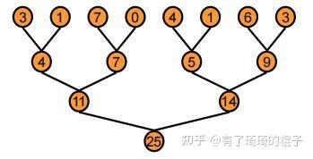
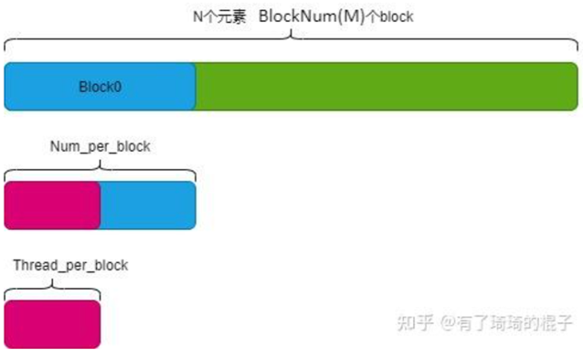
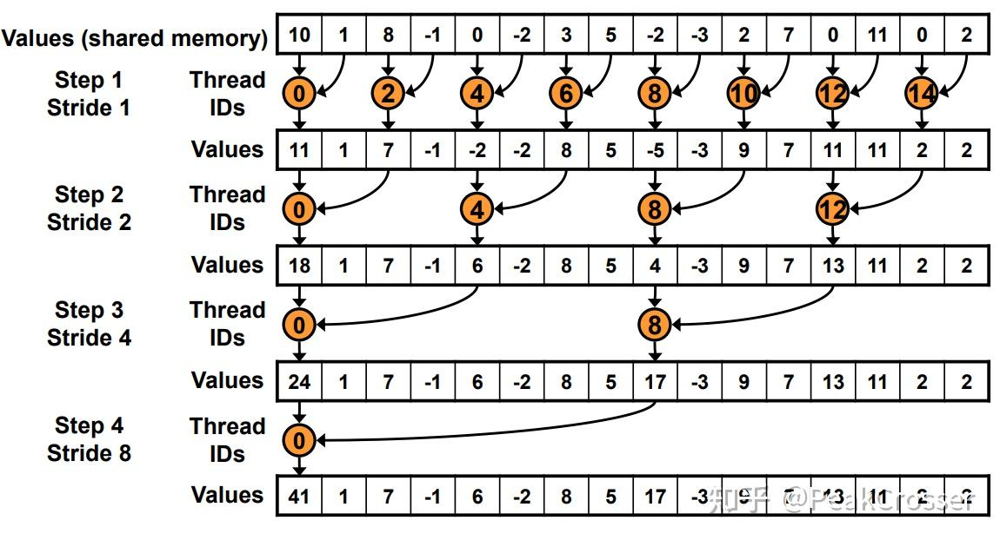
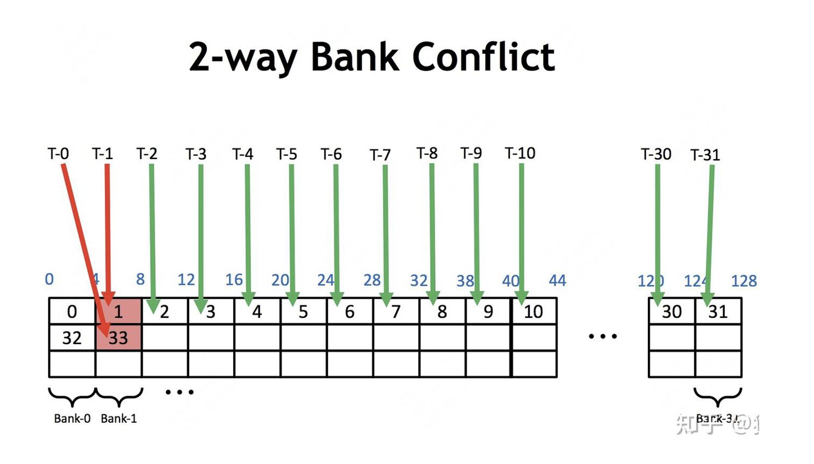
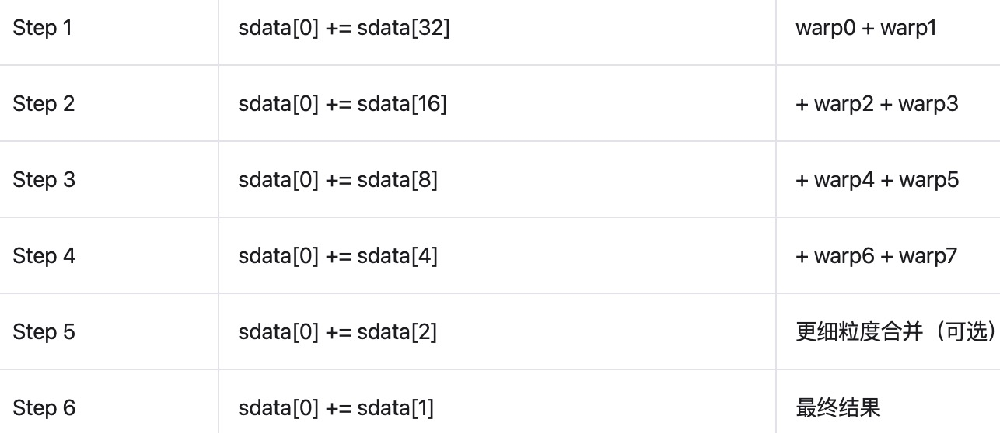
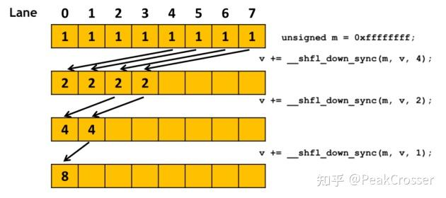
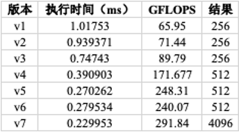

# Reduce

## 简介

本文将讲解Reduce发展过程：

<!-- more -->


## 什么是reduce？
reduce中文为"缩减"或"规约"，在CUDA中，Reduce是指将多个线程的计算结果通过某种操作（求和、求最小值等）合并为一个值的通用并行模式。常见的实现方式有树形规约、交叉规约等。
 - 树形规约（Tree-based Reduction）
    

Tree-based Reduction使用共享内存，在一个block内按类似二叉树的方式合并相邻线程的数据，并逐层缩减，直到最终只由一个线程得到总结果。它的优点是通用性强，适用于任意线程数；缺点是需要同步（__syncthreads）和共享内存，稍慢一些。

 - 交叉规约（Warp-shuffle Reduction）

利用CUDA的__shfl_down_sync等指令在warp 内直接进行线程间通信，不依赖共享内存，速度更快。缺点是仅适用于warp内（通常是32线程）规约。

> 💡 **Note**: warp_shuffle 是 warp 内线程之间，通过硬件指令，直接访问彼此寄存器内容的一种高效通信方式，不需要共享内存或全局内存，用于提升 warp 内规约、转置、广播等操作性能。

 - Blockreduce

        将上述两种方法合并在一个block内，将所有线程合并为一个输出值，由thread0输出结果。

## V1. naive Reduce(朴素实现)
 - 确定参数

        BlockNum：即开启的block数量，代表需要将数组切分为几份。
        Thread_per_block：每个block中开启的线程数，一般而言，取128，256，512，1024这几个参数会比较多。
        Num_per_block：每个block需要进行reduce操作的长度。

   

    从图中可以看出 $BlockNum \times Num\_per\_block = N$。

 ```cpp
 __global__ void reducev1(float *d_in, float *d_out) {
    __shared__ float sdata[Thread_per_block];
    //each thread loads one element from global memory to shared mem
    unsigned int i = blockDim.x * blockIdx.x + threadIdx.x;
    unsigned int tid = threadIdx.x;
    sdata[tid] = d_in[i];// 第tid号线程将第i号的数据从global中取出，放到shared memory的第tid元素中。
    __syncthreads();//block内的通信同步

    // do reduction in shared mem
    for (unsigned int s = 1; s < blockDim.x; s *= 2 ) {
        //通过 % (2*s) == 0，我们总是只选第一个线程来进行这一组的相加。
        if (tid % (2 * s) == 0) {   //选择每一组相加中负责相加的第一个线程
            sdata[tid] += sdata[tid + s];
        }
        __syncthreads();
    }

    // 读取数据
    if (tid == 0) d_out[blockIdx.x] = sdata[tid];
}
 ```
 - 设置一个与block内thread数量相同的shared memroy，将第tid号线程将第i号的数据从global中取出，放到shared memory的第tid元素中。
 - 同步完成后进行树形规约
    - 第一次迭代中s为1，如果满足tid % (2 * s) == 0，tid号线程将shared  memory中第tid和第tid+1号元素想加后放回至tid号位置。
    - 第二次迭代s为2，tid号线程将shared memory中第tid和第tid+2号元素想加后放回至tid号位置。
    - 不断迭代，直至将所有元素累加到thread0位置。
 - 最后只需要将thread0的元素取出即完成本轮reduce。
 

 ### 影响性能的地方
  1. 取余操作<br>
  2. 存在warp divergence ：只有满足tid % (2 * s) == 0才是有效线程<br>
  3. 有一半的线程处于闲置，一直到最后

## V2. 解决warp divergence

 > 💡 **Note**:warp divegence是指在一个warp中 如果存在if_else语句就会使的不同的线程执行不同的指令，产生线程束分歧，这些指令是串行执行的，只有执行同一指令的线程可以同时工作，其他线程会处于等待状态，影响性能。

 由于warp divergence是warp层面的，一个block包括256个线程 也就是8个warp，我们只要保证每个warp内执行的指令相同，即可解决warp divergence。
 ```cpp
 __global__ void reducev2 (float* d_in, float* d_out) {
    __shared__ float sdata[Thread_per_block];
    unsigned int i = blockDim.x * blockIdx.x + threadIdx.x;
    unsigned int tid = threadIdx.x;
    sdata[tid] = d_in[i];
    __syncthreads();

    for (unsigned int s = 1; s < blockDim.x; s*=2) {
        int index = 2 * s * tid;
        if (index < blockDim.x) {
            sdata[index] += sdata[index + s];
        }
        __syncthreads();
    }

    if (tid == 0) d_out[blockIdx.x] = sdata[tid];

 }
 ```
 - 与naive Reduce相比 只是改变了if判断语句：
   

   **在naive中，每个thread对应的是shared memory中的每个元素，而经过优化后，现在每个thread对应的是threadIDs（也就是图中的橙色圆圈）。**
   <!-- - 在第一次迭代中0-3号warp满足if，执行相加指令，4-7号warp不满足，线程处于等待状态；
   - 第二次迭代时，只有0和1号warp执行；
   - 第三次迭代只有0号warp执行指令；
   - 第四次时会产生warp divergence。 -->

 ### 影响性能的地方
  1. 存在bank conflict<br>
      每个thread访问相邻两个元素，如图所示
      
      根据下面这个式子
      $$Δindex = index(tid + 1) - index(tid) = 2 * s * (tid + 1) - 2 * s * tid = 2s$$
      计算可知相邻两个线程访问的地址差为2s。<br>
        s = 1: thread0访问sdata[0]和sdata[1],thread1访问sdata[2]和sdata[3],不存在bank conflict；<br>
        s = 16: thread0访问sdata[0]和sdata[16],thread1访问sdata[32]和sdata[48],存在bank conflict。
        
  2. 有一半的线程处于闲置，甚至一直到最后

## V3. 解决bank conflict
 > 💡 **Note**: 多个线程、同时、同一bank的不同地址 ➡️ bank conflict<br>
多个线程、同时、同一bank的同一地址 ➡️ 广播机制

 由于存在bank冲突，解决办法是将for循环逆着，使第0个元素与第128个元素相加，由于128是32的倍数，一个warp内的线程对应不同的bank，同时一个线程访问一个bank中的两个不同的数据，因此避免了bank conflict。
 
 ```cpp
 __global__ void reducev3 (float* d_in, float* d_out) {
    __shared__ float sdata[Thread_per_block];
    unsigned int i = blockDim.x * blockIdx.x + threadIdx.x;
    unsigned int tid = threadIdx.x;
    sdata[tid] = d_in[i];
    __syncthreads();
    // 128 64 32 间隔取值
    for (unsigned int s = blockDim.x / 2; s > 0; s >>= 1) {// s >>= 1 就是把 s 除以 2，并向下取整（整数除法）
        if (tid < s) {
            sdata[tid] += sdata[tid + s];
        }
        __syncthreads();
    }

    if (tid == 0) d_out[blockIdx.x] = sdata[tid];

 }
 ```
 - 规约过程
     - 第一次迭代s = 128: warp内的线程依次访问0～127，sdata[tid] += sdata[tid + 128],tid和tid+128访问的数据落在同一的bank上；
    - 第二次迭代s = 64: tid访问0～63，sdata[tid] += sdata[tid + 64],tid和tid+64访问的数据落在同一的bank上；
    - ...
    - s = 16: 开始出现bank conflict。
 ### 影响性能的地方
   1. 有一半的线程处于闲置，甚至一直到最后

## V4. 解决idle线程问题
 
 由于在上面几个优化方案reduce过程中始终有一半线程会处于等待状态，所以为了进一步提升性能，在进行for循环前让每个线程先进行一次相加，所以现在一个blockDim.x是上面的两倍，也就是512个线程。
 ```cpp
 __global__ void reducev4 (float* d_in, float* d_out) {
    __shared__ float sdata[Thread_per_block];
    unsigned int i = blockDim.x * blockIdx.x * 2 + threadIdx.x;
    unsigned int tid = threadIdx.x;
    sdata[tid] = d_in[i] + d_in[i + blockDim.x];
    __syncthreads();
    // 128 64 32 间隔取值
    for (unsigned int s = blockDim.x / 2; s > 0; s >>= 1) {// s >>= 1 就是把 s 除以 2，并向下取整（整数除法）
        if (tid < s) {
            sdata[tid] += sdata[tid + s];
        }
        __syncthreads();
    }

    if (tid == 0) d_out[blockIdx.x] = sdata[tid];

 }
 ```
 - i = blockDim.x * blockIdx.x * 2 + threadIdx.x <br>
    tid代表线程号，i代表在原始数组中的索引号，由于现在一个block可以处理两倍于原来的数据 所以i的计算需要将每一行的元素也就是blockDim.x*2，线程块数目需要除以2。

 - sdata[tid] = d_in[i] + d_in[i + blockDim.x]<br>
    tid一次加载相距blockDim.x的两个数据，进行相加将计算结果存于shared memory中。
 
## V5. 展开最后一维减少同步
 因为GPU的最基本的调度单元是warp，当规约过程中的满足条件的线程数小于32时，实际上只有一个warp在工作；由于一个warp内所有的thread会以SIMD的模式自动执行相同的指令，无需__syncthreads()，所以在最后一个warp相加的时候，可以完全展开，以减少额外同步所消耗的性能。
 > 💡 **Note**:SIMD是指一条指令同时用于处理多个数据；同一个 warp 中的所有线程，在同一个时钟周期内，执行相同的指令，只是操作的数据不同。

 ```cpp
 // CUDA 官方推荐 warp 内合并时，参数使用 volatile float*，以防止编译器进行寄存器缓存优化，导致实际不发生内存操作。其作用是保证每次对 cache 访问是都重新从共享内存中加载数据. 
 __device__ void warpReduce(volatile float* sdata, int tid) {
    sdata[tid] += sdata[tid + 32];// 有时 block 有多个 warp（如 64 个线程），你需要先把两个 warp 的中间结果合并。
 //     cache[0..15] = 2
 //     cache[16..31] = 原始 1
    sdata[tid] += sdata[tid + 16];
 //     cache[0..7] = 4
 //     cache[8..15] = 保持为 2
 //     cache[16..31] = 保持为 1
    sdata[tid] += sdata[tid + 8];
    sdata[tid] += sdata[tid + 4];
    sdata[tid] += sdata[tid + 2];
    sdata[tid] += sdata[tid + 1];
 }

 __global__ void reducev5 (float* d_in, float* d_out) {
    __shared__ float sdata[Thread_per_block];
    unsigned int i = blockDim.x * blockIdx.x * 2+ threadIdx.x;
    unsigned int tid = threadIdx.x;
    sdata[tid] = d_in[i] + d_in[i + blockDim.x];
    __syncthreads();
    // 128 64 32 间隔取值
    for (unsigned int s = blockDim.x / 2; s > 32; s >>= 1) {// s >>= 1 就是把 s 除以 2，并向下取整（整数除法）
        if (tid < s) {
            sdata[tid] += sdata[tid + s];
        }
        __syncthreads();
    }

    if (tid < 32) warpReduce(sdata, tid);
    if (tid == 0) d_out[blockIdx.x] = sdata[tid];

 }
 ```
 - 使用一个warpReduce函数对最后一个warp内的线程进行计算，sdata[0]: warp  0 的计算结果，sdata[32]: warp 1 的计算结果以此类推：
     - sdata[tid] += sdata[tid + 32] warp 0 + warp 1
     - sdata[tid] += sdata[tid + 16]  + warp 2 + warp 3
     - ...
     - sdata[tid]存放总和。


## V6. 使用shuffle指令
 warp shuffle允许同一warp内的线程可以直接在寄存器内访问数据，这一实现是硬件层面的。

 ```cpp
 __device__ float warpReduce(float num) {
    for (int offset = warpSize / 2; offset > 0; offset /= 2) {
        num += __shfl_down_sync(0xffffffff, num, offset, warpSize);//int __shfl_sync(unsigned mask, int var, int srcLane, int width=32);
        //mask:通常写 0xffffffff 表示所有线程都参与
        //var:每个线程持有的变量
        //srcLane:被取值的线程号(0~31)
        //默认是 32width: warp size,
    }
    return num;
 }

 __global__ void reduce6(float* d_in, float* d_out) {
    //sum是每个线程的私有变量
    float sum = 0.0f;
    //tid代表线程号，i代表在原始数组中的索引号
    int i = blockIdx.x * blockDim.x * 2 + threadIdx.x;
    int tid = threadIdx.x;
    int gridSize = blockDim.x * gridDim.x * 2;//一次能处理的数据总量

    // 每个线程处理多个元素
    // for (int iter = 0; iter < Thread_per_block / warp_Size; ++iter) {
    //     sum += d_in[i + blockDim.x * iter];
    // }
    while (i < N) {
        sum += d_in[i];
        if (i + blockDim.x < N)
            sum += d_in[i + blockDim.x];
        i += gridSize;
        //可以把每个线程想象成一个“工人”， i += gridSize 就是让每个工人“轮流”去处理属于自己的那一份工作，直到所有工作都做完。
    }

    // 对每个warp进行规约
    sum = warpReduce(sum);

    // 将每个值填写到共享内存中
    __shared__ float sdata_warpSum[Thread_per_block / warpSize];
    int threadInWarpId = tid % warpSize;
    int warpId = tid / warpSize;
    if (threadInWarpId == 0) {
        sdata_warpSum[warpId] = sum;
    }
    __syncthreads();

    //对block进行规约
    //从共享内存中读取数据 不符合要求置零
    sum = (threadInWarpId < (Thread_per_block / warpSize)) ? sdata_warpSum[threadInWarpId] : 0.0f;
    if (warpId == 0) {
        sum = warpReduce(sum);
    }

    // 将结果写入全局内存
    if (tid == 0) {
        d_out[blockIdx.x] = sum;
    }
 }
 ```
 
 - warpReduce函数 
    - offset 每次减半：16 → 8 → 4 → 2 → 1
    - offset = 16 thread[i] += thread[i + 16]，
    - offset = 8  thread[i] += thread[i + 8]，
    - ...
    - thread[0]存放最终的sum。
 - reduce6函数
    - 先进行两数相加（避免idle线程）
    - 对每个warp进行规约，结果存在每个warp的thread0中，
    - 将每个warp内的第一个线程（0，32...）的值移到sdata_warpSum中
    - 对第一个block内的warp进行规约
 ### 下一步优化
    使用向量化访存
## V7. 使用向量化访存
 float处理一个元素需要发射一次指令，而float4发射一次指令可以处理四个元素，有利于提升吞吐率和带宽利用率。
 ```cpp
 __device__ float warpReduce(float num) {
    for (int offset = warpSize / 2; offset > 0; offset /= 2) {
        num += __shfl_down_sync(0xffffffff, num, offset);
    }
    return num;
 }

 __global__ void reduce7(float* d_in, float* d_out) {
    float sum = 0.0f;
    int i = blockIdx.x * blockDim.x * 4 * 2 + threadIdx.x * 4;
    int tid = threadIdx.x;
    int gridSize = blockDim.x * gridDim.x * 2 * 4;

    while (i < N) {
        float4 val = ((float4*)d_in)[i / 4];
        sum += val.x + val.y + val.z + val.w;
        if (i + blockDim.x * 4 < N) {
            float4 val2 = ((float4*)d_in)[(i + blockDim.x * 4) / 4];
            sum += val2.x + val2.y + val2.z + val2.w;
        }
        i += gridSize;
    }

    sum = warpReduce(sum);

    __shared__ float sdata_warpSum[Thread_per_block / warpSize];
    int threadInWarpId = tid % warpSize;
    int warpId = tid / warpSize;
    if (threadInWarpId == 0) {
        sdata_warpSum[warpId] = sum;
    }
    __syncthreads();

    sum = (threadInWarpId < (Thread_per_block / warpSize)) ? sdata_warpSum[threadInWarpId] : 0.0f;
    if (warpId == 0) {
        sum = warpReduce(sum);
    }

    if (tid == 0) {
        d_out[blockIdx.x] = sum;
    }
 }
 ```
 ## 性能对比


