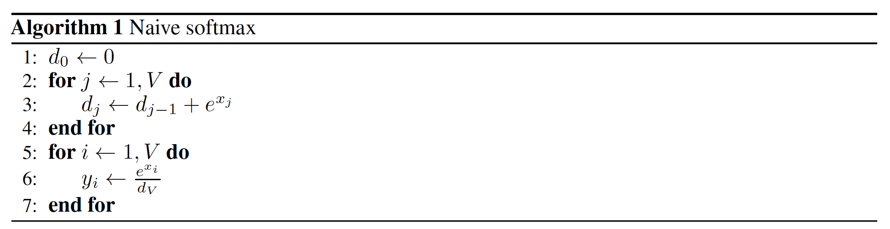
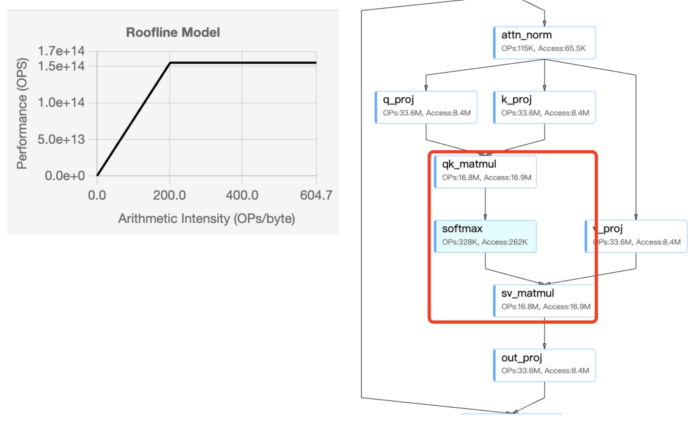
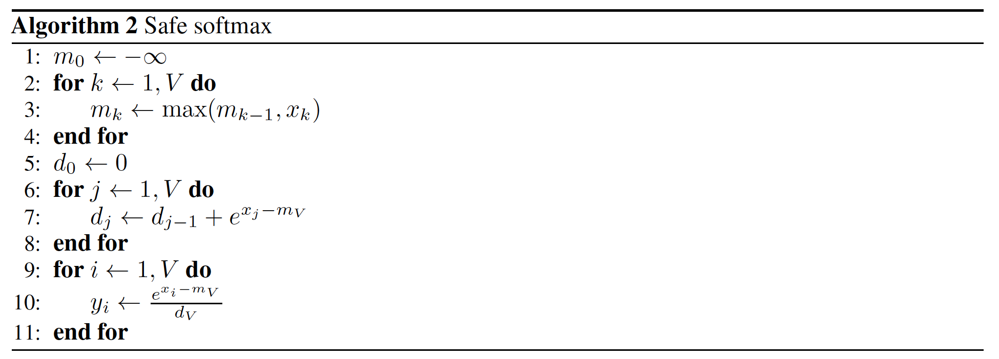
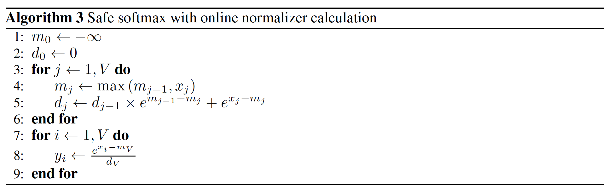
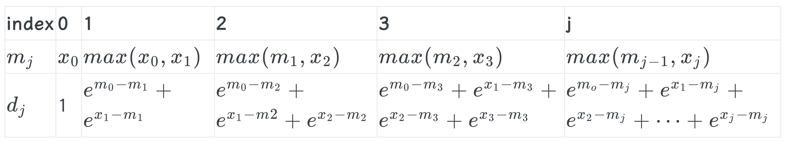

# Softmax 

## 简介

本文将讲解Softmax发展过程：
naive softmax -> safe softmax -> online softmax

<!-- more -->

## 一、Naive softmax

原始softmax的公式为:
$$
\sigma(z_i) = \frac{e^{z_i}}{\sum_{j=1}^{n} e^{z_j}}
$$

- 对于向量中的每一个元素，**它的MAC(memory access count)为3**: 第一次pass中load一次，在第二次pass中load一次, store一次, 所以一共是三次memory access。

- Original softmax的问题所在: 在第三行的算法中，对进行sum的过程中，由于真实硬件的浮点格式所能表示的范围限制(fp16正数所能表示的最大值为65504，而$e^{12}$>65504),很容易造成上溢或者下溢。
为了解决上述问题，从而引出safe softmax。

    

```python
"""
在 attenion 算子中, softmax 函数的输入 QK^T, 输入矩阵大小就是 [s,s]
"""
# [N, N] -> [N, N], 每个元素进行 3 次内存访问：2次读取和一次写入.
# mac = 3N^2, flops = 3N^2 - N
def native_softmax(x):
    s, s = x.shape # 第一个维度是序列长度，第二个维度是隐藏层大小
    output = np.array(x) # np.array() 将 python 中的数据结构（如列表、元组等）转换为 NumPy 的数组
    for r in range(s):
        sum = 0
        for i in range(s):
            sum += np.exp(x[r][i]) 
        for i in range(s):
            output[r][i] = np.exp(x[r][i]) / sum
    
    return output
```
### Orignal softmax Roofline 分析
以NVIDIA-V100GPU的RoofModel为例（下图）,从图片右侧的流程图中，Softmax 节点显示：
OPS（运算次数）：328K，Access（数据访问量）：262K 字节, 其操作强度定义为：
$$ 
I = \frac{OPS}{Access} = \frac{328K}{262K} = 1.25 FLOPs/Byte
$$

Roofline 模型：
- 横轴 ：操作强度（log scale）
- 纵轴 ：性能（OPS/s）
- 水平线 ：硬件的峰值计算性能（Compute-bound 区域）。
- 斜线 ：内存带宽限制（Memory-bound 区域）。

在 Roofline 图中，这样的低 I 值必然落在 内存带宽限制区域 （即斜线部分，左图中零点附近）。结果表明 **Softmax 是一个典型的内存受限（Memory-bound）算子 ，其性能主要受限于内存带宽，而非计算能力**。



## 二、Safe softmax
为解决上述提到的可能的数据溢出问题，基本上所有的深度学习框架使用的都是safe Softmax的计算。其计算公式如下：
$$
c = max(z_1,z_2,...,z_n)
$$
$$
\sigma(z_i) = \frac{e^{z_i-c}}{\sum_{j=1}^{n} e^{z_j-c}}
$$
- 该计算公式在数学上和naive等价:
$$
\sigma(z_i) = \frac{e^{z_i-c}}{\sum_{j=1}^{n} e^{z_j-c}} = \frac{e^{z_i} \cdot e^{-c}}{\sum_{j=1}^{n} e^{z_j} \cdot e^{-c}} =  \frac{e^{z_i}}{\sum_{j=1}^{n} e^{z_j}}
$$
- Safe Softmax所带来的问题: 为了安全，我们需要额外求出输入向量中的元素最大值，这带来了多一次的循环pass，并且对于向量中的每一个元素，**它的MAC(memory access count)为4**。具体表现为在第一次pass中Load $z_i$ 一次, 在第二次pass中Load $z_j$ 一次，在第三次pass中Load $z_i$ 一次, Store $\sigma_{z_i}$ 一次, 所以总共mac是4次。
为了解决上述问题，从而引出了Online Softmax。

    

```python
"""
在 attenion 算子中, softmax 函数的输入 QK^T, 输入矩阵大小就是 [s,s]
"""
# [N, N] -> [N, N], 每个元素进行 4 次内存访问：3次读取和一次写入.
# mac = 4N^2, flops = 4N^2 - 2N
def safe_softmax(x):
    s, s = x.shape # 第一个维度是序列长度，第二个维度是隐藏层大小
    output = np.array(x) # np.array() 将 python 中的数据结构（如列表、元组等）转换为 NumPy 的数组
    for r in range(s):
        max_r = 0
        for i in range(s):
            max_r = max(max_r, x[r][i]) # flops 为 1
            
        sum = 0
        for i in range(s):
            sum += np.exp(x[r][i] - max_r) # flops 为 2 + 1
            
        for i in range(s):
            output[r][i] = np.exp(x[r][i] - max_r) / sum # flops 为 2
    
    return output
```

## 三、Online softmax

在Safe的基础上，Online softmax做出的主要改进为: 将最大值 $c = max(z_1,z_2,...,z_n)$ 和归一因子 $d = \sum_{j=1}^{n} e^{z_j-c}$ 放在同一个循环pass中处理。

### 具体实现

循环pass处理 $z_1$ -> $z_n$：
- if $z_i \leqslant c$ : 
    $$
    c_{new} = c_{old}
    $$
    $$
    d_{i} = d_{i-1} + e^{z_i-c_{new}}
    $$

- if $z_i > c$ :
    $$
    c_{new} = z_i
    $$
    之前计算的d是相较于旧的c即 $c_{old}$ 的，需要将其转换由新的 $c_{new}$计算:
    $$
    d_{old} = \sum_{j=1}^{n} e^{z_j-c_{old}}, \quad d_{new} = \sum_{j=1}^{n} e^{z_j-c_{new}}
    $$
    通过以下公式可进行转换:
    $$
    d_{new} = d_{old} \cdot \frac{e^{c_{old}}}{e^{c_{new}}}
    $$
    因此对于归一化因子d更新时:
    $$
    d_{i} = d_{new} + e^{z_j-c_{new}} = d_{new} + e^{z_j-z_j} = d_{new} + 1
    $$

- 因此最终Online softmax的公式总结为:
    $$
    c_{i} = max(c_{i-1}, z_i), \quad d_{i} = d_{i-1}e^{c_{i-1}-c_{i}} + e^{z_i-c_{i}}
    $$

    $$
    \sigma(z_i) = \frac{e^{z_i-c_{V}}}{d_{V}}
    $$
    这里 $c_{V}$ 和 $d_{V}$ 是全局的最大值和归一化项，可以在一个 for 循环中同时实现，或者说在一个 kernel 中计算完成；

<!-- <br><br> -->
该算法在迭代输入数组的元素时保留最大值c 和归一化项 d。在每次迭代中，它都需要将 normalizer d 调整为新的最大 cj，然后才向 normalizer 添加新的值。
**这里我们把vector中的每个元素的MAC从4降到了3**，在第一次pass里面，我们load一次 $z_j$ 即可，在第二次pass里面我们load一次 $z_i$ ,store一次 $\sigma_{z_i}$,所以一共是3次memory access。



```python
def online_softmax(x: torch.Tensor) -> torch.tensor:
    """Iterative calculation and 2.5x faster than native softmax """
    row_cont, col_count = x.shape
    assert x.ndim == 2, f"only accepts 2D tensor now"
    output = torch.zeros_like(x)
    
    for r in range(row_cont):
        row_max = x[r][0]
        normalizer = 0
        for c in range(1, col_count):
            pre_max = row_max
            cur = x[r][c]
            row_max = max(pre_max, cur)
            # if cur > pre_max:
            #     print(f"Update row max now is {row_max}, row = {r}")
            normalizer = normalizer * torch.exp(pre_max - row_max) + torch.exp(cur - row_max)
        output[r, :] = torch.exp(x[r, :] - row_max) / normalizer
    
    return output
```

## 四、Online softmax的并行化
算法 3 的 1-6 行定义了一种通过一次遍历输入向量来顺序计算归一化项的方法，这样的实现虽然减少了内存访问次数，但因为是使用 for 循环串行执行，所以还是不够快。如果能通过并行分块计算归一化项就更好了，但因为的实现依赖前一个归一化项 $d_{j-1}$ ，所以看起来不能分块计算。**除非 $d_{j}$ 可以不直接依赖 $d_{j-1}$ ，而是通过分配好的索引范围来乱序计算**。可以分块计算归一化项的证明过程如下所示：

算法 3 第 5 行（$d_{j} \leftarrow d_{j-1} \times e^{m_{j-1}-m_{j}} + e^{x_{j}-m_{j}}$）的循环展开几个例子:

上述$d_{3}$ 的推导是按照 0->1->2->3 的先后顺序来推导的，但其实由于 exp/log 计算的特性，除了正常从严格按先后顺序推导以外，乱序也是可以得到的，例如 2->1->0->3：
$$
\begin{aligned}
m_{21} &= \max(x_2, x_1) \\
d_{21} &= e^{x_2 - m_{21}} + e^{x_1 - m_{21}} \\
m_{210} &= \max(x_0, m_{21}) = \max(x_0, x_2, x_1) \\
d_{210} &= d_{21} \cdot e^{m_{21} - m_{210}} + e^{x_0 - m_{210}} \\
&= (e^{x_2 - m_{21}} + e^{x_1 - m_{21}}) \cdot e^{m_{21} - m_{210}} + e^{x_0 - m_{210}} \\
&= e^{x_2 - m_{210}} + e^{x_1 - m_{210}} + e^{x_0 - m_{210}} \\
m_3 &= m_{2103} = \max(x_3, m_{210}) = \max(x_3, x_0, x_2, x_1) \\
d_3 &= d_{210} \cdot e^{m_{210} - m_3} + e^{x_3 - m_3} \\
&= (e^{x_2 - m_{210}} + e^{x_1 - m_{210}} + e^{x_0 - m_{210}}) \cdot e^{m_{210} - m_3} + e^{x_3 - m_3} \\
&= e^{x_2 - m_3} + e^{x_1 - m_3} + e^{x_0 - m_3} + e^{x_3 - m_3}
\end{aligned}
$$

有了这个基础，我们可以随意定义分块计算: 
$$
d_{xy} = d_{x} \cdot e^{m_{x} - m_{xy}} + e^{y - m_{xy}}
$$
例如按照乱序计算分块 (2->1)、分块(0->3) ，最后结合两个分块结果：
$$
\begin{aligned}
m_{21} &= \max(x_2, x_1) \\
d_{21} &= e^{x_2 - m_{21}} + e^{x_1 - m_{21}} \\
m_{03} &= \max(x_0, x_3) \\
d_{03} &= e^{x_0 - m_{03}} + e^{x_3 - m_{03}} \\
m_3 &= m_{2103} = \max(m_{21}, m_{03}) = \max(x_2, x_1, x_0, x_3) \\
d_3 &= d_{2103} = d_{21} * e^{m_{21} - m_3} + d_{03} * e^{m_{03} - m_3} \\
&= (e^{x_2 - m_{21}} + e^{x_1 - m_{21}}) * e^{m_{21} - m_3} + (e^{x_0 - m_{03}} + e^{x_3 - m_{03}}) * e^{m_{03} - m_3} \\
&= e^{x_2 - m_3} + e^{x_1 - m_3} + e^{x_0 - m_3} + e^{x_3 - m_3}
\end{aligned}
$$

同样可以得到相同的$d_{3}$ 。这样，我们就可以得到这种方式最大的一个特性：
**$m$ 和 $d$ 的迭代计算操作同时满足交换律和结合律，任意分块分别计算 $m$ 和 $d$ 之后，将所有子块结果重新聚合在数学上完全等价**，即序列中 max 值带来的影响可以延迟到最后一步再被修正。

```python
# [N, N] -> [N, N], 每个元素进行 3 次内存访问：2 次读取和一次写入. 
# mac = 3N^2, flops = 8N^2，分块计算，可发挥并行计算优势
def block_online_softmax(x, block_size=256):
    assert x.shape[1] % block_size == 0
    s, s = x.shape
    output = np.array(x)
    for r in range(s):
        m = x[r][0]
        d = 0
        
        # 可使用多线程并行计算，实际 mac 为 N^2
        for b in range(0, s // block_size):
            # Calculate m,d of single block
            m_block = x[r][b*block_size]
            d_block = 0
            for j in range(0, block_size):
                m_block, d_block = online_softmax_update(m_block, d_block, x[r][b*block_size + j], 1)
            
            # Merge all block's result to total
            m, d = online_softmax_update(m, d, m_block, d_block) 
            
        for i in range(s):
            output[r][i] = np.exp(x[r][i] - m) / d
    
    return output
```

## 总结
Online Softmax算法有两点创新内容：
- 提出并证明了通过一次遍历输入数据来计算 Softmax 函数归一化项的方法，该方法将 Softmax 函数的内存访问次数减少了 1.33 倍。
- 证明了可以分块计算归一化常数，这个方法可以发挥 GPU 多线程的特性。

下面代码分别给出 online softmax 算法的 python 代码实现以及 global memory 的访存量 MAC。并进行结果对比测试：

```python
import numpy as np
import torch.nn.functional as F
import torch

def online_softmax_update(m0, d0, m1, d1):
    #                             x   1
    m = max(m0, m1) # flops: 1
    d = d0 * np.exp(m0 - m) + d1 * np.exp(m1-m) # flops: 5
    return m, d

# [N, N] -> [N, N], 每个元素进行 3 次内存访问：2 次读取和一次写入.
# mac = 3N^2, flops = 8N^2 
def online_softmax(x):
    s, s = x.shape
    output = np.array(x)
    for r in range(s):
        m = x[r][0]
        d = 1
        for j in range(1, s):
            m, d = online_softmax_update(m, d, x[r][j], 1) # flops 为 6
        for i in range(s):
            output[r][i] = np.exp(x[r][i] - m) / d # flops 为 2
            
    return output

# [N, N] -> [N, N], 每个元素进行 3 次内存访问：2 次读取和一次写入. 
# mac = 3N^2, flops = 8N^2，分块计算，可发挥并行计算优势
def block_online_softmax(x, block_size=256):
    assert x.shape[1] % block_size == 0
    s, s = x.shape
    output = np.array(x)
    for r in range(s):
        m = x[r][0]
        d = 0
        
        # 可使用多线程并行计算，实际 mac 为 N^2
        for b in range(0, s // block_size):
            # Calculate m,d of single block
            m_block = x[r][b*block_size]
            d_block = 0
            for j in range(0, block_size):
                m_block, d_block = online_softmax_update(m_block, d_block, x[r][b*block_size + j], 1)
            
            # Merge all block's result to total
            m, d = online_softmax_update(m, d, m_block, d_block) 
            
        for i in range(s):
            output[r][i] = np.exp(x[r][i] - m) / d
    
    return output
     
if __name__ == "__main__":
    x = np.random.randn(1024, 1024)
    # 对每一行执行 softmax 操作
    pytorch_softmax_out = F.softmax(torch.tensor(x), dim=1) # dim=0表示按列计算；dim=1表示按行计算。
    native_softmax_out = native_softmax(x)
    safe_softmax_out = safe_softmax(x)
    online_softmax_out = online_softmax(x)
    block_online_softmax_out = block_online_softmax(x, 256)
    
    if torch.allclose(pytorch_softmax_out, torch.tensor(native_softmax_out), atol=1e-4):
        print("naive softmax 与 PyTorch softmax 结果一致!")
    else:
        print("naive softmax safe_softmax 与 PyTorch softmax 结果不一致!")
    
    if torch.allclose(pytorch_softmax_out, torch.tensor(safe_softmax_out), atol=1e-4):
        print("safe softmax 与 PyTorch softmax 结果一致!")
    else:
        print("safe softmax 与 PyTorch softmax 结果不一致!")
    
    if torch.allclose(pytorch_softmax_out, torch.tensor(online_softmax_out), atol=1e-4):
        print("online softmax 与 PyTorch softmax 结果一致!")
    else:
        print("online softmax 与 PyTorch softmax 结果不一致!")

    if torch.allclose(pytorch_softmax_out, torch.tensor(block_online_softmax_out), atol=1e-4):
        print("block online softmax 与 PyTorch softmax 结果一致!")
    else:
        print("block online softmax 与 PyTorch softmax 结果不一致!")
```

运行结果显示结果全部一致。


## 待更新
- Softmax + TopK 的fusion效果。

## 参考文献

1. [Milakov M, Gimelshein N. Online normalizer calculation for softmax[J]. arXiv preprint arXiv:1805.02867, 2018](https://arxiv.org/pdf/1805.02867)

2. [从 Naive Softmax到Online Softmax and Top-k](https://zhuanlan.zhihu.com/p/1892986988065453222)

3. [Online Softmax解读](https://www.armcvai.cn/2024-10-01/online-softmax-paper.html)